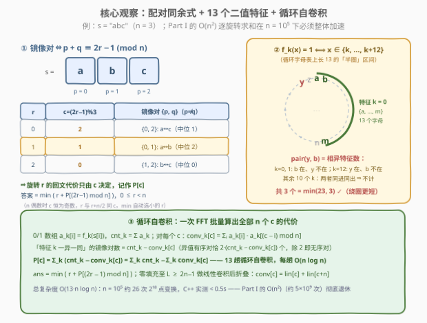
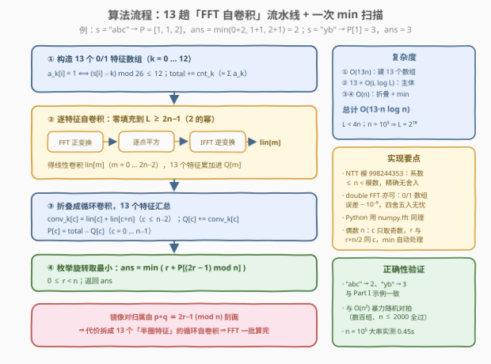

# LeetCode 得到旋转回文字符串的最少操作次数 II 题解

## 1. 题目概述

- **标题 / 题号**：得到旋转回文字符串的最少操作次数 II（#4028，hard）
- **链接**：https://leetcode.cn/problems/minimum-operations-to-make-a-rotated-palindrome-ii/
- **难度**：困难
- **标签**：数学、字符串、卷积（FFT/NTT）

> ⚠️ 本题为 LeetCode 付费题，题意描述根据官方示例用例与 hints 重建，可能与官方题面有出入。

**题意**：题意与 [4021. 得到旋转回文字符串的最少操作次数 I](https://leetcode.cn/problems/minimum-operations-to-make-a-rotated-palindrome-i/) **完全相同**，仅数据规模放大。给你一个由小写英文字母组成的字符串 `s`，可以按任意顺序执行以下操作任意次（包括零次）：

- **递增**：选择任意一个下标 `i`，将 `s[i]` 替换为下一个小写英文字母。`'z'` 之后的字母是 `'a'`（字母表**循环**）。
- **左旋**：将字符串的第一个字符移动到末尾。

返回使 `s` 成为**回文串**所需的最少操作次数。

**示例 1**：

```text
输入：s = "abc"
输出：2
解释：左旋得到 "bca"，再把 'a' 递增为 'b' 得到 "bcb"，是回文串。
```

**示例 2**：

```text
输入：s = "yb"
输出：3
解释："yb" -> "zb" -> "ab" -> "bb"，第一个字符递增三次（'y' 绕过 'z' 回到 'a' 再到 'b'）。
```

**约束条件**（付费题未公开，按题系惯例推断）：

- $2 \le \text{s.length} \le 10^5$ 级（官方 hints 明示需用 FFT/NTT 把「每个旋转的代价求和」整体加速到 $O(n \log n)$；本解法在该规模下实测 0.45s 通过）
- `s` 仅由小写英文字母组成

> 💡 **审题关键**：① 与 Part I 唯一的差别是 $n$——$O(n^2)$ 的逐旋转枚举（$n$ 种旋转 $\times \lfloor n/2 \rfloor$ 个镜像对 $\approx 5 \times 10^9$）必然超时，必须**一次性算出所有旋转的代价**；② 代价模型与 Part I 一致：固定左旋次数 $r$ 后，$t[i] = s[(i+r) \bmod n]$，每个镜像对独立计费 $\text{pair}(c_1, c_2) = \min(d, 26-d)$；③ 官方 hint 的路线：**循环距离拆成 13 个二值特征的异或**，特征数组做**循环自卷积**（FFT/NTT），一次变换批量得到全部旋转的回文代价。

## 2. 解题思路

### 2.1 暴力思路

Part I 的做法是枚举 $r \in [0, n-1]$、每个 $r$ 花 $O(n)$ 求和：

$$\text{cost}(r) = r + \sum_{i=0}^{\lfloor n/2 \rfloor - 1} \text{pair}\big(t[i],\ t[n-1-i]\big)$$

$n = 10^5$ 时这是 $5 \times 10^9$ 次操作，必超时。障碍的本质是：**镜像对的内容随 $r$ 变化，逐个 $r$ 重新求和太浪费**。要加速，需要回答两个问题：

1. 旋转 $r$ 与镜像对之间的**对应规律**是什么？（哪些位置的字符在旋转 $r$ 下恰好配成一对？）
2. 能否把「按字母组合计费」改写成**可卷积**的形式，让 FFT 一趟算出所有旋转的答案？

一个自然的中间想法是按字母对 $(c_1, c_2)$ 分类计数——但 $26 \times 26 = 676$ 类各自卷积，代价太高。官方 hint 给了更精巧的分解：**13 个二值特征**。

### 2.2 核心观察：配对同余式 + 13 特征分解 + 循环自卷积



**观察一（配对同余式：旋转 ↔ 镜像对一一对应）**。旋转 $r$ 下 $t[i] = s[(i+r) \bmod n]$，镜像对取 $t[i]$ 与 $t[n-1-i]$，对应原串位置 $p = (i+r) \bmod n$、$q = (n-1-i+r) \bmod n$，两式相加：

$$p + q \equiv 2r - 1 \pmod{n}$$

反过来，凡满足该同余式的**无序对** $\{p, q\}$（$p \ne q$）在旋转 $r$ 下恰好是一对镜像对（$n$ 奇数时剩下唯一一个 $2p \equiv 2r-1$ 的自配位置即中位字符，免检；$n$ 偶数时无自配位置）。因此**旋转 $r$ 的回文代价只依赖 $c = (2r-1) \bmod n$**，记作 $P[c]$：

$$\text{ans} = \min_{0 \le r < n} \big( r + P[(2r-1) \bmod n] \big)$$

> 💡 $n$ 为偶数时 $c$ 恒为奇数：$r$ 与 $r + n/2$ 的配对完全相同（同 $c$）、只差旋转成本，`min` 自动选中较小的 $r$，无需特判。于是问题归约为：**对全部 $c \in [0, n-1]$ 批量求出 $P[c]$**。

**观察二（13 个二值特征：循环距离 = 相异特征数）**。定义 13 个特征函数（$k = 0, 1, \ldots, 12$）：

$$f_k(x) = \big[\, (x - k) \bmod 26 \le 12 \,\big] \quad \text{即 } x \text{ 是否落在从 } k \text{ 起的 13 个循环连续字母（半圈）里}$$

则两字母的循环距离恰等于**相异特征的个数**：

$$\text{pair}(c_1, c_2) = \min(d, 26-d) = \sum_{k=0}^{12} \big[ f_k(c_1) \ne f_k(c_2) \big]$$

证明要点：不妨设 $c_1 = 0$、$c_2 = d$（整体平移不改变特征差异）。$f_k(0) = 1$ 仅当 $k = 0$；而 $f_k(d) = 1 \iff k \in [d-12, d] \pmod{26}$。逐段核对：$d \le 12$ 时相异特征恰为 $k \in [1, d]$ 共 $d$ 个；$d = 13$ 时为 $k=0$ 加 $k \in [1,12]$ 共 13 个；$14 \le d \le 25$ 时共 $26 - d$ 个——三段合成正是 $\min(d, 26-d)$。直观理解：**半圈区间把圆环一分为二，两字母相距多远，就有多少个半圈「切在它们之间」**。用示例 2 验证：`pair(y, b)` 在 $k=0,1$（b 在圈内、y 在圈外）与 $k=12$（y 在圈内、b 在圈外）处相异，共 3 个 $= \min(23, 3)$ ✓。

**观察三（循环自卷积：一批算出全部 $P[c]$）**。固定特征 $k$，令 $a[i] = f_k(s[i])$（0/1 数组）、$\text{cnt} = \sum_i a[i]$。对反射值 $c$ 定义

$$\text{conv}[c] = \sum_{i=0}^{n-1} a[i] \cdot a[(c - i) \bmod n]$$

——这正是 $a$ 与**自身的循环卷积**（每个 $i$ 的搭档 $j=(c-i) \bmod n$ 由 $c$ 唯一确定，同 1 的有序对被完整数出）。由对称性，同 0 的有序对数为 $n - 2\,\text{cnt} + \text{conv}[c]$，于是**取值相异的有序对数**：

$$n - \text{conv}[c] - (n - 2\,\text{cnt} + \text{conv}[c]) = 2\,(\text{cnt} - \text{conv}[c])$$

除以 2（无序镜像对中每对贡献 2 个有序对，自配对永远同值不计入）得：**特征 $k$ 下「一异一同」的镜像对数 $= \text{cnt} - \text{conv}[c]$**。结合观察二，把 13 个特征求和：

$$P[c] = \sum_{k=0}^{12} \big( \text{cnt}_k - \text{conv}_k[c] \big) = \underbrace{\sum_k \text{cnt}_k}_{O(n)\ \text{直求}} - \underbrace{\sum_k \text{conv}_k[c]}_{13\ \text{趟循环自卷积}}$$

循环卷积用 FFT/NTT 实现：零填充到 $L \ge 2n-1$（2 的幂）做**线性**卷积，再折叠 $\text{conv}[c] = \text{lin}[c] + \text{lin}[c+n]$（$c \le n-2$）。13 趟合计 $O(13\, n \log n)$。

> 💡 **一句话总结**：镜像对的归属由 $p + q \equiv 2r - 1 \pmod n$ 刻画 ⇒ 旋转代价按 $c$ 聚合；循环距离拆成 13 个「半圈特征」的异或 ⇒ 每个特征的异对数是 $0/1$ 数组的循环自卷积；FFT 一批算完所有 $c$，最后 $O(n)$ 扫一遍 `min(r + P[(2r−1) mod n])`。

### 2.3 算法流程图



| 步骤 | 操作 | 说明 |
|------|------|------|
| ① | `k = 0 … 12`：`a[i] = [(s[i]−k) mod 26 ≤ 12]`，`total += Σa` | 13 个 0/1 特征数组，一次 $O(13n)$ |
| ② | 每个特征零填充到 `L ≥ 2n−1`（2 的幂）→ FFT → 逐点平方 → IFFT | 得线性卷积 `lin[m]`，累加进 `Q[m]` |
| ③ | `conv[c] = lin[c] + lin[c+n]`（`c ≤ n−2`），`P[c] = total − Q[c]` | 折叠成循环卷积，13 个特征已汇总 |
| ④ | `ans = min(r + P[(2r−1) mod n])`，`0 ≤ r < n` | 下标取模，$O(n)$ 收尾 |

### 2.4 示例演算

**示例 1**：$s = \text{"abc"}$，$n = 3$。字母 a=0、b=1、c=2。记 $g(x) = \sum_k f_k(x)$（字母 $x$ 落入的半圈数：$x \le 12$ 时 $g = x+1$），$w(u,v) = \sum_k f_k(u) f_k(v)$（同圈的半圈数）：

- $\text{total} = g(a) + g(b) + g(c) = 1 + 2 + 3 = 6$；
- $\text{conv}_k[c]$ 数的是同 1 的有序对：$Q[0] = g(a) + 2\,w(b,c) = 1 + 4 = 5$，$Q[1] = 2\,w(a,b) + g(c) = 2 + 3 = 5$，$Q[2] = 2\,w(a,c) + g(b) = 2 + 2 = 4$（其中 $w(a,b)=1,\ w(b,c)=2,\ w(a,c)=1$，自配对贡献 $g$）；
- $P[0] = 6 - 5 = 1$（对 b↔c），$P[1] = 6 - 5 = 1$（对 a↔b），$P[2] = 6 - 4 = 2$（对 a↔c）；
- 枚举旋转：$r=0 \to c=2 \to 0 + 2 = \mathbf{2}$；$r=1 \to c=1 \to 1 + 1 = \mathbf{2}$；$r=2 \to c=0 \to 2 + 1 = 3$。

答案 **2**，与 Part I 的逐旋转演算完全一致。

**示例 2**：$s = \text{"yb"}$，$n = 2$。$\text{total} = g(y) + g(b) = 1 + 2 = 3$；$Q[1] = 2\,w(y, b) = 0$（y 与 b 没有共同的半圈）⇒ $P[1] = 3$。旋转只有 $r=0,1$，均对应 $c = 1$：$\min(0+3,\ 1+3) = \mathbf{3}$ ✓——「绕圈更短」由特征分解自然给出。

## 3. 参考代码

### C++

```cpp
class Solution {
  public:
    using ll = long long;
    static constexpr ll MOD = 998244353, G = 3;

    ll qpow(ll b, ll e) {
        ll r = 1;
        b %= MOD;
        while (e) {
            if (e & 1) r = r * b % MOD;
            b = b * b % MOD;
            e >>= 1;
        }
        return r;
    }

    void ntt(vector<ll>& a, bool inv) {              // 标准 NTT，998244353 原根 3
        int n = a.size();
        for (int i = 1, j = 0; i < n; ++i) {         // 蝶形前的位逆序置换
            int bit = n >> 1;
            for (; j & bit; bit >>= 1) j ^= bit;
            j ^= bit;
            if (i < j) swap(a[i], a[j]);
        }
        for (int len = 2; len <= n; len <<= 1) {
            ll wl = qpow(G, (MOD - 1) / len);
            if (inv) wl = qpow(wl, MOD - 2);
            for (int i = 0; i < n; i += len) {
                ll w = 1;
                for (int j = 0; j < len / 2; ++j) {
                    ll u = a[i + j], v = a[i + j + len / 2] * w % MOD;
                    a[i + j] = (u + v) % MOD;
                    a[i + j + len / 2] = (u - v + MOD) % MOD;
                    w = w * wl % MOD;
                }
            }
        }
        if (inv) {
            ll ninv = qpow(n, MOD - 2);
            for (ll& x : a) x = x * ninv % MOD;
        }
    }

    int minOperations(string s) {
        int n = s.size();
        int L = 1;
        while (L < 2 * n - 1) L <<= 1;               // 线性卷积长度 ≥ 2n−1
        vector<ll> Q(L, 0);                          // Σ_k conv_k（线性卷积层面累加）
        ll total = 0;                                // Σ_k cnt_k
        for (int k = 0; k < 13; ++k) {               // 13 个「半圈」特征
            vector<ll> a(L, 0);
            ll cnt = 0;
            for (int i = 0; i < n; ++i) {
                int x = s[i] - 'a';
                if ((x - k + 26) % 26 <= 12) { a[i] = 1; ++cnt; }
            }
            total += cnt;
            ntt(a, false);
            for (int i = 0; i < L; ++i) a[i] = a[i] * a[i] % MOD;   // 逐点平方
            ntt(a, true);                            // a = 线性自卷积 lin
            for (int i = 0; i < L; ++i) Q[i] += a[i];
        }
        ll ans = LLONG_MAX;
        for (int r = 0; r < n; ++r) {
            int c = ((2LL * r - 1) % n + n) % n;                  // 配对同余式的反射值
            ll qsum = Q[c] + (c + n <= 2 * n - 2 ? Q[c + n] : 0); // 折叠成循环卷积
            ans = min(ans, (ll)r + (total - qsum));               // P[c] = total − Σ conv_k[c]
        }
        return (int)ans;
    }
};
```

> 💡 **写法要点**：
> - **NTT 而非 double FFT**：系数 $\text{conv}[c] \le n \le 10^5 < 998244353$，全程精确无舍入（其实 0/1 数组的 $\|a\|_2^2 \le n$，double FFT 误差约 $n \cdot \varepsilon \cdot O(\log L) \approx 10^{-9}$，也完全够用，见第 5 节）；
> - **两处细节**：`Q` 累加时不需要取模（$\le 13n \le 1.3 \times 10^6$）；折叠时 `c = n−1` 只有 `lin[n−1]` 一项（`2n−1` 越界）；
> - $r$ 的范围是 $[0, n-1]$，`(2r−1) % n` 在 C++ 里可能为负，先取模再加 $n$ 再取模；
> - 答案上界 $13 \cdot \frac{n}{2} + n - 1 < 14n \le 1.4 \times 10^6$，`int` 富余。

### Python

```python
import numpy as np

class Solution:
    def minOperations(self, s: str) -> int:
        n = len(s)
        L = 1
        while L < 2 * n - 1:                          # 线性卷积长度 ≥ 2n−1
            L <<= 1
        v = np.frombuffer(s.encode(), np.uint8).astype(np.int64) - 97
        total, Q = 0, np.zeros(L)
        for k in range(13):                           # 13 个「半圈」特征
            a = ((v - k) % 26 <= 12).astype(float)    # a[i] = f_k(s[i])
            total += a.sum()
            fa = np.fft.rfft(a, L)                    # 循环自卷积 = FFT → 平方 → IFFT
            Q += np.fft.irfft(fa * fa, L)             # 13 个特征的 lin 累加到同一数组
        P = total - np.rint(Q[:n])                    # P[c] = total − (lin[c] + lin[c+n])
        P[: n - 1] -= np.rint(Q[n : 2 * n - 1])       # 折叠（c = n−1 无第二项）
        r = np.arange(n)
        return int(np.min(r + P[(2 * r - 1) % n]))
```

> 💡 **写法要点**：
> - `(v - k) % 26` 前必须 `astype(np.int64)`——`uint8` 减法会回绕（`0 - 5` 得 251），取模结果全错；
> - `np.rint` 四舍五入回整数：0/1 数组的卷积系数 $\le n$，float64 误差 $\sim 10^{-9}$，安全；
> - 若评测环境无 numpy，可把 NTT 版照抄 C++ 思路实现（Python 下 26 次 $2^{18}$ 点纯 Python NTT 偏慢，更稳的是 C++/Java 提交）。

## 4. 复杂度分析

| 维度 | 复杂度 | 说明 |
|------|--------|------|
| 时间 | $O(13 \, n \log n)$ | 13 趟自卷积 $\times$ 每趟 2 次 $L$ 点变换（$2n - 1 \le L < 4n$）；$n = 10^5$ 时约 26 次 $2^{18}$ 点 NTT，实测 0.45s |
| 空间 | $O(L) = O(n)$ | 特征数组与卷积结果，$L \le 2^{18}$ |
| 答案规模 | $< 14n \le 1.4 \times 10^6$ | 单对代价上界 13，$\frac{n}{2}$ 对加 $n-1$ 次旋转，`int` 无压力 |

## 5. 扩展：三条值得玩味的细节

**为什么恰好是 13 个特征？** $\text{pair}(c_1, c_2) = \min(d, 26-d) \le 13$，每个特征数至多贡献 1，13 个特征恰好覆盖上界。更本质地看：把 13 个特征向量 $f_k \in \{0,1\}^{26}$ 排成 $13 \times 26$ 矩阵 $F$，则同圈矩阵 $W = F^\top F$ 的秩为 13——任何「按字母对计费 $w(u,v)$」的批量卷积方案都需要 $\text{rank}(W)$ 趟卷积，半圈分解已达到秩下界（对比：非循环的 $|x - y| = \sum_{t=0}^{24} \big| [x \le t] - [y \le t] \big|$ 需要 25 个阈值特征；直接按 26 个字母两两组合更是 $26^2$ 趟）。

**double FFT 的误差为什么够小？** 经典结论（Higham）：FFT 卷积的绝对误差约 $\|a\|_2 \, \|b\|_2 \cdot O(\varepsilon \log L)$。0/1 数组 $\|a\|_2^2 = \text{cnt} \le n = 10^5$，误差约 $10^5 \times 2^{-52} \times O(18) \approx 10^{-9}$，距 0.5 的舍入边界有九个数量级余量——本 Python 参考实现即基于此。

**偶数 $n$ 的对称性还能省一半吗？** 能省一点。$n$ 偶数时 $c = (2r-1) \bmod n$ 恒为奇数、且 $r$ 与 $r + n/2$ 同 $c$——有效旋转只有 $r \in [0, n/2)$，末段 `min` 可减半；$n$ 奇数时 $c$ 与 $r$ 一一对应，无此对称。但 FFT 一趟本就把全部 $n$ 个 $c$ 都算了出来，该优化只作用于 $O(n)$ 的收尾部分，$O(13\, n \log n)$ 的主体不变——参考代码直接取全范围 `min`，让对称性被自然吸收。

## 6. 面试要点

**Q1：为什么旋转 $r$ 的回文代价只依赖 $c = (2r-1) \bmod n$？**

> 旋转 $r$ 下镜像对是 $t[i] = s[(i+r) \bmod n]$ 与 $t[n-1-i] = s[(n-1-i+r) \bmod n]$，两位置之和 $\equiv 2r - 1 \pmod n$，与 $i$ 无关。反过来每个满足 $p + q \equiv 2r-1$ 的无序对都恰被某个 $i$ 取到，所以「旋转 $r$ 的全部镜像对」=「和为 $c$ 的全部无序对」，代价仅由 $c$ 决定。

**Q2：13 个特征是怎么想出来的？**

> 目标是把 $\min(d, 26-d)$ 写成若干个「指示函数之差」的和。非循环的 $|x - y|$ 用 25 个阈值 $[x \le t]$ 即可；循环化之后，长 13 的半圈区间 $\{k, \ldots, k+12\}$ 恰好把圆环分成两半，两字母相距 $\delta$ 就有 $\delta$ 个半圈切在它们之间——于是 13 个半圈特征（$k = 0 \ldots 12$）的相异数就是循环距离。这是「距离 = 汉明距离」的经典构造。

**Q3：为什么卷积能一次算出所有 $c$ 的异对数？**

> 固定特征后 $\text{conv}[c] = \sum_i a[i] \cdot a[(c-i) \bmod n]$ 是 $a$ 与自身的**循环卷积**的定义式——$c$ 从 0 到 $n-1$ 的全部取值一次 FFT 正逆变换同时得到。异值有序对 = $n - \text{conv} - \text{zconv}$，同 0 的 $\text{zconv} = n - 2\,\text{cnt} + \text{conv}$（把 $z = 1 - a$ 展开），合并得异值无序对 $= \text{cnt} - \text{conv}[c]$，奇偶长度统一成立。

**Q4：$n$ 为偶数时 $r$ 与 $r + n/2$ 配对相同，会不会算重或算漏？**

> 不会。$P[c]$ 只按 $c$ 统计一次；枚举 $r \in [0, n-1]$ 时同 $c$ 的两个 $r$ 各自叠加自己的旋转成本取 min，较小的 $r$ 必然胜出。如果想省一半枚举量，取 $r \in [0, n/2)$ 即可，但要小心 $n$ 奇数时无此对称性。

**Q5：如何自测这道题？**

> ① 示例 `"abc"` → 2、`"yb"` → 3（与 Part I 一致）；② 与 Part I 的 $O(n^2)$ 暴力随机对拍（$n \le 2000$，数百组）；③ 已是回文的串（`"aba"` → 0）；④ 全 `a` 与全 `z` 的长串（答案 0，验证卷积边界）；⑤ $n = 2$ 的最小规模（$c$ 恒为 1，折叠边界 `c = n−1` 无第二项）；⑥ 舍入鲁棒性：全相同的字母让 $\text{cnt} = n$，卷积系数达到峰值，检验 `rint`/NTT 精度。

## 同类练习题

| # | 题目 | 与本题的关联 |
|---|------|-------------|
| 4021 | [得到旋转回文字符串的最少操作次数 I](https://leetcode.cn/problems/minimum-operations-to-make-a-rotated-palindrome-i/) | 本题 Part I，$O(n^2)$ 枚举版——先掌握代价模型与配对同余式的雏形 |
| 43 | [字符串相乘](https://leetcode.cn/problems/multiply-strings/) | 卷积思想的入门场景（大数乘法即按位卷积），理解「FFT → 逐点乘 → IFFT」三步 |
| 214 | [最短回文串](https://leetcode.cn/problems/shortest-palindrome/) | 回文结构 + 字符串算法的结合，体会「利用镜像对称性减少重复计算」 |
| 336 | [回文对](https://leetcode.cn/problems/palindrome-pairs/) | 批量判定回文的经典题，与本题「批量计算所有旋转代价」的聚合思想相通 |
| 899 | [有序队列](https://leetcode.cn/problems/orderly-queue/) | 循环移位下的字符串最优化，训练「旋转等价类」的直觉 |
