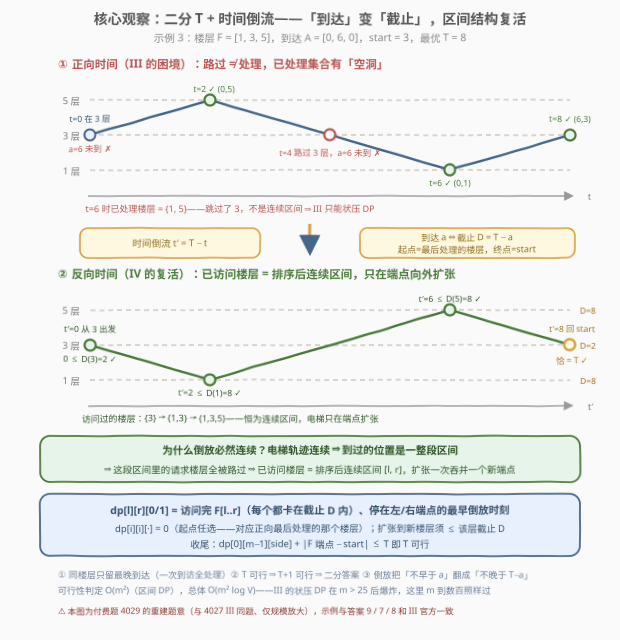
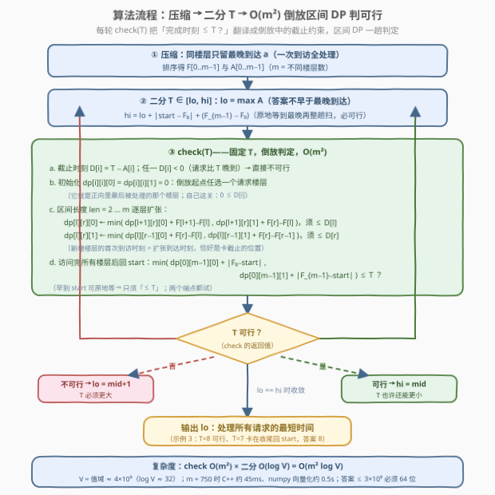

# LeetCode 电梯请求IV 题解

## 1. 题目概述

- **标题 / 题号**：电梯请求IV（#4029，hard）
- **链接**：https://leetcode.cn/problems/elevator-requests-iv/
- **难度**：困难
- **标签**：数组、动态规划、二分查找、排序

> ⚠️ 本题为 LeetCode 付费题（Plus 会员专享），题意描述根据官方示例用例与 hints 重建，可能与官方题面有出入。

**题意**：题意与 [4027. 电梯请求 III](https://leetcode.cn/problems/elevator-requests-iii/) **完全相同**，仅 `requests` 规模放大——官方 hints 明示目标复杂度 $O(m^2 \log V)$（二分 + 倒放 + 区间 DP）。三组示例与 III 官方**逐字相同**、答案一致（付费题 4028 与 4021 也是这种「示例全同、规模放大」的姊妹关系，可互为佐证）。

给你一个整数 `n` 表示一栋建筑的楼层数，楼层编号从 `0` 到 `n - 1`。同时给你一个整数 `start`，表示电梯的起始楼层，以及一个二维整数数组 `requests`，其中 `requests[i] = [arrival_i, floor_i]` 表示在时间 `arrival_i` 发出了一个前往楼层 `floor_i` 的请求。

在时间 `0`，电梯在楼层 `start`。每一秒钟，电梯可以**向上**移动一层、**向下**移动一层，或者**停留**在当前楼层。

一个请求只能在其**到达时间或之后**被处理；从请求到达时起，只要电梯在任意时刻位于该请求对应的楼层，该请求就会被**立即**处理。

返回处理所有请求所需的**最短**时间。

**示例 1**：

```text
输入：n = 9, start = 0, requests = [[0,8],[6,5]]
输出：9
解释：0 → 5 花 5 秒，t = 5 时请求 (6,5) 还没到，等到 6 处理；
      5 → 8 花 3 秒，t = 9 处理 (0,8)。
```

**示例 2**：

```text
输入：n = 8, start = 5, requests = [[1,7],[7,3]]
输出：7
解释：5 → 7 花 2 秒，t = 2 ≥ 1 立即处理；7 → 3 花 4 秒，t = 6 < 7，等到 7。
```

**示例 3**：

```text
输入：n = 7, start = 3, requests = [[0,5],[0,1],[6,3]]
输出：8
解释：3 → 5（t=2 处理）→ 1（t=6 处理）→ 3（t=8 ≥ 6 处理）。
```

**约束条件**（付费题未公开，按 hints 与姊妹题推断）：

- $1 \le n \le 10^9$
- $1 \le \text{requests.length} \le 750$ 级（hints 明示单次可行性判定 $O(m^2)$、总体 $O(m^2 \log V)$——正是数百量级的 $m$ 才配这个复杂度；姊妹题 4023 的区间 DP 版同为 $m \le 750$）
- $0 \le \text{arrival}_i \le 10^9$
- $0 \le \text{start}, \text{floor}_i \le n - 1$
- 楼层可重复（hint 1 明示「压缩成 $m$ 个不同楼层」）

> 💡 **审题关键**：① 同楼层的多个请求只看**最晚到达**——一次不早于最晚到达的到访就把该层全部处理掉；② 目标是 makespan（最后一个处理时刻）且可行性随 $T$ 单调 ⇒ **二分答案**；③ 与 III 唯一的差别是 $m$：状压 $2^m$ 在 $m > 25$ 后彻底不可行，必须找到多项式判定；④ 函数签名沿用 III 的 `elevatorRequests`（付费题看不到官方代码模板，按系列惯例重建）。

## 2. 解题思路

### 2.1 暴力思路

III 的状压 DP $O(2^m m^2)$ 在 $m = 750$ 面前是 $2^{750}$ 个状态，天文数字；排列枚举 $m!$ 同样不可行。贪心也活不下来——III 已给出两个反例（先到先服务与最近邻分别输 20:15、109:100）。

更本质的障碍是 III 题解宣判过的那句「**区间结构失效**」：正向时间里电梯可能路过某层时请求还没到、只能回头再来，已处理集合出现空洞——示例 3 里 3 层被路过了**两次**（t=0 出发时、t=4 下行途中），直到 t=8 才真正处理。4023（II）赖以做区间 DP 的地基，在分散到达的正向世界里是塌的。

IV 的出路不是更聪明的正向搜索，而是**换一个时间方向看同一条轨迹**。

### 2.2 核心观察：二分答案 + 时间倒流，区间结构在倒放中复活



**观察一（同层压缩）**。楼层 $f$ 上有多个请求 $a_1, \dots, a_k$，则任意一次 $t \ge \max a_j$ 的到访会把它们**全部**处理掉，而 makespan 只由每个楼层「那次足够的到访」决定。于是输入压缩成 $m$ 个不同楼层：排序得 $F[0..m-1]$，每层只留 $A[i] = \max$ 到达时刻。

**观察二（可行性单调 ⇒ 二分答案 $T$）**。问「完成时刻 $\le T$ 吗」：$T$ 变大只会让所有约束更松（下见观察三，截止与收尾同时放宽），故可行性单调，可二分最小可行 $T$。界不用精细：下界 $lo = \max A$（最后一个处理不早于最晚到达）；上界 $hi = \max A + |start - F_0| + (F_{m-1} - F_0)$——原地等到 $\max A$ 再从近端扫到远端，每个楼层都在不早于自己的到达时刻被访问，必可行。

**观察三（时间倒流：下界变上界）**。固定 $T$，令 $t' = T - t$ 把轨迹**倒放**：$x'(t') = x(T - t')$。这是对合变换，轨迹一一对应、每秒 ±1 层的速度约束原样保留，但所有约束镜像翻转：

| 正向 | 倒放 |
|------|------|
| $t = 0$ 从 `start` 出发 | $t' = T$ **回到** `start`（倒放的终点）|
| $t = T$ 停在最后处理的楼层 $p$ | $t' = 0$ **从 $p$ 出发**（$p$ 是某请求楼层，枚举）|
| 请求 $(f, a)$：某 $t \in [a, T]$ 位于 $f$ | 楼层 $f$：某 $t' \in [0,\ T - a]$ 访问——**截止 $D = T - a$** |

于是「完成时刻 $\le T$ 吗」等价于：**从某个请求楼层出发，在各自截止 $D$ 前访问全部 $m$ 个楼层，最后回到 `start`，总时长 $\le T$**——一个纯「截止时刻」型的数轴服务问题。

**观察四（区间结构复活）**。倒放里「访问过」是**到过就算**：轨迹连续 ⇒ 任意时刻到过的位置是一整段区间 ⇒ 区间内的请求楼层全被路过 ⇒ **已访问楼层 = 排序后的连续区间 $[l, r]$**——正是正向世界里塌掉、4023（II）里立着的那个结构！而且最优倒放只在区间端点向外扩张（进区间内部闲逛或在原地等待帮不了任何截止，删掉只会更早）。状态坍缩成三元组：

$$\text{dp}[l][r][0/1] = \text{访问完 } F[l..r] \text{ 全部楼层（各自卡在截止内）、停在左/右端点的最早倒放时刻}$$

- **初始**：$\text{dp}[i][i][\cdot] = 0$——倒放起点任选一个请求楼层（它就是正向最后被处理的那个；$0 \le D[i]$ 已含在全局检查里）；
- **扩张**（以向左为例）：$\text{dp}[l][r][0] \gets \min\big(\text{dp}[l{+}1][r][0] + F[l{+}1] - F[l],\ \text{dp}[l{+}1][r][1] + F[r] - F[l]\big)$，且**须 $\le D[l]$**（新楼层的首次到访恰在扩张到达时刻）；右端对称；
- **收尾**：$\min\big(\text{dp}[0][m{-}1][0] + |F_0 - start|,\ \text{dp}[0][m{-}1][1] + |F_{m-1} - start|\big) \le T$ 即可行（早到 `start` 可原地等，等价于正向开头在 `start` 停留）。

> ⚠️ **四个正确性细节**（每个都是能翻车的暗礁）：
> ① **扩张时刻 = 新楼层首次到访**：扩张前轨迹位置被围在 $[F_{l+1}, F_r]$ 内（若到过更远的地方，区间早该更大了），$F[l]$ 在界外，首次到访只能是扩张这一脚——截止检查的位置恰好正确；
> ② **min 时刻无损**：截止是「$\le$」型约束，早到严格支配晚到，等待与闲逛可全删，只存每个状态的最早时刻；
> ③ **长腿路过顺带无损**：从 $u$ 直奔 $v$ 途中路过的请求楼层，拆成逐层扩张后到达时刻望远镜求和不变——与 4027 的「捎带」论证同构；
> ④ **倒放起点必是请求楼层**：makespan 时刻电梯恰好停在最后一个被处理的请求楼层，所以 $\text{dp}[i][i] = 0$ 对**所有** $i$ 初始化（枚举起点），不漏任何方案。

> 💡 **一句话总结**：makespan 单调 ⇒ 二分 $T$；倒放 $t' = T - t$ 把「不早于 $a$」翻成「不晚于 $T - a$」、把起点终点对调；连续轨迹 ⇒ 已访问楼层恒为连续区间 ⇒ $O(m^2)$ 区间 DP 判定，总体 $O(m^2 \log V)$——III 埋掉的区间结构，被时间倒流救了回来。

### 2.3 算法流程图



| 步骤 | 操作 | 说明 |
|------|------|------|
| ① | 同楼层只留最晚 $a$，排序得 $F, A$ | hint 1 的压缩，$m$ = 不同楼层数 |
| ② | $lo = \max A$，$hi = lo + \lvert start - F_0\rvert + (F_{m-1} - F_0)$ | 下界：答案不早于最晚到达；上界：等到最晚再整趟扫，构造性可行 |
| ③ | check($T$)：$D[i] = T - A[i]$，有负即毙 | 有请求比 $T$ 还晚到 |
| ④ | $\text{dp}[i][i][\cdot] = 0$；$len = 2..m$ 逐层扩张 | 距离相加，卡**新楼层**的截止 $D$ |
| ⑤ | 收尾 $\text{dp}[0][m{-}1][\cdot] + \lvert F\text{ 端点} - start\rvert \le T$？ | 早到 `start` 原地等 ⇒「$\le$」即可，两个端点都试 |
| ⑥ | 可行 $hi = mid$，否则 $lo = mid + 1$ | 标准二分答案 |
| ⑦ | 收敛输出 $lo$ | $m = 1$ 退化 $\max(a_0, \lvert start - f_0\rvert)$，无须特判 |

### 2.4 示例演算

**示例 3**（$start = 3$，请求 $(0,5)$、$(0,1)$、$(6,3)$）：压缩排序 $F = [1, 3, 5]$，$A = [0, 6, 0]$。

**T = 8**：$D = [8, 2, 8]$。

| 区间（楼层） | 端点 | 计算 | 值 |
|--------------|------|------|----|
| $[1,1]$（3）| 左/右 | 起点任选（正向最后处理的 3 层），$0 \le D(3)=2$ | 0 |
| $[0,1]$（1,3）| 左（在 1）| $0 + (3-1) = 2 \le D(1)=8$ | 2 |
| $[0,1]$（1,3）| 右（在 3）| $0 + (3-1) = 2 \le D(3)=2$ | 2 |
| $[1,2]$（3,5）| 左（在 3）| $0 + (5-3) = 2 \le D(3)=2$ | 2 |
| $[1,2]$（3,5）| 右（在 5）| $0 + (5-3) = 2 \le D(5)=8$ | 2 |
| $[0,2]$（1,3,5）| 左（在 1）| $\min(2+2,\ 2+4) = 4 \le 8$ | 4 |
| $[0,2]$（1,3,5）| 右（在 5）| $\min(2+4,\ 2+2) = 4 \le 8$ | 4 |

收尾：$\min(4 + |1-3|,\ 4 + |5-3|) = 6 \le 8$ ✓ **可行**。对应正向：3 层停到 $t=2$ → 1 层（$t=4$）→ 3 层（$t=6$，恰卡 $a=6$）→ 5 层（$t=8$）。

**T = 7**：$D = [7, 1, 7]$。$[0,1]$ 右端 $2 > 1$、$[1,2]$ 左端 $2 > 1$ 被截止卡死，但绕另一侧扩张仍得 $\text{dp}[0][2][\cdot] = 6$；收尾 $6 + 2 = 8 > 7$ ✗ **不可行**——死在最后回 `start` 的一腿。故答案 $8$。

**示例 1/2 同法可验**：示例 1（$F=[5,8]$，$A=[6,0]$）在 $T=9$ 时扩张 $0+(8-5)=3$ 恰卡 $D(5)=3$、收尾 $3+5=8 \le 9$；$T=8$ 时该扩张 $3 > 2$ 被卡、另一侧收尾 $3+8=11 > 8$ ⇒ 答案 9。示例 2（$F=[3,7]$，$A=[7,1]$）在 $T=7$ 时 $D(3)=0$ 迫使倒放起点必为 3 层、扩张到 7 层（$t'=4 \le 6$）后收尾 $4+2=6 \le 7$；$T=6$ 直接 $D(3)<0$ ⇒ 答案 7。✓

## 3. 参考代码

### C++

```cpp
class Solution {
  public:
    long long elevatorRequests(int n, int start, vector<vector<int>>& requests) {
        map<int, long long> latest;                     // 楼层 -> 最晚到达时刻
        for (auto& r : requests) {
            auto it = latest.find(r[1]);
            if (it == latest.end()) latest.emplace(r[1], (long long)r[0]);
            else it->second = max(it->second, (long long)r[0]);
        }
        int m = latest.size();
        vector<long long> F(m), A(m);
        int k = 0;
        for (auto& [f, a] : latest) { F[k] = f; A[k] = a; k++; }

        auto dist = [](long long x, long long y) { return x > y ? x - y : y - x; };
        long long lo = 0;
        for (int i = 0; i < m; i++) lo = max(lo, A[i]);     // 答案 >= 最晚到达
        long long hi = lo + dist(start, F[0]) + (F[m-1] - F[0]);  // 等到最晚再整趟扫

        const long long INF = LLONG_MAX / 4;
        vector<long long> dp(2LL * m * m, INF);
        auto id = [&](int l, int r, int s) { return ((long long)l * m + r) * 2 + s; };

        auto check = [&](long long T) {
            vector<long long> D(m);
            for (int i = 0; i < m; i++) {
                D[i] = T - A[i];                          // 倒放截止 = T - a
                if (D[i] < 0) return false;               // 有请求比 T 还晚到
            }
            fill(dp.begin(), dp.end(), INF);
            for (int i = 0; i < m; i++)                   // 起点任选一个请求楼层
                dp[id(i, i, 0)] = dp[id(i, i, 1)] = 0;
            for (int len = 2; len <= m; len++)            // 区间递增 = 依赖序
                for (int l = 0; l + len - 1 < m; l++) {
                    int r = l + len - 1;
                    long long best = min(dp[id(l+1, r, 0)] + F[l+1] - F[l],
                                         dp[id(l+1, r, 1)] + F[r]   - F[l]);
                    if (best <= D[l]) dp[id(l, r, 0)] = best;      // 卡新楼层截止
                    best = min(dp[id(l, r-1, 0)] + F[r]   - F[l],
                               dp[id(l, r-1, 1)] + F[r]   - F[r-1]);
                    if (best <= D[r]) dp[id(l, r, 1)] = best;
                }
            long long t0 = dp[id(0, m-1, 0)], t1 = dp[id(0, m-1, 1)];
            if (t0 < INF && t0 + dist(F[0], start) <= T) return true;   // 回 start
            if (t1 < INF && t1 + dist(F[m-1], start) <= T) return true;
            return false;
        };

        while (lo < hi) {
            long long mid = lo + (hi - lo) / 2;
            if (check(mid)) hi = mid;
            else lo = mid + 1;
        }
        return lo;
    }
};
```

> 💡 **写法要点**：
> - `INF` 取 `LLONG_MAX / 4`：有效值 $\le 3 \times 10^9$，加距离既不溢出也不与有效值混淆；且**只有 $best \le D$ 时才写表**，不可达态永远保持精确 INF，杜绝「INF + 距离」逐层累积；
> - dp 拉平成一维（$2m^2$ 个 `long long`，$m = 750$ 约 9 MB），每轮 check 整表重置；区间按 `len` 递增枚举天然满足依赖序；
> - 签名沿用 III 的 `elevatorRequests`（付费题模板不可见，按系列惯例重建）。

### Python

```python
import numpy as np

class Solution:
    def elevatorRequests(self, n: int, start: int, requests: list[list[int]]) -> int:
        latest = {}                                   # 楼层 -> 最晚到达时刻
        for a, f in requests:
            if f not in latest or latest[f] < a:
                latest[f] = a
        keys = sorted(latest)
        F = np.array(keys, dtype=np.int64)
        A = np.array([latest[f] for f in keys], dtype=np.int64)
        m = len(F)
        INF = np.int64(1) << np.int64(62)

        lo = int(A.max())                             # 答案 >= 最晚到达
        hi = lo + abs(start - int(F[0])) + int(F[-1] - F[0])

        def check(T: int) -> bool:
            D = T - A                                 # 倒放截止 = T - a
            if int(D.min()) < 0:
                return False
            d0 = np.zeros(m, dtype=np.int64)          # 对角线 len=1：d0[l] = dp[l][l][0]
            d1 = np.zeros(m, dtype=np.int64)
            for k in range(2, m + 1):                 # 区间长度 k，只依赖 k-1 层
                sz = m - k + 1                        # 新对角线长度（l = 0..sz-1）
                c0 = np.minimum(d0[1:sz+1] + F[1:sz+1] - F[:sz],   # 左端：来自 [l+1, r]
                                d1[1:sz+1] + F[k-1:m]  - F[:sz])
                c1 = np.minimum(d0[:sz]   + F[k-1:m]  - F[:sz],    # 右端：来自 [l, r-1]
                                d1[:sz]   + F[k-1:m]  - F[k-2:m-1])
                d0 = np.where(c0 <= D[:sz], c0, INF)  # 卡新楼层截止，卡掉的重置精确 INF
                d1 = np.where(c1 <= D[k-1:m], c1, INF)
            t0 = int(d0[0]) + abs(int(F[0]) - start)      # 收尾：回 start
            t1 = int(d1[0]) + abs(int(F[-1]) - start)
            return t0 <= T or t1 <= T

        while lo < hi:
            mid = (lo + hi) // 2
            if check(mid):
                hi = mid
            else:
                lo = mid + 1
        return lo
```

> 💡 **写法要点**：
> - 按区间长度分层时第 $k$ 层只读第 $k-1$ 层 ⇒ 滚动成**两条对角线数组** $d_0/d_1$，每层整体交给 numpy（`np.minimum` 合并两来源、`np.where` 卡截止），$m = 750$ 实测约 0.5 s；
> - 必须显式 `int64`：答案 $\le 3 \times 10^9$ 超 int32，且 `INF = 2^62` 加距离不得回绕——被截止卡掉的项由 `where` 重置回精确 INF，无累积污染；
> - 若评测环境无 numpy：照 C++ 思路写纯 Python 三重循环即可（约 $m^2 \log V \approx 1.8 \times 10^7$ 步，偏慢），更稳的是 C++/Java 提交。

## 4. 复杂度分析

| 维度 | 复杂度 | 说明 |
|------|--------|------|
| 时间 | $O(m^2 \log V)$ | 每次 check 是区间 DP：$\frac{m(m+1)}{2}$ 个区间 × 2 端点 × $O(1)$ 转移；二分轮数 $\log V \approx 32$（$V \le 4 \times 10^9$）。$m = 750$ 时 C++ 实测 45ms、numpy 向量化约 0.5s |
| 空间 | $O(m^2)$，可压 $O(m)$ | C++ 全表 $2m^2$ 个 `long long` 约 9MB；按对角线滚动只需两条 $O(m)$ 数组（Python 版即如此） |
| 答案规模 | $\le 3 \times 10^9$ | $hi = \max A + \lvert start - F_0\rvert + (F_{m-1} - F_0) \le 10^9 + 10^9 + 10^9$；int32 必炸，C++ 全程 `long long`、numpy 显式 `int64`（Python 大整数天然免疫） |

## 5. 扩展：电梯四部曲的分野与「倒放」的适用边界

**四部曲全景**：

| 题号 | 请求到达 | 目标 | $m$ | 关键结构 | 算法 |
|------|----------|------|-----|----------|------|
| 4020 I | 顺序给定 | 总时间 | — | 轨迹唯一 | $O(m)$ 模拟 |
| 4023 II | 全部 $t = 0$ | $\sum$ 惩罚 | $\le 750$ | 正向连续区间 | $O(m^2)$ 区间 DP |
| 4027 III | 分散到达 | makespan | $\le 16$ | 无（正向有空洞）| $O(2^m m^2)$ 状压 |
| 4029 IV | 分散到达 | makespan | $\sim 750$ | **倒放**连续区间 | $O(m^2 \log V)$ 二分 + 倒放 |

**倒放为什么奏效**：「release time + makespan on a line」是经典的可解特例——max 目标只关心每个楼层**一次足够早的到访**，倒放把下界翻成上界后恰是「带截止的数轴遍历」（区间 DP 标准形态）。两个条件缺一不可：换一般图（时间窗 TSP）是 NP-hard；换 $\sum$ 目标（各请求分别计费，同层早请求也要早处理、一次到访不够刻画）倒放的支配性论证也不再成立——II 的 $a = 0$ 特例退回正向区间 DP，$a > 0$ 的 $\sum$ 版则难得多。

**II 与 IV 是结构孪生**：II 靠「同时到达 ⇒ 永无空洞」在正向立起区间结构；IV 靠倒放把「到过就算」的截止世界还原出同一结构。可以说 IV = II 的结构 + III 的题意 + 二分的壳。值域二分的 32 轮理论上还能再压（可行性翻转的断点必是某些 $a_i$ 与路径长的组合），但 $O(m^2 \log V)$ 已绰绰有余，不值得为省一个 $\log$ 因子增加实现风险。

## 6. 面试要点

**Q1：怎么想到二分答案？**

> 目标是 makespan 型（「最短完成时间」），且可行性对 $T$ 单调：$T$ 变大只会让截止 $T - a$ 与收尾时限同时放宽。这是 410/1011 二分答案家族的标准信号——先猜答案、再验答案。本题的难点全在 $O(m^2)$ 的判定器上。

**Q2：时间倒流具体翻译了什么？为什么成立？**

> $t' = T - t$ 是对合变换：$x'(t') = x(T - t')$ 与原轨迹一一对应、速度约束不变，但约束镜像翻转——「某 $t \ge a$ 在 $f$」变「某 $t' \le T - a$ 访问 $f$」，下界变上界；起点终点对调：正向起点 `start` 变倒放终点，正向终点（最后处理的楼层，必是请求楼层）变倒放起点。判定器因此在「截止型」世界里运行，而这正是区间 DP 的母语。

**Q3：为什么倒放里已访问集合是连续区间，正向却不是？**

> 正向约束「$\ge a$」允许「到了不算数」：路过时请求未到就得回头，集合出空洞（示例 3 的 3 层被路过两次）。倒放约束「$\le D$」是「到过就算」：轨迹连续 ⇒ 到过的位置是一整段区间 ⇒ 区间里的请求楼层全被访问。同一条轨迹、两种计法，结构天壤之别——这是本题最值得玩味的一步，也是 III 与 IV 难度分野的根源。

**Q4：区间 DP 有哪些隐藏的正确性假设？**

> ① 扩张到达时刻 = 新楼层**首次**到访（扩张前位置被围在区间内）；② min 时刻支配（截止是上界，早到不劣，等待与闲逛可删）；③ 长腿路过的楼层 = 逐层扩张的望远镜拆分，到达时刻不变；④ 倒放起点必是请求楼层（makespan 时刻电梯恰在最后处理的楼层），所以 $\text{dp}[i][i] = 0$ 对所有 $i$ 初始化、天然枚举起点。

**Q5：溢出和边界要注意什么？**

> ① 答案上界 $\le 3 \times 10^9$：int32 必炸，C++ 全程 `long long`、numpy 显式 `int64`；② INF 哨兵要经得起「加距离」且不可达态保持精确 INF（`LLONG_MAX/4` + 只在过关时写表）；③ $m = 1$ 退化 $\max(a_0, \lvert start - f_0\rvert)$，代码无须特判；④ 重复楼层先压缩再 DP（hint 1）；⑤ 二分下界直接从 $\max A$ 起步（makespan $\ge$ 最晚到达）。

## 同类练习题

| # | 题目 | 与本题的关联 |
|---|------|-------------|
| 4027 | [电梯请求III](https://leetcode.cn/problems/elevator-requests-iii/) | 同题意的小规模版（$m \le 16$ 状压 DP），本题最直接的暴力对拍基准 |
| 4023 | [电梯请求II](https://leetcode.cn/problems/elevator-requests-ii/) | 同时到达的正向区间 DP——倒放复活的结构正是它的骨架 |
| 4020 | [电梯请求I](https://leetcode.cn/problems/elevator-requests-i/) | 系列首作，顺序给定零决策，$O(m)$ 模拟 |
| 1011 | [在D天内送达包裹的能力](https://leetcode.cn/problems/capacity-to-ship-packages-within-d-days/) | 二分答案 + 单调可行性判定的入门款，体会「猜答案、验答案」范式 |
| 1547 | [切棍子的最小成本](https://leetcode.cn/problems/minimum-cost-to-cut-a-stick/) | 排序端点 + $(l, r, side)$ 区间 DP，与本题状态设计同构 |
