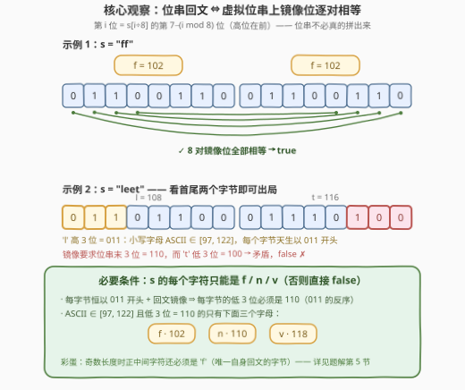
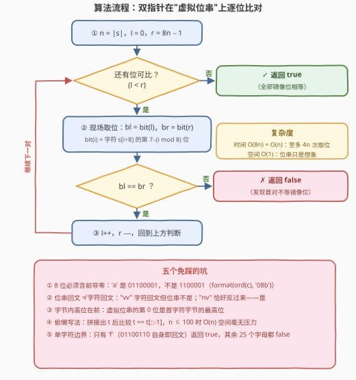

# 判断 ASCII 值回文

- **题目名称**：判断 ASCII 值回文
- **链接**：[4030. 判断 ASCII 值回文](https://leetcode.cn/problems/check-ascii-palindromic/)
- **难度**：简单
- **标签**：字符串、位运算、双指针

## 1. 题目概述

给你一个由**小写英文字母**组成的字符串 $s$。

将 $s$ 中的每个字符替换为其 ASCII 值对应的 **8 位二进制表示**（**包括前导零**），并保持字符原有顺序，从而构造一个**二进制字符串**。

如果得到的二进制字符串是一个**回文串**，则返回 `true`；否则返回 `false`。

- **二进制字符串**：仅由字符 `'0'` 和 `'1'` 组成的字符串。
- **回文串**：正着读和反着读都相同的字符串。

**示例 1**：

```text
输入：s = "ff"
输出：true
解释：'f' 的 ASCII 值为 102，8 位二进制表示为 01100110，
拼接得到 0110011001100110，它是回文串。
```

**示例 2**：

```text
输入：s = "leet"
输出：false
解释：'l'、'e'、'e'、't' 的 8 位二进制表示分别为
01101100、01100101、01100101、01110100，
拼接得到 01101100011001010110010101110100，不是回文串。
```

**约束条件**：

- $1 \le s.length \le 100$
- $s$ 仅由小写英文字母组成

> 💡 **审题关键**：① 每个字符**固定**展开为 8 位且**含前导零**，位串长度恒为 $8n$；② 判的是**位串**回文，不是字符回文——`"vv"` 不是（字符回文但位串不是），`"nv"` 反而是（位串回文但字符不回文）；③ 小写字母 ASCII 为 $97 \sim 122$，每个字节天生以 `011` 开头，这个"公共前缀"能推出极强的必要条件（见第 5 节）。

---

## 2. 解题思路

### 2.1 暴力思路：显式拼接整个位串，再判回文

最"忠实于题面"的写法分两步：

```text
① 每个 c ∈ s 转成 8 位二进制（含前导零），按序拼接得到 t
② 反转比较（或双指针）判断 t 是否回文
```

```python
t = ''.join(f'{ord(c):08b}' for c in s)
return t == t[::-1]
```

正确性显然，时间 $O(8n)$、空间 $O(8n)$。本题 $n \le 100$，位串至多 800 位，这个版本完全够用。但它把 800 个 `'0'`/`'1'` 真的写进了内存——**位串的每一位其实都能按需算出来**，根本不必显式存在。

### 2.2 核心观察：位串是虚拟的——第 $i$ 位按需取出



**观察一（定位公式）**。位串的第 $i$ 位（$0 \le i < 8n$）落在第 $\lfloor i/8 \rfloor$ 个字符的字节里，是其中**高位在前**的第 $i \bmod 8$ 位：

$$\text{bit}(i) \;=\; \Bigl( s[\,i \gg 3\,] \;\gg\; \bigl(7 - (i \,\&\, 7)\bigr) \Bigr) \,\&\, 1$$

**观察二（回文条件）**。回文要求第 $i$ 位与第 $8n-1-i$ 位相等。于是双指针 $l = 0$、$r = 8n-1$ 向中间收缩，每轮用观察一**现场取出**两位比较——全程不建串，空间 $O(1)$。

**观察三（快速出局）**。小写字母 ASCII 为 $97 \sim 122$（二进制 $01100001 \sim 01111010$），**每个字节恒以 `011` 开头**。镜像相等迫使每个字节的低 3 位必须是 `110`（`011` 的反序），于是 $s$ 中每个字符只能是 `f`(102)、`n`(110)、`v`(118)——出现其它字母可立刻返回 `false`（`"leet"` 的 `l` 在这一步就被否了）。推导详见第 5 节。

> 💡 **一句话总结**：第 $i$ 位 $= s[i \gg 3]$ 的第 $7-(i \,\&\, 7)$ 位（高位在前）；双指针在"想象中的位串"上逐对比较，空间 $O(1)$；顺手还能用「字符只能是 f/n/v」做一步快筛。

### 2.3 算法流程图



| 步骤 | 操作 | 说明 |
|------|------|------|
| ① | `n = |s|`，`l = 0`，`r = 8n − 1` | 虚拟位串的下标区间 $[0, 8n)$ |
| ② | 取 `bl = bit(l)`，`br = bit(r)` | 按定位公式现场取位，不建串 |
| ③ | `bl == br`？不等则返回 `false` | 发现首对不等的镜像位即出局 |
| ④ | `l++`，`r−−`，回到 ② | 收缩至 $l \ge r$ 仍无失配则返回 `true` |

### 2.4 示例演算

**示例 1**：$s = $ `"ff"`，位串 `01100110 01100110`（16 位）：

| 镜像对 $(l, r)$ | $\text{bit}(l)$ | $\text{bit}(r)$ | 结果 |
|----------------|----|----|------|
| $(0, 15)$ | `'f'` 最高位 = 0 | `'f'` 最低位 = 0 | ✓ |
| $(1, 14)$ | 1 | 1 | ✓ |
| $(2, 13)$ | 1 | 1 | ✓ |
| $\cdots$ | | | 8 对全部相等 |

返回 $\mathbf{true}$。妙处在于 `'f' = 01100110` 这个字节**自身就是回文**，两个 `f` 互为镜像，整串自然回文。

**示例 2**：$s = $ `"leet"`，位串长 $32$ 位：

| 镜像对 $(l, r)$ | $\text{bit}(l)$ | $\text{bit}(r)$ | 结果 |
|----------------|----|----|------|
| $(0, 31)$ | `'l'` 最高位 = 0 | `'t'` 最低位 = 0 | ✓ |
| $(1, 30)$ | `'l'` 第 2 位 = 1 | `'t'` 倒数第 2 位 = 0 | ✗ 不等 |

第二步即失配，返回 $\mathbf{false}$——与观察三一致：`l` 根本不在 $\{f, n, v\}$ 里，看首字符就能出局。

---

## 3. 参考代码

### C++

```cpp
class Solution {
  public:
    bool isPalindromic(string s) {
        int n = s.size(), l = 0, r = 8 * n - 1;         // 虚拟位串下标 [0, 8n)
        while (l < r) {
            int bl = (s[l >> 3] >> (7 - (l & 7))) & 1;  // s[l/8] 的第 7-l%8 位
            int br = (s[r >> 3] >> (7 - (r & 7))) & 1;
            if (bl != br) return false;                 // 首对不等镜像位，出局
            ++l, --r;                                   // 收缩
        }
        return true;
    }
};
```

> 💡 **写法要点**：
> - `l >> 3` 即 $l/8$ 定字符，`7 - (l & 7)` 定位（字节内**高位在前**）；
> - 小写字母 ASCII $\le 122$，`char` 右移无符号问题；若泛化到任意字节建议先转 `(unsigned char)`；
> - 循环至多 $4n$ 轮（每轮消化一对镜像位）。

### Python

```python
class Solution:
    def isPalindromic(self, s: str) -> bool:
        t = ''.join(f'{ord(c):08b}' for c in s)   # 'f' -> '01100110'，注意补足前导零
        return t == t[::-1]
```

> 💡 **写法要点**：
> - `f'{ord(c):08b}'` 中的 `08` 保证 8 位**含前导零**——`'a'` 是 `01100001` 而非 `1100001`；
> - 位串至多 800 位，$O(n)$ 空间毫无压力，比双指针版更清晰易写；
> - 想练 $O(1)$ 空间可照 C++ 版写双指针：`bit = lambda i: (ord(s[i >> 3]) >> (7 - (i & 7))) & 1`。

---

## 4. 复杂度分析

| 维度 | 复杂度 | 说明 |
|------|--------|------|
| 时间 | $O(n)$ | 双指针至多 $8n/2 = 4n$ 次取位比较；拼接版同样 $O(8n)$ |
| 空间 | $O(1)$（双指针版） | 位串按需计算、不落内存；拼接版为 $O(8n)$，本题规模下同样可接受 |
| 答案规模 | 布尔值 | 无溢出问题 |

---

## 5. 扩展：字节级刻画——$\mathrm{rev}_8$ 与 {f, n, v} 定理

每个字符恰好 8 位、且 8 是偶数 ⇒ 位串长度 $8n$ 为偶数、**回文中轴恰落在字节边界上**。把回文条件按字节分组改写：设 $B_j$ 为第 $j$ 个字符的字节，则

$$B_j \text{ 的第 } k \text{ 位} = B_{n-1-j} \text{ 的第 } 7-k \text{ 位} \quad\Longleftrightarrow\quad B_{n-1-j} = \mathrm{rev}_8(B_j)$$

其中 $\mathrm{rev}_8$ 表示**字节内 8 位反转**（[190. 颠倒二进制位](https://leetcode.cn/problems/reverse-bits/) 的 8 位迷你版）。由此得到两个漂亮的推论：

**定理 1（字符集塌缩）**。$B_{n-1-j}$ 也是小写字母的字节（同样以 `011` 开头），而它等于 $\mathrm{rev}_8(B_j)$——后者以 `011` 开头，推出 $B_j$ 必以 `110` 结尾。**每个字符的低 3 位都必须是 `110`**，即 ASCII $\equiv 6 \pmod 8$，在 $97 \sim 122$ 中只有：

```text
f = 102 = 01100 110
n = 110 = 01101 110
v = 118 = 01110 110
```

出现任何其它字母，直接 `false`。

**定理 2（中轴字符）**。$n$ 为奇数时，正中间字节要满足 $\mathrm{rev}_8(B) = B$（字节自身回文）。逐个检查 26 个小写字母，**只有 `f` 满足**——`01100110` 反过来还是 `01100110`。所以奇数长度的 $s$ 若为 ASCII 回文，正中间字符必是 `f`（单字符串更是只有 `"f"` 返回 `true`）。

**完整刻画**。$\mathrm{rev}_8$ 在 $\{f, n, v\}$ 上的作用是 $f \mapsto f$、$n \leftrightarrow v$。记 $M$ 为"`n`、`v` 互换、`f` 不变"的字符映射，则

$$s \text{ 是 ASCII 回文} \;\Longleftrightarrow\; \text{每个字符} \in \{f, n, v\} \;\text{且}\; M(s) = \mathrm{reverse}(s)$$

验证：`"ff"`：$M(s)=$ `"ff"` $=$ 反转 `"ff"` ✓；`"nv"`：$M(s)=$ `"vn"` $=$ 反转 `"nv"` ✓；`"vvnn"`：$M(s)=$ `"nnvv"` $=$ 反转 `"vvnn"` ✓；`"fn"`：`"fv"` $\ne$ `"nf"` ✗。

于是"字节级"算法浮现：一趟扫描判断 $\mathrm{rev}_8(s_j) = s_{n-1-j}$ 对所有 $j$ 成立，比较次数是逐位版的 $1/8$。对本题纯属杀鸡用牛刀，但它是「**看清结构 ⇒ 折叠等价条件**」这一思维的好练习。

---

## 6. 面试要点

**Q1：位串回文和字符回文是一回事吗？**

> 不是。`"vv"` 是字符回文，但位串 `01101110 01110110` 的镜像要求第二个字节是 $\mathrm{rev}_8(v) = n$，故不是位串回文；反过来 `"nv"` 不是字符回文，位串却是回文。根源：镜像相等作用在**位**级别（$B_{n-1-j} = \mathrm{rev}_8(B_j)$），不是字符级别（$s_{n-1-j} = s_j$）。

**Q2：为什么必须补前导零？丢掉会怎样？**

> 题目定义的就是"8 位二进制表示"。若丢前导零（如把 `'a'` 写成 `1100001`），字节长度不再恒为 8，位串失去对齐，回文判定自然错乱。Python 里 `f'{ord(c):08b}'` 的 `08`、C++ 里逐位 `(c >> k) & 1`（$k$ 从 7 到 0）都在保证这一点。

**Q3：如何不显式构造位串就取第 $i$ 位？**

> $\text{bit}(i) = (s[i \gg 3] \gg (7 - (i \,\&\, 7))) \,\&\, 1$：$i \gg 3$ 定位字符，$i \,\&\, 7$ 定位字节内偏移，**高位在前**所以移位数是 $7-(i \,\&\, 7)$。双指针 $l, r$ 从两端收缩即得 $O(1)$ 空间解。

**Q4：有没有比逐位比较更快的判据？**

> 有。按字节分组可得 $B_{n-1-j} = \mathrm{rev}_8(B_j)$；再利用"小写字母字节恒以 `011` 开头"可推出每个字符只能是 `f`/`n`/`v`、奇长度时中轴必须是 `f`（见第 5 节）。比较次数缩为逐位版的 $1/8$，还能在第一步做字符集快筛。

**Q5：哪些边界用例值得自测？**

> ① 单字符：只有 `"f"` 是 `true`，其余 25 个字母都是 `false`；② 偶长度：`"vv"`（字符回文但位串不是，防"想当然"）、`"nv"`、`"vvnn"`（位串回文）；③ 奇长度：中轴不是 `f` 必 `false`，如 `"fnf"`；④ 规模上界：$n = 100$ 全 `f`，位串 800 位全回文，`true`。

---

## 7. 同类练习题

- [125. 验证回文串](https://leetcode.cn/problems/valid-palindrome/)：最基础的双指针判回文模板，本题把"指针"搬到了虚拟位串上
- [9. 回文数](https://leetcode.cn/problems/palindrome-number/)：反转一半数字即可判定，与双指针收缩同源的"只看一半"思想
- [190. 颠倒二进制位](https://leetcode.cn/problems/reverse-bits/)：$\mathrm{rev}_8$ 就是它的 8 位迷你版，第 5 节字节级刻画的基石
- [234. 回文链表](https://leetcode.cn/problems/palindrome-linked-list/)：结构不可随机访问时的回文判定，与"虚拟位串"异曲同工
- [4021. 得到旋转回文字符串的最少操作次数 I](https://leetcode.cn/problems/minimum-operations-to-make-a-rotated-palindrome-i/)：同目录近邻题，回文判定在"旋转"变体下的运用
