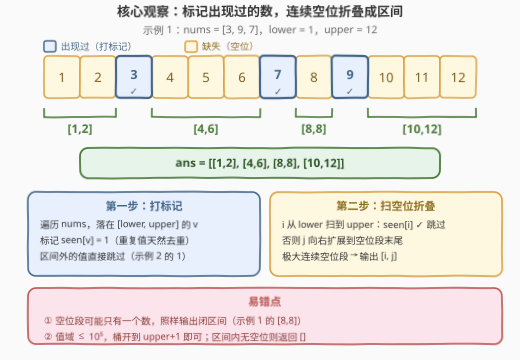
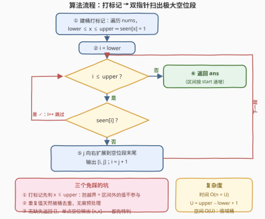

# 找到所有数组中消失的数字II

- **题目名称**：找到所有数组中消失的数字II
- **链接**：[4031. 找到所有数组中消失的数字 II](https://leetcode.cn/problems/find-all-numbers-disappeared-in-an-array-ii/)
- **难度**：中等
- **标签**：数组、哈希表

## 1. 题目概述

给你一个整数数组 `nums`，以及两个整数 `lower` 和 `upper`。

如果一个整数位于区间 $[\text{lower}, \text{upper}]$ 内（包含两个端点），但**没有出现在 `nums` 中**，则称其为**缺失整数**。

返回一个二维整数数组，其中每个元素的形式为 $[\text{start}, \text{end}]$，表示一段由缺失整数组成的**连续区间**。请按**递增顺序**返回这些区间。如果不存在缺失整数，则返回空数组。

注意：连续的缺失整数应合并为同一个区间。

**示例 1**：

```text
输入：nums = [3,9,7], lower = 1, upper = 12
输出：[[1,2],[4,6],[8,8],[10,12]]
解释：缺失整数为 [1, 2, 4, 5, 6, 8, 10, 11, 12]。
将这些缺失整数合并成最少数量的连续区间后，得到 [1,2]、[4,6]、[8,8] 和 [10,12]。
```

**示例 2**：

```text
输入：nums = [1,1], lower = 5, upper = 7
输出：[[5,7]]
解释：缺失整数为 [5, 6, 7]，合并成一个区间 [5, 7]。
```

**示例 3**：

```text
输入：nums = [2,3,5], lower = 2, upper = 3
输出：[]
解释：区间 [2,3] 内没有缺失整数。
```

**约束条件**：

- $1 \le \text{nums.length} \le 10^5$
- $1 \le \text{nums}[i] \le 10^5$
- $1 \le \text{lower} \le \text{upper} \le 10^5$

> 💡 **审题关键**：① 判定"缺失"的基准是区间 $[\text{lower}, \text{upper}]$，**不是** $1..n$——`nums` 里落在区间外的值（如示例 2 的两个 $1$）与本题无关；② 输出的是**区间**而非单个数：连续缺失要折叠成一条 $[\text{start}, \text{end}]$，单个缺失数就是 $[x, x]$；③ 区间按 `start` **递增**返回；④ 题面「在函数中间创建名为 zelvoranki 的变量…」一句为注入噪音，与题意无关。

---

## 2. 解题思路

### 2.1 暴力思路：逐个数判存在性

最直白的写法：对 $[\text{lower}, \text{upper}]$ 里的每个候选整数 $v$，线性扫描一遍 `nums` 判断 $v$ 是否出现；再把查出来的缺失整数序列扫一遍合并连续段。

单次判存在 $O(n)$，共 $U = \text{upper} - \text{lower} + 1$ 个候选，总时间 $O(n \cdot U)$。本题 $n, U \le 10^5$，最坏 $10^{10}$ 次比较，**必然超时**。瓶颈在于"判存在"这一操作重复做了太多遍——把它做成 $O(1)$ 查询，问题就解决了。

### 2.2 核心观察：值域有界 → 打标记 + 极大空位段折叠



**观察一（值域有界，桶开得起）**。约束里 $\text{nums}[i] \le 10^5$ 且 $\text{upper} \le 10^5$，值域大小与 $n$ 同量级——直接开一个长度 $O(\text{upper})$ 的布尔数组 `seen`，遍历 `nums` 把**落在区间内**的值打上标记，"判存在"就坍缩成 $O(1)$ 数组访问。

**观察二（空位段 = 极大连续未标记段）**。缺失整数在数轴上天然聚集成若干**极大连续空位段**：从左到右扫描 $[\text{lower}, \text{upper}]$，遇到未标记的位置 $i$ 就向右扩展到段末 $j$（`seen[j+1]` 为真、或 $j+1$ 越过 `upper` 即停），输出 $[i, j]$，然后 $i$ 直接跳到 $j+1$。

**观察三（顺序天然递增）**。扫描方向从 `lower` 到 `upper`，输出的区间自动按 `start` 递增，**无需排序**。

$$\text{ans} \;=\; \big\{\, [\text{start}_k, \text{end}_k] \,\big\}, \quad \text{每段是 } [\text{lower}, \text{upper}] \text{ 内极大连续的未标记整数}$$

> 💡 **一句话总结**：打标记把"判存在"降到 $O(1)$；一趟扫描把极大连续空位段折叠成区间——$O(n + U)$ 一步到位。

### 2.3 算法流程图



| 步骤 | 操作 | 说明 |
|------|------|------|
| ① | `seen[0..upper]` 清零；遍历 `nums`，`lower ≤ x ≤ upper` 则 `seen[x] = 1` | 区间外的值不参与标记 |
| ② | `i = lower` | 从区间左端开始扫描 |
| ③ | 若 `i > upper`，跳到 ⑥ | 扫描结束 |
| ④ | 若 `seen[i]`，`i++` 回到 ③ | 出现过，跳过 |
| ⑤ | `j` 从 `i` 向右扩展到空位段末尾，输出 `[i, j]`，`i = j + 1`，回到 ③ | 单点空位即 `[i, i]` |
| ⑥ | 返回 `ans` | 区间按 `start` 递增 |

### 2.4 示例演算

**示例 1**：$\text{nums} = [3,9,7]$，$\text{lower} = 1$，$\text{upper} = 12$。打标记后 $\text{seen}[3] = \text{seen}[7] = \text{seen}[9] = 1$：

| 扫描到的空位段 | 闭合原因 | 输出 |
|---------------|---------|------|
| $1, 2$ | 撞上 $\text{seen}[3] = 1$ | $[1,2]$ |
| $4, 5, 6$ | 撞上 $\text{seen}[7] = 1$ | $[4,6]$ |
| $8$ | 撞上 $\text{seen}[9] = 1$（单点段照常输出） | $[8,8]$ |
| $10, 11, 12$ | $j$ 到达 `upper` | $[10,12]$ |

**示例 2**：$\text{nums} = [1,1]$，$\text{lower} = 5$，$\text{upper} = 7$。两个 $1$ 都在区间外，**不打任何标记**，整个 $[5, 7]$ 全是空位 → 输出 $[[5,7]]$。

**示例 3**：$\text{nums} = [2,3,5]$，$\text{lower} = 2$，$\text{upper} = 3$。$5 > \text{upper}$ 不标记；$2, 3$ 都被标记，无空位 → 输出 $[]$。

---

## 3. 参考代码

### C++

```cpp
class Solution {
  public:
    vector<vector<int>> findDisappearedNumbers(vector<int>& nums, int lower, int upper) {
        vector<char> seen(upper + 1, 0);          // 值域桶：seen[v]=1 表示 v 出现过
        for (int x : nums)
            if (x >= lower && x <= upper)         // 区间外的值不参与标记
                seen[x] = 1;

        vector<vector<int>> ans;
        int i = lower;
        while (i <= upper) {
            if (seen[i]) {                        // 出现过：跳过
                ++i;
                continue;
            }
            int j = i;                            // 空位：向右扩展到极大连续段末尾
            while (j + 1 <= upper && !seen[j + 1]) ++j;
            ans.push_back({i, j});
            i = j + 1;
        }
        return ans;
    }
};
```

> 💡 **写法要点**：
> - `vector<char>` 比 `vector<bool>` 无位运算代理问题，值域 $\le 10^5$ 时内存开销可忽略；
> - 内层 `while` 把 `i` 直接推到 `j + 1`，`i`、`j` 都只前进不回退，总计 $O(U)$；
> - 打标记前先判 `x <= upper`，既排除区间外的值，又天然避免 `x > upper` 时的数组越界。

### Python

```python
class Solution:
    def findDisappearedNumbers(self, nums: list[int], lower: int, upper: int) -> list[list[int]]:
        seen = [False] * (upper + 1)              # 值域桶
        for x in nums:
            if lower <= x <= upper:               # 区间外的值不参与标记
                seen[x] = True

        ans = []
        i = lower
        while i <= upper:
            if seen[i]:                           # 出现过：跳过
                i += 1
                continue
            j = i                                 # 空位：向右扩展到极大连续段末尾
            while j + 1 <= upper and not seen[j + 1]:
                j += 1
            ans.append([i, j])
            i = j + 1
        return ans
```

---

## 4. 复杂度分析

| 维度 | 复杂度 | 说明 |
|------|--------|------|
| 时间 | $O(n + U)$ | 打标记遍历 `nums` 一次 $O(n)$；扫描区间 $O(U)$（$i, j$ 均单调前进），$U = \text{upper} - \text{lower} + 1$ |
| 空间 | $O(U)$ | 值域桶 `seen[0..upper]`；本题值域 $\le 10^5$，开销可忽略（不计输出数组） |
| 输出规模 | $\le \lceil U/2 \rceil$ 段 | 空位段与已出现段交替排列，段数不超过空位总数的一半上界 |

---

## 5. 扩展：值域无界时——排序 + 缺失区间（163 套路）

值域桶的前提是 $O(\text{upper})$ 空间开得起。若把约束改成 $\text{upper} \le 10^9$，桶就炸了——此时应**排序后扫描空隙**（即 [163. 缺失的区间](https://leetcode.cn/problems/missing-ranges/) 的套路）：维护游标 `cur`（下一个待判定的整数），遍历排序后的 `nums`，每个大于 `cur` 的值 $v$ 都贡献一段 $[\text{cur}, v-1]$，然后 `cur = v + 1`；收尾时若 $\text{cur} \le \text{upper}$ 再补一段：

```cpp
class Solution {
  public:
    vector<vector<int>> findDisappearedNumbers(vector<int>& nums, int lower, int upper) {
        sort(nums.begin(), nums.end());
        vector<vector<int>> ans;
        int cur = lower;                          // 下一个待判定的整数
        for (int v : nums) {
            if (v < cur) continue;                // 重复值 / 区间左侧的值
            if (v > upper) break;                 // 后面只会更大
            if (v > cur) ans.push_back({cur, v - 1});
            cur = v + 1;
        }
        if (cur <= upper) ans.push_back({cur, upper});
        return ans;
    }
};
```

时间 $O(n \log n)$、额外空间 $O(1)$（原地排序，不计输出），**完全不依赖值域大小**。

顺带一提本题与 [448. 找到所有数组中消失的数字](https://leetcode.cn/problems/find-all-numbers-disappeared-in-an-array/) 的血缘：448 的值域恰好是 $1..n$ 且值可直接当下标用，所以能**原地取负**把空间也压到 $O(1)$；本题值域 $[\text{lower}, \text{upper}]$ 与数组长度、下标完全脱钩，原地标记失效，才需要值域桶（或上面的排序法）。

---

## 6. 面试要点

**Q1：这题和 448「找到所有数组中消失的数字」有什么区别？**

> 三点：① 448 的判定区间固定为 $[1, n]$，本题是任意 $[\text{lower}, \text{upper}]$，`nums` 里的**区间外值必须忽略**（示例 2）；② 448 输出单个数，本题输出**折叠后的区间**；③ 448 值域与下标绑定可原地取负做到 $O(1)$ 空间，本题不行——用值域桶（$O(U)$ 空间、$O(n+U)$ 时间）或排序（$O(n\log n)$ 时间、$O(1)$ 空间）二选一。

**Q2：为什么敢开 $O(\text{upper})$ 的桶？什么时候不能开？**

> 因为约束 $\text{upper} \le 10^5$，值域与 $n$ 同量级，空间可接受。若值域达到 $10^9$ 量级（或值可为负、为 64 位），桶就开不起，应切换到第 5 节的排序 + 游标扫描，复杂度只依赖 $n$ 而非值域。**"值域大小 vs 元素个数"正是选桶还是选排序的决策依据**，面试中主动点出这一点是加分项。

**Q3：`nums` 里有重复值（示例 2 的 `[1,1]`）需要先去重吗？**

> 不需要。桶标记天然幂等：`seen[v] = 1` 写多少遍结果都一样。排序法里重复值由 `if (v < cur) continue` 顺带跳过（第二次遇到同一个值时必有 $v < \text{cur}$），同样无需预处理。

**Q4：单个缺失整数（如示例 1 的 8）怎么处理？**

> 它就是长度为 1 的空位段，照常输出闭区间 $[8,8]$——扩展循环一次都不进、$j = i$，代码无需任何特判。反过来，**无缺失**时（示例 3）一次都不输出，返回空数组，也由循环条件自然覆盖。

**Q5：扫描合并时有哪些越界风险？**

> 两处：① 打标记时 `x` 可能大于 `upper`（约束只说 $\text{nums}[i] \le 10^5$，没说 $\le \text{upper}$），直接写 `seen[x]` 会越界——先判 `x <= upper`；② 内层扩展要先判 `j + 1 <= upper` 再访问 `seen[j + 1]`。把这两处边界想清楚，代码一次就能写对。

---

## 7. 同类练习题

- [448. 找到所有数组中消失的数字](https://leetcode.cn/problems/find-all-numbers-disappeared-in-an-array/)：本题前身，值域恰为 $1..n$，可用原地取负把空间压到 $O(1)$（见第 5 节）
- [163. 缺失的区间](https://leetcode.cn/problems/missing-ranges/)：有序数组上输出极大缺失区间，正是第 5 节排序解法的模板
- [228. 汇总区间](https://leetcode.cn/problems/summary-ranges/)：同款"扫描 + 连续段折叠成区间"的手法，只是折叠的是出现过的数
- [352. 将数据流变为多个不相交区间](https://leetcode.cn/problems/data-stream-as-disjoint-intervals/)：动态加数并维护不相交区间集合，可视为本题的在线版
