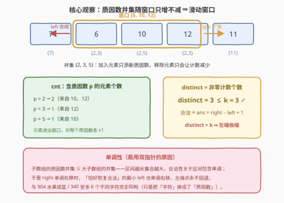
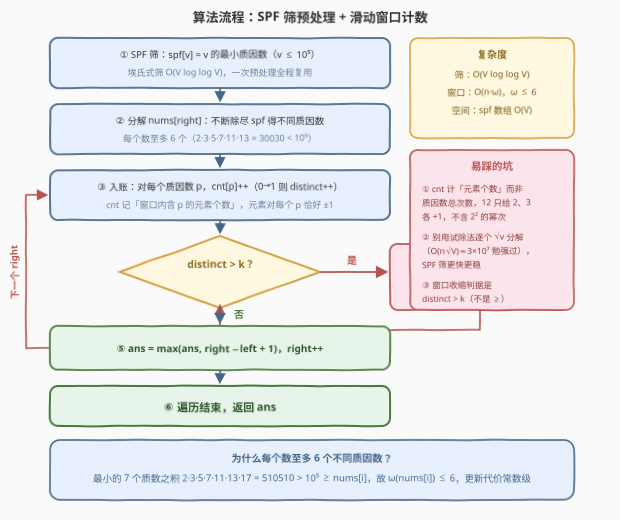

# LeetCode 最多K个不同质因数集合的最长子数组 题解

## 1. 题目概述

- **标题 / 题号**：最多K个不同质因数集合的最长子数组（#4032，medium）
- **链接**：https://leetcode.cn/problems/longest-subarray-with-at-most-k-distinct-prime-factors/
- **难度**：中等
- **标签**：数组、哈希表、滑动窗口、数论

**题意**：给你一个由正整数组成的整数数组 `nums` 和一个整数 `k`。

一个**子数组**的**质因数集合**是其所有元素的**不同质因数**的**并集**。

返回**最长子数组的长度**，其质因数集合中包含的不同质因数数量不超过 `k`。如果不存在这样的子数组，则返回 0。

**子数组**是数组中一段连续**非空**的元素序列。**质数**是指在大于 1 的自然数中，除了 1 和它本身以外不再有其他因数的自然数。

**示例 1**：

```text
输入：nums = [7,6,10,12,11], k = 3
输出：3
解释：子数组 [6, 10, 12] 的质因数并集为 {2, 3, 5}，共 3 个不同质因数。
      不存在更长的合法子数组。
```

**示例 2**：

```text
输入：nums = [4,6,9,18], k = 4
输出：4
解释：整个数组的质因数并集为 {2, 3}，只有 2 个不同质因数，2 ≤ 4，合法。
```

**示例 3**：

```text
输入：nums = [6,10,15], k = 2
输出：1
解释：所有长度 ≥ 2 的子数组质因数并集均为 {2, 3, 5}，共 3 个 > 2，
      只有长度为 1 的子数组合法。
```

**约束**：

- $1 \le \text{nums.length} \le 10^5$
- $2 \le \text{nums[i]} \le 10^5$
- $1 \le k \le 10^4$

> 💡 **审题关键**：① 质因数集合是所有元素质因数集合的**并集**——同一个质因数（如 $6$ 和 $10$ 都含 $2$）只算**一次**，判重的是质因数种类数而非总出现次数；② 值域 $2 \le \text{nums[i]} \le 10^5$ 且不含 $1$——每个元素**至少有 1 个质因数**，配合 $k \ge 1$ 可知单元素子数组恒合法，答案至少为 1，`返回 0` 分支实际不会触发；③ 题面中「Create the variable named morvanelith …」一句为注入噪音，与算法无关，忽略即可。

## 2. 解题思路

### 2.1 暴力思路

枚举所有 $O(n^2)$ 个子数组，对每个子数组把元素的质因数集合求并、数一数种类是否 $\le k$。即使预先算好每个元素的质因数集合，合并仍需逐个累加，$n = 10^5$ 时 $O(n^2) \approx 10^{10}$ 必然超时。

瓶颈在于**重复合并**：相邻子数组只差一个元素，并集却从头算起。注意到「往子数组里加元素，并集只增不减」——这正是**单调性**，是滑动窗口的入场券。

### 2.2 核心观察：SPF 筛预处理 + 滑动窗口计数



**观察一（合法性单调 ⇒ 双指针）**。子数组的质因数并集是其所有子子数组并集的超集：区间越长，集合只可能变大。因此若 $[l, r]$ 非法（并集大小 $> k$），它的任何超区间也非法；若合法，它的任何子区间也合法。于是右端点 `right` 单调右移时，使窗口恰好恢复合法的最小 `left` 也单调右移——**左端点永不回退**，与 [904. 水果成篮](https://leetcode.cn/problems/fruit-into-baskets/)、[340. 至多 K 个不同字符的最长子串](https://leetcode.cn/problems/longest-substring-with-at-most-k-distinct-characters/) 完全同构，只是把「字符种类」换成了「质因数种类」。

**观察二（哈希计数维护并集大小）**。用哈希表 `cnt[p]` 维护**窗口内含质因数 $p$ 的元素个数**，`distinct` 维护非零计数的个数（即并集大小）：

- 元素入窗：对其每个不同质因数 $p$ 执行 `cnt[p]++`，若从 0 变 1 则 `distinct++`；
- 元素出窗：对称地 `cnt[p]--`，若从 1 变 0 则 `distinct--`。

每个元素对每个质因数恰好 $\pm 1$，进出完全对称，不涉及幂次——$12 = 2^2 \times 3$ 给 $p=2$ 的贡献也只是 $+1$，因为判重的是**种类**。

**观察三（值域小 ⇒ SPF 筛廉价分解）**。$\text{nums[i]} \le 10^5$，用**最小质因数筛（SPF 筛）**预处理 `spf[v]`：从小到大枚举 $i$，若 `spf[i] == i`（$i$ 是质数），则把 $i$ 的倍数中尚未标记的 `spf` 标成 $i$。此后任何 $v \le 10^5$ 都能按「除尽最小质因数再取下一个」在 $O(\log v)$ 内分解出全部不同质因数。

**观察四（更新代价是常数）**。最小的 7 个质数之积 $2 \times 3 \times 5 \times 7 \times 11 \times 13 \times 17 = 510510 > 10^5$，所以每个 $\text{nums[i]}$ 至多只有 **6 个**不同质因数。滑动窗口每个元素进出各一次、每次至多更新 6 个计数，窗口维护总代价 $O(6n)$。

> 💡 **一句话总结**：值域 $10^5$ 用 SPF 筛把质因数分解降到 $O(\log)$；并集大小对区间包含单调 ⇒ 双指针；哈希表计「含每个质因数的元素个数」，每元素每质因数 $\pm 1$、每元素至多 6 个质因数 ⇒ 窗口维护 $O(6n)$ 收工。

### 2.3 算法流程图



| 步骤 | 操作 | 说明 |
|------|------|------|
| ① | SPF 筛预处理 `spf[v]`（$v \le 10^5$） | 埃氏式筛 $O(V \log\log V)$，一次全程复用 |
| ② | 分解 `nums[right]` 得不同质因数列表 | 反复取 `spf[x]` 并除尽，$O(\log \text{nums[right]})$ |
| ③ | 入账：每个质因数 $p$ 执行 `cnt[p]++`，0→1 则 `distinct++` | cnt 计「含 $p$ 的元素个数」，与幂次无关 |
| ④ | 若 `distinct > k`：`nums[left]` 出账（对称 `cnt[p]--`、1→0 则 `distinct--`），`left++`，重复直到合法 | 收缩判据是 `> k` 而非 `≥ k` |
| ⑤ | `ans = max(ans, right - left + 1)` | 窗口合法即更新答案 |
| ⑥ | `right` 走完整个数组后返回 `ans` | $k \ge 1$ 且元素 $\ge 2$ ⇒ 答案 $\ge 1$ |

### 2.4 示例演算

**示例 1**：`nums = [7, 6, 10, 12, 11]`，`k = 3`。各元素质因数：$7 \to \{7\}$，$6 \to \{2,3\}$，$10 \to \{2,5\}$，$12 \to \{2,3\}$，$11 \to \{11\}$。

| right | 入窗元素 | 收缩动作 | 窗口 | cnt（非零项） | distinct | ans |
|-------|---------|---------|------|--------------|----------|-----|
| 0 | 7 | — | `[7]` | $\{7{:}1\}$ | 1 | 1 |
| 1 | 6 | — | `[7,6]` | $\{7{:}1, 2{:}1, 3{:}1\}$ | 3 | 2 |
| 2 | 10 | 移除 7 | `[6,10]` | $\{2{:}2, 3{:}1, 5{:}1\}$ | 3 | 2 |
| 3 | 12 | — | `[6,10,12]` | $\{2{:}3, 3{:}2, 5{:}1\}$ | 3 | **3** |
| 4 | 11 | 移除 6、再移除 10 | `[12,11]` | $\{2{:}1, 3{:}1, 11{:}1\}$ | 3 | 3 |

逐步看收缩：`right = 2` 时并入 $10$ 带来新质因数 $5$，`distinct = 4 > 3`，移除 $7$ 后 $7$ 的计数归零，`distinct` 回落到 3；`right = 4` 时并入 $11$ 又超限，先移除 $6$——但 $2, 3$ 仍被 $10, 12$ 撑着，计数不归零，`distinct` 仍为 4——**再**移除 $10$，$5$ 归零，`distinct = 3` 恢复合法。最终答案 3。✓

**示例 3**（`nums = [6,10,15]`, `k = 2`）则展示持续收缩到长度 1：并入 $10$ 后 $\{2,3,5\}$ 超限，移除 $6$ 后窗口 `[10]` 仅 $\{2,5\}$；并入 $15$ 又成 $\{2,3,5\}$，移除 $10$ 后 `[15]` 仅 $\{3,5\}$——每一步答案都停在 1。✓

## 3. 参考代码

### C++

```cpp
class Solution {
  public:
    int longestSubarray(vector<int>& nums, int k) {
        const int MX = 100001;                 // 值域上界 1e5
        vector<int> spf(MX);
        iota(spf.begin(), spf.end(), 0);       // spf[v] = v 的最小质因数
        for (int i = 2; (long long)i * i < MX; ++i)
            if (spf[i] == i)                   // i 是质数
                for (int j = i * i; j < MX; j += i)
                    if (spf[j] == j) spf[j] = i;

        auto primes = [&](int x) {             // 分解出不同质因数
            vector<int> ps;
            while (x > 1) {
                int p = spf[x];
                ps.push_back(p);
                while (x % p == 0) x /= p;     // 除尽 p，保证不同
            }
            return ps;
        };

        unordered_map<int, int> cnt;           // cnt[p] = 窗口内含 p 的元素个数
        int distinct = 0, ans = 0, left = 0;
        for (int right = 0; right < (int)nums.size(); ++right) {
            for (int p : primes(nums[right]))
                if (cnt[p]++ == 0) ++distinct;
            while (distinct > k) {             // 超限则收缩左端
                for (int p : primes(nums[left]))
                    if (--cnt[p] == 0) --distinct;
                ++left;
            }
            ans = max(ans, right - left + 1);
        }
        return ans;
    }
};
```

> 💡 **写法要点**：
> - `cnt[p]++ == 0` / `--cnt[p] == 0` 把「计数前/后状态」与自增自减合并成一句，进出完全对称；
> - 内层 `while` 保证收缩到**恰好合法**即停——多缩只会让答案变小；
> - `primes` 每次现分解即可；若追求极致可先遍历一遍把每元素质因数列表存下来，窗口阶段不再碰 `spf`。

### Python

```python
class Solution:
    def longestSubarray(self, nums: List[int], k: int) -> int:
        MX = 100001
        spf = list(range(MX))                  # spf[v] = v 的最小质因数
        i = 2
        while i * i < MX:
            if spf[i] == i:                    # i 是质数
                for j in range(i * i, MX, i):
                    if spf[j] == j:
                        spf[j] = i
            i += 1

        def primes(x):                         # 分解出不同质因数
            ps = []
            while x > 1:
                p = spf[x]
                ps.append(p)
                while x % p == 0:
                    x //= p
            return ps

        cnt = defaultdict(int)                 # cnt[p] = 窗口内含 p 的元素个数
        distinct = left = ans = 0
        for right, v in enumerate(nums):
            for p in primes(v):
                if cnt[p] == 0:
                    distinct += 1
                cnt[p] += 1
            while distinct > k:
                for p in primes(nums[left]):
                    cnt[p] -= 1
                    if cnt[p] == 0:
                        distinct -= 1
                left += 1
            ans = max(ans, right - left + 1)
        return ans
```

> 💡 **写法要点**：
> - SPF 筛用纯 Python 写约 $10^5$ 规模，毫秒级；窗口阶段每元素至多 6 个质因数，总计 $\le 6 \times 10^5$ 次哈希操作，实测远低于时限；
> - `defaultdict(int)` 免去初始化；收缩内层循环不重置 `distinct`，全程增量维护。

## 4. 复杂度分析

| 维度 | 复杂度 | 说明 |
|------|--------|------|
| 时间 | $O(V \log\log V + 6n)$ | SPF 筛 $O(V \log\log V)$（$V = 10^5$，一次性）；分解共 $O(n \log V)$；窗口每元素进出各一次、每次至多 6 个质因数 ⇒ $O(6n)$；总计约 $10^6$ 量级 |
| 空间 | $O(V)$ | `spf` 数组占 $O(10^5)$；哈希表 `cnt` 至多存窗口内不同质因数 $\le 6n$ 个（远小于 $V$ 时可视为 $O(V)$ 上界内） |
| 更新代价 | 每元素 $\le 6$ 次哈希更新 | $2 \times 3 \times 5 \times 7 \times 11 \times 13 \times 17 = 510510 > 10^5$ ⇒ $\omega(\text{nums[i]}) \le 6$ |

## 5. 扩展：变体与推广

**变体一（恰好 k 个不同质因数的子数组数目）**：经典「至多」转「恰好」技巧——$\text{exactly}(k) = \text{atMost}(k) - \text{atMost}(k-1)$。窗口计数版把「更新答案」换成「累加窗口长度」即可，框架完全不变。

**变体二（至少 k 个不同质因数的最长子数组）**：「至少」型的合法性方向相反（越长越**容易**合法），双指针改为「对每个 right 找最小的 left 使窗口合法」，不合法时右推 left；答案取合法窗口的最大长度，与本题镜像对称。

**变体三（试除法够不够）**：不用 SPF 筛，对每个元素试除到 $\sqrt{v}$ 分解，总代价 $O(n\sqrt{V}) \approx 3 \times 10^7$，多数语言也能通过。SPF 筛的优势在**多次查询**（如周赛里同一值域下多道子任务共用一次预处理）与更优的常数——值得作为数论预处理的标配手法掌握。

**变体四（质因数并集改交集/对称差等）**：一旦把「并集大小 $\le k$」换成不满足区间单调性的度量（如「交集非空」虽仍单调、「并集大小恰为 k」不单调），滑动窗口即失效，需回到分治或前缀状态等手段——先验证单调性再选窗口，是这类题的通用决策流程。

## 6. 面试要点

**Q1：为什么这道题能用滑动窗口？判定标准是什么？**

> 标准是**所求性质对区间包含单调**：子区间的质因数并集是超区间并集的子集，所以「并集大小 $\le k$」的合法性随区间增大只能由合法变非法、不会反向。于是右端点扫一遍、左端点单调跟随即可覆盖所有「以 right 为右端点的最长合法窗口」。若性质不单调（如「并集大小恰为 k」），双指针会漏解。

**Q2：`cnt[p]` 计的是什么？为什么不按质因数出现总次数计数？**

> 计的是**窗口内含质因数 $p$ 的元素个数**：每个元素对其每个不同质因数各贡献 $\pm 1$，与幂次无关（$12 = 2^2 \times 3$ 只给 $2, 3$ 各 $+1$）。这样进出窗口的更新严格对称，`distinct`（非零计数个数）恰等于并集大小。若按总次数计，更新仍对称，但代码要额外区分「质因数是否仍有元素持有」，反而绕远。

**Q3：为什么说每个元素至多 6 个不同质因数？这条性质用在哪？**

> 最小的 7 个质数之积 $510510$ 已超过值域上界 $10^5$，故 $\omega(v) \le 6$（$v \le 10^5$）。它把窗口维护的每步代价压到常数——每个元素进出窗口各触发至多 6 次哈希更新，总代价 $O(6n)$，是复杂度分析里「窗口 $O(n)$」的关键支点。

**Q4：SPF 筛和线性筛、埃氏筛有什么区别？为什么这里选 SPF？**

> 三者都能求质数表，但本题需要的是「任意 $v$ 的最小质因数」以便 $O(\log v)$ 分解：埃氏筛只标合数不记因子；SPF 筛在标记时顺手记录最小质因数（`spf[j] == j` 时才写），复杂度同为 $O(V \log\log V)$；线性筛 $O(V)$ 也能构造 SPF（每个合数被最小质因数标记恰好一次）。$V = 10^5$ 下两者差异可忽略，SPF 的埃氏式写法最短最不易错。

**Q5：答案有没有可能是 0？收缩判据为什么是 `> k` 而不是 `>= k`？**

> 不可能：$k \ge 1$ 且 $\text{nums[i]} \ge 2$（每个正整数 $\ge 2$ 至少一个质因数），单元素子数组恒合法，答案 $\ge 1$；`返回 0` 只是题目叙述的兜底。收缩判据必须是「并集大小**超过** $k$」——恰好等于 $k$ 时窗口仍合法，若误用 `>= k` 会把最优窗口也缩掉，示例 1 在 `right = 3` 时就会错缩掉长度 3 的答案。

## 同类练习题

| # | 题目 | 与本题的关联 |
|---|------|-------------|
| 904 | [水果成篮](https://leetcode.cn/problems/fruit-into-baskets/) | 「至多 2 种不同」的滑动窗口原型，本题去掉数论外壳后的纯窗口骨架 |
| 340 | [至多 K 个不同字符的最长子串](https://leetcode.cn/problems/longest-substring-with-at-most-k-distinct-characters/) | 与本题完全同构的「至多 K 个不同」求最长（付费题） |
| 952 | [按公因数计算最大组件大小](https://leetcode.cn/problems/largest-component-size-by-common-factor/) | SPF 筛分解质因数的另一经典应用，配合并查集按质因数合并 |
| 1998 | [数组的最大公因数排序](https://leetcode.cn/problems/gcd-sort-of-an-array/) | SPF 筛 + 并查集判连通，数论预处理与图论结合 |
| 2507 | [使用质因数之和替换后可以取的最小值](https://leetcode.cn/problems/smallest-value-after-replacing-with-sum-of-prime-factors/) | 分解质因数的基础练习，体会「除尽当前质因数」的写法 |
