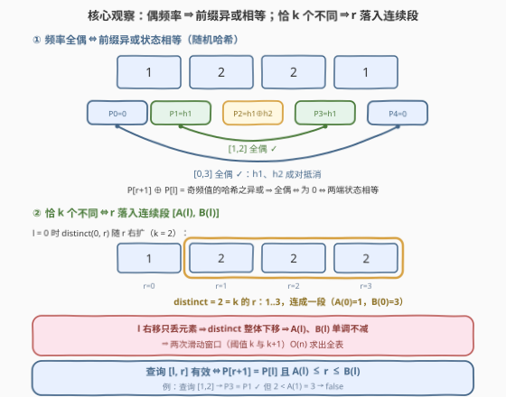
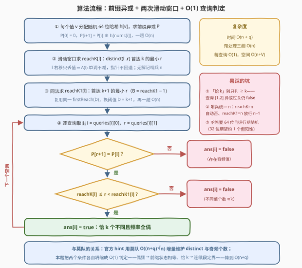

# 有效K个不同元素子数组I

- **题目名称**：有效K个不同元素子数组I
- **链接**：[4033. 有效 K 个不同元素子数组 I](https://leetcode.cn/problems/valid-k-unique-subarrays-i/)
- **难度**：困难
- **标签**：数组、哈希表、前缀异或、滑动窗口、随机化

## 1. 题目概述

给定一个整数数组 `nums` 和一个整数 `k`，同时给定一个二维整数数组 `queries`，其中 `queries[i] = [li, ri]` 表示子数组 `nums[li..ri]`。

对于每个查询，如果子数组 `nums[li..ri]` **同时**满足以下两个条件，则认为该子数组是**有效的**：

1. 它**恰好**包含 $k$ 个**不同**的数字；
2. 子数组中每个数字出现的**频率**都是**偶数**。

返回布尔数组 `ans`：若 `nums[li..ri]` 有效则 `ans[i] = true`，否则为 `false`。

**示例 1**：

```text
输入：nums = [1,2,2,1], k = 2, queries = [[0,1],[0,3],[1,2]]
输出：[false,true,false]
解释：[0,1] → {1:1, 2:1}，频率全奇，false；
      [0,3] → {1:2, 2:2}，恰 2 个不同且全偶，true；
      [1,2] → {2:2}，频率全偶但只有 1 个不同数 < k，false。
```

**示例 2**：

```text
输入：nums = [3,3,3], k = 1, queries = [[1,2],[0,2]]
输出：[true,false]
解释：[1,2] → {3:2}，恰 1 个不同且全偶，true；
      [0,2] → {3:3}，出现 3 次是奇数，false。
```

**约束条件**：

- $2 \le n = \text{nums.length} \le 10^5$
- $1 \le \text{nums[i]} \le 10^5$
- $1 \le k \le n$
- $1 \le \text{queries.length} \le 10^5$
- $0 \le l_i < r_i \le n - 1$

> 💡 **审题关键**：① 判定是两条条件的**与**——「恰好 $k$ 个不同」（不是至多）且「所有频率为偶」，示例 1 的查询 `[1,2]` 通过了第二条却栽在第一条上，两条缺一不可；② 频率全偶 $\Rightarrow$ 子数组长度必为偶（必要不充分）；③ `queries` 一次性全部给出 $\Rightarrow$ 允许**离线**预处理——官方 hint 由此指向莫队算法，而把两个条件**各自单独坍缩**可得更快的 $O(n+q)$ 做法。

---

## 2. 解题思路

### 2.1 暴力思路

对每个查询独立扫描子数组 `nums[l..r]`，用哈希表计数，一趟统计出两个量：不同值个数 `distinct` 与奇频值个数 `odd`，答案即 `distinct == k && odd == 0`。单查询 $O(n)$，总计 $O(nq) \approx 10^{10}$，必然超时。

瓶颈在于**重复统计**：$10^5$ 个查询的区间彼此大量重叠，却每个都从零数起。出路是把两个判定条件各自「坍缩」成可 $O(1)$ 查询的预处理量——这正是本题作为 Hard 的考点。

### 2.2 核心观察：前缀异或判偶 + 单调定界判恰 k 个不同



**观察一（频率全偶 $\Leftrightarrow$ 前缀异或相等）**。给每个**值** $v$ 分配一个随机 64 位整数 $h[v]$（运行期随机），定义前缀异或

$$P[0] = 0, \quad P[i] = P[i-1] \oplus h[\text{nums}[i-1]]$$

则子数组 $[l, r]$ 的哈希异或 $P[r+1] \oplus P[l] = \bigoplus_{\text{出现奇次的 } v} h[v]$：偶频值成对抵消，只有奇频值幸存。于是

$$\text{频率全偶} \iff P[r+1] \oplus P[l] = 0 \iff P[r+1] = P[l]$$

正向成立是确定性的；反向可能被「碰撞」欺骗——若干奇频值的哈希异或恰好为 0。但对任意**固定**的非空值集合，其哈希异或为 0 的概率恰为 $2^{-64}$，对全部 $O(n^2)$ 个区间取并集上界：错误率 $\le n^2 / 2^{64} \approx 5 \times 10^{-10}$，可放心当作确定性使用。这与 [525. 连续数组](https://leetcode.cn/problems/contiguous-array/)、[1371. 每个元音包含偶数次的最长子字符串](https://leetcode.cn/problems/find-the-longest-substring-containing-vowels-in-even-counts/) 的「前缀状态配对」同宗——那里字母表只有 2/10 种状态可用奇偶掩码；本题值域 $10^5$ 造不出掩码，用**随机异或哈希**补位。

**观察二（「恰好 $k$ 个不同」$\Leftrightarrow$ $r$ 落入连续段）**。固定 $l$ 让 $r$ 右扩，每并入一个元素，不同值个数 $\text{distinct}(l, r)$ **单调不减且每步至多 +1**（一个元素至多贡献一个新值）。于是取值序列不跳档，等于 $k$ 的 $r$ 恰构成一个连续区间 $[A(l), B(l)]$（可能为空）：

- $A(l)$ = 首个使 $\text{distinct}(l, r) \ge k$ 的 $r$——因步长 $\le 1$，首次「达标」即首次「恰达 $k$」；
- $B(l)$ = 首个使 $\text{distinct}(l, r) \ge k+1$ 的 $r$ 减 1（若永不超 $k$ 则为 $n-1$），即最后一个 $\text{distinct} \le k$ 的 $r$。

$$\text{distinct}(l, r) = k \iff A(l) \le r \le B(l)$$

**观察三（$A$、$B$ 关于 $l$ 单调 $\Rightarrow$ 滑动窗口 $O(n)$ 求全表）**。$l$ 右移只会**丢**一个元素，$\text{distinct}(l, \cdot)$ 整体下移 $\Rightarrow$ 达标位置 $A(l)$、$B(l)$ 都只会右移。指针单调前进 $\Rightarrow$ 两次「求首个达标位置」的滑动窗口扫描（阈值分别取 $k$ 与 $k+1$），每个元素至多进出各一次，$O(n)$ 求出全表。

**查询合并**：每个查询只剩两次 $O(1)$ 比较——

$$\text{valid}(l, r) \iff P[r+1] = P[l] \;\text{且}\; A(l) \le r < C(l)$$

其中 $C(l)$ 即首个达 $k+1$ 个不同的 $r$。哨兵统一取 $n$：$A(l) = n$ 自动判否，$C(l) = n$ 自动把上界放行为 $n - 1$，查询处无需任何特判。

> 💡 **一句话总结**：频率全偶坍缩为**前缀异或两端相等**（随机 64 位哈希，$O(1)$ 判定）；「恰好 $k$ 个不同」因 $\text{distinct}$ 关于 $r$ 单调、步长 $\le 1$，坍缩为 **$r$ 落入 $[A(l), B(l)]$ 连续段**，而 $A$、$B$ 关于 $l$ 单调 $\Rightarrow$ 两次滑动窗口 $O(n)$ 预处理；总复杂度 $O(n + q)$。

### 2.3 算法流程图



| 步骤 | 操作 | 说明 |
|------|------|------|
| ① | 为每个值 $v$ 分配随机 64 位哈希 $h[v]$，一趟求 $P[0..n]$ | $P[i] = P[i-1] \oplus h[\text{nums}[i-1]]$；值域 $10^5$ 直接开数组 |
| ② | 滑动窗口求 `reachK[l]`：首个 $\text{distinct}(l, \cdot) \ge k$ 的 $r$ | 即 $A(l)$；指针只前进，无解记哨兵 $n$ |
| ③ | 同法求 `reachK1[l]`：首个 $\ge k+1$ 的 $r$ | 即 $C(l)$，$B(l) = C(l) - 1$；复用同一函数换阈值 |
| ④ | 逐查询判定：$P[r+1] = P[l]$ 且 `reachK[l]` $\le r <$ `reachK1[l]` | 两次 $O(1)$ 比较，短路求值 |
| ⑤ | 返回布尔数组 | 无排序、无逐查询扫描 |

### 2.4 示例演算

**示例 1**：`nums = [1,2,2,1]`，`k = 2`。记两个随机哈希为 $h_1, h_2$。

**第一步（前缀异或）**：

| $i$ | 0 | 1 | 2 | 3 | 4 |
|-----|---|---|---|---|---|
| $\text{nums}[i-1]$ | — | 1 | 2 | 2 | 1 |
| $P[i]$ | $\mathbf{0}$ | $h_1$ | $h_1 \oplus h_2$ | $h_1$ | $\mathbf{0}$ |

$P_0 = P_4$、$P_1 = P_3$：同色状态对对应仅有的两个「频率全偶」区间 $[0,3]$ 与 $[1,2]$——异或检查只放行这两个候选。

**第二步（定界表）**：

| $l$ | $\text{distinct}(l, r)$，$r = 0..3$ | $A(l)$（首达 2） | $C(l)$（首达 3） | $B(l) = C-1$ |
|-----|--------------------------------------|------------------|------------------|--------------|
| 0 | 1, 2, 2, 2 | 1 | 4（$=n$，永不） | 3 |
| 1 | —, 1, 1, 2 | 3 | 4 | 3 |
| 2 | —, —, 1, 2 | 3 | 4 | 3 |
| 3 | —, —, —, 1 | 4（$=n$，永不） | 4 | 3 |

**第三步（逐查询）**：

| 查询 | $P[r+1] = P[l]$？ | $A(l) \le r \le B(l)$？ | 结果 |
|------|-------------------|------------------------|------|
| $[0,1]$ | $P_2 = h_1 \oplus h_2 \ne P_0 = 0$ ✗ | — | false（频率全奇）✓ |
| $[0,3]$ | $P_4 = 0 = P_0$ ✓ | $1 \le 3 \le 3$ ✓ | **true** ✓ |
| $[1,2]$ | $P_3 = h_1 = P_1$ ✓ | $3 \le 2$ ✗ | false（仅 1 个不同数）✓ |

查询 $[1,2]$ 是「两条条件缺一不可」的活体例证：`[2,2]` 频率全偶、通过了异或检查，却因不同数不足 $k$ 被定界检查拦下。

**示例 2**（`nums = [3,3,3]`，`k = 1`）：$P = [0, h_3, 0, h_3]$；$A = [0,1,2]$（单元素即达 1 个不同），$C = [3,3,3] = n$（永不达 2 个）$\Rightarrow B = [2,2,2]$。查询 $[1,2]$：$P_3 = h_3 = P_1$ ✓ 且 $1 \le 2 \le 2$ ✓ → true；查询 $[0,2]$：$P_3 = h_3 \ne P_0 = 0$ → false（3 出现 3 次）。✓

---

## 3. 参考代码

### C++

```cpp
class Solution {
  public:
    vector<bool> validSubarrays(vector<int>& nums, int k, vector<vector<int>>& queries) {
        const int n = nums.size();

        // ① 值 → 随机 64 位哈希（拒绝 0），一趟求前缀异或 P
        mt19937_64 rng(random_device{}());
        vector<unsigned long long> hv(100001);
        for (auto& x : hv) { do { x = rng(); } while (x == 0); }
        vector<unsigned long long> P(n + 1, 0);
        for (int i = 0; i < n; ++i) P[i + 1] = P[i] ^ hv[nums[i]];

        // ② firstReach(D)[l] = 使 distinct(l..r) ≥ D 的最小 r，不存在记哨兵 n
        auto firstReach = [&](int D) {
            vector<int> res(n, n);
            unordered_map<int, int> cnt;
            int d = 0, r = -1;                    // 窗口 [l, r]，d = 窗口内不同值个数
            for (int l = 0; l < n; ++l) {
                while (r + 1 < n && d < D)
                    if (cnt[nums[++r]]++ == 0) ++d;
                res[l] = d >= D ? r : n;
                if (--cnt[nums[l]] == 0) --d;     // 左端出窗
            }
            return res;
        };
        vector<int> reachK  = firstReach(k);      // A(l)
        vector<int> reachK1 = firstReach(k + 1);  // C(l)，B(l) = C(l) − 1

        // ③ 每查询两次 O(1) 比较
        vector<bool> ans;
        ans.reserve(queries.size());
        for (auto& q : queries) {
            int l = q[0], r = q[1];
            ans.push_back(P[r + 1] == P[l] && reachK[l] <= r && r < reachK1[l]);
        }
        return ans;
    }
};
```

> 💡 **写法要点**：
> - `cnt[nums[++r]]++ == 0` 把「先看旧值再自增」合并成一句——加入侧判 0→1、删除侧判 1→0，进出严格对称；
> - 哨兵统一用 $n$：`reachK[l] = n` 自动判否、`reachK1[l] = n` 自动放行上界 $n-1$，查询处零特判；
> - 哈希拒绝 0 并用 `random_device` 运行期播种——固定哈希可能被针对性构造（本题测试固定虽无此风险，习惯上仍应随机）。

### Python

```python
import random
from collections import defaultdict


class Solution:
    def validSubarrays(self, nums: List[int], k: int, queries: List[List[int]]) -> List[bool]:
        n = len(nums)

        # ① 值 → 随机 64 位哈希（or 1 兜底拒绝 0），一趟求前缀异或 P
        h = {}
        P = [0] * (n + 1)
        for i, v in enumerate(nums):
            if v not in h:
                h[v] = random.getrandbits(64) or 1
            P[i + 1] = P[i] ^ h[v]

        # ② first_reach(D)[l] = 使 distinct(l..r) ≥ D 的最小 r，不存在记哨兵 n
        def first_reach(D):
            res = [n] * n
            cnt = defaultdict(int)
            d = 0
            r = -1                            # 窗口 [l, r]，d = 窗口内不同值个数
            for l in range(n):
                while r + 1 < n and d < D:
                    r += 1
                    if cnt[nums[r]] == 0:
                        d += 1
                    cnt[nums[r]] += 1
                res[l] = r if d >= D else n
                cnt[nums[l]] -= 1             # 左端出窗
                if cnt[nums[l]] == 0:
                    d -= 1
            return res

        reach_k = first_reach(k)              # A(l)
        reach_k1 = first_reach(k + 1)         # C(l)，B(l) = C(l) − 1

        # ③ 每查询两次 O(1) 比较
        return [P[r + 1] == P[l] and reach_k[l] <= r < reach_k1[l]
                for l, r in queries]
```

> 💡 **写法要点**：
> - 全程无排序、无逐查询扫描：预处理三趟 $O(n)$ + 查询 $O(1)$，$n = q = 10^5$ 时纯 Python 也是毫秒量级，远优于莫队 $O((n+q)\sqrt{n}) \approx 6 \times 10^7$ 次增量操作；
> - `random.getrandbits(64) or 1`：哈希为 0 会让该值对异或「隐形」，`or 1` 一行兜底（0→1 的概率偏置对碰撞上界无影响）。

---

## 4. 复杂度分析

| 维度 | 复杂度 | 说明 |
|------|--------|------|
| 时间 | $O(n + q)$ | 前缀异或一趟 $O(n)$；两次滑动窗口各 $O(n)$（指针只前进，每元素进出各一次）；每查询 $O(1)$ |
| 空间 | $O(n + V)$ | $P$、`reachK`、`reachK1` 各 $O(n)$；哈希结构 $O(\min(n, V))$，$V = 10^5$ |
| 出错概率 | $\le n^2 / 2^{64} \approx 5 \times 10^{-10}$ | 仅来自随机异或哈希的碰撞（对全部区间取并集上界），运行期随机 $\Rightarrow$ 测试无法针对性构造 |

---

## 5. 扩展：莫队与两条退路

**莫队算法（官方 hint 的路线）**。把查询按 $\left(\lfloor l/B \rfloor,\ r\right)$ 排序离线，两个指针增量移动，维护 `cnt[v]`、不同值个数 `distinct` 与奇频值个数 `odd`，查询时判 `distinct == k && odd == 0`。这是**确定性**算法，复杂度 $O((n+q)\sqrt{n}) \approx 6 \times 10^7$（$n = q = 10^5$，块长 $\sqrt n$），C++ 稳过、纯 Python 偏慢。本题的 $O(n+q)$ 做法本质是把两个条件**各自单独坍缩**成 $O(1)$ 判定量——拿到「区间 + 恰好 + 全偶」类查询时，先做这个拆解，再决定是否上莫队。

**$k$ 随查询变化时**。$A(l)$、$B(l)$ 只对**固定**的 $k$ 有意义；若每个查询自带 $k_i$，「区间不同数」须回到经典离线做法：按 $r$ 扫描、树状数组维护每个值**最后一次出现的位置**，$\text{distinct}(l, r)$ 即 $[l, r]$ 上的位置计数和，$O((n+q)\log n)$（SPOJ DQUERY / 洛谷 P1972 原型）。

**不信任随机化时**。奇频条件可用莫队增量维护（如上）；若值域压缩到小字母表，前缀奇偶掩码配对即可**确定性**判偶——[1371](https://leetcode.cn/problems/find-the-longest-substring-containing-vowels-in-even-counts/)、[1542](https://leetcode.cn/problems/find-longest-awesome-substring/) 正是这一形态，前者掩码即状态、后者还允许至多一位奇频。

---

## 6. 面试要点

**Q1：「所有频率为偶」为什么能转化为 $P[r+1] = P[l]$？反向为什么「几乎」成立？**

> 子数组的哈希异或 $P[r+1] \oplus P[l]$ 展开后，偶频值成对抵消，只剩奇频值的哈希之异或。全偶 $\iff$ 该异或为 0 $\iff$ 两端前缀状态相等。反向的漏洞是**碰撞**——若干奇频值的哈希异或恰为 0——但任一固定非空集合的碰撞概率恰为 $2^{-64}$，全体 $O(n^2)$ 个区间取并集上界 $n^2/2^{64} \approx 5 \times 10^{-10}$；且哈希在运行期随机生成，测试数据无法针对性构造。

**Q2：「恰好 $k$ 个不同」为什么等价于 $r \in [A(l), B(l)]$？连续性从哪来？**

> 固定 $l$ 右扩 $r$，每并入一个元素，不同值个数**单调不减且步长 $\le 1$**——取值序列不跳档，等于 $k$ 的 $r$ 必然连成一段，两端即「首次达标」$A(l)$ 与「首次超档减一」$B(l)$。两条性质缺一不可：若度量会跳变（如 [4032](https://leetcode.cn/problems/longest-subarray-with-at-most-k-distinct-prime-factors/) 的质因数并集一次可 +6），取值可能直接跳过 $k$，等号区间为空、定界失效；若度量不单调，$A$、$B$ 更无从谈起。

**Q3：$A(l)$、$B(l)$ 全表为什么能滑动窗口 $O(n)$ 求出？**

> $l$ 右移只丢一个元素，$\text{distinct}(l, \cdot)$ 整体下移 $\Rightarrow$ 「首达 $k$」「首达 $k+1$」的位置都单调不减——两指针均不回退，每元素至多进出各一次。与「滑动窗口求最长/最短」同一骨架，只是把统计答案换成记录「首次达标位置」。实现上要保证窗口为空（$r = l-1$）与「永不达标」（记哨兵 $n$）两种退化都被循环结构自然吞掉。

**Q4：与莫队、树状数组相比，这套做法的前提与取舍是什么？**

> 前提有二：$k$ 是全局常数（$A/B$ 表对固定 $k$ 才有意义）、接受 $2^{-64}$ 量级的随机错误率。$k$ 逐查询变化 $\Rightarrow$ 退到「按 $r$ 扫 + BIT 维护 last 出现」的区间不同数 $O((n+q)\log n)$；要求确定性 $\Rightarrow$ 莫队 $O((n+q)\sqrt{n})$（官方 hint 路线）。三者共同入口都是「查询离线」——先问每个条件能否单独坍缩成 $O(1)$ 判定量，不行再降级到对数/根号工具。

**Q5：哈希为什么取 64 位？32 位会怎样？**

> 期望假阳性区间数 $\approx \frac{n(n+1)/2}{2^w}$：32 位时 $\approx 1.2$ 个——大概率翻车；64 位时 $\approx 2.7 \times 10^{-10}$——高枕无忧。异或哈希的碰撞结构是「随机向量子集异或为零」，与多项式串哈希的 Anti-hash 攻击面不同，但运行期随机以杜绝针对性构造的原则一致。

---

## 7. 同类练习题

- [1371. 每个元音包含偶数次的最长子字符串](https://leetcode.cn/problems/find-the-longest-substring-containing-vowels-in-even-counts/)：小字母表的「频率全偶」——奇偶掩码做前缀状态配对，本题值域大改随机异或哈希
- [1542. 找出最长的超赞子字符串](https://leetcode.cn/problems/find-longest-awesome-substring/)：前缀奇偶掩码 + 允许至多一位奇频，前缀状态配对的进阶形态
- [1177. 构建回文串的查询](https://leetcode.cn/problems/can-make-palindrome-from-substring/)：区间奇频值个数查询，26 字母前缀计数做差，本题「偶频判定」的小字母表版本
- [1442. 形成两个异或相等数组的三元组数目](https://leetcode.cn/problems/count-triplets-that-can-form-two-arrays-of-equal-xor/)：前缀异或相等配对的计数版，与观察一同一母题
- [930. 和相同的二元子数组](https://leetcode.cn/problems/binary-subarrays-with-sum/)：前缀和相等配对计数，「前缀状态」思想的最简入门
