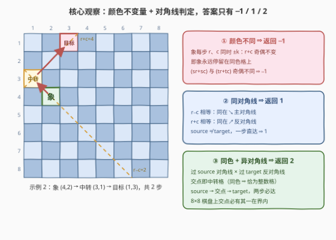
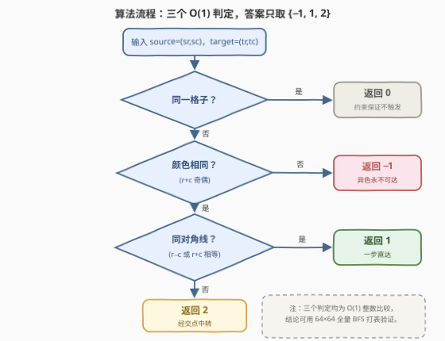

# 象到达目标格子的最少移动步数

- **题目名称**：象到达目标格子的最少移动步数
- **链接**：[4034. 象到达目标格子的最少移动步数](https://leetcode.cn/problems/minimum-bishop-moves-to-reach-target/)
- **难度**：中等
- **标签**：数学、棋盘模拟、广度优先搜索

## 1. 题目概述

给你一个 `8 x 8` 的棋盘，行和列的**下标从 1 开始**。给你一个数组 `source = [sr, sc]`，表示**象**的起始位置，以及一个数组 `target = [tr, tc]`。

在一步移动中，象可以在棋盘范围内沿着**单个对角线方向**移动**任意数量**的格子。

返回象**恰好**到达 `target` 位置所需的**最少**移动次数。如果它永远无法到达 `target`，则返回 `-1`。

**示例 1**：

```text
输入：source = [8,1], target = [1,8]
输出：1
解释：一步对角线移动即可将象直接从 (8, 1) 送达 (1, 8)。
```

**示例 2**：

```text
输入：source = [4,2], target = [1,3]
输出：2
解释：象从 (4, 2) 移动到 (3, 1)，然后再从 (3, 1) 移动到 (1, 3)，
      经过 2 步移动到达目标位置。
```

**示例 3**：

```text
输入：source = [1,1], target = [3,4]
输出：-1
解释：无论进行多少次对角线移动，从 (1, 1) 出发的象都永远无法到达 (3, 4)。
```

**约束条件**：

- `source.length == target.length == 2`
- $1 \le sr, sc, tr, tc \le 8$
- `source != target`

> 💡 **审题关键**：① 象是「斜线车」——一步沿对角线走**任意格**，不是只走一格；② **恰好到达**＝必须停在 `target` 上，路过不算；③ 约束保证 `source != target`，答案为 0 的情形不会出现；④ 棋盘固定 `8×8`、共 64 格，这为「打表 / BFS 验证公式」留了后路。

---

## 2. 解题思路

### 2.1 暴力思路

最直接的做法是 **BFS**：从 `source` 出发，每个格子沿 4 个对角线方向各扩展至多 7 格，逐层向外扩散，首次碰到 `target` 时的层数即答案；搜完仍没碰到则返回 `-1`。棋盘只有 64 格、每格至多 28 条出边，一次 BFS 是 $O(64 \times 28)$ 的常数操作，当然能过。

但答案既然只由两个格子的**坐标关系**决定，就应该存在**闭式判定**——这类「步数只取 $0/1/2/\infty$」的棋盘题几乎都有 $O(1)$ 公式。BFS 在这里留作验证正确性的工具（见第 5 节）。

### 2.2 核心观察：颜色不变量 + 对角线判定，$O(1)$ 分类



**观察一（颜色不变量 ⇒ 不可达判定）**。象每步从 $(r, c)$ 走到 $(r \pm k, c \pm k)$：$r+c$ 的变化量是 $0$ 或 $\pm 2k$，**奇偶性永远不变**。这正是国际象棋的常识——**象永远待在同色格上**。因此若

$$(sr + sc) \not\equiv (tr + tc) \pmod 2$$

两格异色，象无论如何都到不了，返回 `-1`（示例 3：$1+1=2$ 与 $3+4=7$ 奇偶不同）。

**观察二（同对角线 ⇔ 一步直达）**。两格同在一条**主对角线**（↘ 方向）上，当且仅当 $r - c$ 相等；同在一条**反对角线**（↗ 方向）上，当且仅当 $r + c$ 相等。象一步恰好能到达**且仅能到达**自己两条对角线上的格子，故

$$sr - sc = tr - tc \quad \text{或} \quad sr + sc = tr + tc \iff \text{答案为 } 1$$

（示例 1：$8+1 = 1+8 = 9$，同在反对角线上，一步直达。）

**观察三（同色异对角线 ⇔ 两步必达）**。剩下的情形：同色但四条对角线互不相同。取**过 `source` 的主对角线** $r - c = sr - sc$ 与**过 `target` 的反对角线** $r + c = tr + tc$，联立解得交点

$$\left( \frac{sr - sc + tr + tc}{2},\ \frac{tr + tc - sr + sc}{2} \right)$$

两个分量都是整数：分子 $(sr+sc) + (tr+tc) - 2sc$，同色保证 $(sr+sc) + (tr+tc)$ 为偶。于是象可以 source → 交点 → target 走两步（第一段沿主对角线、第二段沿反对角线）。「异对角线」保证交点既不是 source 也不是 target，两步都真实有效。

> ⚠️ **交点会不会在棋盘外？** 用旋转坐标 $u = r - c,\ v = r + c$ 看：格子是否在棋盘上等价于 $2 + |u| \le v \le 16 - |u|$。source、target 分别是 $(u_s, v_s)$、$(u_t, v_t)$，两个候选中转格恰好是**坐标交换**得到的 $(u_s, v_t)$ 与 $(u_t, v_s)$。若 $(u_s, v_t)$ 越下界（$v_t < 2 + |u_s|$），由 target 在界内得 $|u_t| \le v_t - 2 < |u_s|$，进而 $2 + |u_t| < 2 + |u_s| \le v_s$ 且 $v_s \le 16 - |u_s| \le 16 - |u_t|$，故 $(u_t, v_s)$ 必在界内；其余越界情形对称。**两个候选交点至少其一在棋盘上**（亦可对全部 $64 \times 64$ 组位置 BFS 打表穷举验证，结论一致）。

> 💡 **一句话总结**：颜色奇偶判 **−1**；$r-c$ 或 $r+c$ 相等判 **1**；其余同色情形，过 source 对角线与过 target 反对角线的**交点**作中转，两步必达，判 **2**。三个判定全是整数比较，$O(1)$ 收工。

### 2.3 算法流程图



| 步骤 | 操作 | 说明 |
|------|------|------|
| ① | 比较奇偶：`(sr+sc) % 2 != (tr+tc) % 2`？ | 不同 ⇒ 异色永不可达，返回 `-1` |
| ② | 比较对角线：`sr-sc == tr-tc` 或 `sr+sc == tr+tc`？ | 相等 ⇒ 同对角线，返回 `1` |
| ③ | 其余情形 | 同色异对角线，经交点中转，返回 `2` |

（「同一格子返回 0」分支被约束 `source != target` 排除，代码中无需处理。）

### 2.4 示例演算

| 示例 | source | target | 颜色（$r+c$ 奇偶） | $r-c$ / $r+c$ | 判定 | 交点（若需） |
|------|--------|--------|------|------|------|------|
| 1 | $(8,1)$ | $(1,8)$ | $9$ 与 $9$，同 | $7 \ne -7$，但 $9 = 9$ | **1**（同反对角线） | — |
| 2 | $(4,2)$ | $(1,3)$ | $6$ 与 $4$，同 | $2 \ne -2$，$6 \ne 4$ | **2**（经中转） | $\left(\frac{2+4}{2}, \frac{4-2}{2}\right) = (3,1)$ |
| 3 | $(1,1)$ | $(3,4)$ | $2$ 与 $7$，**异** | — | **−1**（异色） | — |

三个示例全部与官方输出一致。✓

---

## 3. 参考代码

### C++

```cpp
class Solution {
  public:
    int minBishopMoves(vector<int>& source, vector<int>& target) {
        int sr = source[0], sc = source[1];
        int tr = target[0], tc = target[1];
        if ((sr + sc) % 2 != (tr + tc) % 2) return -1;      // 异色：永不可达
        if (sr - sc == tr - tc || sr + sc == tr + tc) return 1;  // 同对角线：一步直达
        return 2;                                            // 同色异对角线：经交点中转
    }
};
```

> 💡 **写法要点**：
> - 三个判定按「先排除不可达、再判一步、兜底两步」的顺序排布，每个分支都对应一条数学结论，可直接注释引用；
> - 约束 `source != target` 排除了 0 步情形，无需先判相等；若去掉该约束，在开头补 `if (sr == tr && sc == tc) return 0;` 即可；
> - 坐标范围 $[1,8]$，`(sr+sc) % 2` 无负数取模陷阱。

### Python

```python
class Solution:
    def minBishopMoves(self, source: list[int], target: list[int]) -> int:
        sr, sc = source
        tr, tc = target
        if (sr + sc) % 2 != (tr + tc) % 2:
            return -1                          # 异色：永不可达
        if sr - sc == tr - tc or sr + sc == tr + tc:
            return 1                           # 同对角线：一步直达
        return 2                               # 同色异对角线：经交点中转
```

> 💡 **写法要点**：
> - `sr, sc = source` 直接解包；
> - 也可用异或写颜色判定 `(sr + sc) ^ (tr + tc) & 1`，但可读性不如显式取模，面试以清楚为先。

---

## 4. 复杂度分析

| 维度 | 复杂度 | 说明 |
|------|--------|------|
| 时间 | $O(1)$ | 一次奇偶比较 + 两次等值比较，共常数次整数运算 |
| 空间 | $O(1)$ | 仅常数个变量 |
| 正确性 | $64 \times 64$ 全量 BFS 打表验证 | 对棋盘上全部 4096 组 `(source, target)`，公式输出与 BFS 最短路完全一致（含 −1 情形） |

---

## 5. 扩展：BFS 打表验证与变体

**BFS 打表验证**。对全部 $64 \times 64$ 组位置跑一遍 BFS，与公式对拍：

```python
from collections import deque

def bfs_dist(sr, sc):
    dist = {(sr, sc): 0}
    q = deque([(sr, sc)])
    while q:
        r, c = q.popleft()
        for dr, dc in ((1, 1), (1, -1), (-1, 1), (-1, -1)):
            nr, nc = r + dr, c + dc
            while 1 <= nr <= 8 and 1 <= nc <= 8:   # 沿对角线走任意格
                if (nr, nc) not in dist:
                    dist[(nr, nc)] = dist[(r, c)] + 1
                    q.append((nr, nc))
                nr += dr
                nc += dc
    return dist

def formula(sr, sc, tr, tc):
    if (sr + sc) % 2 != (tr + tc) % 2: return -1
    if sr - sc == tr - tc or sr + sc == tr + tc: return 1
    return 2

assert all(bfs_dist(sr, sc).get((tr, tc), -1) == formula(sr, sc, tr, tc)
           for sr in range(1, 9) for sc in range(1, 9)
           for tr in range(1, 9) for tc in range(1, 9)
           if (sr, sc) != (tr, tc))
```

**变体一（推广到 $n \times n$ 棋盘）**：上述三条判定对任意 $n \ge 2$ 的棋盘都成立（$n \times n$ 时界内条件变为 $2 + |u| \le v \le 2n - |u|$，坐标交换论证不变）。若棋盘带**障碍物**，闭式失效，回到 BFS / Dijkstra。

**变体二（其它棋子的最少步数分类）**：**车**横竖任走，两点不同行列时 1 步、同行或同列且中间无阻挡时 1 步、否则 2 步；**皇后**取车与象判定的并（任一方向一步可达即 1 步，异色且行列都不等才需 2 步）；**马**无此好性质，老老实实 BFS。这类题的通用心法：**先找走法的不变量（颜色/行列），再找一步可达的代数刻画（坐标和/差相等），最后证明两步的充分性（交点存在）**。

---

## 6. 面试要点

**Q1：为什么象永远只能停在同色格上？**

> 每步移动 $(r, c) \to (r \pm k, c \pm k)$，$r + c$ 的变化量为 $0$ 或 $\pm 2k$，恒为偶数，故 $r + c$ 的奇偶性是不变量。$r + c$ 的奇偶正是国际象棋棋盘的格子颜色，所以象从同色格出发就永远在同色格上——这是返回 `-1` 的唯一来源。

**Q2：怎么用代数条件判定「两格在同一条对角线上」？**

> 主对角线（↘）上每格 $r - c$ 为定值，反对角线（↗）上每格 $r + c$ 为定值。所以两格同对角线 ⇔ $r - c$ 相等或 $r + c$ 相等。等价地说，换到旋转坐标 $(u, v) = (r - c, r + c)$ 后，「同对角线」就是「横坐标相等或纵坐标相等」。

**Q3：同色但不在同一条对角线时，为什么两步一定够？中转格怎么求？**

> 中转格取「过 source 的主对角线」与「过 target 的反对角线」的交点，坐标为 $\big((sr - sc + tr + tc)/2,\ (tr + tc - sr + sc)/2\big)$；同色保证两个分子为偶、交点是整数格。若这个交点落在棋盘外，则换用「过 source 的反对角线 × 过 target 的主对角线」的交点——在旋转坐标下两者恰是 $(u_s, v_t)$ 与 $(u_t, v_s)$，可以证明至少一个在界内（$|u|$ 大小此消彼长的对称论证），也可 4096 组位置打表穷举验证。

**Q4：棋盘固定 64 格，BFS 也是 O(1)，为什么还推崇公式解？**

> 三点：① **零存储零搜索**，四次比较解决，无邻接表无队列；② **可推广**——换 $n \times n$ 棋盘公式一字不改，BFS 却要重建图；③ 面试考察的正是「从模拟中提炼数学结构」的能力，先给 BFS 再升级到闭式是漂亮的答题叙事。BFS 并非没用，它是验证公式正确性的打表工具。

**Q5：这题和「判断格子颜色」类问题有什么联系？**

> 同一个 $(r + c)$ 奇偶不变量。[1812. 判断国际象棋棋盘中一个格子的颜色] 用它判颜色；本题用它判**可达性**（异色 ⇒ −1）。凡是涉及象 / 斜向移动的题目，先检查这个不变量，往往直接砍掉一半状态空间。

---

## 7. 同类练习题

- [1812. 判断国际象棋棋盘中一个格子的颜色](https://leetcode.cn/problems/determine-color-of-a-chessboard-square/)：$(r+c)$ 奇偶判色的单点练习，本题颜色不变量的基础
- [1266. 访问所有点的最小时间](https://leetcode.cn/problems/minimum-time-visiting-all-points/)：斜向移动一步走满 $\max(|dx|,|dy|)$ 的 O(1) 公式，同款「斜走」数学
- [999. 可以被一步捕获的棋子数](https://leetcode.cn/problems/available-captures-for-rook/)：车的走法模拟，与象对角线走法对照，体会棋子规则的代码刻画
- [688. 骑士在棋盘上的概率](https://leetcode.cn/problems/knight-probability-in-chessboard/)：棋盘上的 DP/BFS 建模，当闭式不存在时的通用武器
- [2596. 检查骑士巡视方案](https://leetcode.cn/problems/check-knight-tour-configuration/)：用坐标差分类判定合法移动，同款 O(1) 分类思维
