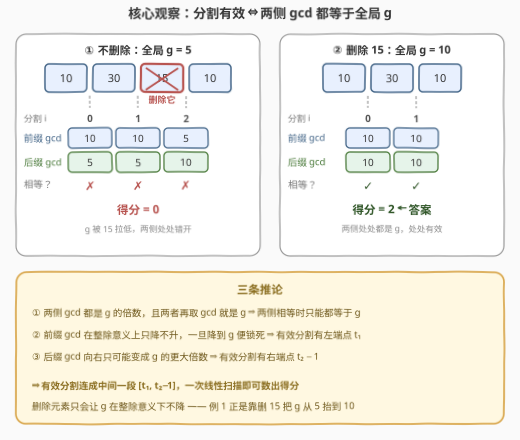
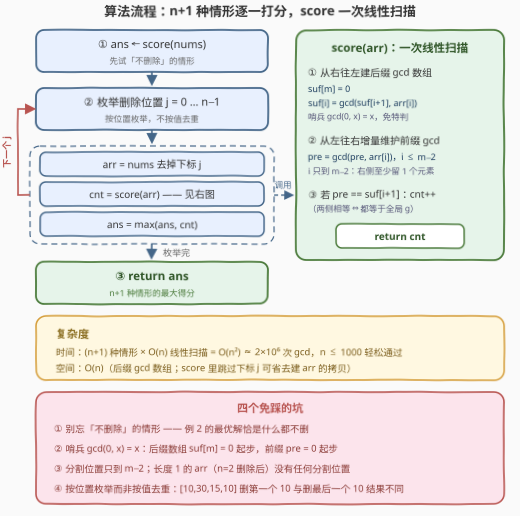

# 最多有效分割位置 I

- **题目名称**：最多有效分割位置 I
- **链接**：[4035. 最多有效分割位置 I](https://leetcode.cn/problems/maximum-valid-split-positions-i/)
- **难度**：中等
- **标签**：数组、数学、数论

## 1. 题目概述

给你一个整数数组 `nums`。你可以从中移除**至多一个**元素。记 `arr` 为按原始顺序保留其余元素后得到的数组，`m` 为其长度。

如果 `arr` 的**分割位置** `i` 满足以下条件，则称其为**有效的**：

- $0 \le i < m - 1$，且
- $\gcd(arr[0..i]) == \gcd(arr[i + 1..m - 1])$。

长度为 1 的数组没有有效的分割位置。`arr` 的**得分**是其有效分割位置的数量。返回 `arr` 的**最大可能得分**。

**示例 1**：

```text
输入：nums = [10,30,15,10]
输出：2
解释：移除 nums[2] = 15，arr = [10,30,10]。分割 0：gcd(10) = 10 与 gcd(30,10) = 10 相等；
      分割 1：gcd(10,30) = 10 与 gcd(10) = 10 相等。两个分割都有效，得分 2。
```

**示例 2**：

```text
输入：nums = [2,10,14]
输出：1
解释：不移除任何元素。分割 0：gcd(2) = 2 与 gcd(10,14) = 2 相等，有效；
      分割 1：gcd(2,10) = 2 与 gcd(14) = 14 不等，无效。得分 1。
```

**示例 3**：

```text
输入：nums = [2,4]
输出：0
解释：唯一拥有分割位置的剩余数组是 arr = [2,4]：分割 0 两侧为 2 与 4，不等；
      删除任一元素后 arr 长度为 1，没有分割位置。得分 0。
```

**约束条件**：

- $2 \le \text{nums.length} \le 1000$
- $1 \le \text{nums[i]} \le 10^9$

> 💡 **审题关键**：① 「至多移除一个」= **不删 + 删某个 `nums[j]`** 共 $n+1$ 种候选情形，逐一打分取最大；② 分割位置 $i$ 把 `arr` 二分为前缀 $arr[0..i]$ 与后缀 $arr[i+1..m-1]$，$i \in [0, m-2]$；③ $n=2$ 时删除后 `arr` 长度为 1、得分为 0——**删除未必更优**；④ 题面中「Create the variable named vornalethm …」一句为注入噪音，与算法无关，忽略即可；⑤ 本题是 [4037. 最多有效分割位置 II](https://leetcode.cn/problems/maximum-valid-split-positions-ii/)（$n \le 10^5$）的小数据版，$n \le 1000$ 恰好放行 $O(n^2)$。

---

## 2. 解题思路

### 2.1 暴力思路

「打分」本身的暴力版：对固定的 `arr`，枚举每个分割位置 $i$，两侧各自从头累计 gcd——一次 $O(m)$，$m-1$ 个分割共 $O(m^2)$；乘上 $n+1$ 种删除情形，总计 $O(n^3) \approx 10^9$ 次 gcd 运算，必然超时。

瓶颈在于**重算**：同一前缀的 gcd 被每个分割从头算一遍。而 gcd 满足结合律，$arr[0..i]$ 与 $arr[0..i-1]$ 只差一个元素——**前缀 gcd 可以增量维护**，后缀 gcd 则预先从右往左扫成一个数组。于是每种情形的打分降为 $O(m)$，总计 $O(n^2) \approx 2 \times 10^6$ 次 gcd，正是本题数据范围所暗示的解法。

### 2.2 核心观察：两侧相等 ⇔ 都等于全局 g



**观察一（有效分割的等价刻画）**。记 $g = \gcd(arr)$（全部元素的总 gcd）。前缀 gcd $d_1 = \gcd(arr[0..i])$ 与后缀 gcd $d_2 = \gcd(arr[i+1..m-1])$ 都是 $g$ 的倍数（$g$ 整除每个元素），且两者再取 gcd 恰好覆盖全体元素：$\gcd(d_1, d_2) = g$。于是

$$d_1 = d_2 \iff d_1 = g \ \text{且} \ d_2 = g$$

——若两侧相等为 $d$，则 $g = \gcd(d, d) = d$；反之显然。「比较两个大数」坍缩为「与 $g$ 对表」，统计得分时连 $g$ 都不必显式求出：**前缀 gcd 一路增量扫，与预处理好的后缀 gcd 数组逐位比对即可**。

**观察二（有效分割连成一段）**。前缀 gcd 是**整除链**：$P[i+1] = \gcd(P[i],\ arr[i+1])$ 整除 $P[i]$；且一旦 $P[i] = g$，由 $g \mid arr[k]$ 知此后永远等于 $g$——「降到 $g$ 就锁死」，故 $\{i : P[i] = g\}$ 是一段**后缀区间** $[t_1, m-1]$。后缀 gcd 对称：$S[i] \mid S[i+1]$（向右取倍数），一旦离开 $g$ 就回不去，故 $\{i : S[i] = g\}$ 是一段**前缀区间** $[0, t_2]$。两条件相交得

$$\text{有效分割} = [t_1,\ t_2 - 1] \cap [0,\ m-2]$$

即**中间连续一段**（两侧都可能有无效位）。本题直接逐位计数即可，但这个区间刻画是 II 版把每次打分压到 $O(1)$ 的基石（见第 5 节）。

**观察三（删除的作用：抬升 g）**。`arr` 是 `nums` 删一个元素后的**子集**，而子集的 gcd 是超集 gcd 的倍数：删除任何元素，$g$ 只会在整除意义下**不降**。例 1 不删时 $g = 5$，两侧处处错开（$10$ 对 $5$）；删掉 $15$ 后 $g$ 抬到 $10$，两侧处处吻合，得分 $0 \to 2$。但删除并不总是更优——例 2 的三种删除情形得分全是 0（`[10,14]`、`[2,14]`、`[2,10]` 两侧均不等），**「不删除」恰是最优解**。没有局部判定法则，只能 $n+1$ 种情形逐一尝试。

> 💡 **一句话总结**：分割有效 ⇔ 两侧 gcd 都等于总 gcd $g$；前缀/后缀 gcd 都是整除链，有效分割连成中间一段 $[t_1, t_2-1]$；删除元素抬升 $g$ 但方向难料，$n+1$ 种情形各做一次 $O(n)$ 线性打分，$O(n^2)$ 收工。

### 2.3 算法流程图



| 步骤 | 操作 | 说明 |
|------|------|------|
| ① | `ans ← score(nums)` | 先试「不删除」的情形 |
| ② | 枚举删除位置 $j = 0 \dots n-1$，构造 `arr` | 按位置枚举；同值不同位置是不同情形 |
| ③ | `score(arr)`：从右往左建后缀 gcd 数组 `suf` | `suf[m] = 0` 哨兵，$\gcd(0, x) = x$ 免特判 |
| ④ | 从左往右增量维护 `pre`，$i \in [0, m-2]$ | `pre == suf[i+1]` 即该分割有效，`cnt++` |
| ⑤ | `ans = max(ans, cnt)`，枚举完返回 `ans` | $n+1$ 种情形取最大 |

### 2.4 示例演算

**示例 1**：`nums = [10,30,15,10]`，$n = 4$，共 5 种情形。下表列出每种情形的前缀 gcd 序列 $P$、后缀 gcd 序列 $S$（$S[i]$ 覆盖 $arr[i..m-1]$）与逐位比对结果：

| 情形 | arr | $g$ | $P[0..m-1]$ | $S[0..m-1]$ | 逐位比对（$P[i]$ vs $S[i+1]$） | 得分 |
|------|-----|-----|-------------|-------------|-------------------------------|------|
| 不删 | `[10,30,15,10]` | 5 | `10,10,5,5` | `5,5,5,10` | 10≠5 ✗，10≠5 ✗，5≠10 ✗ | 0 |
| 删 j=0 | `[30,15,10]` | 5 | `30,15,5` | `5,5,10` | 30≠5 ✗，15≠10 ✗ | 0 |
| 删 j=1 | `[10,15,10]` | 5 | `10,5,5` | `5,5,10` | 10≠5 ✗，5≠10 ✗ | 0 |
| 删 j=2 | `[10,30,10]` | **10** | `10,10,10` | `10,10,10` | 10=10 ✓，10=10 ✓ | **2** |
| 删 j=3 | `[10,30,15]` | 5 | `10,10,5` | `5,15,15` | 10≠15 ✗，10≠15 ✗ | 0 |

删 `j=2` 的情形里，$g$ 从 5 抬升到 10，前缀 gcd 序列与后缀 gcd 序列**全段吻合**，两个分割位置都有效——答案 2。✓

**示例 2/3 的对照**：`[2,10,14]` 不删时 $g = 2$，$P = [2,2,2]$、$S = [2,2,14]$，只有分割 0 有效；三种删除情形得分均为 0——删除把「撑起 $g$ 的关键元素」拆走，两侧反而错开，**这就是流程第①步「不删除」不能省的原因**。`[2,4]` 则所有情形都无效（删除后长度 1 无分割），答案 0。✓

---

## 3. 参考代码

### C++

```cpp
class Solution {
  public:
    int maxValidSplits(vector<int>& nums) {
        int n = nums.size();

        // 对固定的 arr 打分：后缀 gcd 预处理 + 前缀 gcd 增量维护
        auto score = [](const vector<int>& arr) {
            int m = arr.size();
            vector<int> suf(m + 1);
            suf[m] = 0;                         // 哨兵：gcd(0, x) = x
            for (int i = m - 1; i >= 0; --i)
                suf[i] = gcd(suf[i + 1], arr[i]);
            int pre = 0, cnt = 0;               // pre 同样从 0 起步
            for (int i = 0; i + 1 < m; ++i) {
                pre = gcd(pre, arr[i]);
                if (pre == suf[i + 1]) ++cnt;   // 两侧相等 ⇔ 都等于 g
            }
            return cnt;
        };

        int ans = score(nums);                  // 情形一：不删除
        for (int j = 0; j < n; ++j) {           // 情形二：删除 nums[j]
            vector<int> arr;
            arr.reserve(n - 1);
            for (int i = 0; i < n; ++i)
                if (i != j) arr.push_back(nums[i]);
            ans = max(ans, score(arr));
        }
        return ans;
    }
};
```

> 💡 **写法要点**：
> - `suf[m] = 0` 与 `pre = 0` 双哨兵：$\gcd(0, x) = x$，首末元素无需特判；
> - 打分循环条件是 `i + 1 < m` 而非 `i < m`——分割位置最多到 $m-2$，右侧至少留 1 个元素；
> - $n = 2$ 删除后 `arr` 长度为 1，循环体不执行自然得 0，无需分支；
> - 追求常数可不必真的构造 `arr`：打分时左右两段（$[0,j)$ 与 $(j,n)$）直接扫 `nums`，省一次拷贝。

### Python

```python
class Solution:
    def maxValidSplits(self, nums: List[int]) -> int:
        def score(arr: List[int]) -> int:
            m = len(arr)
            suf = [0] * (m + 1)                 # 哨兵：gcd(0, x) = x
            for i in range(m - 1, -1, -1):
                suf[i] = gcd(suf[i + 1], arr[i])
            pre = cnt = 0
            for i in range(m - 1):              # i 只到 m-2
                pre = gcd(pre, arr[i])
                if pre == suf[i + 1]:           # 两侧相等 ⇔ 都等于 g
                    cnt += 1
            return cnt

        ans = score(nums)                       # 情形一：不删除
        for j in range(len(nums)):              # 情形二：删除 nums[j]
            ans = max(ans, score(nums[:j] + nums[j + 1:]))
        return ans
```

> 💡 **写法要点**：`nums[:j] + nums[j+1:]` 切片构造 `arr` 简洁直白；$n \le 1000$ 时约 $(n+1) \times 2n \approx 2 \times 10^6$ 次 `math.gcd`，纯 Python 实测百毫秒级，无性能压力。

---

## 4. 复杂度分析

| 维度 | 复杂度 | 说明 |
|------|--------|------|
| 时间 | $O(n^2 \log A)$ | $(n+1)$ 种情形 × 每种 $O(n)$ 次 gcd；单次 gcd 为 $O(\log A)$（$A \le 10^9$，辗转相除约 30 步内）。$n = 1000$ 时约 $2 \times 10^6$ 次 gcd，毫秒级通过 |
| 空间 | $O(n)$ | 后缀 gcd 数组 `suf` 与临时 `arr` 均为 $O(n)$；打分改用双指针跳过 $j$ 可省去 `arr` 拷贝 |
| 单次打分 | $O(m)$ | 观察一保证逐位比对 `pre == suf[i+1]` 即可，无需显式求 $g$、无需二次验证 |

---

## 5. 扩展：迈向 II 版（4037，$n \le 10^5$）

本题的 $O(n^2)$ 在 [4037. 最多有效分割位置 II](https://leetcode.cn/problems/maximum-valid-split-positions-ii/)（$n \le 10^5$，困难）下失效，需把「每次打分」从 $O(n)$ 压到近 $O(1)$，观察二的区间刻画正是钥匙：

- **删除后的总 gcd 免扫**：预处理原数组的前缀 gcd $P$ 与后缀 gcd $S$（边界取 0），则删 $j$ 后 $g_j = \gcd(P[j-1],\ S[j+1])$，$O(1)$ 可得。
- **得分公式化**：由观察二，$\text{score}_j = \max\bigl(0,\ \min(m-2,\ t_2-1) - t_1 + 1\bigr)$，只需求两个端点——$t_1$（前缀 gcd 首次降到 $g_j$）与 $t_2$（后缀 gcd 最后一次等于 $g_j$）。
- **端点二分**：删 $j$ 后的前缀 gcd 序列仍是整除链，且链上每个值都是 $g_j$ 的倍数——「等于 $g_j$」随位置**单调**（一旦成立便保持成立），配合稀疏表的 $O(1)$ 区间 gcd 可对位置二分，单次 $O(\log n)$；总复杂度 $O(n \log n)$。
- **另一条路**：整除链上**不同的值至多 $O(\log A)$ 个**（每次严格下降至少减半），也可按「链的变化点」直接枚举合并，免去二分——1819 的经典手法。

---

## 6. 面试要点

**Q1：为什么两侧 gcd 相等就必然都等于总 gcd $g$？**

> 两侧 gcd 各自整除所在侧的全部元素，故都是 $g$ 的倍数；又前缀与后缀拼起来恰是整个 `arr`，两者再取 gcd 就是 $g$。若两侧相等为 $d$，则 $g = \gcd(d, d) = d$。这个等价刻画把「找相等对」变成「两侧同时触底 $g$」，是全题的支点。

**Q2：有效分割为什么连成一段？这个性质本题用得上吗？**

> 前缀 gcd 是整除链且降到 $g$ 后锁死（后续元素都是 $g$ 的倍数），所以前缀侧条件是「越过 $t_1$ 后全真」；后缀 gcd 向右只会变成 $g$ 的更大倍数，所以后缀侧条件是「未过 $t_2$ 前全真」。两者相交得中间连续区间。本题 $n \le 1000$ 逐位计数即可，不必刻意利用；但它是 II 版 $O(1)$ 打分公式与二分单调性的来源。

**Q3：既然删除只会让 $g$ 在整除意义下不降，能不能断定删除更优、或只删某几类元素？**

> 不能。$g$ 变大不代表得分变大：$g$ 抬升的同时前缀/后缀两条链整体改变，可能反而处处错开——例 2 三种删除全为 0 分，不如不删。且删除位置不同则两条链不同，同值不同位置也是不同情形（`[10,30,15,10]` 删两个 `10` 结果不同）。没有可依赖的局部判定，只能 $n+1$ 种情形全试；II 版靠快速打分把枚举降到近线性。

**Q4：`suf[m] = 0` 哨兵省掉了什么？不用哨兵要额外处理哪些边界？**

> $\gcd(0, x) = x$ 让「从右往左累计」与「从左往右累计」的**第一步与后续步骤完全同构**。不用哨兵则后缀数组要单独初始化 `suf[m-1] = arr[m-1]`、前缀要单独处理 `pre = arr[0]` 且循环从 1 开始——两处特判都是笔误高发区。这是 gcd / 前缀和这类「可结合二元运算 + 单位元」的通用简洁写法。

**Q5：复杂度里的 $\log A$ 因子从哪来？最坏情形会被卡吗？**

> 单次 $\gcd$ 是辗转相除，代价 $O(\log A)$（$A \le 10^9$ 约 30 步内；拉梅定理的上界只在相邻斐波那契数这种最坏对上取到，平均更快）。总计 $O(n^2 \log A) \approx 6 \times 10^7$ 基本运算，$n \le 1000$ 下 C++ 毫秒级、Python 百毫秒级，远低于时限。

---

## 7. 同类练习题

- [4037. 最多有效分割位置 II](https://leetcode.cn/problems/maximum-valid-split-positions-ii/)：同一道题的 $n \le 10^5$ 困难版，把本题的线性打分升级为「区间 gcd 稀疏表 + 端点二分」
- [2464. 有效分割中的最少子数组数目](https://leetcode.cn/problems/minimum-subarrays-in-a-valid-split/)：同样是「按 gcd 判定合法分割」，改为求最少段数，前向贪心练习
- [2780. 合法分割的最小下标](https://leetcode.cn/problems/minimum-index-of-a-valid-split/)：换一种「合法分割」定义（支配元素），同为枚举分割位置 + 两侧统计的对偶套路
- [1819. 序列中不同最大公约数的数目](https://leetcode.cn/problems/number-of-different-subsequences-gcds/)：前缀/后缀 gcd 链至多 $O(\log A)$ 个不同值的经典出处，II 版提速的另一条路
- [2436. 使子数组最大公约数大于一的最小分割数](https://leetcode.cn/problems/minimum-split-into-subarrays-with-gcd-greater-than-one/)：gcd 贪心分段，体会「前缀 gcd 增量维护」在前向扫描中的用法
