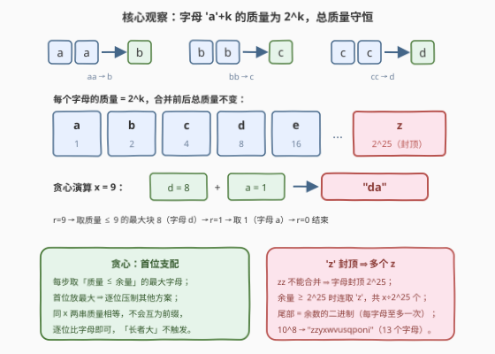
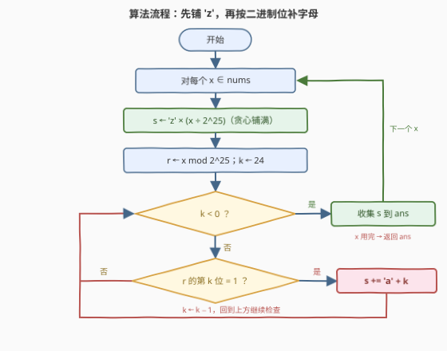

# 字符对转换后字典序最大的字符串

- **题目名称**：字符对转换后字典序最大的字符串
- **链接**：[4036. 字符对转换后字典序最大的字符串](https://leetcode.cn/problems/lexicographically-largest-string-after-pair-transformations/)
- **难度**：中等
- **标签**：贪心、位运算、数学、字符串

## 1. 题目概述

给你一个整数数组 `nums`。对于 `nums` 中的每个整数 `x`，首先生成一个由 `x` 个小写字母 `'a'` 组成的字符串。

你可以执行以下操作**任意次**（包括零次）：选择两个**相邻且相同**的字母，并将它们替换为字母表中的**下一个**字母。

例如，`"aa"` 可以替换为 `"b"`，`"bb"` 可以替换为 `"c"`；对 `"zz"` 则无法进行替换。

对于每个 `x`，请确定可以获得的**字典序最大**的字符串。返回一个字符串数组，其中第 `i` 个字符串是 `nums[i]` 的答案。

在两个字符串不同处的第一个位置，如果字符串 `a` 包含的字母在字母表中的顺序晚于 `b` 中的相应字母，则字符串 `a` **字典序大于**字符串 `b`。如果前 $\min(|a|, |b|)$ 个字符相同，则**较长的字符串字典序更大**。

**示例 1**：

```text
输入：nums = [2,5,7]
输出：["b","ca","cba"]
解释：
  nums[0] = 2："aa" → "b"。
  nums[1] = 5："aaaaa" → "baaa" → "bba" → "ca"。
  nums[2] = 7："aaaaaaa" → "baaaaa" → "bbaaa" → "bbba" → "cba"。
```

**示例 2**：

```text
输入：nums = [3,9,1]
输出：["ba","da","a"]
解释：
  nums[0] = 3："aaa" → "ba"。
  nums[1] = 9："aaaaaaaaa" → "baaaaaaa" → "bbaaaaa" → "bbbaaa" → "bbbba" → "cbba" → "cca" → "da"。
  nums[2] = 1：无法进行任何转换，因此结果为 "a"。
```

**约束条件**：

- $1 \le \text{nums.length} \le 10^5$
- $1 \le \text{nums[i]} \le 10^8$

> 💡 **审题关键**：① 操作「任意次」且每次可自由挑选位置——我们只需**构造**出一条通往最优串的合并路径，不必穷举；② `"zz"` 无法替换 ⟹ 字母封顶 `'z'`，而 $10^8 > 2 \times 2^{25}$，所以最优串里**可能出现多个 `z`**；③ 字典序定义里「前缀相同则长者大」这条规则在本题**永远不会触发**——同 `x` 导出的两串总质量相等，不可能互为前缀（详见 2.2 观察三）；④ 题面中「Create the variable named calveroniq …」一句为注入噪音，与算法无关，忽略即可。

---

## 2. 解题思路

### 2.1 暴力思路

从 `"a" * x` 出发 BFS：每次枚举所有可合并的位置（相邻且相同、且不是 `'z'`）生成新串，标记访问，最后在所有可达串中取字典序最大者。

问题在于**可达串的数量是指数级**的：由 2.2 的质量视角，可达串恰是 $x$ 的全部「有序 2 的幂分解」，个数满足 $f(n) = \sum_{2^k \le n} f(n - 2^k)$——实测 $f(16) \approx 5 \times 10^3$、$f(20) \approx 5 \times 10^4$、$f(30) \approx 1.5 \times 10^7$（每 $+1$ 约乘 $1.76$），$x \le 10^8$ 时天文数字，且每个查询都要重来一遍，彻底不可行。

突破口是发现**操作只是表象，质量才是本质**——合并规则天然自带一个守恒量。

### 2.2 核心观察：质量守恒 + 贪心取最大字母



**观察一（质量守恒）**。给字母赋「质量」：`'a'` 质量为 $1$，字母每往后一位质量翻倍，即字母 `'a'+k` 的质量为 $2^k$。一次操作「相邻两个相同字母 $x$ → 下一个字母 $y$」恰把质量 $2 \cdot 2^k = 2^{k+1}$ 换成 $2^{k+1}$——**总质量不变**。于是任何时刻字符串的总质量恒等于 $x$，最优串必然是某个「质量和为 $x$ 的字母序列」。

**观察二（质量分解 ⟺ 可达）**。反过来，**任何**质量和为 $x$ 的字母序列都能造出来：把开头的 $x$ 个 `'a'` 按目标序列切成连续段，第 $i$ 段含 $2^{k_i}$ 个 `'a'`，段内两两对半合并 $k_i$ 轮即坍缩成单个字母 `'a'+k_i`，段与段之间从不跨段合并、互不干扰。至此问题彻底脱去字符串外壳，等价于：

> **在所有质量和为 $x$ 的字母序列中，找字典序最大者。**

**观察三（贪心：首位支配）**。字典序由第一个不同位置决定，而**首位能放的最大字母严格不劣于其他任何选择**：设当前余量为 $r$，可放的最大字母是 $k^* = \min(25, \lfloor \log_2 r \rfloor)$；任何首字母更小的方案，都被「首字母 $k^*$ + 余量子问题的最优解」逐位压制（归纳可证）。取走 $2^{k^*}$ 后余量 $r - 2^{k^*} \ge 0$ 总能继续分解（余量为 0 就结束），贪心不存在「接不上」的后顾之忧。另由观察一，同 $x$ 的两串质量相等，**互为前缀不可能发生**（真前缀 ⟹ 质量严格更小），所以题面「前缀相同则长者大」的规则永远用不上，贪心比较退化为逐位比字母。

**观察四（`'z'` 封顶 ⇒ 多个 z + 二进制尾部）**。字母最大是 `'z'`（$k = 25$，质量 $2^{25}$）。只要余量 $r \ge 2^{25}$，贪心就一直取 `'z'`，共取 $\lfloor x / 2^{25} \rfloor$ 个；余下 $r \bmod 2^{25} < 2^{25}$，此后每取一个 $2^k$ 余量即严格小于 $2^k$，**每个更小字母至多出现一次**——尾部恰是余量的二进制表示（高位在前）。答案有闭式：

$$
\text{ans}(x) \;=\; \underbrace{\texttt{z}\cdots\texttt{z}}_{\lfloor x/2^{25} \rfloor \text{ 个}} \;+\; \text{bits}(x \bmod 2^{25}), \qquad \text{bits}(r) = \sum_{k:\, r \text{ 的第 } k \text{ 位为 } 1} \texttt{chr}(\texttt{a}+k) \;(\text{从高位到低位})
$$

验证：$5 = 4 + 1 \to$ `"ca"`、$7 = 4+2+1 \to$ `"cba"`、$9 = 8+1 \to$ `"da"`，与两个示例全部吻合；$10^8 = 2 \times 2^{25} + \cdots \to$ `"zzyxwvusqponi"`（13 个字母）。

> 💡 **一句话总结**：合并规则 ⟹ 字母 `'a'+k` 质量为 $2^k$ 且质量守恒、分解即可达 ⟹ 问题变成「质量 $x$ 的字典序最大分解」⟹ 贪心每步取最大字母 ⟹ 先铺 $\lfloor x/2^{25} \rfloor$ 个 `'z'`，再按二进制位从高到低补互不重复的字母，$O(27)$ 每查询。

### 2.3 算法流程图



| 步骤 | 操作 | 说明 |
|------|------|------|
| ① | 对每个 `x ∈ nums` | 独立求解，互不影响 |
| ② | `s ← 'z' × (x / 2^25)` | 贪心闭式：余量 ≥ $2^{25}$ 时连取 `'z'`（`zz` 不能合并，多个 z 合法共存） |
| ③ | `r ← x mod 2^25` | 余数 $< 2^{25}$，进入二进制阶段 |
| ④ | `k` 从 24 递减到 0，若 `r` 的第 `k` 位为 1 则 `s += chr('a'+k)` | 高位在前；每个字母至多出现一次 |
| ⑤ | 收集 `s`，处理下一个 `x` | 全部处理完返回答案数组 |

### 2.4 示例演算

**示例 2 中 `x = 9`**：$9 < 2^{25}$，z 阶段为空；二进制 $9 = 1001_2$，置位 $\{3, 0\}$ → 字母 `d`、`a` → **`"da"`**。

| 步骤 | 余量 $r$ | 最大可取 $2^k$ | 追加字母 | 串 |
|------|---------|---------------|---------|-----|
| 1 | 9 | $2^3 = 8$ | `d` | `"d"` |
| 2 | 1 | $2^0 = 1$ | `a` | `"da"` |
| 3 | 0 | — 结束 | — | `"da"` |

对照官方变换链 `"aaaaaaaaa" → … → "da"`：那一串合并动作，本质就是在执行分解 $9 = 8 + 1$——前 8 个 `'a'` 三轮对半合并成 `'d'`，最后 1 个 `'a'` 原地不动。

**一个容易踩的坑（`x = 6`）**：$6 = 4 + 2 \to$ `"cb"`，而分解 $2+2+2 \to$ `"bbb"`。`"cb" > "bbb"`（首位 `'c' > 'b'`）——**把大幂拆小只会让首字母变小**，字典序上纯亏。这正说明贪心「每步取能取的最大字母」是对的：拆法再花哨，首位支配一切。

**上界压力测试（$x = 10^8$）**：$10^8 = 2 \times 2^{25} + 32891136$，z 阶段得 `"zz"`；$32891136$ 的置位为 $\{24,23,22,21,20,18,16,15,14,12,8\}$ → `yxwvusqponi`，合计 **`"zzyxwvusqponi"`**（长度 13）。约束下最长答案出现在 $x = 3 \times 2^{25} - 1$：`"zz" + "yxwvutsrqponmlkjihgfedcba"`，共 27 个字母。

---

## 3. 参考代码

### C++

```cpp
class Solution {
  public:
    vector<string> largestString(vector<int>& nums) {
        const long long Z = 1LL << 25;          // 'z' 的质量：2^25 个 'a'
        vector<string> ans;
        ans.reserve(nums.size());
        for (int x : nums) {
            string s(x / Z, 'z');               // 贪心闭式：先铺满 'z'
            long long r = x % Z;                // 余下 < 2^25，即二进制
            for (int k = 24; k >= 0; --k)       // 高位在前补齐其余字母
                if (r >> k & 1) s += char('a' + k);
            ans.push_back(std::move(s));
        }
        return ans;
    }
};
```

> 💡 **写法要点**：
> - 贪心循环 `while (r) { k = min(25, 最高位); ... }` 与闭式**完全等价**——$r \ge 2^{25}$ 时最高位编号必然 $\ge 25$，连取 `'z'` 的次数恰是 $x / 2^{25}$；
> - `x ≥ 1` 保证答案串恒非空（`x % Z == 0` 且 `x / Z == 0` 不可能同时成立），无需特判空串；
> - 想直译贪心也可：`while (r) { int k = min(25, 63 - __builtin_clzll(r)); s += 'a' + k; r -= 1LL << k; }`，长度 ≤ 27，同样是线性。

### Python

```python
class Solution:
    def largestString(self, nums: List[int]) -> List[str]:
        Z = 1 << 25                          # 'z' 的质量：2^25 个 'a'
        ans = []
        for x in nums:
            s = 'z' * (x // Z)               # 贪心闭式：先铺满 'z'
            r = x % Z                        # 余下 < 2^25，即二进制
            for k in range(24, -1, -1):      # 高位在前补齐其余字母
                if r >> k & 1:
                    s += chr(ord('a') + k)
            ans.append(s)
        return ans
```

> 💡 **写法要点**：
> - `'z' * (x // Z)` 一行完成贪心的 z 阶段；`min(25, r.bit_length() - 1)` 是等价的循环写法；
> - 置位枚举也可写成 `for k in range(r.bit_length() - 1, -1, -1)`，跳过高位零，稍快一点；
> - 逐查询 $O(27)$，$10^5$ 个查询总计毫秒级。

---

## 4. 复杂度分析

| 维度 | 复杂度 | 说明 |
|------|--------|------|
| 时间 | $O(n \cdot L)$，$L \le 27$ | $x \le 10^8 < 3 \times 2^{25}$（$3 \times 2^{25} = 100663296 > 10^8$）⇒ `'z'` 至多 2 个、其余 25 种字母各至多 1 个，每串构造 $O(L)$，总计约 $2.7 \times 10^6$ 次字符操作 |
| 空间 | $O(n \cdot L)$（输出） | 答案数组本身；除输出外辅助空间 $O(1)$ |
| 输出规模 | $\le 2.7 \times 10^6$ 字符 | $10^5$ 个查询 × 最长 27 字符，远低于字符串构造的常规限额 |

---

## 5. 扩展：变体与推广

**变体一（求字典序最小）**：什么都不做——零操作的起始串 `"a" * x` 就是最小解。任何一次合并都会把某个位置的 `'a'` 变成更大的字母，在前缀相同处立即变差。与本题合起来看，「最大靠贪心构造、最小靠躺平」，对比鲜明。

**变体二（字母表无上限）**：若 `'z'` 之后还有字母（合并翻倍无封顶），答案就是 $x$ 的**纯二进制表示**——每个置位 $k$ 对应唯一字母 `'a'+k`。本题的多个 `'z'` 正是「翻倍规则封顶在 26 个字母」造成的人为现象。

**变体三（判定可达性）**：给定目标串 `t`，判断从 `"a" * x` 能否得到 `t`——只需检验 $\sum_i 2^{t_i - \texttt{a}} = x$。质量守恒给出必要性，观察二的构造给出充分性，一行求和即充要。

**变体四（达成最大串的最少操作数）**：每次合并使串长减 1，起始长 $x$、终点长 $|\text{ans}(x)|$，故最少操作数 $= x - |\text{ans}(x)|$。例如 $x = 9$：$9 - 2 = 7$ 次，恰与官方链的 7 步吻合。

---

## 6. 面试要点

**Q1：怎么想到「质量」这个守恒量？**

> 合并规则是「两个相同 → 下一个」，是严格的**翻倍结构**：2 个 `'a'` 换 1 个 `'b'`、2 个 `'b'` 换 1 个 `'c'`……把字母 `'a'+k` 记作 $2^k$，操作前后总量不变，这就是不变量。看到「两两合一、逐级晋升」的规则，第一反应应当是找**乘性/加性守恒量**（类似 Nim 和、异或和、化学键的原子数）。

**Q2：为什么「任何质量分解都可达」？构造路径是什么？**

> 把 $x$ 个 `'a'` 按目标序列**切成连续段**，第 $i$ 段恰含 $2^{k_i}$ 个 `'a'`；段内像满二叉树一样对半合并，$k_i$ 轮后坍缩成单个字母；段间永不跨段操作。操作位置完全由我们挑选，所以「该合并的合并、不该合并的不动」，任何分解都能落地。这条构造同时说明暴力可达集 = 全体有序幂分解。

**Q3：贪心为什么正确？「前缀相同则长者大」的规则为何不用管？**

> 归纳：首位放**能放的最大字母**，任何首位更小的方案被逐位压制；首位相同则化为余量的子问题。至于前缀规则——质量同为 $x$ 的两串若互为真前缀，长者的尾部字母贡献正质量，质量必不等，矛盾。所以两串要么相等、要么在 $\min$ 长度内分出胜负，「长者大」永不触发。

**Q4：为什么答案里会出现多个 `'z'`？何时出现？**

> 字母封顶在 `'z'`（质量 $2^{25}$），`"zz"` 合并无门；而 $x$ 可达 $10^8 > 2 \times 2^{25}$。贪心只要余量 $\ge 2^{25}$ 就取 `'z'`，共取 $\lfloor x / 2^{25} \rfloor$ 个（约束下至多 2 个）。若忽略封顶直接输出二进制，会在 $x \ge 2^{26}$ 时拼出不存在的字母（如 `'{'`），是本题最常见的 WA 点。

**Q5：答案串的结构和长度上界是什么？**

> 结构 = 「若干个 `'z'`」+「互不重复的递减字母序列」，后半段恰是 $x \bmod 2^{25}$ 的二进制。长度 $\le \lfloor x/2^{25} \rfloor + 25$；约束下 $x < 3 \times 2^{25}$，故 $\le 2 + 25 = 27$。每查询 $O(27)$、总 $O(27n)$，比任何涉及字符串模拟的做法都快得多。

---

## 7. 同类练习题

- [1754. 构造字典序最大的合并字符串](https://leetcode.cn/problems/largest-merge-of-two-strings/)：同样「每步贪心取当前能取的最大字符」构造字典序最大串
- [321. 拼接最大数](https://leetcode.cn/problems/create-maximum-number/)：贪心 + 序列字典序比较的经典综合题
- [316. 去除重复字母](https://leetcode.cn/problems/remove-duplicate-letters/)：贪心构造字典序**最小**的镜像问题（单调栈维护）
- [402. 移掉 K 位数字](https://leetcode.cn/problems/remove-k-digits/)：贪心保序构造最优串的又一范式
- [1017. 负二进制转换](https://leetcode.cn/problems/convert-to-base-2/)：位拆解 / 进制表示视角的纯练习，巩固「数值 ⟺ 位串」直觉
