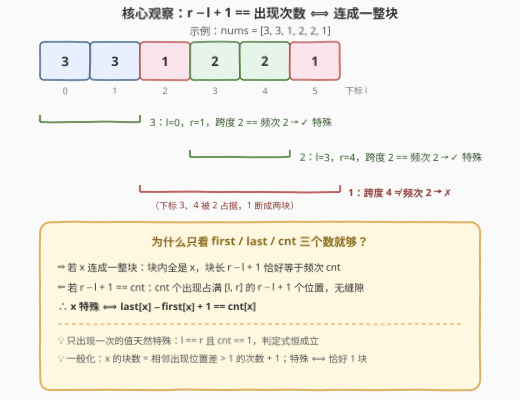
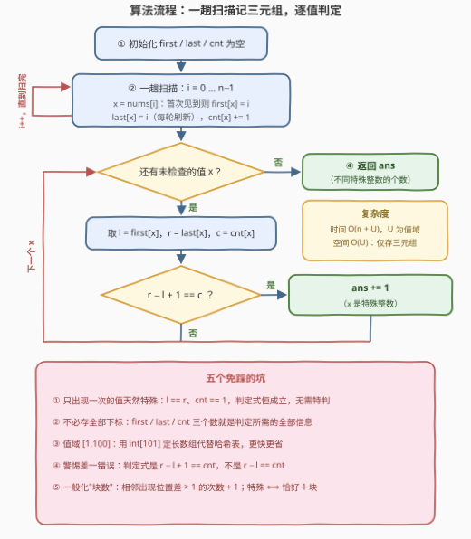

# LeetCode 计算单个区间中出现的整数数量 题解

## 1. 题目概述

- **标题 / 题号**：计算单个区间中出现的整数数量（#4038，easy）
- **链接**：https://leetcode.cn/problems/count-integers-appearing-in-a-single-block/
- **难度**：简单
- **标签**：数组、哈希表、计数

**题意**：给你一个整数数组 `nums`。

如果整数 $x$ 在 `nums` 中的**所有出现位置**都位于**同一个连续区间**内，则称 $x$ 为**特殊整数**。

返回 `nums` 中**不同**特殊整数的数量。

**示例 1**：

```text
输入：nums = [1,2,2,1]
输出：1
解释：1 出现在下标 0 和 3，形成了两个分离的区间，不是特殊整数；
     2 在下标 [1, 2] 处形成一个连续区间，是特殊整数。
     因此，共有一个特殊整数。
```

**示例 2**：

```text
输入：nums = [3,3,1,2,2,1]
输出：2
解释：3 在下标 [0, 1] 处形成一个连续区间，是特殊整数；
     1 出现在下标 2 和 5，形成两个分离的区间，不是特殊整数；
     2 在下标 [3, 4] 处形成一个连续区间，是特殊整数。
     因此，共有两个特殊整数。
```

**约束**：

- $1 \le nums.length \le 100$
- $1 \le nums[i] \le 100$

> 💡 **审题关键**：① 判定对象是**每个不同的值**，答案是"特殊值的个数"，不是位置数；② "同一个连续区间"意味着 $x$ 的所有出现必须**无缝连成一块**——中间只要隔着一个别的元素就算断开；③ 值域 $[1,100]$、长度 $\le 100$，怎么做都能过，但值得追求"一趟扫描 + 三个统计量判定"的优雅写法。

## 2. 解题思路

### 2.1 暴力思路：收集每个值的全部下标

最直观的做法：用哈希表把每个值出现的**所有下标**收集成列表，再检查列表是否首尾相连（相邻下标差恒为 1）：

```python
pos = {}
for i, x in enumerate(nums):
    pos.setdefault(x, []).append(i)
ans = sum(all(b - a == 1 for a, b in zip(p, p[1:])) for p in pos.values())
```

正确性显然，时间 $O(n)$，但要把每个值的完整下标序列存下来，空间 $O(n)$。更极端的暴力是对每个值检查 $[first, last]$ 区间内是否**全等于** $x$，时间 $O(n \cdot D)$——同样正确，但都没抓住问题的本质。

其实，"$x$ 的所有出现连成一块"这个性质，信息量小得惊人：**只需要 3 个数**就能判定。

### 2.2 核心观察：首末位置 + 频次，一趟判定



设 $l$、$r$ 分别是 $x$ **首次**、**最后一次**出现的下标，$cnt$ 是 $x$ 的出现次数。则：

$$x \text{ 是特殊整数} \;\Longleftrightarrow\; r - l + 1 = cnt$$

**双向证明**：

- **（⇒）** 若 $x$ 连成一整块，这块恰是区间 $[l, r]$，长度为 $r - l + 1$；块内每个位置都是 $x$，故 $cnt = r - l + 1$。
- **（⇐）** 若 $r - l + 1 = cnt$：$x$ 的 $cnt$ 次出现全都落在 $[l, r]$ 内（$l$、$r$ 本就是最早、最晚出现），而 $[l, r]$ 恰有 $r - l + 1 = cnt$ 个位置——$cnt$ 个出现**占满**了这个区间，没有任何缝隙留给别的元素，故 $x$ 连续。

于是判定 $x$ 是否特殊，**根本不需要存下标序列**：一趟扫描为每个值维护 $(first, last, cnt)$ 三元组，扫描结束后逐值套用上式即可。

两个顺手的推论：

- **只出现一次的值天然特殊**：$l = r$、$cnt = 1$，$r - l + 1 = 1 = cnt$ 恒成立；
- **一般化**：$x$ 被断成的**块数** = 相邻两次出现位置差 $> 1$ 的次数 $+ 1$；"特殊" ⟺ 块数恰好为 $1$。

> 💡 **一句话总结**：$r - l + 1 == cnt$ 一个式子搞定——首末位置夹出的区间长度若恰好等于出现次数，说明出现位置占满了区间、无缝成块。

### 2.3 算法流程图



| 步骤 | 操作 | 说明 |
|------|------|------|
| ① | 初始化 `first` / `last` / `cnt` 为空 | 值域 $[1,100]$ 可用定长数组 |
| ② | 一趟扫描 $i = 0 \dots n-1$ | 首见记 `first[x]=i`；`last[x]=i` 每轮刷新；`cnt[x]++` |
| ③ | 逐个检查出现过的 $x$ | 取 $l = first[x]$，$r = last[x]$，$c = cnt[x]$ |
| ④ | $r - l + 1 == c$？ | 是则 `ans++`（$x$ 特殊）；否则跳过 |
| ⑤ | 返回 `ans` | 即不同特殊整数的个数 |

### 2.4 示例演算

**示例 2**：$nums = [3, 3, 1, 2, 2, 1]$，一趟扫描得到：

| 值 $x$ | $l$（首次） | $r$（末次） | $cnt$ | $r - l + 1$ | 判定 |
|--------|----|----|-------|-------------|------|
| 3 | 0 | 1 | 2 | 2 | $2 = 2$ ✓ 特殊 |
| 1 | 2 | 5 | 2 | 4 | $4 \ne 2$ ✗ 断成两块 |
| 2 | 3 | 4 | 2 | 2 | $2 = 2$ ✓ 特殊 |

答案为 $\mathbf{2}$。注意值 $1$：它的两次出现夹出的区间 $[2, 5]$ 长 4，却只出现 2 次——中间下标 3、4 被 $2$ 占据，正是"跨度 ≠ 频次"的典型形态。

**示例 1**：$nums = [1, 2, 2, 1]$：值 $1$ 有 $l=0$、$r=3$、$cnt=2$，$r-l+1=4 \ne 2$ ✗；值 $2$ 有 $l=1$、$r=2$、$cnt=2$，$r-l+1=2=2$ ✓。答案 $\mathbf{1}$。

## 3. 参考代码

### C++

```cpp
class Solution {
  public:
    int countSpecialIntegers(vector<int>& nums) {
        int n = nums.size();
        int first[101], last[101], cnt[101];          // 值域 [1,100]，定长数组代替哈希
        memset(first, -1, sizeof first);
        memset(last, -1, sizeof last);
        memset(cnt, 0, sizeof cnt);

        for (int i = 0; i < n; ++i) {                 // 一趟扫描，维护三元组
            int x = nums[i];
            if (first[x] < 0) first[x] = i;           // 仅首次生效
            last[x] = i;                              // 每轮刷新成最新位置
            ++cnt[x];
        }

        int ans = 0;
        for (int x = 1; x <= 100; ++x)                // 逐值判定
            if (cnt[x] && last[x] - first[x] + 1 == cnt[x])
                ++ans;
        return ans;
    }
};
```

> 💡 **写法要点**：
> - 值域只有 $[1, 100]$，三个 `int[101]` 比哈希表更快、零哈希开销；
> - `first[x] < 0` 兼作"未出现"标记，判定时用 `cnt[x] && ...` 排除没出现过的值；
> - `last[x]` 每轮无条件刷新，循环结束自然停在最后一次出现的位置。

### Python

```python
class Solution:
    def countSpecialIntegers(self, nums: List[int]) -> int:
        first, last, cnt = {}, {}, {}
        for i, x in enumerate(nums):        # 一趟扫描，维护三元组
            first.setdefault(x, i)          # 仅首次生效
            last[x] = i                     # 每轮刷新
            cnt[x] = cnt.get(x, 0) + 1
        return sum(last[x] - first[x] + 1 == c for x, c in cnt.items())
```

> 💡 **写法要点**：
> - `setdefault(x, i)` 一行完成"仅首次记录"；
> - 哈希表版本不依赖值域，任意整数都能跑；
> - 喜欢紧凑写法也可 `pos.setdefault(x, []).append(i)` 存全部下标，最后判 `p[-1] - p[0] + 1 == len(p)`——正是 2.1 的暴力版，正确但多存了下标。

## 4. 复杂度分析

| 维度 | 复杂度 | 说明 |
|------|--------|------|
| 时间 | $O(n + U)$ | 一趟扫描 $O(n)$ + 逐值判定 $O(U)$，$U$ 为值域大小（本题 $U \le 100$）；哈希版为期望 $O(n + D)$，$D$ 为不同值个数 |
| 空间 | $O(U)$ | 每个值只存 $(first, last, cnt)$ 三元组，$O(U)$ / $O(D)$，不随 $n$ 增长 |
| 答案规模 | $[0, 100]$ | 至多是不同值的个数，`int` 绰绰有余 |

## 5. 扩展：信息压缩的视角与三个变体

**为什么三个数就够了？** "所有出现连成一块"看似是关于**整个下标集合**的性质，实际上被完全压缩进了 $(first, last, cnt)$ 三个统计量——这是"用聚合统计替代原始数据"的经典例子。对比三种存法：

| 存法 | 额外空间 | 判定方式 |
|------|----------|----------|
| 全部下标列表 | $O(n)$ | 相邻下标差是否恒为 1 |
| $(first, last, cnt)$ | $O(D)$ | $r - l + 1 == cnt$，$O(1)$ |
| 只存 $first$，逐位验证 | $O(1)$ | 扫 $[l, r]$ 检查是否全为 $x$，$O(n \cdot D)$ |

**变体 1（数块数）**：若把问题改成"$x$ 被断成了几块"，答案 = 相邻两次出现位置差 $> 1$ 的次数 $+ 1$（单次出现即 1 块）。"特殊"就是块数 $= 1$ 的特例。

**变体 2（数组的度）**：[697. 数组的度](https://leetcode.cn/problems/degree-of-an-array/) 用的是完全相同的三元组——求出现次数最多的值中，包含其所有出现的最短子数组长度，即 $r - l + 1$ 的最小值。掌握本题后，697 只是"换个问法"。

**变体 3（值域无界）**：若 $nums[i]$ 达 $10^9$，把定长数组换成 `unordered_map` / `dict` 即可，思路不变——"值域小用数组、值域大用哈希"是通用权衡。

## 6. 面试要点

**Q1：「所有出现位于同一连续区间」的等价判定式是什么？如何证明？**

> $x$ 特殊 $\Longleftrightarrow$ $last[x] - first[x] + 1 == cnt[x]$。（⇒）连成一块时块内全是 $x$，块长 = 频次；（⇐）$cnt$ 次出现全落在 $[l, r]$ 的 $r-l+1$ 个位置里且恰好占满，无缝隙，故连续。双向都只依赖首末位置与频次。

**Q2：只出现一次的值需要特判吗？**

> 不需要。$l = r$、$cnt = 1$，判定式 $r - l + 1 = 1 = cnt$ 恒成立，天然特殊。推论：所有元素互不相同（$D = n$）时答案就是 $n$。

**Q3：为什么要存 first/last/cnt 而不是全部下标？**

> 判定式只需要首末位置和总次数——下标序列的其余信息是冗余的。存三元组把额外空间从 $O(n)$ 压到 $O(D)$，且一趟扫描即可维护，是本题最优雅的形态。

**Q4：值域 $[1,100]$ 这个条件怎么利用？**

> 用 `int[101]` 定长数组代替哈希表：无哈希计算、缓存友好，判定阶段还能直接 $x = 1 \dots 100$ 顺序枚举。值域无界时退回哈希表，期望复杂度不变。

**Q5：哪些边界用例值得自测？**

> ① $n = 1$：单元素自成一块，答案 1；② 全相同（如 $[7,7,7]$）：一整块，答案 1；③ 全互不相同：答案 $n$；④ 交替出现（如 $[1,2,1,2]$）：两个值都断开，答案 0；⑤ 首尾分离（如 $[1,2,2,1]$）：跨度大、频次小，答案 1。

## 同类练习题

| # | 题目 | 与本题的关联 |
|---|------|-------------|
| 697 | [数组的度](https://leetcode.cn/problems/degree-of-an-array/) | 同一套 $(first, last, cnt)$ 三元组，换成求最高频值的最短包含区间 |
| 219 | [存在重复元素 II](https://leetcode.cn/problems/contains-duplicate-ii/) | 哈希记录出现位置、按下标距离判定，"位置信息入哈希"的入门版 |
| 448 | [找到所有数组中消失的数字](https://leetcode.cn/problems/find-all-numbers-disappeared-in-an-array/) | 同样利用小值域 $[1, n]$ 用定长数组做计数 |
| 1207 | [独一无二的出现次数](https://leetcode.cn/problems/unique-number-of-occurrences/) | 频次哈希的另一道计数入门练习 |
| 4031 | [找到所有数组中消失的数字II](https://leetcode.cn/problems/find-all-numbers-disappeared-in-an-array-ii/) | 同目录近邻题，值域计数思想的进阶版 |
