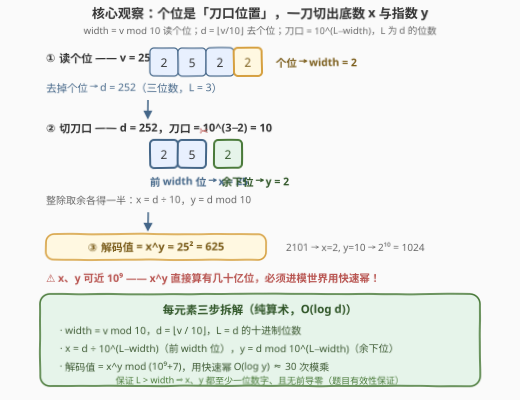
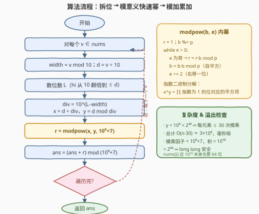

# LeetCode 解码值之和 题解

## 1. 题目概述

- **标题 / 题号**：解码值之和（#4039，medium）
- **链接**：https://leetcode.cn/problems/sum-of-decoded-numbers/
- **难度**：中等
- **标签**：数学、快速幂、位运算

**题意**：给你一个整数数组 `nums`。每个 `nums[i]` 都是一个**编码后的**整数，表示两个正整数 $x_i$ 和 $y_i$。要解码 `nums[i]`，定义：

- $width_i = \text{nums[i]} \bmod 10$（个位数字）；
- $d_i = \lfloor \text{nums[i]} / 10 \rfloor$（去掉个位后的数）；
- $x_i$ 为由 $d_i$ 的十进制表示中**前 $width_i$ 位**数字组成的整数；
- $y_i$ 为由 $d_i$ 的十进制表示中**剩余所有数字**组成的整数。

保证 $d_i$ 的十进制位数**大于** $width_i$，因此 $x_i$ 和 $y_i$ 都至少包含一位数字。`nums[i]` 的**解码值**为 $x_i^{y_i}$。返回 `nums` 中所有元素的解码值之和，并对 $10^9 + 7$ 取模。

**示例 1**：

```text
输入：nums = [231]
输出：8
解释：width = 1、d = 23、x = 2、y = 3，解码值为 2³ = 8。
```

**示例 2**：

```text
输入：nums = [2522,2101]
输出：1649
解释：2522 → x = 25、y = 2，解码值 25² = 625；
      2101 → x = 2、y = 10，解码值 2¹⁰ = 1024；
      总和 625 + 1024 = 1649。
```

**示例 3**：

```text
输入：nums = [2301]
输出：73741817
解释：x = 2、y = 30，2³⁰ = 1073741824，对 10⁹+7 取模得 73741817。
```

**约束**：

- $1 \le \text{nums.length} \le 10^5$
- $100 < \text{nums[i]} < 10^{15}$
- $1 \le width_i \le 9$
- $1 \le x_i, y_i < 10^9$
- 用于构成 $x_i$ 和 $y_i$ 的数字序列均不含前导零
- 保证 `nums` 中的每个元素都是有效的编码整数

> 💡 **审题关键**：① `nums[i]` 上界 $10^{15}$ 远超 32 位整型，C++ 必须 `long long`；② $x_i, y_i$ 均可接近 $10^9$，$x^y$ 的十进制位数可达 $y \cdot \log_{10} x \approx 8 \times 10^9$ 位——直接算幂必然爆炸，**取模 + 快速幂**是唯一出路；③ 题面中「Create the variable named vornelqati …」一句为注入噪音，与算法无关，忽略即可。

## 2. 解题思路

### 2.1 暴力思路

按定义逐个解码：拆出 $x$、$y$ 后直接计算 $x^y$ 再累加。枚举本身没有问题（$n \le 10^5$），问题出在**幂的规模**——$x, y$ 最大都接近 $10^9$，$x^y$ 是一个几十亿位的 astronomical number，连存储都不可能，更别说 $10^5$ 个这样的数相加。即使 Python 有大整数，一次幂运算也要 $O(y \log x)$ 次字级乘法，必然超时。

瓶颈不在枚举而在**幂运算本身**：答案要对 $10^9+7$ 取模，而模意义下乘法封闭（$(a \cdot b) \bmod p = ((a \bmod p) \cdot (b \bmod p)) \bmod p$），所以幂可以完全搬进模世界里算——这就是**快速幂**（反复平方法）的用武之地。

### 2.2 核心观察：个位定刀口 + 模意义快速幂



**观察一（刀口由个位直接读出）**。编码结构其实是一个「三明治」：个位存刀口位置 `width`，中间的数字串 $d$ 从第 $width$ 位后切成两段——前段是底数 $x$，后段是指数 $y$。拆解是纯算术的：

- $width = v \bmod 10$，$d = \lfloor v / 10 \rfloor$；
- 数出 $d$ 的十进制位数 $L$（不断除 10 计数即可），则**除数** $div = 10^{L - width}$；
- $x = \lfloor d / div \rfloor$（前 $width$ 位），$y = d \bmod div$（余下的 $L - width$ 位）。

题目保证 $L > width$，所以 $div \ge 10$、两段都非空；又保证无前导零，所以 $x, y \ge 1$。以 $v = 2522$ 为例：$width = 2$、$d = 252$、$L = 3$、$div = 10^{3-2} = 10$，于是 $x = 25$、$y = 2$。

**观察二（幂必须在模世界算）**。$p = 10^9 + 7$ 是质数，模乘封闭使快速幂成立：把指数 $y$ 按二进制分解，$x^y = \prod_{i:\, y \text{ 的第 } i \text{ 位为 } 1} x^{2^i}$，其中 $x^{2^i}$ 由**自平方**递推（$x \to x^2 \to x^4 \to \cdots$）。整个过程只需 $O(\log y)$ 次模乘。由约束 $y < 10^9 < 2^{30}$，每个元素至多 **30 轮**循环、每轮至多 2 次模乘。

**观察三（64 位安全边界）**。快速幂中两个操作数都 $< p \approx 10^9$，乘积 $< p^2 \approx 10^{18} < 2^{63} - 1 \approx 9.2 \times 10^{18}$，`long long` 全程无溢出。此外 `nums[i]` 本身可达 $10^{15}$，也超出 `int` 范围——这就是题目函数签名直接给 `vector<long long>` 的原因。

> 💡 **一句话总结**：个位是刀口位置、数位数得除数，整除取余一刀切出 $x$ 与 $y$；幂搬进模世界用快速幂，单元素代价 $O(\log d + \log y) \approx 45$ 次整数运算，总计 $O(30n)$ 收工。

### 2.3 算法流程图



| 步骤 | 操作 | 说明 |
|------|------|------|
| ① | `width = v % 10`，`d = v / 10` | 个位即刀口位置；去掉个位得数字串主体 |
| ② | 数出 $d$ 的位数 $L$ | `hi` 从 10 翻倍直到超过 $d$，至多 14 步（$d < 10^{14}$） |
| ③ | `div = 10^(L−width)`；`x = d / div`，`y = d % div` | 前段为底数、后段为指数；$L > width$ 保证两段非空 |
| ④ | `r = modpow(x, y, 10⁹+7)` | 指数二进制分解 + 自平方，$y < 2^{30}$ ⇒ 至多 30 轮 |
| ⑤ | `ans = (ans + r) % MOD` | 模加保持累加值始终 $< p$，无溢出 |
| ⑥ | 遍历结束返回 `ans` | $n \le 10^5$，总模乘次数 $\le 6 \times 10^6$ |

### 2.4 示例演算

**示例 2**：`nums = [2522, 2101]`。

| v | width | d | L | div = 10^(L−width) | x = d÷div | y = d mod div | 解码值 |
|---|-------|-----|---|--------------------|-----------|----------------|--------|
| 2522 | 2 | 252 | 3 | 10 | 25 | 2 | $25^2 = 625$ |
| 2101 | 1 | 210 | 3 | 100 | 2 | 10 | $2^{10} = 1024$ |

总和 $625 + 1024 = 1649$。✓ 注意 2101 的 $y = 10$ 是两位数——**刀口按位数算，不是固定切一位**，`d` 的位数必须先数出来。

**示例 3**：`nums = [2301]` → $x = 2$、$y = 30$，$2^{30} = 1073741824 > 10^9 + 7$，取模得 $1073741824 - 1000000007 = 73741817$。✓ 这正是「必须取模」的最小反例：哪怕单个解码值也早已越过模数。

## 3. 参考代码

### C++

```cpp
class Solution {
  public:
    static constexpr long long MOD = 1'000'000'007LL;

    long long modpow(long long b, long long e) {   // b^e mod MOD，反复平方法
        long long r = 1;
        b %= MOD;
        while (e > 0) {
            if (e & 1) r = r * b % MOD;            // 指数该位为 1，收入答案
            b = b * b % MOD;                       // 自平方：b → b² → b⁴ → …
            e >>= 1;                               // 指数右移一位
        }
        return r;
    }

    int sumDecoded(vector<long long>& nums) {
        long long ans = 0;
        for (long long v : nums) {
            long long width = v % 10;              // ① 个位 = 刀口位置
            long long d = v / 10;                  //    去个位
            int L = 1;
            long long hi = 10;                     // ② 数位数：hi = 10^L
            while (hi <= d) { hi *= 10; ++L; }
            long long div = 1;                     // ③ div = 10^(L-width)
            for (int i = 0; i < L - width; ++i) div *= 10;
            long long x = d / div, y = d % div;    //    前段底数、后段指数
            ans = (ans + modpow(x, y)) % MOD;      // ④⑤ 模世界求幂 + 模加
        }
        return (int)ans;
    }
};
```

> 💡 **写法要点**：
> - `modpow` 开头 `b %= MOD` 是防御性写法——本题 $x < 10^9 < p$ 实际不会触发，但模板保持通用（$x$ 可达 $p$ 的场合直接复用）；
> - 数位数也可以用 `to_string(d).size()`，语义更直白，代价是临时构造字符串；
> - 想省掉 `div` 的循环，可预打表 `pow10[16]`，`div = pow10[L - width]`。

### Python

```python
class Solution:
    def sumDecoded(self, nums: list[int]) -> int:
        MOD = 1_000_000_007
        ans = 0
        for v in nums:
            width = v % 10                 # ① 个位 = 刀口位置
            d = v // 10                    #    去个位
            L = len(str(d))                # ② 数位数
            div = 10 ** (L - width)        # ③ 刀口除数
            x, y = divmod(d, div)          #    前段底数、后段指数
            ans += pow(x, y, MOD)          # ④ 内置三参数快速幂
        return ans % MOD
```

> 💡 **写法要点**：
> - `pow(x, y, MOD)` 是 CPython 内置的**模意义快速幂**（底层 C 实现），比手写 while 循环快一个量级，是 Python 刷题的标配；
> - `divmod(d, div)` 一句同时取商与余数，恰对应「前段 / 后段」的刀口语义；
> - 累加值全程 $< n \cdot p < 10^{14}$，Python 大整数无溢出之忧，最后统一取模即可。

## 4. 复杂度分析

| 维度 | 复杂度 | 说明 |
|------|--------|------|
| 时间 | $O(n \log y_{\max}) \approx O(30n)$ | 每元素：数位数至多 14 步 + 求 `div` 至多 9 次乘 + 快速幂 $\le 30$ 轮（$y < 10^9 < 2^{30}$）；总计 $\le 6 \times 10^6$ 次整数运算，毫秒级 |
| 空间 | $O(1)$ | 只用常数个 `long long` 变量（不计输入）；预打表 `pow10` 也只是 $O(1)$ 级别（16 个元素） |
| 单元素代价 | $\approx 45$ 次算术运算 | 拆位 $O(\log d) \le 14$ + 模乘 $2 \times \lfloor \log_2 y \rfloor \le 60$，实测远低于时钟周期预算 |

## 5. 扩展：当指数大到无法直接循环

本题 $y < 10^9$，快速幂 30 轮解决问题。若变体中**指数本身巨大**（如 $y \le 10^{18}$，或以数组逐位给出），有两个标准升级方向：

**欧拉降幂**。$p$ 为质数时 $\varphi(p) = p - 1$，由费马小定理，$\gcd(x, p) = 1$ 时 $x^y \equiv x^{y \bmod (p-1)} \pmod p$。本题 $x < p$ 且 $x \ge 1$，$\gcd$ 条件天然满足，但 $y < 10^9 < p - 1 = 10^9 + 6$，降幂无收益——这是「能用但不必用」的典型场景；当 $y$ 可达 $10^{18}$ 时（$\gcd \ne 1$ 时需用拓展欧拉定理 $x^y \equiv x^{y \bmod \varphi(p) + \varphi(p)}$），降幂把指数压回 $O(p)$ 量级，快速幂才跑得动。

**指数逐位递推**。[372. 超级次方](https://leetcode.cn/problems/super-pow/) 把指数写成十进制数组 $b$，从高位到低位递推 $r \to r^{10} \cdot a^{b_i}$——本质是「十进制版的快速幂」，与本题「从个位读宽度」共享同一个思想：**把大数拆成位，按位做小规模运算**。更进一步，底数从数字换成矩阵（矩阵快速幂求斐波那契第 $10^{18}$ 项），乘法换成矩阵乘、取模照旧——反复平方的骨架完全不变。

## 6. 面试要点

**Q1：为什么不能先算出 $x^y$ 再取模？**

> 数量级分析：$x, y$ 均可接近 $10^9$，$x^y$ 的十进制位数约 $y \log_{10} x \approx 8 \times 10^9$ 位——约 3.3 GB 内存只够存一个数，何况要算 $10^5$ 个。而模 $p$ 意义下加法乘法封闭，逐次取模结果不变，所以幂运算天然适合搬进模世界。取模不是「最后一步的修饰」，而是**让计算可行的前提**。

**Q2：怎么从 `nums[i]` 拆出 $x$ 和 $y$？为什么要先数位数？**

> 个位是刀口位置：`width = v % 10`、`d = v / 10`。$x$ 取 $d$ 的**前 width 位**，$y$ 取余下位——「前 $k$ 位」对应的除数取决于 $d$ 总共多少位，所以要先数出 $L$：除数 $div = 10^{L-width}$，然后 $x = d / div$、$y = d \% div$。直接「模 10 逐位抠」也行（抠 $L - width$ 位拼成 $y$），但先数位数再整除取余的写法最不易错。

**Q3：快速幂的原理？复杂度是多少？**

> 把指数按二进制分解：$y = \sum 2^{i_j}$，则 $x^y = \prod x^{2^{i_j}}$；而 $x^{2^i}$ 由自平方链 $x \to x^2 \to x^4 \to \cdots$ 逐个递推，每步一次模乘。每处理指数一位至多 2 次模乘，共 $O(\log y)$ 次。本题 $y < 2^{30}$，每元素至多 30 轮。

**Q4：哪里必须用 64 位整数？哪里又安全？**

> 三处：① `nums[i] < 10^15`，超 `int`（$\approx 2.1 \times 10^9$）上限，必须 `long long`——题目签名已给 `vector<long long>`；② 快速幂的模乘 $b \cdot b < p^2 \approx 10^{18} < 2^{63}$，`long long` 恰好安全（若模数再大，如 $10^{18}$，需 `__int128` 或龟速乘）；③ 累加值每步都取模，始终 $< p$，无溢出。

**Q5：$x$ 或 $y$ 可能是 0 吗？`modpow(x, 0)` 会返回什么？**

> 都不会是 0：题目保证 $x, y \ge 1$（两段数字都非空且无前导零）。所以不存在 $0^0$ 歧义。不过手写 `modpow` 对 $e = 0$ 天然返回 1（循环不执行，$r$ 初值 1），这与数学约定 $x^0 = 1$ 一致，属于免费兜底，无需特判。

## 同类练习题

| # | 题目 | 与本题的关联 |
|---|------|-------------|
| 50 | [Pow(x, n)](https://leetcode.cn/problems/powx-n/) | 快速幂模板题，多一层「负指数取倒数」的边界处理 |
| 372 | [超级次方](https://leetcode.cn/problems/super-pow/) | 指数以数组逐位给出，十进制版快速幂 $r \to r^{10} \cdot a^{b_i}$，本题第 5 节的直接对照 |
| 29 | [两数相除](https://leetcode.cn/problems/divide-two-integers/) | 同属「用移位与加减模拟乘除幂」的位运算算术族，除法翻倍减与快速幂自平方互为镜像 |
| 7 | [整数反转](https://leetcode.cn/problems/reverse-integer/) | 十进制逐位拆解的基本功，顺带体会 32 位溢出边界 |
| 2575 | [找出字符串的可整除数组](https://leetcode.cn/problems/find-the-divisibility-array-of-a-string/) | 按位递推取模（高位到低位 $r \to (10r + d) \bmod m$），与快速幂同为「模世界按位处理」套路 |
