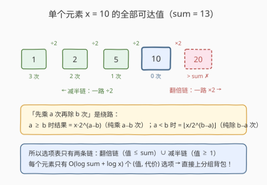
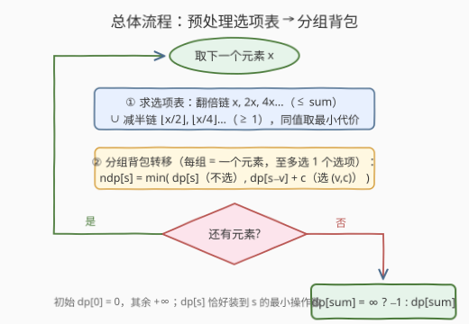

# LeetCode 构造子集和的最少操作次数 I 题解

## 1. 题目概述

- **标题 / 题号**：构造子集和的最少操作次数 I（#4040，medium）
- **链接**：https://leetcode.cn/problems/minimum-operations-to-form-subset-sum-i/
- **难度**：中等
- **标签**：动态规划、背包问题、位运算

**题意**：给你一个整数数组 $nums$ 和一个整数 $sum$。

一次**操作**中，选择一个当前值为 $x$ 的元素，并将其替换为 $2 \cdot x$ 或 $\lfloor x / 2 \rfloor$。

对于每个元素，对其执行的**所有乘法操作都必须发生在任何除法操作之前**。

返回所需的**最少**操作次数，使得操作后的数组中存在一个**子集**，其元素之和**恰好**等于 $sum$。如果无法做到，则返回 $-1$。

**示例 1**：

```text
输入：nums = [5,6,10], sum = 4
输出：3
解释：5 → 2 → 1（2 次），6 → 3（1 次），操作后子集 {1, 3} 和为 4。
```

**示例 2**：

```text
输入：nums = [10,2], sum = 13
输出：3
解释：10 → 5（1 次），2 → 4 → 8（2 次），操作后子集 {5, 8} 和为 13。
```

**示例 3**：

```text
输入：nums = [6,3], sum = 8
输出：-1
解释：不存在任何操作序列，使某个子集的元素和等于 8。
```

**约束**：

- $1 \le nums.length \le 100$
- $1 \le nums[i] \le 500$
- $1 \le sum \le 5000$

> 💡 **审题关键**：① 「乘法全在除法之前」是对**每个元素分别**生效的顺序约束，这是本题可达值集合足够小的根本原因；② 子集是**操作后**数组的子集，每个元素要么不选、要么以某个确定的终值被选中——天然的**分组背包**结构；③ 终值超过 $sum$ 的元素不可能进子集，直接剪掉。

## 2. 解题思路

### 2.1 暴力思路：枚举每个元素的操作序列

最直接的想法：对每个元素 $x$，枚举「先乘 $a$ 次、再除 $b$ 次」的所有组合，得到全部 $(终值, 操作数)$；再枚举子集，从每组里挑一个终值凑 $sum$。

问题在于规模：操作次数上不封顶，操作序列空间是无穷的；即便限定总操作数 $\le k$，每个元素的组合也有 $O(k^2)$ 种，配合子集枚举直接爆炸。$n = 100$ 时这条路完全走不通。

### 2.2 核心观察：可达值只有两条链



**观察一（混合序列是绕路）**。由于乘法必须全在除法之前，任何操作序列都形如「先乘 $a$ 次，再除 $b$ 次」，结果为 $\lfloor x \cdot 2^a / 2^b \rfloor$：

- 若 $a \ge b$：结果 $= x \cdot 2^{a-b}$，与「纯乘 $a-b$ 次」相同，但操作数 $a+b \ge a-b$，不占优；
- 若 $a < b$：结果 $= \lfloor x / 2^{b-a} \rfloor$（$2^a$ 整除可先约去），与「纯除 $b-a$ 次」相同，同样不占优。

所以**只需考虑两条纯链**：

- **翻倍链**：$x \to 2x \to 4x \to \cdots$，第 $k$ 项代价 $k$，只需保留值 $\le sum$ 的前缀；
- **减半链**：$x \to \lfloor x/2 \rfloor \to \lfloor x/4 \rfloor \to \cdots$，第 $j$ 项代价 $j$，值降到 $0$ 为止（$0$ 对子集和无贡献）。

**观察二（选项表很小）**。翻倍链长度 $\le \log_2 sum + 1 \approx 13$，减半链长度 $\le \log_2 500 \approx 9$，两链取并集、同值取最小代价，每个元素只有 **$O(\log sum + \log x)$ 个选项**。

**观察三（分组背包建模）**。目标是从每个元素「不选，或选一个 $(值\ v, 代价\ c)$ 选项」中决策，使选中值之和恰为 $sum$ 且总代价最小——这正是**分组背包**：组 $=$ 元素，组内选项 $=$ 各可达值，外加一个代价 $0$、值 $0$ 的「不选」。

> 💡 **一句话总结**：顺序约束把每个元素的可达值压缩成「翻倍链 ∪ 减半链」共 $O(\log)$ 个选项；剩下就是一个标准的分组背包恰好装满问题。

### 2.3 算法流程图



| 步骤 | 操作 | 说明 |
|------|------|------|
| ① | 对每个 $x$ 生成选项表 | 翻倍链（值 $\le sum$）∪ 减半链（值 $\ge 1$），同值取最小代价 |
| ② | 分组背包转移 | $dp[s]$ = 已处理元素中，子集和**恰好**为 $s$ 的最小操作数；每组从**旧** $dp$ 转移，保证每组至多选一项 |
| ③ | 初始化与答案 | $dp[0] = 0$，其余 $+\infty$；结束时 $dp[sum]$ 为 $\infty$ 则返回 $-1$ |

组内转移（每组从旧 `dp` 出发，避免同组重复选用）：

$$ndp[s] \;=\; \min\Bigl(\, dp[s],\;\; \min_{(v,\,c)\,\in\,\text{选项表}} dp[s-v] + c \Bigr)$$

### 2.4 示例演算

**示例 2**：$nums = [10, 2]$，$sum = 13$。

| 元素 | 翻倍链（$\le 13$） | 减半链（$\ge 1$） | 合并后选项表 $(值: 代价)$ |
|------|------|------|------|
| $10$ | $10{:}0$ | $5{:}1,\ 2{:}2,\ 1{:}3$ | $\{10{:}0,\ 5{:}1,\ 2{:}2,\ 1{:}3\}$ |
| $2$ | $2{:}0,\ 4{:}1,\ 8{:}2$ | $1{:}1$ | $\{2{:}0,\ 4{:}1,\ 8{:}2,\ 1{:}1\}$ |

背包过程：初始 $dp[0] = 0$。处理完 $10$ 后 $dp[10] = 0,\ dp[5] = 1,\ dp[2] = 2,\ dp[1] = 3$；处理 $2$ 时，$dp[13] \leftarrow dp[5] + 2 = 3$（选 $10 \to 5$ 与 $2 \to 8$），最终答案 $3$。✓

**示例 3**：$nums = [6, 3]$，$sum = 8$。两元素的选项值均出自 $\{6, 12, 24, 3, 1\}$，任意子集组合都凑不出 $8$（$6+3=9$、$6+1=7$、$12+3=15$……），$dp[8]$ 始终为 $\infty$，返回 $-1$。✓

## 3. 参考代码

### C++

```cpp
class Solution {
  public:
    int minOperations(vector<int>& nums, int sum) {
        const int INF = 0x3f3f3f3f;
        vector<int> dp(sum + 1, INF);
        dp[0] = 0;

        for (int x : nums) {
            // 每个元素的选项表：值 -> 最小代价
            unordered_map<int, int> opts;
            auto add = [&](int v, int c) {
                auto it = opts.find(v);
                if (it == opts.end() || it->second > c) opts[v] = c;
            };
            // 翻倍链：只保留 <= sum 的前缀
            long long v = x;
            int c = 0;
            while (v <= sum) {
                add((int)v, c);
                v *= 2;
                ++c;
            }
            // 减半链：降到 0 为止
            v = x / 2;
            c = 1;
            while (v >= 1) {
                add((int)v, c);
                v /= 2;
                ++c;
            }
            // 分组背包：每组从旧 dp 转移，保证每组至多选一个选项
            vector<int> ndp = dp;
            for (auto& [val, cost] : opts) {
                for (int s = sum; s >= val; --s) {
                    if (dp[s - val] != INF && dp[s - val] + cost < ndp[s]) {
                        ndp[s] = dp[s - val] + cost;
                    }
                }
            }
            dp = move(ndp);
        }
        return dp[sum] >= INF ? -1 : dp[sum];
    }
};
```

### Python

```python
class Solution:
    def minOperations(self, nums: list[int], sum: int) -> int:
        INF = float('inf')
        dp = [INF] * (sum + 1)
        dp[0] = 0

        for x in nums:
            # 选项表：值 -> 最小代价（翻倍链 ∪ 减半链）
            opts = {}
            v, c = x, 0
            while v <= sum:                 # 翻倍链，只留 <= sum 的前缀
                opts[v] = min(opts.get(v, INF), c)
                v *= 2
                c += 1
            v, c = x // 2, 1
            while v >= 1:                   # 减半链，降到 0 为止
                opts[v] = min(opts.get(v, INF), c)
                v //= 2
                c += 1

            # 分组背包：不选（继承 dp）或选一个 (v, c)，从旧 dp 转移
            ndp = dp[:]
            for v, cst in opts.items():
                for s in range(sum, v - 1, -1):
                    if dp[s - v] + cst < ndp[s]:
                        ndp[s] = dp[s - v] + cst
            dp = ndp

        return dp[sum] if dp[sum] < INF else -1
```

## 4. 复杂度分析

| 维度 | 复杂度 | 说明 |
|------|--------|------|
| 时间 | $O\bigl(n \cdot (\log sum + \log U) \cdot sum\bigr)$ | 每个元素生成 $O(\log sum + \log U)$ 个选项（$U = \max nums[i] \le 500$），每项扫一遍容量 $sum$；代入 $n=100,\ sum=5000$ 约 $1.1 \times 10^7$ |
| 空间 | $O(sum)$ | 一维 `dp` 加一份滚动副本 `ndp`，与元素个数无关 |

## 5. 扩展：顺序约束为什么重要

如果去掉「乘法必须在除法之前」的限制，可达值集合会**真正变大**：例如 $x = 5$，先除后乘 $5 \to 2 \to 4$，得到 $4$——它在原规则下不可达（翻倍链 $5, 10$；减半链 $5, 2, 1$）。原因是 $\lfloor \lfloor x/2 \rfloor \cdot 2 \rfloor$ 这类**除法之后再翻倍**会制造出二进制低位的扰动，值集合不再只有 $O(\log)$ 个。本题的顺序约束正是为了让「先乘后除」可被纯链支配，从而把状态空间压到背包可承受的范围——**读题时识别这类"压缩可达域"的约束，是判断能否 DP 的关键信号**。

## 6. 面试要点

**Q1：为什么「先乘 $a$ 次再除 $b$ 次」总不优于纯乘或纯除？**

　　分情况：$a \ge b$ 时 $\lfloor x \cdot 2^a / 2^b \rfloor = x \cdot 2^{a-b}$，纯乘 $a-b$ 次即可；$a < b$ 时 $2^a$ 是整数因子可先约去，结果 $= \lfloor x / 2^{b-a} \rfloor$，纯除 $b-a$ 次即可。两种情况混合序列的操作数 $a+b$ 都严格不小于对应的纯链。

**Q2：为什么值超过 $sum$ 的可达状态可以直接剪掉？**

　　所有 $nums[i] \ge 1$，子集内任何元素都是正贡献；一旦某元素终值 $> sum$，包含它的子集和必超过 $sum$，它对答案只能"不选"。所以翻倍链在超过 $sum$ 处截断，既不影响正确性，又保证选项表大小为 $O(\log sum)$。

**Q3：这是 0-1 背包还是分组背包？转移时要注意什么？**

　　分组背包：每个元素（组）要么不选，要么**恰好选一个**终值。转移必须让组内所有选项都从**同一份旧 $dp$** 出发（先拷贝 `ndp = dp`，或按组用二维滚动），否则同一元素的两个选项会叠加，等于一个元素贡献了两次。

**Q4：`dp` 初始化为什么是 $dp[0]=0$、其余 $+\infty$，而不是取 $\max$ 那种初始化？**

　　本题求的是子集和**恰好**等于 $sum$ 的最小代价（"恰好装满"型背包），不可达状态必须是 $+\infty$ 才能阻止非法转移；只有 $dp[0]=0$（空子集）是免费的合法起点。最后 $dp[sum]$ 仍为 $\infty$ 即无解返回 $-1$。

**Q5：减半链为什么要在值为 $0$ 时停止？$0$ 不是也可以进子集吗？**

　　可以进，但没有意义：加上 $0$ 不改变子集和，却可能花费额外操作（把某元素降到 $0$ 至少 $1$ 次）。最优解绝不会为子集选一个 $0$ 值元素，所以从选项表中剔除即可；同时「不选该元素」已由转移中的继承分支覆盖。

## 同类练习题

| # | 题目 | 与本题的关联 |
|---|------|-------------|
| 494 | [目标和](https://leetcode.cn/problems/target-sum/) | 子集和恰好装满型背包的变形（正负号分配 → 子集差），对比"恰好"与"至多"两种初始化。 |
| 1049 | [最后一块石头的重量 II](https://leetcode.cn/problems/last-stone-weight-ii/) | 把问题转化为子集和尽可能接近一半，同样是"恰好装满"思想的迁移。 |
| 1155 | [掷骰子等于目标和的方法数](https://leetcode.cn/problems/number-of-dice-rolls-with-target-sum/) | 分组背包计数版——每组（骰子）必须恰好选一个值，对比本题的"至多选一个"。 |
| 1981 | [最小化目标值与所选元素的差](https://leetcode.cn/problems/minimize-the-difference-between-target-and-chosen-elements/) | 每行必须选一个数的分组背包，与本题"每元素一个选项表"结构几乎同构。 |
| 2218 | [从栈中取出 K 个硬币的最大值](https://leetcode.cn/problems/maximum-value-of-k-coins-from-piles/) | 分组背包+前缀和的组合，练习"组内枚举选项"的通用套路。 |
