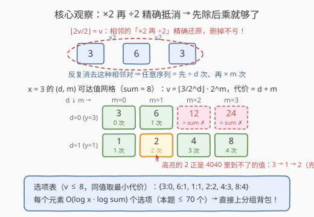
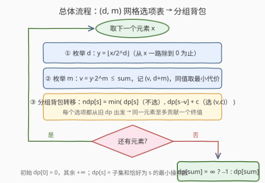

# LeetCode 构造子集和的最少操作次数 II 题解

## 1. 题目概述

- **标题 / 题号**：构造子集和的最少操作次数 II（#4041，hard）
- **链接**：https://leetcode.cn/problems/minimum-operations-to-form-subset-sum-ii/
- **难度**：困难
- **标签**：动态规划、背包问题、位运算

**题意**：给你一个整数数组 $nums$ 和一个整数 $sum$。

一次**操作**中，选择一个当前值为 $x$ 的元素，并将其替换为 $2 \cdot x$ 或 $\lfloor x / 2 \rfloor$。

对于每个元素，**乘法操作和除法操作可以按照任意顺序执行**——这与第 4040 题（乘法必须全部在除法之前）唯一的区别。

返回所需的**最少**操作次数，使得操作后的数组中存在一个**子集**，其元素之和**恰好**等于 $sum$。如果无法做到，则返回 $-1$。

**示例 1**：

```text
输入：nums = [10,2], sum = 13
输出：3
解释：10 → 5（1 次），2 → 4 → 8（2 次），操作后子集 {5, 8} 和为 13。
```

**示例 2**：

```text
输入：nums = [6,3], sum = 8
输出：2
解释：3 → 1（÷2）→ 2（×2），共 2 次；子集 {6, 2} 和为 8。
```

**示例 3**：

```text
输入：nums = [2,2], sum = 7
输出：-1
解释：不存在任何操作序列，使某个子集的元素和等于 7。
```

**约束**：

- $1 \le nums.length \le 100$
- $1 \le nums[i] \le 500$
- $1 \le sum \le 5000$

> 💡 **审题关键**：① 与 4040 的唯一区别是**去掉了「乘法全在除法之前」的顺序约束**——除完还能再乘（如 $3 \to 1 \to 2$），可达值集合变大了；② 但「×2 再 ÷2」**精确抵消**（$\lfloor 2v/2 \rfloor = v$），最优序列仍可归一化成「先除若干次、再乘若干次」；③ 子集结构不变：每个元素要么不选、要么以某个终值入选——还是**分组背包**。注意示例 2 的输入正是 4040 示例 3 中返回 $-1$ 的输入，如今答案变成 $2$。

## 2. 解题思路

### 2.1 暴力思路：直接搜索操作序列

每个元素的操作序列是 ×2 与 ÷2 的**任意混排**，长度没有上界，值域看似会爆炸：除法会丢掉二进制最低位，除完再乘回不去，仿佛能不断制造新值。即便对单个元素 BFS 出全部可达值（值、代价都有界），$n = 100$ 个元素各自选定一个终值再去凑子集，组合规模仍然是天文数字。突破口在于先证明「混排」是**假象**——任意序列都可以无损地压缩成规范形。

### 2.2 核心观察：抵消引理与「先除后乘」网格



**引理（抵消）**：若某元素的操作序列中，一个 ×2 之后（不必相邻）还存在 ÷2，则取**距离最近**的一对 $(×2, ÷2)$：它们中间不可能再夹 ×2（否则取更靠右的 ×2，距离更近），也不可能夹 ÷2（否则取更靠左的 ÷2）——即这对操作**相邻**。而相邻的「先 ×2 再 ÷2」精确还原：

$$\Bigl\lfloor \frac{2v}{2} \Bigr\rfloor = v$$

删去这对操作，终值不变、长度减 $2$。反复删除，直到任何 ×2 都不出现在 ÷2 之前。

**推论**：任何终值 $v$ 的最短操作序列形如「先 ÷ $d$ 次，再 × $m$ 次」：

$$v = \Bigl\lfloor \frac{x}{2^d} \Bigr\rfloor \cdot 2^m, \qquad \text{代价} = d + m$$

其中 $d \le \lfloor \log_2 x \rfloor + 1 \le 9$（$x \le 500$，除到 $0$ 为止），$m$ 枚举到 $v \le sum$ 为止（$\le 13$）。**每个元素只有 $O(\log x \cdot \log sum)$ 个候选**（本题规模实测不超过 $70$ 个），同值取最小代价（如 $x = 4$：$(d{=}0, m{=}0)$ 得 $4$ 代价 $0$，优于 $(d{=}1, m{=}1)$ 的代价 $2$）。

注意抵消方向不能反：$\lfloor v/2 \rfloor \cdot 2 \ne v$（$v$ 为奇数时丢掉最低位的 1）——**除完再乘不是恒等**，它恰恰制造了 4040 中不存在的新可达值（$3 \to 1 \to 2$ 里的 $2$）。

**分组背包建模**（与 4040 完全一致）：组 = 元素，组内选项 = 各可达值 $(v, c)$ 外加代价 $0$ 的「不选」；要求选中值之和**恰好**为 $sum$ 且总代价最小。

> 💡 **一句话总结**：抵消引理把任意混排序列压成「先 ÷ $d$ 次再 × $m$ 次」的 $O(\log^2)$ 网格，可达域看似变大、实际仍然极小——剩下的还是那道分组背包。

### 2.3 算法流程图



| 步骤 | 操作 | 说明 |
|------|------|------|
| ① | 对每个 $x$ 枚举 $(d, m)$ 网格 | $y = \lfloor x/2^d \rfloor$ 从 $x$ 一路除到 $0$；对每个 $y$ 枚举 $v = y \cdot 2^m \le sum$，记代价 $d+m$，同值取最小 |
| ② | 分组背包转移 | $dp[s]$ = 已处理元素中子集和**恰好**为 $s$ 的最小操作数；每组从**旧** $dp$ 转移，保证每组至多选一项 |
| ③ | 初始化与答案 | $dp[0] = 0$，其余 $+\infty$；结束时 $dp[sum]$ 仍为 $\infty$ 则返回 $-1$ |

组内转移（每组从旧 `dp` 出发，避免同组重复选用）：

$$ndp[s] \;=\; \min\Bigl(\, dp[s],\;\; \min_{(v,\,c)\,\in\,\text{选项表}} dp[s-v] + c \Bigr)$$

### 2.4 示例演算

**示例 2**：$nums = [6, 3]$，$sum = 8$——正是 4040 示例 3 中返回 $-1$ 的输入，「除完再乘」如今合法。

先建选项表（只保留 $v \le 8$，同值取最小代价）：

| 元素 | $d{=}0$（$y{=}x$） | $d{=}1$ | $d{=}2$（$y{=}1$） | 合并选项表 $(值{:}代价)$ |
|------|------|------|------|------|
| $6$ | $6{:}0$（$12 > 8$ 截断） | $3{:}1,\ 6{:}2$（$12$ 截断） | $1{:}2,\ 2{:}3,\ 4{:}4,\ 8{:}5$ | $\{6{:}0,\ 3{:}1,\ 1{:}2,\ 2{:}3,\ 4{:}4,\ 8{:}5\}$ |
| $3$ | $3{:}0,\ 6{:}1$（$12$ 截断） | $1{:}1,\ 2{:}2,\ 4{:}3,\ 8{:}4$ | $y = 0$ 停止 | $\{3{:}0,\ 6{:}1,\ 1{:}1,\ 2{:}2,\ 4{:}3,\ 8{:}4\}$ |

背包过程：初始 $dp[0] = 0$。处理完 $6$ 后：$dp[6] = 0,\ dp[3] = 1,\ dp[1] = 2,\ dp[2] = 3,\ dp[4] = 4,\ dp[8] = 5$。处理 $3$ 时取选项 $(2{:}2)$：$dp[8] \leftarrow dp[6] + 2 = 2$，即 **$6$ 不动 + $3 \to 1 \to 2$**，最终答案 $2$。✓

**示例 3**：$nums = [2,2]$，$sum = 7$。$2$ 的选项表为 $\{2{:}0,\ 4{:}1,\ 1{:}1\}$，两个元素能凑出的子集和只有 $\{0,1,2,3,4,5,6,8\}$，$7$ 不可达，返回 $-1$。✓

## 3. 参考代码

### C++

```cpp
class Solution {
  public:
    int minOperations(vector<int>& nums, int sum) {
        const int INF = 0x3f3f3f3f;
        vector<int> dp(sum + 1, INF);
        dp[0] = 0;

        for (int x : nums) {
            // 选项表：值 -> 最小代价。归一化后只需枚举「先除 d 次、再乘 m 次」
            unordered_map<int, int> opts;
            auto add = [&](int v, int c) {
                auto it = opts.find(v);
                if (it == opts.end() || it->second > c) opts[v] = c;
            };
            for (int d = 0, y = x; y >= 1; y /= 2, ++d) {
                long long v = y;
                int m = 0;
                while (v <= sum) {          // 只保留 <= sum 的值
                    add((int)v, d + m);
                    v *= 2;
                    ++m;
                }
            }
            // 分组背包：组内每个选项都从旧 dp 出发，保证每组至多选一个
            vector<int> ndp = dp;
            for (auto& [val, cost] : opts) {
                for (int s = sum; s >= val; --s) {
                    if (dp[s - val] != INF && dp[s - val] + cost < ndp[s]) {
                        ndp[s] = dp[s - val] + cost;
                    }
                }
            }
            dp = move(ndp);
        }
        return dp[sum] >= INF ? -1 : dp[sum];
    }
};
```

### Python

```python
class Solution:
    def minOperations(self, nums: list[int], sum: int) -> int:
        INF = float('inf')
        dp = [INF] * (sum + 1)
        dp[0] = 0

        for x in nums:
            # 选项表：值 -> 最小代价 = min(d + m)，其中 v = (x >> d) << m <= sum
            opts = {}
            y, d = x, 0
            while y:                          # 先除 d 次，除到 0 为止
                v, m = y, 0
                while v <= sum:               # 再乘 m 次，只留 <= sum 的值
                    if opts.get(v, INF) > d + m:
                        opts[v] = d + m
                    v <<= 1
                    m += 1
                y >>= 1
                d += 1

            # 分组背包：每个选项都从旧 dp 转移（每组至多选一个）
            ndp = dp[:]
            for v, c in opts.items():
                cand = [t + c for t in dp[:sum + 1 - v]]
                ndp[v:] = map(min, ndp[v:], cand)   # 切片 + map 加速
            dp = ndp

        return dp[sum] if dp[sum] < INF else -1
```

## 4. 复杂度分析

| 维度 | 复杂度 | 说明 |
|------|--------|------|
| 时间 | $O\bigl(n \cdot \log U \cdot \log sum \cdot sum\bigr)$ | 每个元素生成 $O(\log U \cdot \log sum)$ 个选项（$U = \max nums[i] \le 500$，实测不超过 $70$ 个），每个选项扫一遍容量 $sum$；代入 $n=100,\ sum=5000$ 约 $3.5 \times 10^7$ |
| 空间 | $O(sum)$ | 一维 `dp` 加一份滚动副本 `ndp`；选项表逐元素重建、用完即弃 |

## 5. 扩展：与 4040 对比，顺序约束到底「值多少钱」

- **可达域**：4040 的顺序约束（乘法全在前）使可达值只有**两条纯链**（$x \cdot 2^m$ 与 $\lfloor x/2^j \rfloor$），共 $O(\log)$ 个；4041 允许混排，可达值扩成 **$(d, m)$ 网格** $O(\log^2)$ 个——新值全部来自「除法丢掉低位后再翻倍」。
- **代价**：同一输入 $[6,3],\ sum=8$，4040 返回 $-1$，4041 返回 $2$（$3 \to 1 \to 2$）。顺序约束不是白给的，它直接改变**可达性**。
- **共性套路**：两题的证明完全同源——**先证明任意操作序列可归一化（消去无意义的操作对），再只枚举规范形**。这类「先压缩可达域、再 DP」的思想在操作类最短路问题中反复出现（见下方 991、1553）。
- 顺带一提：把 $2$ 换成任意整数 $k$，$\lfloor kv/k \rfloor = v$ 依然精确成立，抵消引理对「×k 再 ÷k」同样有效——只是枚举范围换成 $\log_k$，套路不变。

## 6. 面试要点

**Q1：怎么证明「任意操作序列可归一化为先除后乘」？**

　　取序列中**距离最近**的一对「×2 在前、÷2 在后」：若中间还夹着 ×2，换成更靠右的那个 ×2 距离更近，矛盾；夹着 ÷2 同理矛盾。故这对必然相邻，而 $\lfloor 2v/2 \rfloor = v$ 精确还原，删去后终值不变、长度减 $2$。对序列长度归纳，最终得到「所有 ÷2 在前、所有 ×2 在后」的规范形，且长度不增。

**Q2：为什么「除完再乘」不是恒等，抵消方向不能反？**

　　$\lfloor v/2 \rfloor \cdot 2$ 在 $v$ 为奇数时丢掉二进制最低位的 1（$3 \to 1 \to 2 \ne 3$），所以「÷2 再 ×2」**不可**抵消——它恰恰制造了 4040 中不存在的新可达值。抵消只对「×2 在前、÷2 在后」成立：$2v$ 必为偶数，除回来不丢信息。

**Q3：与 4040 相比，选项表从「两条链」变成「一个网格」，规模失控了吗？**

　　渐进从 $O(\log)$ 涨到 $O(\log^2)$，但量级仍极小（$x \le 500,\ sum \le 5000$ 时不超过 $70$ 项）。真正不可缺的是**值 $> sum$ 的剪枝**：所有元素为正，子集里超容量的值必然不被选中，没有这个截断，$m$ 的枚举无上界，网格就不再是有限表。

**Q4：为什么每组必须从同一份旧 dp 转移？**

　　分组背包每组（元素）至多选一个选项。若组内直接原地更新 `dp`，选项 A 的结果会被选项 B 接着使用，等于同一元素被「选了两次」。先拷贝 `ndp = dp`，所有选项从旧 `dp` 读、往 `ndp` 写，组处理完再整体替换。

**Q5：dp 为什么初始化为 dp[0]=0、其余 +∞？什么时候返回 -1？**

　　本题是「恰好装满」型背包：只有空子集（和为 0）免费合法，其余状态必须由合法转移逐步填出；不可达状态保持 $+\infty$ 以阻断非法转移。处理完全部元素后 $dp[sum]$ 仍为 $\infty$，说明凑不出，返回 $-1$。

## 同类练习题

| # | 题目 | 与本题的关联 |
|---|------|-------------|
| 4040 | [构造子集和的最少操作次数 I](https://leetcode.cn/problems/minimum-operations-to-form-subset-sum-i/) | 本题的顺序约束版，可达值从 $(d, m)$ 网格退化为两条纯链，建议先做再对比两版差异。 |
| 991 | [坏了的计算器](https://leetcode.cn/problems/broken-calculator/) | ×2 与 −1 的最短操作序列，同样靠「倒序归一化/消去无意义操作对」求解，与抵消引理同源。 |
| 1553 | [吃掉 N 个橘子的最少天数](https://leetcode.cn/problems/minimum-number-of-days-to-eat-n-oranges/) | ÷2、÷3、−1 操作下的可达值搜索（记忆化 BFS），对比本题「先归一化再枚举」的思路。 |
| 397 | [整数替换](https://leetcode.cn/problems/integer-replacement/) | ÷2 类操作的最短路问题，位运算与 BFS/记忆化的经典练习。 |
| 879 | [盈利计划](https://leetcode.cn/problems/profitable-schemes/) | 多维「恰好装满」背包的另一种形态，巩固分组/多维背包的转移写法。 |
