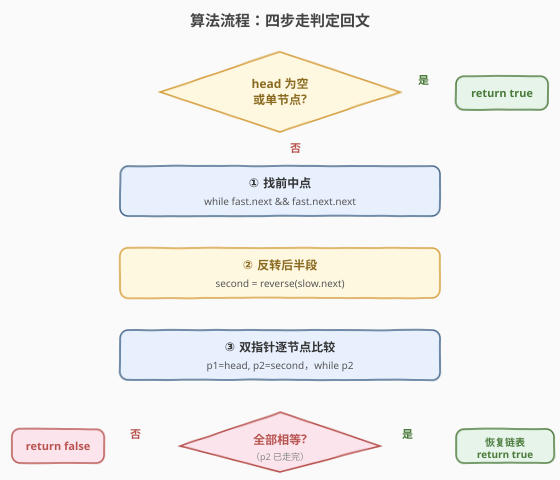
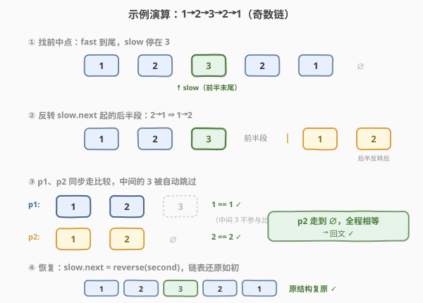

# 回文链表

- **题目名称**：回文链表
- **链接**：[234. 回文链表](https://leetcode.cn/problems/palindrome-linked-list/)
- **难度**：简单
- **标签**：链表、双指针、快慢指针

## 1. 题目概述

给你单链表的头节点 `head`，判断该链表是否为**回文链表**（正着读和反着读序列相同）。

**示例 1**：

```text
输入：head = [1,2,2,1]
输出：true
解释：正序 1→2→2→1，反序 1→2→2→1，二者相同。
```

**示例 2**：

```text
输入：head = [1,2,3,4,3,2,1]
输出：true
解释：正反序均为 1→2→3→4→3→2→1。
```

**示例 3**：

```text
输入：head = [1,2]
输出：false
```

**约束条件**：

- 链表中节点数目范围 `[0, 10^5]`
- `0 <= Node.val <= 9`

**进阶要求**：你能否用 $O(n)$ 时间和 $O(1)$ 额外空间解决？

> 💡 这是一道把前面学过的两个原子操作「拼装」成一道题的经典面试题——[快慢指针找中点（876）](876_链表的中间结点.md) + [反转链表（206）](206_反转链表.md)。组合后能得到 $O(n)$ 时间、$O(1)$ 空间的最优解，是面试官最爱追问的"能不能不要额外空间"的样板题。

---

## 2. 解题思路

### 2.1 暴力思路：复制到数组再双指针

链表不支持随机访问、也不能从尾部往回走，最直觉的做法是**把所有值复制到数组**，再用左右双指针向中间夹逼比较。

```text
vals = []
for p in head..end: vals.append(p.val)
l, r = 0, len(vals)-1
while l < r:
    if vals[l] != vals[r]: return False
    l += 1; r -= 1
return True
```

- 时间 $O(n)$，空间 $O(n)$（要开一个长度为 $n$ 的数组）。

能 AC，但**违反进阶要求（$O(1)$ 空间）**。它的本质问题是：链表"只能单向走"的特性让我们不得不用额外空间来"反着读"。如果能**在链表上直接把后半段反过来**，就能省掉数组。

> ⚠️ 暴力法把链表的"顺序值"搬进了数组，相当于用 $O(n)$ 空间换取了"双向访问"的能力。最优解的思路是：与其搬数据，不如**就地反转后半段链表**，让指针自己会"倒着走"。

### 2.2 核心观察：找中点 → 反转后半 → 双指针比较


三步组合，每一步都是已学过的原子操作：

1. **找中点**：快慢双指针 `slow` 走 1 步、`fast` 走 2 步。为了让前半段在奇偶两种长度下都"够用"，这里用**取前中点**的循环条件 `while fast.next and fast.next.next`（与 [876](876_链表的中间结点.md) 默认取后中点不同，详见第 5 节扩展）。
2. **反转后半段**：从 `slow.next` 开始，套用 [206](206_反转链表.md) 的三指针迭代法把后半段原地掉头。
3. **双指针比较**：`p1` 从 `head` 出发、`p2` 从反转后的后半段头出发，逐个比对 `val`，全部相等即为回文。

> 💡 **为什么"取前中点"？** 取前中点让 `slow` 停在"前半段最后一个节点"，于是 `slow.next` 恰好是后半段的起点。这样反转和比较的边界最干净：前半段长度 $\lceil n/2 \rceil$、后半段长度 $\lfloor n/2 \rfloor$。比较时只走后半段（较短的那段），奇数链正中间的节点自动被跳过——它本就和自身对称，无需比较。

**奇偶两种情形对比**：

| 链表长度 | `slow` 停在 | 前半段 | 反转后的后半段 | 比较结果 |
|---------|------------|--------|--------------|----------|
| **偶数**（如 `1→2→2→1`） | 第 2 个节点（值 2） | `1→2` | `1→2` | 长度相等，逐个比 |
| **奇数**（如 `1→2→3→2→1`） | 第 3 个节点（值 3，正中） | `1→2→3` | `1→2` | 后半段较短，中间的 3 被跳过 |

> ⚠️ 奇数链的正中间节点无论是什么值都不影响回文判定（它对称于自身），所以比较时**让 `p2` 走完后半段即可停**，不必处理中间节点——这是"取前中点 + 比较较短半段"带来的简洁。

### 2.3 算法流程图



**完整步骤**：

1. **边界**：`head` 为空或只有一个节点，直接返回 `true`。
2. **找前半段末尾**：`slow = fast = head`，循环 `while fast.next and fast.next.next`，每轮 `slow` 走 1 步、`fast` 走 2 步。结束时 `slow` 在前半段最后一个节点。
3. **反转后半段**：`second = reverse(slow.next)`，返回后半段反转后的新头。
4. **比较**：`p1 = head`，`p2 = second`；只要 `p2` 非空就比较 `p1.val` 与 `p2.val`，不等立即返回 `false`，各自前进一步。
5. **（可选）恢复链表**：`slow.next = reverse(second)` 把后半段反转回去，保持原链表结构。
6. **返回** `true`。

> 💡 第 5 步"恢复"不是题目要求，但面试中常被追问"能不能不破坏原链表"。花 $O(n)$ 再反转一次即可复原，空间仍为 $O(1)$，是无副作用的好习惯。

### 2.4 示例演算

以 `1→2→3→2→1`（奇数链）为例，追踪三步执行过程：



| 步骤 | 操作 | 链表状态 | 说明 |
|------|------|---------|------|
| ① 找中点 | `slow` 走到值 3 | `1→2→[3]→2→1` | `fast` 走到末尾 1，`slow` 停在前半段末尾 |
| ② 反转后半 | `reverse(slow.next)` | `1→2→3` 与 `1→2`（后半段反转后） | `3→2→1` 反转成 `1→2`，新头为原尾节点 1 |
| ③ 比较 | `p1` 从头、`p2` 从新头同步走 | `p1:1==p2:1` ✓ → `p1:2==p2:2` ✓ | `p2` 走到 `null` 退出，全程相等 |
| ④ 恢复 | `reverse(second)` 接回 `slow.next` | `1→2→3→2→1` | 链表还原如初 |

比较阶段 `p2` 只走了 2 步（后半段长度 2），正中间的 3 自动跳过。最终返回 `true` ✓。

偶数链 `1→2→2→1` 同理：`slow` 停在第 2 个节点（值 2），后半段 `2→1` 反转成 `1→2`，两段长度相等逐个比较，返回 `true`。

---

## 3. 参考代码

### C++（$O(n)$ / $O(1)$，含恢复）

```cpp
/**
 * Definition for singly-linked list.
 * struct ListNode {
 *     int val;
 *     ListNode *next;
 *     ListNode() : val(0), next(nullptr) {}
 *     ListNode(int x) : val(x), next(nullptr) {}
 *     ListNode(int x, ListNode *next) : val(x), next(next) {}
 * };
 */
class Solution {
  public:
    bool isPalindrome(ListNode* head) {
        if (head == nullptr || head->next == nullptr) return true;

        // ① 快慢指针找前半段末尾（取前中点）
        ListNode* slow = head;
        ListNode* fast = head;
        while (fast->next != nullptr && fast->next->next != nullptr) {
            slow = slow->next;
            fast = fast->next->next;
        }

        // ② 反转后半段
        ListNode* second = reverseList(slow->next);

        // ③ 双指针比较
        ListNode* p1 = head;
        ListNode* p2 = second;
        bool result = true;
        while (p2 != nullptr) {            // 只走较短的后半段
            if (p1->val != p2->val) {
                result = false;
                break;
            }
            p1 = p1->next;
            p2 = p2->next;
        }

        // ④ 可选：恢复链表
        slow->next = reverseList(second);
        return result;
    }

  private:
    ListNode* reverseList(ListNode* head) {
        ListNode* prev = nullptr;
        ListNode* curr = head;
        while (curr != nullptr) {
            ListNode* next = curr->next;
            curr->next = prev;
            prev = curr;
            curr = next;
        }
        return prev;
    }
};
```

### Python

```python
# Definition for singly-linked list.
# class ListNode:
#     def __init__(self, val=0, next=None):
#         self.val = val
#         self.next = next
class Solution:
    def isPalindrome(self, head: Optional[ListNode]) -> bool:
        if not head or not head.next:
            return True

        # ① 快慢指针找前半段末尾（取前中点）
        slow = fast = head
        while fast.next and fast.next.next:
            slow = slow.next
            fast = fast.next.next

        # ② 反转后半段
        second = self._reverse(slow.next)

        # ③ 双指针比较
        p1, p2 = head, second
        result = True
        while p2:                            # 只走较短的后半段
            if p1.val != p2.val:
                result = False
                break
            p1, p2 = p1.next, p2.next

        # ④ 可选：恢复链表
        slow.next = self._reverse(second)
        return result

    def _reverse(self, head: Optional[ListNode]) -> Optional[ListNode]:
        prev, curr = None, head
        while curr:
            nxt = curr.next
            curr.next = prev
            prev = curr
            curr = nxt
        return prev
```

> 💡 比较循环用 `while p2`（后半段指针）而非 `while p1`：后半段总是较短或相等的那一段，用它做循环条件能自动跳过奇数链的正中间节点，省去额外的奇偶判断。`reverseList` 完全复用 [206. 反转链表](206_反转链表.md) 的三指针模板，本题只是"调用"它两次。

---

## 4. 复杂度分析

| 维度 | 复杂度 | 说明 |
|------|--------|------|
| **时间复杂度** | $O(n)$ | 找中点遍历一半 $O(n)$；反转后半段 $O(n)$；比较 $O(n)$；恢复 $O(n)$，总和仍为线性 |
| **空间复杂度** | $O(1)$ | 只用 `slow`/`fast`/`prev`/`curr`/`p1`/`p2` 等常数个指针，无递归栈、无数组 |

> ⚠️ 时间虽是 4 段遍历，但每段都是线性，总常数因子约 $2n$，仍是 $O(n)$。若省略第 ④ 步恢复则约 $1.5n$，更快但会破坏原链表——按需取舍。

---

## 5. 扩展：取前中点 vs 取后中点

本题循环条件用的是 `while fast.next and fast.next.next`（**取前中点**），而 [876. 链表的中间结点](876_链表的中间结点.md) 默认用 `while fast and fast.next`（**取后中点**）。二者只差一步，效果却不同：

| 循环条件 | 偶数链 `slow` 停在 | 用途 |
|---------|-------------------|------|
| `fast && fast.next` | 后中点（右半段起点） | 876 题目要求返回第二个中点 |
| `fast.next && fast.next.next` | 前中点（前半段末尾） | 本题需要 `slow.next` 作后半段起点 |

```python
# 取前中点（本题用法）：让 fast 早一轮停止，slow 少走一步
slow = fast = head
while fast.next and fast.next.next:
    slow = slow.next
    fast = fast.next.next
```

> 💡 口诀：**取后中点用 `fast && fast.next`，取前中点用 `fast.next && fast.next.next`**。链表归并排序（[148. 排序链表](https://leetcode.cn/problems/sort-list/)）切分两半时也要取前中点，保证左半段不比右半段长，否则切分不均会死循环。

---

## 6. 面试要点

1. **为什么要"取前中点"而不是"取后中点"？**

   - 取前中点让 `slow` 停在前半段最后一个节点，`slow.next` 恰好是后半段起点，反转和接回的边界最干净。若取后中点，偶数链时 `slow` 会落到右半段起点，前半段末尾丢失，还得额外记录前驱指针，徒增边界处理。

2. **奇数链正中间的节点需要比较吗？**

   - 不需要。正中间节点对称于自身，无论取何值都不影响回文判定。比较循环用 `while p2`（后半段较短）控制，`p2` 走完后半段即停，中间节点被自动跳过——这是"取前中点 + 比较短半段"的精妙之处。

3. **为什么要恢复链表？不恢复会怎样？**

   - 题目不强制恢复，但反转后半段**破坏了原链表结构**。若调用方之后还要用这条链表，就会拿到错误的结构。面试中主动加一句"需要的话我可以再反转一次恢复原状"，体现工程素养，且仍保持 $O(1)$ 空间。

4. **能不能用递归做？空间复杂度是多少？**

   - 可以：递归走到链尾，回溯时用一个外部指针从头同步前进，逐个比较。但递归深度为 $n$，空间 $O(n)$，且长链表（$10^5$）会栈溢出。它只是思路展示，不满足进阶的 $O(1)$ 空间要求。

5. **本题和 [876](876_链表的中间结点.md)、[206](206_反转链表.md) 的关系？**

   - 本题是这两道"原子题"的**组合应用**：快慢指针找中点（876 的取前中点变体）+ 三指针反转（206 的迭代模板）。掌握原子操作后，本题只是把它们串起来加边界处理——这正是面试考察"能否把已学模板迁移到新场景"的典型方式。

> 💡 **一句话总结**：234 回文链表 = 取前中点的快慢指针（876 变体）+ 三指针反转后半段（206）+ 双指针逐节点比较。三段都是 $O(n)$、$O(1)$，拼出满足进阶要求的最优解。面试默写时记住循环条件用 `fast.next && fast.next.next`、比较用 `while p2` 自动跳过中点。

---

## 7. 同类练习题

- [876. 链表的中间结点](https://leetcode.cn/problems/middle-of-the-linked-list/)（[题解](876_链表的中间结点.md)）：快慢指针找中点的原版，本题取前中点的来源
- [206. 反转链表](https://leetcode.cn/problems/reverse-linked-list/)（[题解](206_反转链表.md)）：三指针反转模板，本题后半段反转直接复用
- [143. 重排链表](https://leetcode.cn/problems/reorder-list/)（[题解](../medium/143_重排链表.md)）：同样"找中点 + 反转后半 + 合并"三件套，本题是它的简化版
- [148. 排序链表](https://leetcode.cn/problems/sort-list/)（[题解](../medium/148_排序链表.md)）：归并切分也要取前中点，体会循环条件的差异
- [2130. 链表最大孪生和](https://leetcode.cn/problems/maximum-twin-sum-of-a-linked-list/)：找中点 + 反转后半 + 配对比较，几乎相同的套路换问法
