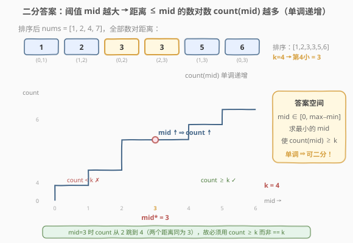
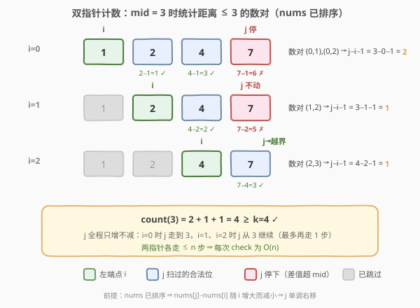
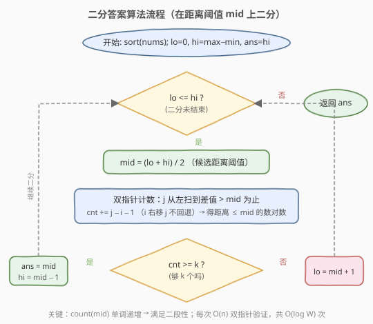

# 找出第 K 小的数对距离

- **题目名称**：找出第 K 小的数对距离
- **链接**：[719. 找出第 K 小的数对距离](https://leetcode.cn/problems/find-k-th-smallest-pair-distance/)
- **难度**：困难
- **标签**：数组、二分查找、双指针、排序

## 1. 题目概述

给定一个整数数组 `nums`，定义数对距离为 $|a - b|$。在所有 $\binom{n}{2}$ 个数对 `(nums[i], nums[j])`（$i < j$）的距离中，返回**第 k 小**的距离（k 从 1 开始）。

**示例 1**：

```text
输入：nums = [1,3,1], k = 1
输出：0
解释：三个数对的距离为 |1−3|=2、|1−1|=0、|3−1|=2，排序后 [0,2,2]，第 1 小为 0。
```

**示例 2**：

```text
输入：nums = [1,1,1], k = 2
输出：0
解释：所有数对距离均为 0，第 2 小仍为 0。
```

**约束条件**：

- $2 \le n \le 10^4$
- $0 \le \text{nums}[i] \le 10^6$
- $1 \le k \le \dfrac{n(n-1)}{2}$

---

## 2. 解题思路

### 2.1 暴力思路

最直接的做法是**枚举所有数对**求距离，排序后取第 k 个。数对共 $\binom{n}{2} \approx 5 \times 10^7$ 个（$n = 10^4$），存储和排序都需要 $O(n^2)$ 时间和空间，必然超时（MLE/TLE）。

换个角度：答案（第 k 小的距离）一定落在 $[0,\ \max - \min]$ 之间。能否**不枚举数对，而是枚举距离**？对每个候选距离 `mid`，只需统计「距离 $\le \text{mid}$ 的数对有多少个」。若从 0 到 $\max - \min$ 逐个试，每次统计 $O(n^2)$，整体依然超时。

> 💡 **关键转化**：把「求第 k 小的值」变成「求最小的 `mid`，使距离 $\le \text{mid}$ 的数对数 $\ge k$」——这是**二分答案**的标准信号。

### 2.2 核心观察：二分答案 + 双指针计数



注意到「距离 $\le \text{mid}$ 的数对数 `count(mid)`」关于 `mid` **单调递增**：

- `mid` 越大（阈值越宽），满足条件的数对越多。
- `mid = 0` 时只有相等的数对算入；`mid = max - min` 时所有数对都算入，`count = n(n-1)/2`。

于是存在一个**分界点** `mid*`：

```text
mid < mid* → count(mid) < k    (不够 k 个，阈值太小)
mid >= mid* → count(mid) >= k  (够 k 个，阈值够大)
```

这正是二分查找所需的**二段性**。在 $[0,\ \max-\min]$ 上二分，每次 $O(n)$ 统计 `count(mid)`，可行则去左半找更小的，不可行则去右半放宽。

> 💡 **识别信号**：题目求「第 k 小/大」且能高效统计「$\le$ 某值的元素个数」→ 想「二分答案」。本题与 [分割数组的最大值](410_分割数组的最大值.md)、[爱吃香蕉的珂珂](../medium/875_爱吃香蕉的珂珂.md) 同骨架，只是 `check()` 换成了「双指针数对计数」。

> ⚠️ **为什么 `count(mid) >= k` 就算可行？** 因为我们找的是「使计数达到 k 的**最小**阈值」。`count >= k` 说明第 k 小的距离 $\le \text{mid}$，可以尝试更小；`count < k` 说明第 k 小的距离 $> \text{mid}$，必须放大阈值。

### 2.3 双指针计数：O(n) 统计数对



**先排序**。排好序后，对每个左端点 `i`，满足 `nums[j] - nums[i] <= mid` 的 `j` 是一个**右端连续区间** `[i+1, r]`。且随着 `i` 右移，`r` 也只增不减（因为 `nums[i]` 变大，差值变小，能容纳更多 `j`）。于是可用**滑动窗口式双指针**在 $O(n)$ 内统计：

```text
j = 0, count = 0
for i in range(n):
    while j < n and nums[j] - nums[i] <= mid:
        j += 1              # j 右移直到差值超过 mid
    count += j - i - 1      # (i, i+1) ... (i, j-1) 共 j-i-1 个数对
```

> ⚠️ **为什么不重置 `j`？** 排序后 `nums` 单调递增。`i` 变大时 `nums[i]` 增大，`nums[j] - nums[i]` 只会变小，所以上一轮的 `j` 位置对当前 `i` 仍然合法，`j` 只需继续向右。这正是双指针 $O(n)$ 而非 $O(n^2)$ 的关键。

### 2.4 算法流程图



注意判定为「可行」时**先记录 `ans = mid` 再收缩右界**（`hi = mid - 1`），保证最终保留的是「最小的可行阈值」。

### 2.5 示例演算

![示例演算：nums = [1,2,4,7], k = 4](images/ktpd_example_walkthrough.svg)

以 `nums = [1,2,4,7]`、`k = 4` 为例。排序后数对距离为 `[1,2,3,3,5,6]`，第 4 小为 3。在 `[0, 6]` 上二分：

- **第 1 轮** `[0,6]`，`mid=3`，双指针计数：`i=0` 得 `(0,1),(0,2)` 共 2 个；`i=1` 得 `(1,2)` 1 个；`i=2` 得 `(2,3)` 1 个；`i=3` 得 0 个。`count=4 ≥ 4` ✓ → 可行，记 `ans=3`，去左半 `[0,2]`。
- **第 2 轮** `[0,2]`，`mid=1`，计数：`i=0` 得 `(0,1)` 1 个；其余 0。`count=1 < 4` ✗ → `lo=2`。
- **第 3 轮** `[2,2]`，`mid=2`，计数：`i=0` 得 1 个；`i=1` 得 `(1,2)` 1 个；其余 0。`count=2 < 4` ✗ → `lo=3`。
- **第 4 轮** `lo=3 > hi=2`，循环结束，返回 `ans=3`。

> 💡 观察第 1 轮：`mid=3` 时 `count` 恰好等于 `k=4`，但答案仍可能是更小的值——只有当更小的 `mid` 的 `count` 仍 $\ge k$ 时才能更新。第 2、3 轮证明 `mid < 3` 时 `count < 4`，故 3 就是分界点。

---

## 3. 参考代码

### 方法一：二分答案 + 双指针计数（推荐）

### C++

```cpp
class Solution {
  public:
    int smallestDistancePair(vector<int>& nums, int k) {
        sort(nums.begin(), nums.end());
        int n = nums.size();
        int lo = 0, hi = nums[n - 1] - nums[0];
        int ans = hi;
        while (lo <= hi) {
            int mid = lo + (hi - lo) / 2;
            // 双指针统计距离 <= mid 的数对数
            int cnt = 0, j = 0;
            for (int i = 0; i < n; ++i) {
                while (j < n && nums[j] - nums[i] <= mid) j++;
                cnt += j - i - 1;
            }
            if (cnt >= k) {
                ans = mid;        // 可行，尝试更小
                hi = mid - 1;
            } else {
                lo = mid + 1;     // 不够 k 个，放大阈值
            }
        }
        return ans;
    }
};
```

### Python

```python
class Solution:
    def smallestDistancePair(self, nums: List[int], k: int) -> int:
        nums.sort()
        n = len(nums)
        lo, hi = 0, nums[-1] - nums[0]
        ans = hi
        while lo <= hi:
            mid = (lo + hi) // 2
            # 双指针统计距离 <= mid 的数对数
            cnt, j = 0, 0
            for i in range(n):
                while j < n and nums[j] - nums[i] <= mid:
                    j += 1
                cnt += j - i - 1
            if cnt >= k:
                ans = mid         # 可行，尝试更小
                hi = mid - 1
            else:
                lo = mid + 1      # 不够 k 个，放大阈值
        return ans
```

> ⚠️ **三个易错点**：
> 1. **必须先排序**：双指针计数的单调性（`j` 只增不减）依赖 `nums` 有序，否则 `j` 不能只增不减。
> 2. **计数公式 `j - i - 1`**：`j` 停在第一个差值超过 `mid` 的位置（或越界），故合法数对为 `(i, i+1) … (i, j-1)`，共 `j - i - 1` 个。由于 `nums[i] - nums[i] = 0 ≤ mid`（`mid ≥ 0`），`j` 至少为 `i+1`，计数恒非负。
> 3. **判定用 `cnt >= k` 而非 `==`**：可能有多个数对距离相同（如距离 3 出现两次），`count` 会跳跃式增长。只要 `count ≥ k`，第 k 小就 $\le \text{mid}$，用 `>=` 才不会漏掉平台期。

---

## 4. 复杂度分析

| 维度 | 复杂度 | 说明 |
|------|--------|------|
| 时间复杂度 | $O(n \log n + n \log W)$ | 排序 $O(n \log n)$ + 二分 $O(\log W)$ 次每次双指针 $O(n)$，$W = \max - \min \le 10^6$ |
| 空间复杂度 | $O(\log n)$ | 排序的递归栈空间（C++ `std::sort`），不计输出 |

> ⚠️ 本题 $n = 10^4$、$W \le 10^6$，二分约 $\log_2 10^6 \approx 20$ 次，每次 $O(n) = 10^4$，总计 $\approx 2 \times 10^5$ 次比较，远快于暴力的 $O(n^2) \approx 10^8$。**面试首选二分答案 + 双指针**。

---

## 5. 扩展：二分第 k 小的通用框架

本题是「**二分答案求第 k 小**」的经典范式。更一般地，当题目满足：

1. 答案落在已知的连续/离散区间 $[L, R]$ 上；
2. 存在高效的 `count(x)` 统计「$\le x$ 的元素个数」，且 `count` 关于 `x` 单调；
3. 求「第 k 小/大」或「最小的最大值/最大的最小值」。

即可套用：找最小的 $x$ 使 $\text{count}(x) \ge k$。不同题目的差异只在 `count()` 的实现：本题用**排序 + 双指针**，[410. 分割数组的最大值](410_分割数组的最大值.md) 用**贪心划段**，[378. 有序矩阵中第 K 小元素](https://leetcode.cn/problems/kth-smallest-element-in-a-sorted-matrix/) 用**矩阵双指针**。

---

## 6. 面试要点

1. **为什么能二分？二段性体现在哪？**

   - `count(mid)`（距离 $\le \text{mid}$ 的数对数）随 `mid` 单调递增。存在分界点 `mid*`，使 `mid < mid*` 时 `count < k`（不合法）、`mid >= mid*` 时 `count >= k`（合法）。这种「左不合法 / 右合法」的结构就是二段性，可用二分定位 `mid*`。

2. **双指针计数为什么是 O(n)？为什么不重置 j？**

   - 排序后 `nums` 单调递增。`i` 右移时 `nums[i]` 增大，`nums[j] - nums[i]` 减小，上一轮的 `j` 对当前 `i` 仍合法，`j` 只需继续右移。两个指针各自至多走 `n` 步，总计 $O(n)$。若每轮重置 `j` 则退化成 $O(n^2)$。

3. **计数公式 `j - i - 1` 怎么来的？会出错吗？**

   - `while` 循环后 `j` 停在第一个使 `nums[j] - nums[i] > mid` 的位置（或 `j == n`）。合法数对是 `(i, i+1) … (i, j-1)`，共 `j - 1 - i = j - i - 1` 个。由于 `nums[i] - nums[i] = 0 \le \text{mid}`（`mid \ge 0`），`j` 至少为 `i+1`，故计数恒非负。

4. **判定条件为什么是 `cnt >= k` 而不是 `==`？**

   - 数对距离可能有重复值（如多个距离同为 3），`count` 会跳跃式增长，`count == k` 可能永远不成立。我们求的是「使计数首次达到 k 的最小阈值」，只要 `count \ge k` 就说明第 k 小 $\le \text{mid}$，应继续向左找更小。用 `>=` 才能正确处理平台期。

5. **如果不排序会怎样？能用二分吗？**

   - 双指针计数的单调性（`j` 只增不减）完全依赖 `nums` 有序；不排序则 `j` 必须每轮重置，退化为 $O(n^2)$ 验证，整体 $O(n^2 \log W)$ 仍可能超时。排序是 $O(n \log n)$，相对 $O(n \log W)$ 的二分部分代价可忽略。

---

## 7. 同类练习题

- [410. 分割数组的最大值](https://leetcode.cn/problems/split-array-largest-sum/)：同骨架二分答案，`check` 换成贪心划段数
- [875. 爱吃香蕉的珂珂](https://leetcode.cn/problems/koko-eating-bananas/)：二分吃速，`check` 用向上取整求和
- [378. 有序矩阵中第 K 小的元素](https://leetcode.cn/problems/kth-smallest-element-in-a-sorted-matrix/)：二分值域，`check` 用矩阵双指针从左下角计数
- [668. 乘法表中第 K 小的数](https://leetcode.cn/problems/kth-smallest-number-in-multiplication-table/)：二分值域，`check` 统计乘法表中小于等于该值的个数
- [1011. 在 D 天内送达包裹的能力](https://leetcode.cn/problems/capacity-to-ship-packages-within-d-days/)：二分运载能力，`check` 贪心按天装货
