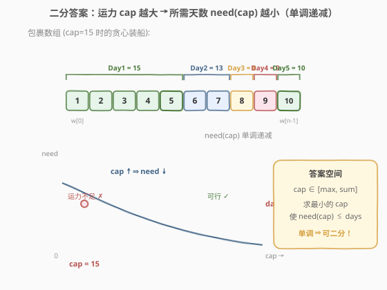
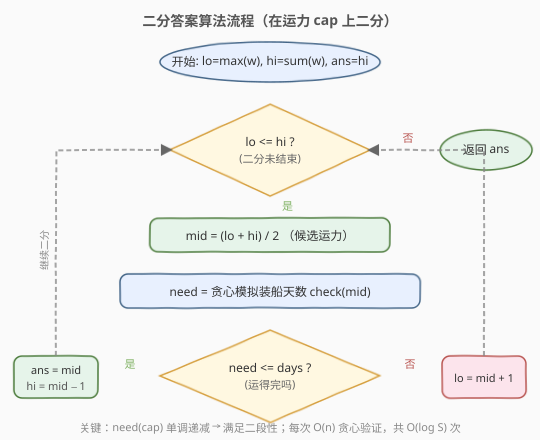

# 在 D 天内送达包裹的能力

- **题目名称**：在 D 天内送达包裹的能力
- **链接**：[1011. 在 D 天内送达包裹的能力](https://leetcode.cn/problems/capacity-to-ship-packages-within-d-days/)
- **难度**：中等
- **标签**：数组、二分查找、贪心

## 1. 题目概述

传送带上的包裹必须在 `days` 天内从港口运送到目的地。第 `i` 个包裹的重量为 `weights[i]`。每一天按 `weights` 的顺序往船上装载包裹，**装载的重量不能超过船的最大运载能力**；一旦加入下一个包裹会超载，就必须等到第二天再装。注意**不能打乱包裹顺序**，也不能在同一天装载跨日的包裹。

返回能在 `days` 天内将所有包裹送达的船的**最低运载能力**。

**示例 1**：

```text
输入：weights = [1,2,3,4,5,6,7,8,9,10], days = 5
输出：15
解释：船舶最低载重 15 时的装船方案：
     第 1 天：1+2+3+4+5 = 15
     第 2 天：6+7       = 13
     第 3 天：8         = 8
     第 4 天：9         = 9
     第 5 天：10        = 10
     载重 14 时至少需要 6 天，来不及。
```

**示例 2**：

```text
输入：weights = [3,2,2,4,1,4], days = 3
输出：6
解释：载重 6 时：第 1 天 [3,2]=5、第 2 天 [2,4]=6、第 3 天 [1,4]=5，恰好 3 天。
```

**示例 3**：

```text
输入：weights = [1,2,3,1,1], days = 4
输出：3
```

**约束条件**：

- `1 <= days <= weights.length <= 5 * 10^4`
- `1 <= weights[i] <= 500`

---

## 2. 解题思路

### 2.1 暴力思路

运载能力 `cap` 的取值范围是 `[max(weights), sum(weights)]`：

- 下界 `max(weights)`：船至少要能装下最重的那个包裹，否则永远运不走。
- 上界 `sum(weights)`：一天把所有包裹运完，必然可行（`days >= 1`）。

从 `cap = max(weights)` 开始逐个尝试，对每个 `cap` 用贪心模拟装船求所需天数 `need(cap)`，第一个满足 `need(cap) <= days` 的 `cap` 即为答案。验证单个 `cap` 是 `O(n)`，整体 `O(n * (sum - max))`，而 `sum` 可达 `2.5 * 10^7`，必然超时。

### 2.2 核心观察：二分答案



关键直觉是：**所需天数 `need(cap)` 关于运载能力 `cap` 单调递减**。

- `cap` 越大，每天能装越多，需要的总天数越少。
- `cap = max(weights)` 时最慢（最坏一天只运一个，`need = n`）；`cap = sum(weights)` 时最快，一天运完，`need = 1 <= days`，必然可行。

于是存在一个**分界点** `cap*`：

```text
cap < cap* → need(cap) > days   (运力不足，运不完)
cap >= cap* → need(cap) <= days  (可行，运得完)
```

这正是二分查找所需的**二段性**。把「求最小可行 `cap`」转化为：在有序区间 `[max(weights), sum(weights)]` 上二分，每次 `O(n)` 贪心验证 `mid` 是否可行，可行则去左半找更小的，不可行则去右半加大运力。

> 💡 **识别信号**：题目求「最小的最大 / 最大的最小 / 最小的满足某单调条件值」，且能 `O(n)` 验证某个候选值是否合法 → 想「二分答案」。这是与「在有序数组里二分找下标」不同的另一类二分：**二分的是答案本身**。和 [875. 爱吃香蕉的珂珂](./875_爱吃香蕉的珂珂.md) 是同一套模板，只是 `check()` 从「向上取整求和」换成了「贪心装船」。

> ⚠️ **下界取 `max(weights)` 而非 `1`**：每个包裹必须整体装船，运力小于任一包裹重量时该包裹永远运不走，故下界必为 `max(weights)`。取更小的下界会让 `check()` 永远不可行而浪费二分。上界取 `sum(weights)` 即可，无需取 `500 * n` 这种更松的值。

### 2.3 算法流程图



注意判定为「可行」时**先记录 `ans = mid` 再收缩右界**（`hi = mid - 1`），保证最终保留的是「最小的可行值」。

### 2.4 示例演算

![示例演算：weights = [1,2,3,4,5,6,7,8,9,10], days = 5](images/ship_example_walkthrough.svg)

以 `weights = [1,2,3,4,5,6,7,8,9,10]`、`days = 5` 为例，`max=10`、`sum=55`，答案区间 `[10, 55]`：

- **第 1 轮** `[10,55]`，`mid=32`，`need=2`（第 1 天 `[1..7]=28`、第 2 天 `[8,9,10]=27`）`≤ 5` ✓ → 可行，记 `ans=32`，去左半 `[10,31]`。
- **第 2 轮** `[10,31]`，`mid=20`，`need=4`（`[1..5]=15`、`[6,7]=13`、`[8,9]=17`、`[10]=10`）`≤ 5` ✓ → 可行，记 `ans=20`，去左半 `[10,19]`。
- **第 3 轮** `[10,19]`，`mid=14`，`need=6`（`[1..4]=10`、`[5,6]=11`、`[7]`、`[8]`、`[9]`、`[10]`）`> 5` ✗ → 运力不足，去右半 `[15,19]`。
- **第 4 轮** `[15,19]`，`mid=17`，`need=4`（`[1..5]=15`、`[6,7]=13`、`[8,9]=17`、`[10]=10`）`≤ 5` ✓ → 可行，记 `ans=17`，去左半 `[15,16]`。
- **第 5 轮** `[15,16]`，`mid=15`，`need=5`（`[1..5]=15`、`[6,7]=13`、`[8]`、`[9]`、`[10]`）`≤ 5` ✓ → 可行，记 `ans=15`，`hi=14`。
- **第 6 轮** `lo=15 > hi=14`，循环结束，返回 `ans=15`。

---

## 3. 参考代码

### C++

```cpp
class Solution {
  public:
    int shipWithinDays(vector<int>& weights, int days) {
        int lo = *max_element(weights.begin(), weights.end());
        int hi = accumulate(weights.begin(), weights.end(), 0);
        int ans = hi;

        while (lo <= hi) {
            int mid = lo + (hi - lo) / 2;
            if (canShip(weights, mid, days)) {
                ans = mid;       // 可行，尝试更小运力
                hi = mid - 1;
            } else {
                lo = mid + 1;    // 运力不足，加大
            }
        }
        return ans;
    }

  private:
    // 贪心验证：运力为 cap 时所需天数是否 <= days
    bool canShip(const vector<int>& weights, int cap, int days) {
        int need = 1;        // 至少 1 天
        int cur = 0;         // 当天已装载重量
        for (int w : weights) {
            if (cur + w <= cap) {
                cur += w;    // 当天还能装
            } else {
                ++need;      // 装不下，开新的一天
                cur = w;
            }
        }
        return need <= days;
    }
};
```

### Python

```python
class Solution:
    def shipWithinDays(self, weights: List[int], days: int) -> int:
        lo, hi = max(weights), sum(weights)
        ans = hi

        while lo <= hi:
            mid = (lo + hi) // 2
            if self._can_ship(weights, mid, days):
                ans = mid       # 可行，尝试更小运力
                hi = mid - 1
            else:
                lo = mid + 1    # 运力不足，加大
        return ans

    def _can_ship(self, weights: List[int], cap: int, days: int) -> bool:
        need, cur = 1, 0        # 至少 1 天
        for w in weights:
            if cur + w <= cap:
                cur += w        # 当天还能装
            else:
                need += 1       # 装不下，开新的一天
                cur = w
        return need <= days
```

> ⚠️ **三个易错点**：
> 1. **`need` 初值是 `1` 不是 `0`**：装第一个包裹的那天就要算上。若初始化为 `0`，则单包裹场景会少算一天。
> 2. **不能打乱顺序**：贪心按 `weights` 原顺序装，遇到超载就开新一天。这是题目「按顺序装载」的硬约束，不是「装箱问题」那种可任意组合的 DP。
> 3. **`days == n` 时直接返回 `max(weights)`**：每个包裹单独一天运，运力等于最大包裹重量即可。可作为快速边界判断。

---

## 4. 复杂度分析

| 维度 | 复杂度 | 说明 |
|------|--------|------|
| 时间复杂度 | O(n log S) | `S = sum(weights) - max(weights)`；二分 `O(log S)` 次，每次贪心验证 `O(n)` |
| 空间复杂度 | O(1) | 仅用常数额外变量 |

> 💡 由于 `weights[i] <= 500`，`sum <= 2.5 * 10^7`，`log S ≈ 25`，`n <= 5 * 10^4`，总运算量约 `1.25 * 10^6`，远低于时限。

---

## 5. 扩展：贪心 `check()` 的正确性

「按顺序贪心装到不能装为止」为什么是最优的？即为什么贪心所需天数 `need(cap)` 一定是所有合法装船方案中**最少**的？

**交换论证**：假设存在一个更优方案 `P`，其天数 `< need`。考察贪心方案的第一天 `G_1`（尽量多装，结束于下标 `g`）与 `P` 的第一天 `P_1`（结束于下标 `p`）。由于贪心是「能装就装」，必有 `p <= g`。把 `P_1` 之后、`G_1` 之内的包裹从后续天挪到第一天，不会让 `P` 的天数增加（只会让后续天更轻）。如此逐天对齐，可把 `P` 调整为贪心方案而天数不增，矛盾。故贪心方案天数最少。

> 💡 **与 [875. 爱吃香蕉的珂珂](./875_爱吃香蕉的珂珂.md) 的对照**：两题骨架完全一致——都是「二分答案 + 单调性验证」。差别只在 `check()`：
> - 875 的 `check` 是 $\sum \lceil \text{piles}[i] / k \rceil$（数学求和，向上取整防溢出）。
> - 1011 的 `check` 是贪心模拟装船（状态机式累加，跨天重置 `cur`）。
>
> 掌握这套「**二分答案框架 + 自定义 check**」的范式，可秒杀一整类「最小化最大值」题。

---

## 6. 面试要点

1. **为什么能二分？二段性体现在哪？**

   - `need(cap)` 随 `cap` 单调递减。存在分界点 `cap*`，使 `cap < cap*` 时运不完、`cap >= cap*` 时运得完。这种「左不合法 / 右合法」的结构就是二段性，可用二分定位 `cap*`。

2. **上下界为什么是 `max(weights)` 和 `sum(weights)`？**

   - 下界：每个包裹必须整体装船，运力小于最重包裹时该包裹永远运不走，故 `cap >= max(weights)`。
   - 上界：题目保证 `days >= 1`，`cap = sum(weights)` 时一天运完所有包裹，`need = 1 <= days`，必然可行。取更松的界（如 `5 * 10^4 * 500`）只增加几次无效二分，不影响正确性。

3. **`check()` 里 `need` 为什么初始化为 `1`？**

   - 装第一个包裹的那一天就要计数。若初始化为 `0`，则「只有一个包裹」时返回 `need = 0`，少算一天导致误判可行。本质上是「天数 = 段数 = 切刀数 + 1」，第一段无需切刀但必须算。

4. **为什么贪心装船得到的天数是最少的？**

   - 贪心「能装就装」让每天装载量尽量大，从而用尽量少的天数。交换论证可证：任何更优方案都能在不增加天数的前提下调整为贪心方案，故贪心方案天数最少（详见第 5 节）。

5. **如果 `days == weights.length`，答案是什么？**

   - 此时每个包裹单独一天运即可，运力只需大于等于最重包裹，答案即 `max(weights)`。可作为快速边界判断，跳过二分。

---

## 7. 同类练习题

- [875. 爱吃香蕉的珂珂](https://leetcode.cn/problems/koko-eating-bananas/)：同模板，二分吃香蕉速度 `k`，`check` 用向上取整求和，求最小可行 `k`
- [410. 分割数组的最大值](https://leetcode.cn/problems/split-array-largest-sum/)：二分「最大子数组和」上限，`check` 贪心划分子数组，几乎与本题同构
- [719. 找出第 K 小的数对距离](https://leetcode.cn/problems/find-k-th-smallest-pair-distance/)：二分距离上限，`check` 用双指针统计满足条件的数对数
- [2064. 分配给商店的最小商品数量](https://leetcode.cn/problems/minimized-maximum-of-products-distributed-to-any-store/)：最大化最小值的二分答案，`check` 统计所需商店数
