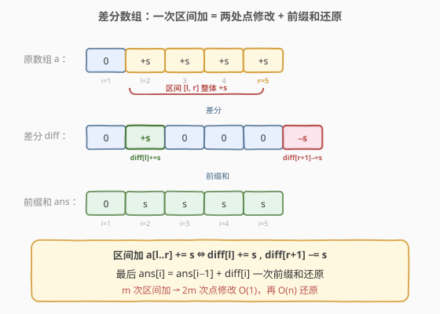
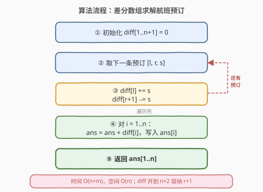
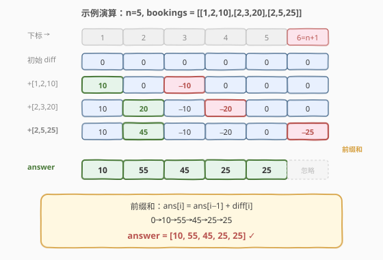

# 航班预订统计

- **题目名称**：航班预订统计
- **链接**：[1109. 航班预订统计](https://leetcode.cn/problems/corporate-flight-bookings/)
- **难度**：中等
- **标签**：数组、差分数组、前缀和

## 1. 题目概述

这里有 `n` 个航班，编号从 `1` 到 `n`。给你一份航班预订表 `bookings`，其中 `bookings[i] = [first_i, last_i, seats_i]` 表示在第 `first_i` 到第 `last_i`（**包含两端**）的每个航班上预订 `seats_i` 个座位。请你返回一个长度为 `n` 的数组 `answer`，其中 `answer[i]` 是航班 `i+1` 上预订的座位总数。

**示例 1**：

```text
输入：bookings = [[1,2,10],[2,3,20],[2,5,25]], n = 5
输出：[10,55,45,25,25]
解释：
航班 1：仅 [1,2,10] → 10
航班 2：[1,2,10] + [2,3,20] + [2,5,25] → 10+20+25 = 55
航班 3：[2,3,20] + [2,5,25] → 20+25 = 45
航班 4：[2,5,25] → 25
航班 5：[2,5,25] → 25
```

**示例 2**：

```text
输入：bookings = [[1,2,10],[2,2,15]], n = 2
输出：[10,25]
```

**约束条件**：

- `1 <= n <= 2 * 10^4`
- `1 <= bookings.length <= 2 * 10^4`
- `bookings[i].length == 3`
- `1 <= first_i <= last_i <= n`
- `1 <= seats_i <= 10^4`

> ⚠️ 注意：每条预订是**区间加**操作（对一段连续航班都加上 `seats_i`），且所有预订给出后才一次性查询每个航班的总量——这正是**差分数组**的典型应用场景。

---

## 2. 解题思路

### 2.1 暴力思路

对每条预订 `[l, r, s]`，循环把 `answer[l..r]` 每个元素都加 `s`。共 `m` 条预订、每条最长 `O(n)`，总时间 `O(m * n)`。在 `m, n = 2*10^4` 时可达 `4*10^8` 量级，会超时。

### 2.2 核心观察：差分数组



差分数组 `diff` 是原数组 `a` 的「相邻差」：`diff[i] = a[i] - a[i-1]`。反过来，`a` 就是 `diff` 的**前缀和**：`a[i] = diff[1] + diff[2] + ... + diff[i]`。

于是「把 `a[l..r]` 整体加 `s`」这个区间操作，可以拆成两处**点修改**：

$$
\text{diff}[l]\;{+}{=}\;s,\qquad \text{diff}[r+1]\;{-}{=}\;s
$$

直观理解：在 `l` 处「开启」一个 `+s` 的贡献，它在后续前缀和里一直生效；到 `r+1` 处「关闭」，用一个 `-s` 把它抵消。这样 `l..r` 之间每个位置的前缀和都多了 `s`，而 `r+1` 及以后恢复原值。

> 💡 **关键转化**：`m` 次区间加 → `2m` 次点修改（`O(1)` 每次），最后再做**一趟前缀和**即可还原所有航班的总量。这正是「离线、纯区间加、最后一次性查询」的最佳模板。

### 2.3 算法流程图



> ⚠️ **下标与边界**：航班编号是 **1-indexed**。`r+1` 可能等于 `n+1`，所以 `diff` 要开到 `n+2` 长度，让 `diff[r+1] -= s` 不越界（虽然 `n+1` 位置的值不影响 `1..n` 的答案，但写入时必须合法）。

### 2.4 示例演算

以 `bookings = [[1,2,10],[2,3,20],[2,5,25]], n = 5` 为例，差分数组取下标 `1..6`（`6 = n+1` 用于承接最后一个 `-s`）：



| 步骤 | 操作 | diff[1] | diff[2] | diff[3] | diff[4] | diff[5] | diff[6] |
|------|------|---------|---------|---------|---------|---------|---------|
| 初始 | — | 0 | 0 | 0 | 0 | 0 | 0 |
| 1 | 加 [1,2,10]：diff[1]+=10, diff[3]−=10 | 10 | 0 | −10 | 0 | 0 | 0 |
| 2 | 加 [2,3,20]：diff[2]+=20, diff[4]−=20 | 10 | 20 | −10 | −20 | 0 | 0 |
| 3 | 加 [2,5,25]：diff[2]+=25, diff[6]−=25 | 10 | 45 | −10 | −20 | 0 | −25 |

最后对 `diff[1..5]` 求前缀和（`ans[i] = ans[i-1] + diff[i]`，`ans[0]=0`）：

- `ans[1] = 0 + 10 = 10`
- `ans[2] = 10 + 45 = 55`
- `ans[3] = 55 + (−10) = 45`
- `ans[4] = 45 + (−20) = 25`
- `ans[5] = 25 + 0 = 25`

最终答案为 `[10, 55, 45, 25, 25]`，`diff[6] = −25` 落在 `n` 之外被忽略。

---

## 3. 参考代码

### C++

```cpp
class Solution {
  public:
    vector<int> corpFlightBookings(vector<vector<int>>& bookings, int n) {
        vector<int> diff(n + 2, 0); // 1-indexed，多开一位容纳 diff[r+1]
        for (auto& b : bookings) {
            int l = b[0], r = b[1], s = b[2];
            diff[l] += s;
            diff[r + 1] -= s;
        }
        vector<int> ans(n);
        int cur = 0;
        for (int i = 1; i <= n; ++i) {
            cur += diff[i];
            ans[i - 1] = cur;
        }
        return ans;
    }
};
```

### Python

```python
class Solution:
    def corpFlightBookings(self, bookings: List[List[int]], n: int) -> List[int]:
        diff = [0] * (n + 2)  # 1-indexed，多开一位容纳 diff[r+1]
        for l, r, s in bookings:
            diff[l] += s
            diff[r + 1] -= s
        ans = []
        cur = 0
        for i in range(1, n + 1):
            cur += diff[i]
            ans.append(cur)
        return ans
```

---

## 4. 复杂度分析

| 维度 | 复杂度 | 说明 |
|------|--------|------|
| 时间复杂度 | $O(n + m)$ | `m = len(bookings)`：遍历预订做 `2m` 次点修改 `O(m)`，再扫一遍 `diff` 求前缀和 `O(n)` |
| 空间复杂度 | $O(n)$ | 差分数组长度 `n+2`（不计返回的 `ans`）；若直接在答案数组上原地标记可省去 `diff` |

---

## 5. 扩展：差分数组的适用边界

差分数组适合**「离线 + 纯区间加 + 最后一次性查询」**的场景：每次区间加 `O(1)`，但查询任意单点是 `O(n)`（要重算前缀和）。

- **在线查询**：若「区间加」与「单点查询」交替进行，差分数组每次查询都要 `O(n)` 重建，不再高效。此时应改用**树状数组（BIT）维护差分序列**：区间加转化为两次单点更新 `O(log n)`，单点查询即差分前缀和 `O(log n)`。
- **二维区间加**：可推广到**二维差分**，对子矩阵加常数用四个角点修改 `O(1)`，再二维前缀和还原。
- **区间加 + 区间查询**：差分配合树状数组维护「差分」和「下标×差分」两项，可做到区间加、区间和均为 `O(log n)`。

> 💡 判断是否该用差分数组的一个信号：**所有修改都先给完、最后才读结果**——这种离线形态正是差分的舒适区。

---

## 6. 面试要点

1. **为什么是 `diff[l] += s, diff[r+1] -= s`？**
   - 因为原数组是差分数组的前缀和。在 `l` 加 `s`，会让 `l` 及之后所有前缀和都多 `s`；在 `r+1` 减 `s`，恰好把这份多余的贡献从 `r+1` 起抵消，于是只有 `l..r` 区间净增 `s`。

2. **数组为什么开到 `n+2`？**
   - 航班编号 1-indexed，且 `r+1` 最大可达 `n+1`。开 `n+2` 保证 `diff[r+1] -= s` 不越界。虽然 `n+1` 处的值不影响 `1..n` 的答案，但写入时必须合法。

3. **查询与修改交替（在线）怎么办？**
   - 差分支持 `O(1)` 区间加，但单点查询要 `O(n)`。改用树状数组维护 `diff`：区间加做两次单点更新，单点查询做一次前缀和，均为 `O(log n)`。

4. **能否省掉 `diff` 数组、直接在答案数组上操作？**
   - 可以。用长度 `n+1` 的 `ans` 先当差分数组做点标记，最后一趟原地累加前缀和即可，空间从 `O(n)` 降到仅返回数组本身。

5. **差分与前缀和是什么关系？**
   - 互为逆运算。若 `b` 是 `a` 的差分（`b[i]=a[i]-a[i-1]`），则 `a` 是 `b` 的前缀和。所以「对 `a` 做区间加」等价于「对 `b` 做两点修改」——这正是把 `O(n)` 区间操作降为 `O(1)` 的本质。

---

## 7. 同类练习题

- [1094. 拼车](https://leetcode.cn/problems/car-pooling/)：差分数组判断任意时刻车上人数是否超过容量，模板完全一致
- [1893. 检查是否区域内所有整数都被覆盖](https://leetcode.cn/problems/check-if-all-the-integers-in-a-range-are-covered/)：区间标记 + 前缀和判断是否全覆盖
- [1854. 人口最多的年份](https://leetcode.cn/problems/maximum-population-year/)：出生 +1、死亡 −1，差分后前缀和取最大值
- [798. 得分最高的最小轮调](https://leetcode.cn/problems/smallest-rotation-with-highest-score/)：把「轮调后某下标得分」建模为区间更新，差分数组求最大
- [560. 和为 K 的子数组](https://leetcode.cn/problems/subarray-sum-equals-k/)（[题解](560_和为K的子数组.md)）：前缀和的另一面，对比「前缀和」与「差分」互为逆运算
