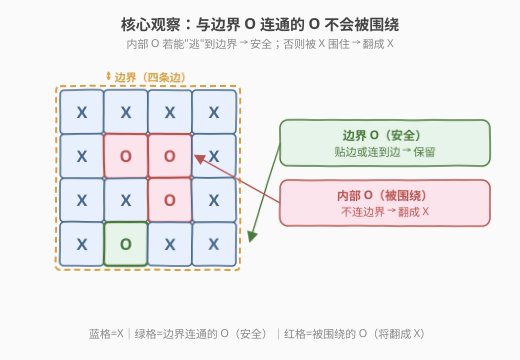
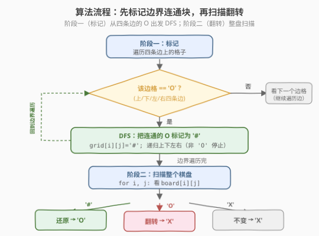
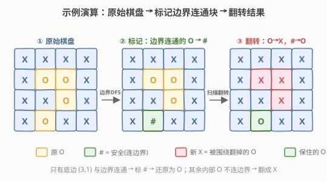

# 被围绕的区域

- **题目名称**：被围绕的区域
- **链接**：[130. 被围绕的区域](https://leetcode.cn/problems/surrounded-regions/)
- **难度**：中等
- **标签**：图、DFS、BFS、并查集

## 1. 题目概述

给你一个 `m x n` 的矩阵 `board`，由若干字符 `'X'` 和 `'O'` 组成。捕获所有**被围绕**的区域：

- 一块区域是由若干**水平/垂直**相邻的 `'O'` 连成的连通块。
- 如果一个连通块中的任意一个 `'O'` 位于棋盘**边界**上，则这块区域**不被围绕**，不应翻转。
- 其余所有 `'O'`（四周被 `'X'` 围住、不与边界连通）都需要被**捕获**，即翻转为 `'X'`。

你需要**原地**修改 `board`。

**示例 1**：

```text
输入：board = [
  ["X","X","X","X"],
  ["X","O","O","X"],
  ["X","X","O","X"],
  ["X","O","X","X"]
]
输出：[
  ["X","X","X","X"],
  ["X","X","X","X"],
  ["X","X","X","X"],
  ["X","O","X","X"]
]
解释：只有底边的 (3,1) 与边界相连，保留为 'O'；其余内部 'O' 被围绕，翻转为 'X'。
```

**示例 2**：

```text
输入：board = [["X"]]
输出：[["X"]]
```

**约束条件**：

- `m == board.length`
- `n == board[i].length`
- `1 <= m, n <= 200`
- `board[i][j]` 为 `'X'` 或 `'O'`

---

## 2. 解题思路

### 2.1 暴力思路

对每个 `'O'`，DFS/BFS 判断它所在的连通块是否触碰边界；若不触碰，则整块翻转。这样每个连通块会被重复扫描多次，最坏 `O((M×N)^2)`，且翻转顺序会影响后续判断，容易出错。

### 2.2 核心观察：与边界连通的 O 永不被围绕



> 💡 **逆向思维**：与其判断"谁被围绕"，不如先标记"谁一定安全"。**任何与边界上的 `'O'` 连通的 `'O'` 都不会被翻转**——因为它有一条通往边界的"逃生通道"。

于是问题转化为两步：

1. **标记**：从四条边界上的每个 `'O'` 出发，DFS/BFS 把所有连通的 `'O'` 暂时改为一个临时标记 `'#'`（表示"安全"）。
2. **扫描还原**：遍历整个棋盘：
   - `'#'`（标记过的安全格）→ 还原回 `'O'`
   - `'O'`（未被标记，即被围绕）→ 翻转为 `'X'`
   - `'X'` → 保持不变

### 2.3 算法流程图



**标记阶段**（从边界出发的 DFS）：

1. 遍历四条边（第 0 行、最后一行、第 0 列、最后一列）。
2. 遇到 `board[i][j] == 'O'`，从该格 DFS：把当前格改为 `'#'`，递归处理上下左右四个邻居（越界或非 `'O'` 停止）。

**翻转阶段**：

3. 遍历所有格子：
   - `'#'` → `'O'`
   - `'O'` → `'X'`

### 2.4 示例演算



以示例 1 为例，棋盘为 `4×4`：

| 阶段 | (1,1) | (1,2) | (2,2) | (3,1) | 说明 |
|------|-------|-------|-------|-------|------|
| ① 原始 | O | O | O | O | (3,1) 在底边 |
| ② 标记 | O | O | O | # | 从底边 (3,1) 出发 DFS，只有它自身被标 `#`；其余三个不与边界连通 |
| ③ 翻转 | X | X | X | O | `O`→`X`，`#`→`O` |

最终输出与示例一致。

---

## 3. 参考代码

### C++

```cpp
class Solution {
    int m, n;
    int dx[4] = {0, 0, 1, -1};
    int dy[4] = {1, -1, 0, 0};

    void dfs(vector<vector<char>>& board, int i, int j) {
        if (i < 0 || i >= m || j < 0 || j >= n || board[i][j] != 'O')
            return;
        board[i][j] = '#'; // 标记为"安全"
        for (int d = 0; d < 4; d++)
            dfs(board, i + dx[d], j + dy[d]);
    }

  public:
    void solve(vector<vector<char>>& board) {
        m = board.size();
        n = board[0].size();
        if (m < 3 || n < 3) return; // 边界全是"边界格"，不可能被围绕

        // 1. 从四条边界出发，标记所有与边界连通的 'O'
        for (int i = 0; i < m; i++) {
            dfs(board, i, 0);       // 左边界
            dfs(board, i, n - 1);   // 右边界
        }
        for (int j = 0; j < n; j++) {
            dfs(board, 0, j);       // 上边界
            dfs(board, m - 1, j);   // 下边界
        }

        // 2. 扫描还原
        for (int i = 0; i < m; i++)
            for (int j = 0; j < n; j++) {
                if (board[i][j] == 'O') board[i][j] = 'X';      // 被围绕
                else if (board[i][j] == '#') board[i][j] = 'O'; // 安全还原
            }
    }
};
```

### Python

```python
class Solution:
    def solve(self, board: List[List[str]]) -> None:
        m, n = len(board), len(board[0])
        if m < 3 or n < 3:
            return

        def dfs(i, j):
            if i < 0 or i >= m or j < 0 or j >= n or board[i][j] != 'O':
                return
            board[i][j] = '#'   # 标记为"安全"
            for di, dj in [(0, 1), (0, -1), (1, 0), (-1, 0)]:
                dfs(i + di, j + dj)

        # 1. 从四条边界出发，标记所有与边界连通的 'O'
        for i in range(m):
            dfs(i, 0)
            dfs(i, n - 1)
        for j in range(n):
            dfs(0, j)
            dfs(m - 1, j)

        # 2. 扫描还原
        for i in range(m):
            for j in range(n):
                if board[i][j] == 'O':
                    board[i][j] = 'X'
                elif board[i][j] == '#':
                    board[i][j] = 'O'
```

---

## 4. 复杂度分析

| 维度 | 复杂度 | 说明 |
|------|--------|------|
| 时间复杂度 | `O(M × N)` | 标记阶段每个格子最多被访问一次；翻转阶段再遍历一次，总计线性 |
| 空间复杂度 | `O(M × N)` | DFS 递归栈最坏情况（边界连成一条长蛇）深度可达 `M×N`；改用 BFS 或并查集可降到队列/路径压缩开销 |

---

## 5. 扩展：BFS 与并查集

- **BFS**：把递归 DFS 换成队列。从边界 `'O'` 入队，每次取出标记 `'#'` 并把四向邻居入队。Python 大网格下 BFS 更安全，可避免递归栈溢出。
- **并查集**：设立一个**虚拟哨兵节点**代表"边界"。遍历所有 `'O'`，与左/上邻居 union；若某 `'O'` 在边界上，则与哨兵 union。最后凡是根为哨兵的 `'O'` 都保留，否则翻转为 `'X'`。适合需要动态查询连通性的变体题。

---

## 6. 面试要点

1. **为什么从边界出发而不是从内部出发？**

   - 从内部判断"是否被围绕"需要先探索完整个连通块再决定，且每个块可能被重复扫描。
   - 从边界出发只需一次 DFS/BFS 标记所有"安全"格，剩下未标记的 `'O'` 必然被围绕——**一次扫描即定论**。

2. **为什么要用临时标记 `'#'` 而不直接修改？**

   - 需要区分"原本就是 `'X'`"和"要翻成 `'X'` 的被围绕 `'O'`"。用第三种字符 `'#'` 临时存"安全 `'O'`"，最后统一还原，避免状态混淆。

3. **为什么 `m < 3 || n < 3` 可以直接返回？**

   - 当行或列数小于 3 时，所有格子都贴着边界，不存在"完全被围绕"的内部格，故无需处理。这是一个常见的提前剪枝。

4. **DFS 递归栈会溢出吗？如何避免？**

   - 最坏情况（如一条贴边的长蛇形 `'O'`）递归深度可达 `M×N`，`m,n ≤ 200` 时可能达 40000 层，Python 易栈溢出。
   - 解决：改用 BFS（显式队列）或手动栈；C++ 可调大栈或在面试中说明改 BFS。

5. **这题和 200 岛屿数量有什么联系？**

   - 都是"网格连通分量 + DFS/BFS 标记"的模板。200 是**计数**连通块，130 是**按是否连边界分类处理**。
   - 核心都是"遍历 + 原地标记"，沉岛法（改 `'0'`）与本题的标记法（改 `'#'`）同源。

---

## 7. 同类练习题
- [200. 岛屿数量](https://leetcode.cn/problems/number-of-islands/)（[题解](200_岛屿数量.md)）：网格 DFS 沉岛计数，本题的模板原型
- [695. 岛屿的最大面积](https://leetcode.cn/problems/max-area-of-island/)：DFS 求连通块面积
- [417. 太平洋大西洋水流问题](https://leetcode.cn/problems/pacific-atlantic-water-flow/)：从边界反向 DFS/BFS，与本题"边界出发"思路完全一致
- [1254. 统计封闭岛屿的数目](https://leetcode.cn/problems/number-of-closed-islands/)：封闭岛屿 = 不连边界的连通块，本题的直接变体
