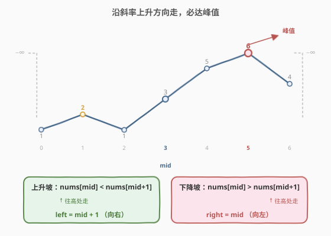
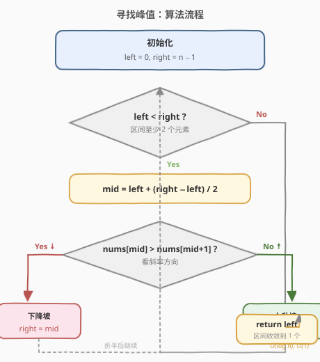
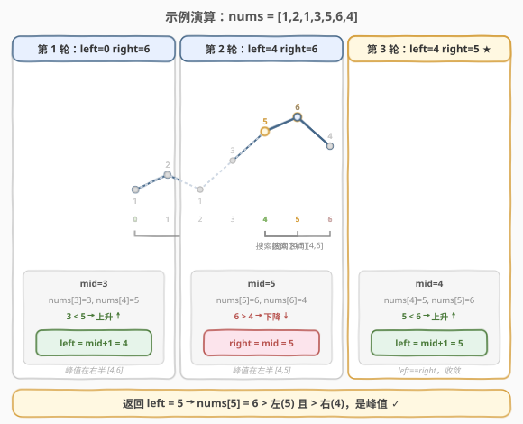

# 寻找峰值

- **题目名称**：寻找峰值
- **链接**：[162. 寻找峰值](https://leetcode.cn/problems/find-peak-element/)
- **难度**：中等
- **标签**：数组、二分查找

## 1. 题目概述

峰值元素是指其值严格大于左右相邻值的元素。给你一个整数数组 `nums`，满足任意相邻元素都不相等（`nums[i] != nums[i+1]`），请找出**任意一个**峰值元素的下标并返回。

可以想象 `nums[-1] = nums[n] = -∞`，即数组两端之外视为负无穷。题目要求时间复杂度为 $O(\log n)$。

**示例 1**：

```text
输入：nums = [1,2,3,1]
输出：2
解释：3 是峰值元素，nums[2] > nums[1] 且 nums[2] > nums[3]。
```

**示例 2**：

```text
输入：nums = [1,2,1,3,5,6,4]
输出：5 （或 1）
解释：下标 5 的 6 是峰值；下标 1 的 2 也是峰值。返回任意一个即可。
```

**约束条件**：

- `1 <= nums.length <= 1000`
- `-2^31 <= nums[i] <= 2^31 - 1`
- 对所有有效的 `i`，都有 `nums[i] != nums[i+1]`
- 要求 $O(\log n)$ 时间

> ⚠️ 注意三点：① 只需返回**任意一个**峰值，不必找最大值；② 相邻元素必不相等，保证没有平台；③ 两端外为 $-\infty$，保证峰值**一定存在**。

---

## 2. 解题思路

### 2.1 暴力思路

从头到尾线性扫描，遇到第一个比右邻居大的元素即为峰值，时间 $O(n)$。简单正确，但不满足 $O(\log n)$ 的要求。问题来了：数组**无序**，二分查找的前提似乎不成立——真的能二分吗？

### 2.2 核心观察：用「斜率」决策二分方向



关键在于：我们不需要知道整个数组长什么样，只要比较中点 `mid` 和它的右邻居 `nums[mid+1]`，就能判断**峰值在哪一侧**。

- 若 `nums[mid] > nums[mid+1]`：`mid` 处于**下降坡**（左高右低）。说明 `mid` 自身或它左边一定有峰值——因为左边一路往上有「爬升」就会在某处停下来形成峰，而左边界外是 $-\infty$，从 $-\infty$ 起步的爬升必定能找到一个峰。因此**向左收缩**：`right = mid`（`mid` 本身可能是峰，要保留）。
- 若 `nums[mid] < nums[mid+1]`：`mid` 处于**上升坡**（左低右高）。对称地，`mid` 右边一定有峰值——右边界外是 $-\infty$，从 $-\infty$ 回望的爬升也必定有峰。因此**向右收缩**：`left = mid + 1`（`mid` 已小于右邻居，不可能是峰，排除）。

> 💡 **一句话直觉**：站在山坡上，往**高的那一边**走，一定能走到一个山顶——因为数组两端是悬崖（$-\infty$），往上走终究会「无路可上」而停下，停下的地方就是峰。这就是「**沿斜率上升方向走必达峰值**」的贪心收敛性。

### 2.3 算法流程图



### 2.4 示例演算

以 `nums = [1,2,1,3,5,6,4]` 为例，每轮比较 `mid` 与 `mid+1` 决定收缩方向：



| 轮次 | left | right | mid | nums[mid] | nums[mid+1] | 斜率 | 动作 |
|------|------|-------|-----|-----------|-------------|------|------|
| 1 | 0 | 6 | 3 | 3 | 5 | 上升 ↑ | left = mid+1 = 4 |
| 2 | 4 | 6 | 5 | 6 | 4 | 下降 ↓ | right = mid = 5 |
| 3 | 4 | 5 | 4 | 5 | 6 | 上升 ↑ | left = mid+1 = 5 |
| 结束 | 5 | 5 | — | — | — | — | 返回 left = 5 |

`nums[5] = 6`，满足 `6 > nums[4]=5` 且 `6 > nums[6]=4`，确为峰值 ✓。

---

## 3. 参考代码

### C++

```cpp
class Solution {
  public:
    int findPeakElement(vector<int>& nums) {
        int left = 0, right = nums.size() - 1;
        while (left < right) {
            int mid = left + (right - left) / 2;
            if (nums[mid] > nums[mid + 1]) {
                right = mid;        // 下降坡：峰值在左（含 mid）
            } else {
                left = mid + 1;     // 上升坡：峰值在右（不含 mid）
            }
        }
        return left;
    }
};
```

### Python

```python
class Solution:
    def findPeakElement(self, nums: List[int]) -> int:
        left, right = 0, len(nums) - 1
        while left < right:
            mid = (left + right) // 2
            if nums[mid] > nums[mid + 1]:
                right = mid        # 下降坡：峰值在左（含 mid）
            else:
                left = mid + 1     # 上升坡：峰值在右（不含 mid）
        return left
```

---

## 4. 复杂度分析

| 维度 | 复杂度 | 说明 |
|------|--------|------|
| 时间复杂度 | $O(\log n)$ | 每轮把搜索区间折半，比较 1 次，共 $O(\log n)$ 轮 |
| 空间复杂度 | $O(1)$ | 仅用 `left` / `right` / `mid` 三个指针，无额外空间 |

---

## 5. 扩展：为什么无序也能二分

常规二分查找依赖「有序」来决定去哪一半，而本题**没有整体单调性**却仍能二分，本质在于：我们二分的不是「值」，而是**「峰值落在哪一半」这个布尔性质**。

定义性质 $P(\text{区间})$：「该区间内至少存在一个峰值」。由两端的 $-\infty$ 与相邻不等条件，整个数组满足 $P$。而 `nums[mid]` 与 `nums[mid+1]` 的大小关系给出了 $P$ 在左右两半的**可判定划分**：下降坡时 $P$ 在左半成立，上升坡时 $P$ 在右半成立。这与「有序数组中找目标」的二分同构——都是用一个 $O(1)$ 比较来排除掉一半。

> ⚠️ 这种「二分一个性质而非二分值」的思想是二分查找的通用范式，也是「二分答案」类题目的共同根基。

---

## 6. 面试要点

1. **数组无序为什么还能用二分？**
   - 二分的对象是「峰值所在区间」这一性质，而非数组值本身。中点与右邻居的斜率能 $O(1)$ 判定峰值在哪一半，从而每轮折半。

2. **为什么 `right = mid` 而不是 `right = mid - 1`？**
   - 下降坡时 `mid` 自身就可能是峰值（它已大于右邻居，只需再大于左邻居即可）。若写成 `mid - 1` 会把 `mid` 这个候选错误排除，导致漏解。本题是「找任意一个满足条件的下标」的典型，`mid` 在条件成立侧需被保留。

3. **`while` 用 `left < right` 还是 `left <= right`？**
   - 用 `left < right`。当 `left == right` 时区间只剩一个元素，它必然是峰值（由收敛过程保证两侧已被正确排除），直接返回即可，无需进入循环。用 `left <= right` 时需注意 `mid+1` 越界与死循环处理。

4. **为什么不会越界访问 `nums[mid+1]`？**
   - 循环条件 `left < right` 保证进入循环时至少有两个元素，即 `mid < right = n-1`，于是 `mid+1 <= n-1`，访问安全。

5. **如果要找「全局最大值」呢？还能 $O(\log n)$ 吗？**
   - 不能。找全局最大值必须看遍每个元素，下界 $O(n)$。本题之所以能 $O(\log n)$，是因为只求「任意一个局部峰」，放宽了目标才换来对数复杂度。

---

## 7. 同类练习题

- [852. 山脉数组的峰顶索引](https://leetcode.cn/problems/peak-index-in-a-mountain-array/)：162 的特化版——整个数组先严格增后严格减（保证唯一峰），二分套路完全一致
- [1095. 山脉数组中查找目标值](https://leetcode.cn/problems/find-in-mountain-array/)：先二分找峰，再在升/降两段分别二分，综合运用斜率二分 + 有序二分
- [33. 搜索旋转排序数组](https://leetcode.cn/problems/search-in-rotated-sorted-array/)（[题解](33_搜索旋转排序数组.md)）：另一道「无整体有序但可二分」的经典，比较中点与端点判定有序半区
- [875. 爱吃香蕉的珂珂](https://leetcode.cn/problems/koko-eating-bananas/)（[题解](875_爱吃香蕉的珂珂.md)）：同属二分家族，对比「二分答案」与「二分性质」两种范式
- [4. 寻找两个正序数组的中位数](https://leetcode.cn/problems/median-of-two-sorted-arrays/)：二分「划分子结构」思想的高阶应用，难度更大但同源
