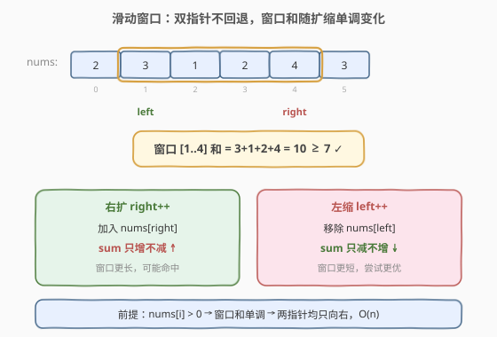
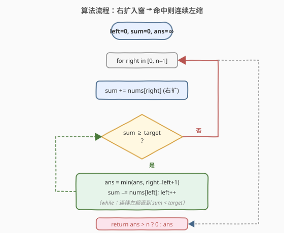
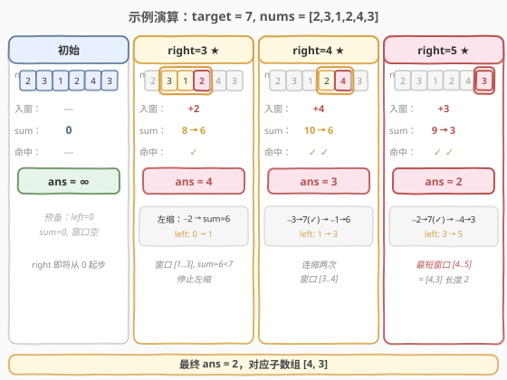

# 长度最小的子数组

- **题目名称**：长度最小的子数组
- **链接**：[209. 长度最小的子数组](https://leetcode.cn/problems/minimum-size-subarray-sum/)
- **难度**：中等
- **标签**：数组、滑动窗口、双指针

## 1. 题目概述

给定一个由**正整数**组成的数组 `nums` 和一个正整数 `target`，返回数组中满足其和 `≥ target` 的**长度最小的连续子数组** `[numsl, numsl+1, ..., numsr-1, numsr]` 的长度。若不存在这样的子数组，返回 `0`。

**示例 1**：

```text
输入：target = 7, nums = [2,3,1,2,4,3]
输出：2
解释：子数组 [4,3] 是该条件下的长度最小的子数组（和为 7）。
```

**示例 2**：

```text
输入：target = 4, nums = [1,4,4]
输出：1
解释：子数组 [4]（下标 1）和为 4，长度为 1。
```

**示例 3**：

```text
输入：target = 11, nums = [1,1,1,1,1,1,1,1]
输出：0
解释：所有元素之和仅 8，不足 11，不存在满足条件的子数组。
```

**约束条件**：

- $1 \leq \text{target} \leq 10^9$
- $1 \leq \text{nums.length} \leq 10^5$
- $1 \leq \text{nums[i]} \leq 10^4$

> 💡 **进阶要求**：给出 $O(n)$ 与 $O(n \log n)$ 两种解法。本文主推 $O(n)$ 的**滑动窗口**，并在第 5 节给出 $O(n \log n)$ 的「前缀和 + 二分」。

---

## 2. 解题思路

### 2.1 暴力思路

枚举所有起点 `i`，从 `i` 开始累加直到和 `≥ target`，记录最短长度。两重循环，最坏 $O(n^2)$，在 $n = 10^5$ 时会超时。

### 2.2 核心观察：正数带来单调性 → 滑动窗口



关键前提是 **`nums[i]` 全为正数**，因此窗口和具有**单调性**：

- **右指针右扩**（加入 `nums[right]`）：窗口和**只增不减**；
- **左指针右缩**（移除 `nums[left]`）：窗口和**只减不增**。

这保证了一个极重要的性质：

> ⚠️ 若窗口 `[left, right]` 已满足和 `≥ target`，则继续右扩 `right` 只会让窗口**更长**，不可能得到更优解。因此此时唯一合理的动作是**固定 `right`，右移 `left` 尝试缩短**，直到窗口和 `< target` 再去右扩 `right`。

于是两个指针都**只向右移动、永不回退**，每个元素最多被左右指针各访问一次，总扫描次数为 $O(n)$。

> 💡 **与 [560. 和为 K 的子数组](560_和为K的子数组.md) 的对比**：560 中元素可为负，单调性被破坏，必须用「前缀和 + 哈希」；而 209 全为正，恰好满足滑动窗口所需的单调性，故可用更省空间的 $O(1)$ 额外空间解法。**判据就是：窗口和是否单调。**

### 2.3 算法流程图



维护变量：

- `left`：窗口左端点，初始 `0`；
- `sum`：当前窗口 `[left, right]` 内元素之和，初始 `0`；
- `ans`：已找到的最短长度，初始 `+∞`（用 `n+1` 或大整数表示）。

**主循环**（`right` 从 `0` 到 `n-1`）：

1. 把 `nums[right]` 累加进 `sum`（窗口右扩）。
2. **当** `sum ≥ target` 时（窗口满足条件）：
   - 更新 `ans = min(ans, right - left + 1)`；
   - 从 `sum` 中减去 `nums[left]`，`left++`（左缩，尝试更短）；
   - 重复本步直到 `sum < target`。
3. `right` 自增，进入下一轮。

循环结束后，若 `ans` 仍为 `+∞` 返回 `0`，否则返回 `ans`。

> ⚠️ **注意是 `while` 不是 `if`**：一次右扩可能让窗口远超 `target`，需要连续左缩多次才能找到以当前 `right` 为右端点的最短窗口。

### 2.4 示例演算

以 `target = 7, nums = [2,3,1,2,4,3]` 为例，下面给出关键命中步（省略未命中步）：



| right | nums[right] | sum（入窗后） | 命中？ | 左缩过程 | 窗口 | ans |
|-------|-------------|---------------|--------|----------|------|-----|
| 0 | 2 | 2 | ✗ | — | [0,0] | ∞ |
| 1 | 3 | 5 | ✗ | — | [0,1] | ∞ |
| 2 | 1 | 6 | ✗ | — | [0,2] | ∞ |
| 3 | 2 | 8 | ✓ | 移除 2 → sum=6 | [1,3] | 4 |
| 4 | 4 | 10 | ✓ | 移除 3→7(命中,ans=3) → 移除 1→6 | [3,4] | 3 |
| 5 | 3 | 9 | ✓ | 移除 2→7(命中,ans=2) → 移除 4→3 | [5,5] | 2 |

最终 `ans = 2`，对应子数组 `[4, 3]`（下标 4–5）。

---

## 3. 参考代码

### C++

```cpp
class Solution {
  public:
    int minSubArrayLen(int target, vector<int>& nums) {
        int n = nums.size(), ans = n + 1, sum = 0, left = 0;
        for (int right = 0; right < n; ++right) {
            sum += nums[right];                       // 右扩
            while (sum >= target) {                   // 满足条件就尝试左缩
                ans = min(ans, right - left + 1);
                sum -= nums[left++];
            }
        }
        return ans > n ? 0 : ans;
    }
};
```

### Python

```python
class Solution:
    def minSubArrayLen(self, target: int, nums: List[int]) -> int:
        ans = len(nums) + 1
        left = s = 0
        for right, x in enumerate(nums):
            s += x                       # 右扩
            while s >= target:           # 满足条件就尝试左缩
                ans = min(ans, right - left + 1)
                s -= nums[left]
                left += 1
        return 0 if ans > len(nums) else ans
```

---

## 4. 复杂度分析

| 维度 | 复杂度 | 说明 |
|------|--------|------|
| 时间复杂度 | $O(n)$ | `right` 走 `n` 步，`left` 累计也最多走 `n` 步，平摊到每轮为均摊 $O(1)$ |
| 空间复杂度 | $O(1)$ | 仅用 `left`/`sum`/`ans` 等几个变量，与输入规模无关 |

---

## 5. 扩展：前缀和 + 二分（$O(n \log n)$）

当数组**含负数**或题目要求不依赖单调性时，可用此法。定义前缀和 `prefix[i]` 为 `nums[0..i-1]` 之和（全为正数故 `prefix` **单调递增**，可二分）。对每个起点 `i`，在 `prefix[i+1..]` 中二分找**第一个**满足 `prefix[j] - prefix[i] ≥ target` 的 `j`，则子数组长度为 `j - i`，取最小值。

```cpp
int minSubArrayLen(int target, vector<int>& nums) {
    int n = nums.size(), ans = n + 1;
    vector<int> p(n + 1, 0);
    for (int i = 0; i < n; ++i) p[i + 1] = p[i] + nums[i];
    for (int i = 0; i < n; ++i) {
        int need = p[i] + target;
        int j = lower_bound(p.begin() + i + 1, p.end(), need) - p.begin();
        if (j <= n) ans = min(ans, j - i);
    }
    return ans > n ? 0 : ans;
}
```

> 💡 该解法依赖 `prefix` 单调（即 `nums[i] > 0`）；若允许负数则 `lower_bound` 失效，需退化为 $O(n^2)$ 或改用 [560](560_和为K的子数组.md) 的哈希思路（但 560 是「等于」而非「不小于」）。

---

## 6. 面试要点

1. **为什么滑动窗口要求元素全为正？**
   - 全为正保证窗口和单调：右扩必增、左缩必减，才能据 `sum` 与 `target` 的关系**唯一决定**指针移动方向。若有负数，右扩反而可能减小窗口和，无法判断该扩还是该缩。

2. **为什么内层是 `while` 而非 `if`？**
   - 一次右扩后 `sum` 可能远超 `target`，需要连续左缩多次才能找到以当前 `right` 结尾的最短合法窗口；若只缩一次会漏掉更短解，导致答案偏大。

3. **如何证明时间复杂度是 $O(n)$ 而非 $O(n^2)$？**
   - **平摊分析**：`left` 在整个循环中只会从 `0` 单调右移到 `n`，累计最多移动 `n` 次；`right` 也是 `n` 次。两指针都不回退，总操作数为 $2n$，故 $O(n)$。

4. **`ans` 初始化为 `n + 1` 而非 `INT_MAX` 的好处？**
   - 合法子数组长度上界就是 `n`，用 `n + 1` 作「无穷大」既不会溢出，又能直接用 `ans > n` 判断是否命中，代码简洁。

5. **如果题目改成「和恰好等于 target」且全为正，怎么做？**
   - 同样滑动窗口，把 `sum >= target` 改为：当 `sum > target` 时左缩、`sum == target` 时记录答案并左缩。全为正时仍单调，滑动窗口依旧有效。

---

## 7. 同类练习题

- [3. 无重复字符的最长子串](https://leetcode.cn/problems/longest-substring-without-repeating-characters/)（[题解](3_无重复字符的最长子串.md)）：滑动窗口经典模板，求「最长」而本题求「最短」，对比窗口收缩时机
- [560. 和为 K 的子数组](https://leetcode.cn/problems/subarray-sum-equals-k/)（[题解](560_和为K的子数组.md)）：含负数场景，对比为何必须用前缀和 + 哈希而非滑动窗口
- [76. 最小覆盖子串](https://leetcode.cn/problems/minimum-window-substring/)：同样是「最小窗口」，但窗口判定改为字符频次匹配，收缩条件更复杂
- [904. 水果成篮](https://leetcode.cn/problems/fruit-into-baskets/)：固定双指针窗口求最长，进一步巩固窗口指针不回退的平摊分析
- [713. 乘积小于 K 的子数组](https://leetcode.cn/problems/subarray-product-less-than-k/)：全为正数的另一变体，把「和」换成「乘积」，窗口收缩逻辑需配合计数
