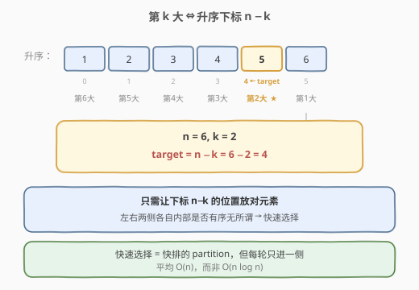
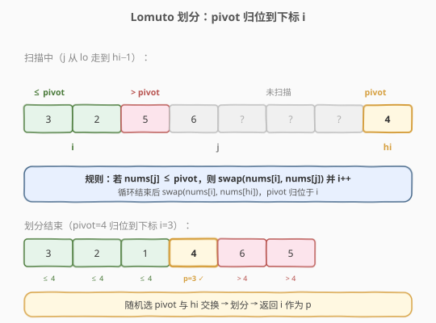
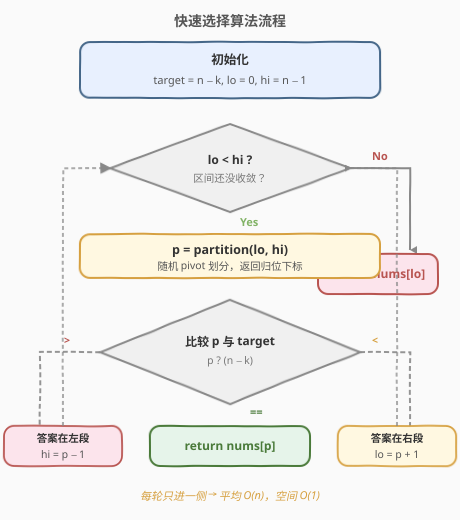
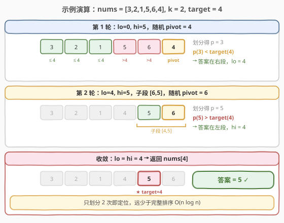

# 数组中的第K个最大元素

- **题目名称**：数组中的第K个最大元素
- **链接**：[215. 数组中的第K个最大元素](https://leetcode.cn/problems/kth-largest-element-in-an-array/)
- **难度**：中等
- **标签**：数组、分治、快速选择、堆

## 1. 题目概述

给定整数数组 `nums` 和整数 `k`，请返回数组中第 **k** 个最大的元素（按**排序后**的顺序，1-indexed，**而非**第 k 个不同的元素）。

**示例 1**：

```text
输入：nums = [3,2,1,5,6,4], k = 2
输出：5
解释：排序后为 [1,2,3,4,5,6]，第 2 个最大的元素是 5。
```

**示例 2**：

```text
输入：nums = [3,2,3,1,2,4,5,5,6], k = 4
输出：4
解释：排序后为 [1,2,2,3,3,4,5,5,6]，第 4 个最大的元素是 4。
```

**约束条件**：

- `1 <= k <= nums.length <= 10^5`
- `-10^4 <= nums[i] <= 10^4`

> ⚠️ 注意：是「第 k 大」**不是**「第 k 个不同元素」；即使有重复值，每个元素也独立计数。本题要求 `O(n)` 平均时间，故直接排序（`O(n log n)`）虽能过，但不是面试期望解法。

---

## 2. 解题思路

### 2.1 暴力思路

将数组**降序排序**，返回第 `k` 个元素。时间 `O(n log n)`、空间 `O(log n)`（排序栈）。简单可靠，但未利用「只需第 k 个、不需整体有序」的性质，存在更优解。

### 2.2 核心观察：第 k 大 = 升序第 (n−k) 个



把「第 k 大」转化为升序视角更直观：长度为 `n` 的数组升序排序后，**第 k 大**就是升序下标为 `n − k` 的元素。

$$
\text{答案} = \text{sorted}(\text{nums})[\,n - k\,]
$$

> 💡 **关键转化**：我们不需要把整个数组排好，只要保证「下标 `n − k` 的位置放对了元素」，其左右两侧各自内部是否有序无所谓。这正是**快速选择（Quickselect）**的用武之地。

### 2.3 快速选择：只递归一侧的分治

快速选择借用了快速排序的 **partition**：选一个 `pivot`，把数组划成「≤ pivot」与「> pivot」两段，pivot 落在它的最终排好位置 `p`。

- 若 `p == n − k`：pivot 即为答案。
- 若 `p < n − k`：答案在右段，递归/迭代右段。
- 若 `p > n − k`：答案在左段，递归/迭代左段。

与快排的区别在于**每次只进入一侧**，因此平均时间从 `O(n log n)` 降到 `O(n)`。



> ⚠️ **避免最坏 `O(n²)`**：当数组已有序且总取末端为 pivot 时，每次只缩一格。解决方法：**随机化 pivot**（先与末端交换再划分），期望复杂度为 `O(n)`。

### 2.4 算法流程图



### 2.5 示例演算

以 `nums = [3,2,1,5,6,4], k = 2` 为例，`n = 6`，目标下标 `target = 4`。



| 轮次 | 区间 [lo,hi] | 随机 pivot 值 | 划分后下标 p | 与 target=4 比较 | 下一步 |
|------|--------------|---------------|---------------|------------------|--------|
| 1 | [0, 5] | 4 | 3 | p < 4 | 答案在右段，lo = 4 |
| 2 | [4, 5] | 6 | 5 | p > 4 | 答案在左段，hi = 4 |
| 收敛 | [4, 4] | — | — | lo == hi | 返回 nums[4] = **5** ✓ |

最终答案为 `5`。整个过程只划分了 2 次，远少于完整排序。

---

## 3. 参考代码

### C++

```cpp
class Solution {
  public:
    int findKthLargest(vector<int>& nums, int k) {
        int n = nums.size();
        int target = n - k;          // 升序下标
        int lo = 0, hi = n - 1;
        while (lo < hi) {
            int p = partition(nums, lo, hi);
            if (p < target) lo = p + 1;
            else if (p > target) hi = p - 1;
            else return nums[p];
        }
        return nums[lo];
    }

  private:
    int partition(vector<int>& nums, int lo, int hi) {
        int r = lo + rand() % (hi - lo + 1);  // 随机 pivot
        swap(nums[r], nums[hi]);
        int pivot = nums[hi];
        int i = lo;                            // [lo, i) <= pivot
        for (int j = lo; j < hi; j++) {
            if (nums[j] <= pivot) {
                swap(nums[i], nums[j]);
                i++;
            }
        }
        swap(nums[i], nums[hi]);               // pivot 归位
        return i;
    }
};
```

### Python

```python
class Solution:
    def findKthLargest(self, nums: List[int], k: int) -> int:
        target = len(nums) - k
        lo, hi = 0, len(nums) - 1
        while lo < hi:
            p = self._partition(nums, lo, hi)
            if p < target:
                lo = p + 1
            elif p > target:
                hi = p - 1
            else:
                return nums[p]
        return nums[lo]

    def _partition(self, nums, lo, hi):
        r = random.randint(lo, hi)
        nums[r], nums[hi] = nums[hi], nums[r]
        pivot = nums[hi]
        i = lo
        for j in range(lo, hi):
            if nums[j] <= pivot:
                nums[i], nums[j] = nums[j], nums[i]
                i += 1
        nums[i], nums[hi] = nums[hi], nums[i]
        return i
```

---

## 4. 复杂度分析

| 维度 | 复杂度 | 说明 |
|------|--------|------|
| 时间复杂度 | O(n) 平均 / O(n²) 最坏 | 每次划分后规模约减半：$n + n/2 + n/4 + \cdots = 2n$；最坏（不随机化）每次只减 1 |
| 空间复杂度 | O(1) | 迭代实现，原地划分，仅常数变量；递归实现为 O(log n) 栈 |

> 💡 随机化 pivot 后，最坏情况出现的概率极低，期望时间为 `O(n)`，这是面试对 `O(n)` 解法的标准要求。

---

## 5. 扩展：堆与计数两种解法

### 5.1 最小堆（维护大小为 k 的堆）

维护一个大小为 `k` 的**最小堆**，扫描整个数组：堆满后新元素若大于堆顶则替换。最终堆顶即第 k 大。

```python
import heapq

class Solution:
    def findKthLargest(self, nums: List[int], k: int) -> int:
        heap = []
        for x in nums:
            heapq.heappush(heap, x)
            if len(heap) > k:
                heapq.heappop(heap)
        return heap[0]
```

- 时间 `O(n log k)`、空间 `O(k)`。当 `k << n` 时非常高效，且适合**数据流**场景（元素逐个到来）。

### 5.2 计数排序（利用值域有限）

由于 `nums[i] ∈ [−10^4, 10^4]`，值域大小 `M = 20001`，可用计数排序在 `O(n + M)` 内得到答案，空间 `O(M)`。当值域远小于 `n` 时这是最优确定线性解。

```python
class Solution:
    def findKthLargest(self, nums: List[int], k: int) -> int:
        offset = 10000
        cnt = [0] * 20001
        for x in nums:
            cnt[x + offset] += 1
        for v in range(20000, -1, -1):   # 从大到小找第 k 个
            k -= cnt[v]
            if k <= 0:
                return v - offset
```

> 💡 **如何选**：数据流/`k` 小 → 堆；值域小 → 计数；通用且期望线性 → 快速选择。

---

## 6. 面试要点

1. **为什么「第 k 大」对应升序下标 `n − k`？**
   - 升序排序后，下标 `n − 1` 是最大（第 1 大），下标 `n − k` 即第 k 大。这一步把「最大」语义统一成「按下标查找」，避免在 partition 比较时反复换算方向出错。

2. **快速选择与快速排序的区别是什么？**
   - 两者都用 partition，但快排对**两侧**都递归（`O(n log n)`），快速选择每次**只进入含目标的一侧**，平均 `O(n)`。

3. **为什么要随机化 pivot？**
   - 固定取末端 pivot 时，对已排序/接近排序的数组会退化为 `O(n²)`；随机化后期望为 `O(n)`，是消除最坏情况的标准做法。

4. **partition 用 Lomuto 还是 Hoare？**
   - Lomuto（单指针 `i`）实现简单、易讲解；Hoare（双指针对向扫描）平均交换次数更少、常数更优，但边界处理更易出错。面试按需选择，讲清即可。

5. **求「第 k 小」或「前 k 个」如何调整？**
   - 第 k 小即升序下标 `k − 1`，把 `target` 改为 `k − 1` 即可；前 k 个可用快速选择定位第 k 个后，其左侧即所求（无序但均 ≤ 第 k 个），或用堆逐个弹出得到有序结果。

---

## 7. 同类练习题

- [347. 前 K 个高频元素](https://leetcode.cn/problems/top-k-frequent-elements/)：top-k 经典变体，可用堆或桶排序 + 快速选择
- [703. 数据流中的第 K 大元素](https://leetcode.cn/problems/kth-largest-element-in-a-stream/)：本题的「数据流」版本，最小堆维护大小 k 的窗口
- [912. 排序数组](https://leetcode.cn/problems/sort-an-array/)：快速排序模板，掌握 partition 后顺手解决
- [324. 摆动排序 II](https://leetcode.cn/problems/wiggle-sort-ii/)：用快速选择找中位数后再做交叉排列，partition 的进阶应用
- [4. 寻找两个正序数组的中位数](https://leetcode.cn/problems/median-of-two-sorted-arrays/)：另一种「第 k 小」的分治求法，对比二分与快速选择的差异
