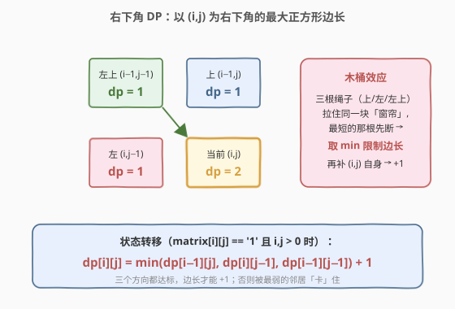
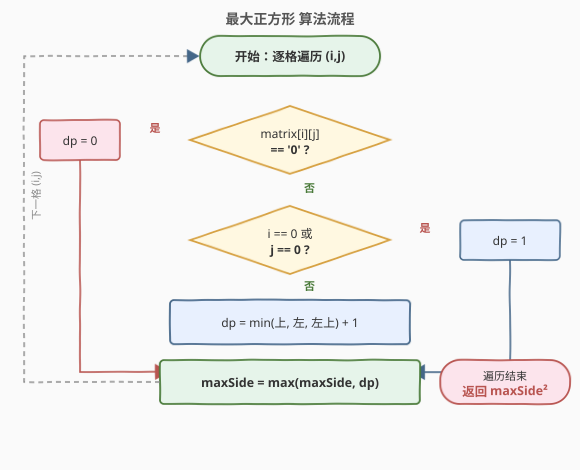
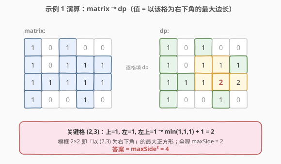

# 最大正方形

- **题目名称**：最大正方形
- **链接**：[221. 最大正方形](https://leetcode.cn/problems/maximal-square/)
- **难度**：中等
- **标签**：数组、动态规划、网格 DP

## 1. 题目概述

在一个由 `'0'` 和 `'1'` 组成的二维 `m x n` 矩阵内，找到只包含 `'1'` 的**最大正方形**，并返回其**面积**。

> ⚠️ 矩阵元素是**字符** `'0'`/`'1'`，不是数字，转移时需先判断 `matrix[i][j] == '1'`。

**示例 1**：

```text
输入：matrix =
 [["1","0","1","0","0"],
  ["1","0","1","1","1"],
  ["1","1","1","1","1"],
  ["1","0","0","1","0"]]
输出：4
解释：最大正方形位于第 2~3 行、第 3~4 列（下标从 0 起），边长为 2，面积为 4。
```

**示例 2**：

```text
输入：matrix = [["0","1"],["1","0"]]
输出：1
```

**示例 3**：

```text
输入：matrix = [["0"]]
输出：0
```

**约束条件**：

- $m = \text{matrix.length}$
- $n = \text{matrix}[i].\text{length}$
- $1 \leq m, n \leq 300$
- $\text{matrix}[i][j] \in \{'0', '1'\}$

> 💡 本题与 [85. 最大矩形](https://leetcode.cn/problems/maximal-rectangle/) 形似但不同：221 求**正方形**（边长受限），可用简洁的网格 DP；85 求**矩形**（任意宽高），需借助「柱状图最大矩形 + 单调栈」。先吃透 221，再看 85 会顺很多。

---

## 2. 解题思路

### 2.1 暴力思路

对每个为 `'1'` 的格子 `(i,j)` 作为正方形**左上角**，逐步尝试扩大边长 $k=1,2,3,\dots$：每扩一格需检查新增的「右边一列 + 下边一行」是否全为 `'1'`，直到越界或遇到 `'0'`。记下能扩到的最大边长。

- 单个起点最坏要扫 $O(k^2)$ 个格子，所有起点合计最坏 $O(m \cdot n \cdot \min(m,n)^2)$，$m=n=300$ 时约 $8.1 \times 10^{9}$ 次操作，**超时**。
- 关键缺陷：反复检查同一片 `'1'` 区域，「以 `(i,j)` 为右下角能撑多大的正方形」被重复计算 → 这是**重叠子问题**的信号 → 上 DP。

### 2.2 核心观察：以「右下角」为状态的网格 DP



换个视角：不再问「以某格为**左上角**能扩多大」，而是问「以某格 `(i,j)` 为**右下角**的最大全 1 正方形边长是多少」。设：

$$dp[i][j] = \text{以 } (i,j) \text{ 为右下角的全 1 正方形的最大边长}$$

当 `matrix[i][j] == '1'` 时，`(i,j)` 能撑出的正方形边长，被它**上方、左方、左上**三个邻居「卡住」：

- 想要边长为 $k$，则需要上方格也能撑出 $\geq k-1$（提供正方形的上边）、左方格能撑出 $\geq k-1$（提供左边）、左上格也能撑出 $\geq k-1$（保证对角方向不断裂）。
- 三者缺一不可，故取**最小值**再加 1（`(i,j)` 自身贡献的一格）：

$$
dp[i][j] = \begin{cases}
0, & \text{matrix}[i][j] = \text{'0'} \\
1, & \text{matrix}[i][j] = \text{'1'} \text{ 且 } (i=0 \text{ 或 } j=0) \quad(\text{首行/首列最多边长 1}) \\
\min\big(dp[i-1][j],\ dp[i][j-1],\ dp[i-1][j-1]\big) + 1, & \text{otherwise}
\end{cases}
$$

答案为 $\big(\max_{i,j} dp[i][j]\big)^2$。

> 💡 **直觉记法**：正方形像一个「向下右生长的窗帘」，三根绳子（上、左、左上）里**最短的那根**决定了它能拉到多长；`(i,j)` 本身再补一格。取 `min` 正源于「木桶效应」——最弱的邻居决定了上限。
>
> ⚠️ 与 [64. 最小路径和](64_最小路径和.md) 的 `min(上,左)` 区分：那里是「取较小者累加**权和**」，这里 `min` 是「取最小者**限制边长**」，且**多依赖一个左上角**——这是「正方形」相较「路径」多出的约束来源。

### 2.3 算法流程图



维护变量：

- `dp`：大小 $m \times n$（或一维滚动 + 一个 `prev` 变量），`dp[i][j]` = 以 `(i,j)` 为右下角的最大边长；
- `maxSide`：全程最大边长，每填一格就更新。

**主流程**：

1. 遍历 `i = 0..m-1, j = 0..n-1`。
2. 若 `matrix[i][j] == '0'`：`dp[i][j] = 0`（滚动数组时显式置 0）。
3. 若为首行 `i==0` 或首列 `j==0`：`dp[i][j] = 1`。
4. 否则：`dp[i][j] = min(上, 左, 左上) + 1`。
5. `maxSide = max(maxSide, dp[i][j])`。
6. 返回 `maxSide * maxSide`。

> 💡 **空间优化**：每个 `dp[i][j]` 只依赖**上一行同列**、**本行前一列**与**上一行前一列**（左上角）。用一维 `dp[j]` 时，更新前的 `dp[j]` 是「上方」、`dp[j-1]` 是已更新的「左方」，但「左上角」会被 `dp[j-1]` 覆盖前需先用临时变量 `prev` 保存——这是滚动数组唯一的易错点。

### 2.4 示例演算

以示例 1 的矩阵为例，逐格填 `dp`（值即为「以该格为右下角的最大正方形边长」）：



原始矩阵与 `dp` 表对照：

```text
matrix:           dp:
1 0 1 0 0         1 0 1 0 0
1 0 1 1 1         1 0 1 1 1
1 1 1 1 1         1 1 1 2 2
1 0 0 1 0         1 0 0 1 0
```

关键格子演算（仅列内部格 `i>0 且 j>0`）：

| 格子 (i,j) | matrix | 上 / 左 / 左上 | min + 1 | dp[i][j] |
|------------|--------|----------------|---------|----------|
| (1,2) | 1 | 1 / 0 / 0 | 0 + 1 | 1 |
| (1,3) | 1 | 0 / 1 / 1 | 0 + 1 | 1 |
| (2,1) | 1 | 0 / 1 / 1 | 0 + 1 | 1 |
| (2,2) | 1 | 1 / 1 / 0 | 0 + 1 | 1 |
| **(2,3)** | **1** | **1 / 1 / 1** | **1 + 1** | **2** ← 边长 2 |
| (2,4) | 1 | 1 / 2 / 1 | 1 + 1 | 2 |
| (3,3) | 1 | 2 / 0 / 1 | 0 + 1 | 1 |

全程 `maxSide = 2`，答案 $= 2^2 = 4$。注意 `(2,3)` 是首个凑齐「上=1、左=1、左上=1」的格子，边长从 1 跃升到 2——这正是三邻居同时「达标」才解锁更大正方形的体现。

---

## 3. 参考代码

### C++（二维 DP）

```cpp
class Solution {
  public:
    int maximalSquare(vector<vector<char>>& matrix) {
        int m = matrix.size(), n = matrix[0].size();
        vector<vector<int>> dp(m, vector<int>(n, 0));
        int maxSide = 0;
        for (int i = 0; i < m; ++i) {
            for (int j = 0; j < n; ++j) {
                if (matrix[i][j] == '0') continue;            // dp[i][j] 保持 0
                if (i == 0 || j == 0) {
                    dp[i][j] = 1;                             // 首行/首列
                } else {
                    dp[i][j] = min({dp[i - 1][j], dp[i][j - 1], dp[i - 1][j - 1]}) + 1;
                }
                maxSide = max(maxSide, dp[i][j]);
            }
        }
        return maxSide * maxSide;
    }
};
```

### C++（一维滚动数组，$O(n)$ 空间）

```cpp
class Solution {
  public:
    int maximalSquare(vector<vector<char>>& matrix) {
        int m = matrix.size(), n = matrix[0].size();
        vector<int> dp(n, 0);
        int maxSide = 0, prev = 0;                            // prev = 左上角 dp[i-1][j-1]
        for (int i = 0; i < m; ++i) {
            for (int j = 0; j < n; ++j) {
                int temp = dp[j];                             // 先存住「上方」，更新后即成下一轮的「左上」
                if (matrix[i][j] == '0') {
                    dp[j] = 0;
                } else if (i == 0 || j == 0) {
                    dp[j] = 1;
                } else {
                    dp[j] = min({dp[j], dp[j - 1], prev}) + 1;   // 上 / 左 / 左上
                }
                prev = temp;
                maxSide = max(maxSide, dp[j]);
            }
        }
        return maxSide * maxSide;
    }
};
```

### Python

```python
class Solution:
    def maximalSquare(self, matrix: List[List[str]]) -> int:
        m, n = len(matrix), len(matrix[0])
        dp = [0] * n
        max_side = 0
        prev = 0                                       # 左上角 dp[i-1][j-1]
        for i in range(m):
            for j in range(n):
                temp = dp[j]                            # 暂存「上方」
                if matrix[i][j] == '0':
                    dp[j] = 0
                elif i == 0 or j == 0:
                    dp[j] = 1
                else:
                    dp[j] = min(dp[j], dp[j - 1], prev) + 1   # 上 / 左 / 左上
                prev = temp
                max_side = max(max_side, dp[j])
        return max_side * max_side
```

---

## 4. 复杂度分析

| 维度 | 复杂度 | 说明 |
|------|--------|------|
| 时间复杂度 | $O(m \cdot n)$ | 每个格子恰好计算一次，共 $m \times n$ 个格子 |
| 空间复杂度（二维） | $O(m \cdot n)$ | 显式维护整张 dp 表 |
| 空间复杂度（滚动） | $O(n)$ | 一维 `dp[j]` + 常数 `prev`；若按较短边做列可压到 $O(\min(m,n))$ |

---

## 5. 扩展：暴力优化与单调栈思路

**① 柱状图 + 单调栈（通向 [85. 最大矩形](https://leetcode.cn/problems/maximal-rectangle/)）**：把每行往上数连续 `'1'` 的个数视作「柱子高度」`heights[j]`，则「以第 `i` 行为底、某段连续柱子形成的最大正方形」可通过对 `heights` 用单调栈求「柱状图最大矩形」时限制宽 $\leq$ 高得到。该法时间同为 $O(mn)$，但能直接推广到「最大矩形」——是 221 → 85 的自然桥梁。

**② 原地修改**：若允许改动输入，可直接在 `matrix` 上把 `'1'` 改写成边长数字（注意字符与整数的转换），空间降为 $O(1)$。面试中需先询问「能否修改输入」。

> 💡 对「正方形」这类**等宽等高**问题，本题的网格 DP（三邻居取 min）通常是最简洁的；单调栈法更适合需要「任意宽高」的矩形问题。

---

## 6. 面试要点

1. **为什么状态定义在「右下角」而不是「左上角」？**
   - 以右下角为状态，`dp[i][j]` 只依赖**已算过的**上、左、左上三个更小的子问题，天然**无后效性**且可按行优先顺序填表。若定义在左上角，要扩展需看「右下」的未知区域，存在后效性，只能退回暴力枚举。

2. **为什么取 `min(上, 左, 左上)` 而不是 `max` 或平均？**
   - 正方形要求**四个角都被 `'1'` 撑住**。三个邻居分别约束了上边、左边、对角线方向能延伸的长度，**最短的那个**先断裂，故取 `min`（木桶效应）。取 `max` 会在某个方向提前遇到 `'0'` 而失效。

3. **滚动数组里 `prev` 变量的作用与时机？**
   - `prev` 保存的是更新前的 `dp[j]`，即**上一行第 j 列**；当内层循环推进到 `j+1` 时，它恰好变成「上一行第 j 列」= `(i, j+1)` 的左上角 `(i-1, j)`。关键是**在覆盖 `dp[j]` 之前**用 `temp` 把旧值取出，更新后再 `prev = temp`。

4. **首行/首列为什么要特判？**
   - 首行没有「上方」、首列没有「左方」、`(0,0)` 还没有「左上」，三邻居转移会越界。它们最多形成边长 1 的正方形（自身为 `'1'` 即可），故直接置 1。

5. **返回面积而非边长，容易忘平方吗？**
   - 是高频笔误。`dp` 存的是**边长**，题目要**面积**，最后务必 `return maxSide * maxSide`。可加一句注释或在写完 `maxSide` 后立刻写返回式提醒自己。

---

## 7. 同类练习题

- [1277. 统计全为 1 的正方形子矩阵](https://leetcode.cn/problems/count-square-submatrices-with-all-ones/)：同一张 `dp` 表，把「求最大边长」换成「把所有 `dp[i][j]` 累加」即得正方形总数，巩固状态定义
- [85. 最大矩形](https://leetcode.cn/problems/maximal-rectangle/)：把「正方形」放宽到「矩形」，需柱状图 + 单调栈，对比两种模型适用边界
- [84. 柱状图中最大的矩形](https://leetcode.cn/problems/largest-rectangle-in-histogram/)：85 的子问题，单调栈模板，与本题扩展思路串联
- [1139. 最大的以 1 为边界的正方形](https://leetcode.cn/problems/largest-1-bordered-square/)：变体——求「边框全为 1」的最大正方形，需预处理方向连续 1 的个数，对比「实心」与「空心」正方形
- [1504. 统计全 1 子矩形](https://leetcode.cn/problems/count-submatrices-with-all-ones/)：矩形版计数，单调栈思路的进阶练习
