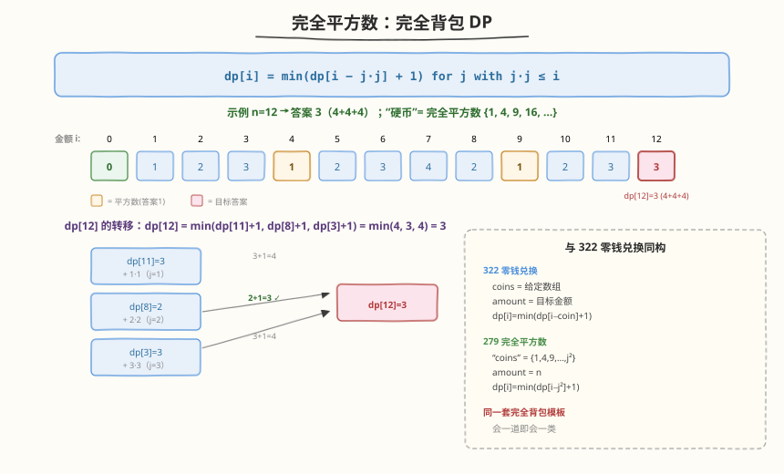
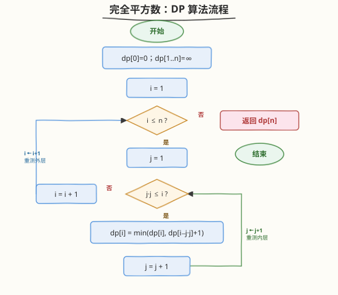
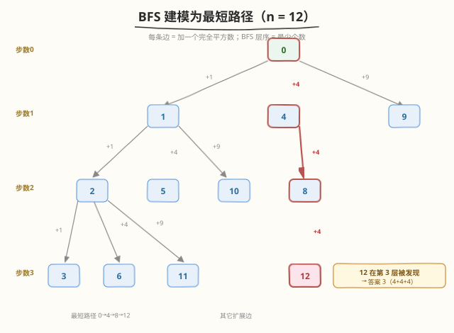

# 完全平方数

- **题目名称**：完全平方数
- **链接**：[279. 完全平方数](https://leetcode.cn/problems/perfect-squares/)
- **难度**：中等
- **标签**：动态规划、完全背包、广度优先搜索、数学

## 1. 题目概述

给你一个整数 `n`，返回和为 `n` 的**完全平方数**的**最少数量**。完全平方数是指某个整数的平方，如 `1, 4, 9, 16, ...`（每个可使用无限次）。

**示例 1**：

```text
输入：n = 12
输出：3
解释：12 = 4 + 4 + 4，共 3 个完全平方数。
```

**示例 2**：

```text
输入：n = 13
输出：2
解释：13 = 4 + 9，共 2 个完全平方数。
```

**约束条件**：

- `1 <= n <= 10^4`

> 💡 把完全平方数 `1, 4, 9, 16, ...` 看作「可无限使用的硬币」，本题就等价于 [322. 零钱兑换](322_零钱兑换.md)：用最少硬币凑出金额 `n`。两者是同一套完全背包模板的姐妹题。

---

## 2. 解题思路

### 2.1 暴力思路（回溯）

对每个 `n` 尝试减去所有不超过它的完全平方数，递归求解子问题。重叠子问题极多，复杂度指数级 `O(√n ^ 深度)`，严重超时。可加记忆化 → 即下面的 DP。

### 2.2 核心观察：完全背包 DP



关键洞察：令 `dp[i]` = 和为 `i` 的最少完全平方数个数。每个完全平方数 `j*j` 可重复使用（完全背包），转移方程：

$$
dp[i] = \min_{\,j:\, j^2 \le i} \bigl(dp[i - j^2] + 1\bigr)
$$

- `dp[0] = 0`（和为 0 不需要任何平方数）
- 外层遍历 `i = 1..n`，内层遍历 `j = 1, 2, ...` 直到 `j*j > i`

> 💡 **与 322 零钱兑换同构**：`coins` = `{1, 4, 9, 16, ...}`，`amount` = `n`。只是这里的「硬币」不是给定的数组，而是「所有不超过 `√n` 的平方数」，内层循环用 `j*j` 即可生成。掌握一道题就等于掌握一类题。

### 2.3 算法流程图



1. 初始化 `dp[0] = 0`，`dp[1..n] = +∞`
2. 外层 `i` 从 1 到 `n`：
   - 内层 `j` 从 1 开始，只要 `j*j <= i`：
     - `dp[i] = min(dp[i], dp[i - j*j] + 1)`
   - `j` 自增
3. 返回 `dp[n]`

### 2.4 示例演算

以 `n = 12` 为例（只列关键行）：

| i | 可选 $j^2$ | 候选 $dp[i-j^2]+1$ | $dp[i]$ | 说明 |
|---|-----------|--------------------|---------|------|
| 0 | — | — | 0 | 基例 |
| 1 | 1 | $dp[0]+1=1$ | 1 | =1 |
| 2 | 1 | $dp[1]+1=2$ | 2 | =1+1 |
| 3 | 1 | $dp[2]+1=3$ | 3 | =1+1+1 |
| 4 | 1, 4 | $dp[3]+1=4$；$dp[0]+1=1$ | 1 | =4 |
| 8 | 1, 4 | $dp[7]+1=5$；$dp[4]+1=2$ | 2 | =4+4 |
| 9 | 1, 4, 9 | $dp[8]+1=3$；$dp[5]+1=3$；$dp[0]+1=1$ | 1 | =9 |
| 12 | 1, 4, 9 | $dp[11]+1=4$；$dp[8]+1=3$；$dp[3]+1=4$ | 3 | =4+4+4 |

输出 `3`（`4+4+4`）。

---

## 3. 参考代码

### C++

```cpp
class Solution {
  public:
    int numSquares(int n) {
        vector<int> dp(n + 1, INT_MAX);
        dp[0] = 0;
        for (int i = 1; i <= n; ++i)
            for (int j = 1; j * j <= i; ++j)
                dp[i] = min(dp[i], dp[i - j * j] + 1);
        return dp[n];
    }
};
```

### Python

```python
class Solution:
    def numSquares(self, n: int) -> int:
        dp = [0] + [float('inf')] * n
        for i in range(1, n + 1):
            j = 1
            while j * j <= i:
                dp[i] = min(dp[i], dp[i - j * j] + 1)
                j += 1
        return dp[n]
```

---

## 4. 复杂度分析

| 维度 | 复杂度 | 说明 |
|------|--------|------|
| 时间复杂度 | `O(n√n)` | 外层 `n` 个状态，内层最多 `√n` 个平方数 |
| 空间复杂度 | `O(n)` | `dp` 数组长度 `n+1` |

> 💡 `n ≤ 10^4`，`√n ≤ 100`，总操作约 `10^6` 量级，远低于时限。

---

## 5. 扩展：BFS 解法与数学解法

### 5.1 BFS：把「凑数」建模为图最短路



把每个整数看作图中的节点，从 `u` 到 `u + j*j` 连一条边（边权为 1）。**从 0 出发到 `n` 的最短路径长度，就是最少完全平方数个数**。BFS 天然求无权图最短路：

```python
from collections import deque

class Solution:
    def numSquares(self, n: int) -> int:
        squares = [i * i for i in range(1, int(n ** 0.5) + 1)]
        visited = [False] * (n + 1)
        q = deque([(0, 0)])  # (当前和, 步数)
        visited[0] = True
        while q:
            cur, step = q.popleft()
            for s in squares:
                nxt = cur + s
                if nxt == n:
                    return step + 1
                if nxt < n and not visited[nxt]:
                    visited[nxt] = True
                    q.append((nxt, step + 1))
        return n  # 最坏 n 个 1 相加
```

> ⚠️ `visited` 必须在**入队时**标记，而非出队时，否则同一状态会被重复入队，退化为指数级。这是 BFS 求最短路的通用坑。

### 5.2 数学解法：拉格朗日四平方和定理

借助两个经典数论定理可做到 `O(√n)`：

- **拉格朗日四平方和定理**：任何自然数都可表示为至多 4 个完全平方数之和 → 答案 ∈ `{1, 2, 3, 4}`。
- **勒让德三平方和定理**：`n` 能表示为 3 个平方数之和，当且仅当 `n` **不是** $4^a(8b+7)$ 的形式。

由此得到判定流程：

1. 若 $n = 4^a(8b+7)$ → 答案为 **4**；
2. 若 `n` 本身是完全平方数 → 答案为 **1**；
3. 若 `n = a² + b²`（枚举 `a`，判断 `n-a²` 是否平方数）→ 答案为 **2**；
4. 否则 → 答案为 **3**。

```python
class Solution:
    def numSquares(self, n: int) -> int:
        def is_square(x: int) -> bool:
            r = int(x ** 0.5)
            return r * r == x

        m = n
        while m % 4 == 0:   # 提取 4^a
            m //= 4
        if m % 8 == 7:      # n = 4^a * (8b+7)
            return 4
        if is_square(n):
            return 1
        for a in range(1, int(n ** 0.5) + 1):
            if is_square(n - a * a):
                return 2
        return 3
```

> 💡 面试中 DP 是「必会标准解」，数学解法作为亮点展示数论功底。两者都要能讲清。

---

## 6. 面试要点

1. **为什么用 DP 而不是贪心？**

   - 贪心（每次取不超过剩余值的最大平方数）不总是最优。如 `n = 12`：贪心取 `9 + 1 + 1 + 1 = 4` 个，但最优是 `4 + 4 + 4 = 3` 个。
   - 平方数面额不满足贪心性质，必须 DP 穷举所有组合。

2. **这题和 322 零钱兑换是什么关系？**

   - 完全同构。`coins = {1, 4, 9, ..., j² ≤ n}`，`amount = n`，求最少硬币数。
   - 转移方程结构一致：`dp[i] = min(dp[i - c] + 1)`。会一道即会一类。

3. **完全背包为什么内层正序？**

   - 完全背包物品可无限用 → 内层容量正序（从小到大），保证 `dp[i - j²]` 可能已包含当前平方数，从而允许重复选取。
   - 若是 0-1 背包（每个物品只用一次）则内层倒序。本题允许重复，故正序。

4. **BFS 和 DP 各有什么优劣？**

   - 复杂度同为 `O(n√n)`。BFS 在「答案较小」时可能更早终止（一旦搜到 `n` 即返回），但常数更大、需 `visited` 数组。
   - DP 实现简洁、常数小，是面试首选；BFS 适合作为「图最短路建模」的思路展示。

5. **`INT_MAX` 做 `+1` 会溢出吗？**

   - 本题不会。`dp[i - j²]` 一定先于 `dp[i]` 算好且是有限值（最多 `i` 个 1），所以 `dp[i - j²] + 1` 不溢出。
   - 若担心，可用 `n + 1` 作为「不可能值」上界（最多用 `n` 个 1），与 322 的 `amount + 1` 技巧一致。

---

## 7. 同类练习题

- [322. 零钱兑换](https://leetcode.cn/problems/coin-change/)（[题解](322_零钱兑换.md)）：完全背包求最少个数，本题的「硬币」版本，同模板
- [518. 零钱兑换 II](https://leetcode.cn/problems/coin-change-ii/)：完全背包求「方案数」，注意组合数与排列数的循环顺序差异
- [377. 组合总和 IV](https://leetcode.cn/problems/combination-sum-iv/)：完全背包求「排列数」，外层容量、内层物品
- [416. 分割等和子集](https://leetcode.cn/problems/partition-equal-subset-sum/)：0-1 背包判定能否恰好装满，对比内层倒序
