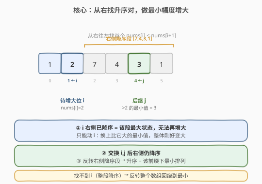
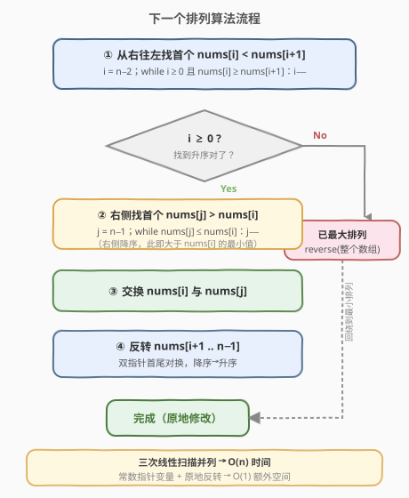

# 下一个排列

- **题目名称**：下一个排列
- **链接**：[31. 下一个排列](https://leetcode.cn/problems/next-permutation/)
- **难度**：中等
- **标签**：数组、双指针

## 1. 题目概述

给定一个整数数组 `nums`，要求将其重新排列成**字典序的下一个排列**。如果当前排列已经是字典序最大的（即降序），则将其重排为字典序最小的（升序）。必须**原地修改**，且使用常数额外空间。

**示例 1**：

```text
输入：nums = [1,2,3]
输出：[1,3,2]
解释：[1,2,3] 的下一个排列是 [1,3,2]。
```

**示例 2**：

```text
输入：nums = [3,2,1]
输出：[1,2,3]
解释：[3,2,1] 已是最大排列，回绕到最小排列 [1,2,3]。
```

**示例 3**：

```text
输入：nums = [1,1,5]
输出：[1,5,1]
```

**约束条件**：

- $1 \leq \text{nums.length} \leq 100$
- $0 \leq \text{nums}[i] \leq 100$
- **进阶**：$O(n)$ 时间、$O(1)$ 额外空间

> 💡 这是排列组合里最经典的"原地求下一个排列"算法，C++ 标准库的 `std::next_permutation` 就是同一套实现。看似没有套路，其实背后是「**尽可能少地增大**」的贪心思想——一次学透，能迁移到全排列去重、字典序相关的一类题。

---

## 2. 解题思路

### 2.1 暴力思路：枚举所有排列

生成 `nums` 的全部排列，排序后找到当前排列的下一个。但 $n$ 个元素的排列数为 $n!$，$n=100$ 时完全不可行，且违反原地、$O(1)$ 空间的要求。

> ⚠️ 暴力的痛点在于没抓住"下一个排列"的本质：它和当前排列**只有末尾一小段不同**，前面尽可能保持不变。所以解法应该是「**从右往左找一个能变大的位置，做最小幅度调整**」。

### 2.2 核心观察：从右找「第一个升序对」，做最小增大



把排列想象成一棵多叉树，越靠左的位**权重越大**。要让下一个排列「比当前大、又尽可能小」，必须：

1. **从右往左**找到第一对满足 $\text{nums}[i] < \text{nums}[i+1]$ 的位置 $i$——称 $i$ 为**待增大位**（pivot）。$i$ 右边必然是**降序**（否则更靠右就会先出现升序对）。
2. 在 $i$ 右边（降序段）里，从右往左找**第一个** $\text{nums}[j] > \text{nums}[i]$ 的 $j$——它就是「比 $\text{nums}[i]$ 大、又尽可能小」的替换值。
3. **交换** $\text{nums}[i]$ 与 $\text{nums}[j]$。交换后 $i$ 右侧仍保持降序（因为 $\text{nums}[j]$ 原本就是降序段中大于 $\text{nums}[i]$ 的最小者）。
4. **反转** $i$ 右侧的降序段，使其变成升序——即该段的最小排列，保证整体「刚好大一点点」。

> ⚠️ **特殊情况**：若步骤 ① 找不到这样的 $i$（整个数组降序），说明已是最大排列，直接反转整个数组得到最小排列。

### 2.3 算法流程图



**主流程**：

1. 令 $i = n-2$，**从右往左**扫描，找到第一个 $\text{nums}[i] < \text{nums}[i+1]$ 的 $i$。
2. 若 $i \geq 0$：令 $j = n-1$，**从右往左**找到第一个 $\text{nums}[j] > \text{nums}[i]$ 的 $j$，交换 $\text{nums}[i]$ 与 $\text{nums}[j]$。
3. **反转**子数组 $\text{nums}[i+1 \ldots n-1]$（双指针首尾对换）。

> 💡 **为什么反转而非排序？** 步骤 ① 之后 $i$ 右侧必定降序；步骤 ③ 交换后它**仍然降序**，所以「反转」一步到位得到升序，等价于排序但只需 $O(n)$ 双指针，无需 $O(n \log n)$。

### 2.4 示例演算

以 `nums = [1,2,7,4,3,1]` 为例：

![示例演算：[1,2,7,4,3,1] 的四步变化](images/nextperm_example_walkthrough.svg)

| 步骤 | 操作 | 数组状态 | 说明 |
|------|------|----------|------|
| ① 找 $i$ | 从右找首个升序对 | `[1,2,7,4,3,1]` | $\text{nums}[1]=2 < \text{nums}[2]=7$，故 $i=1$（右侧 `[7,4,3,1]` 降序） |
| ② 找 $j$ | 右侧找首个 $>\text{nums}[i]$ | 同上 | 从右：$1\not>2$、$3>2$ ✓，故 $j=4$（值为 3） |
| ③ 交换 | swap(nums[1], nums[4]) | `[1,3,7,4,2,1]` | 用 3 替换 2，整体变大但幅度最小 |
| ④ 反转 | reverse(nums[2..5]) | `[1,3,1,2,4,7]` | 右侧 `[7,4,2,1]`→`[1,2,4,7]`，得到该前缀下最小排列 |

> ⚠️ **验证**：`[1,3,1,2,4,7]` 确实 $>$ `[1,2,7,4,3,1]`（第二位 $3>2$），且在所有大于原排列的方案中前缀 `[1,3]` 已最小、右侧又取最小，故为下一个排列 ✓。

---

## 3. 参考代码

### C++（双指针 + 原地反转，$O(n)$ / $O(1)$）

```cpp
class Solution {
  public:
    void nextPermutation(vector<int>& nums) {
        int n = nums.size();
        // ① 从右往左找第一个升序对 nums[i] < nums[i+1]
        int i = n - 2;
        while (i >= 0 && nums[i] >= nums[i + 1]) --i;

        if (i >= 0) {
            // ② 右侧降序段中，从右找第一个 nums[j] > nums[i]
            int j = n - 1;
            while (nums[j] <= nums[i]) --j;
            // ③ 交换
            swap(nums[i], nums[j]);
        }
        // ④ 反转 i+1..n-1（i<0 时反转整个数组，即回绕到最小排列）
        reverse(nums.begin() + i + 1, nums.end());
    }
};
```

### Python

```python
class Solution:
    def nextPermutation(self, nums: List[int]) -> None:
        n = len(nums)
        # ① 从右往左找第一个升序对
        i = n - 2
        while i >= 0 and nums[i] >= nums[i + 1]:
            i -= 1

        if i >= 0:
            # ② 右侧降序段中，从右找第一个 nums[j] > nums[i]
            j = n - 1
            while nums[j] <= nums[i]:
                j -= 1
            # ③ 交换
            nums[i], nums[j] = nums[j], nums[i]

        # ④ 反转 i+1..n-1
        nums[i + 1:] = reversed(nums[i + 1:])
```

> 💡 两种写法逻辑完全一致。注意步骤 ① 用 `>=`（遇到相等要继续左移，因为相等不算"升序"），步骤 ② 用 `<=` 同理，确保找到的是严格更大的最小值。`i < 0` 时直接反转整个数组，对应"已是最大排列则回绕"。

---

## 4. 复杂度分析

| 维度 | 复杂度 | 说明 |
|------|--------|------|
| 时间复杂度 | $O(n)$ | 找 $i$、找 $j$、反转各至多遍历一遍数组，三次线性扫描叠加仍为 $O(n)$ |
| 空间复杂度 | $O(1)$ | 只用常数个指针变量，原地修改，未申请与 $n$ 相关的额外空间 |

> ⚠️ 三次扫描是**并列**不是嵌套，总操作数 $\le 3n$，故 $O(n)$；反转用首尾双指针交换也是线性。整个算法不递归、不开辅助数组，严格 $O(1)$ 额外空间。

---

## 5. 扩展：利用 next_permutation 求全排列

掌握了「下一个排列」，就能**非递归**地枚举所有排列：先把数组升序排序（最小排列），反复调用 `nextPermutation` 直到回到降序（最大排列）。这正是 C++ `std::next_permutation` 配合 `do-while` 的经典用法：

```cpp
sort(nums.begin(), nums.end());          // 最小排列起步
do {
    // 处理当前排列
} while (next_permutation(nums.begin(), nums.end()));
```

对比递归回溯求全排列：

| 方法 | 时间 | 空间 | 特点 |
|------|------|------|------|
| 递归回溯（交换法） | $O(n \cdot n!)$ | $O(n)$ 递归栈 | 实现直观，含重复元素需额外去重 |
| 迭代 next_permutation | $O(n \cdot n!)$ | $O(1)$ | 天然按字典序、含重复元素**自动跳过**重复排列 |

> 💡 对含重复元素的全排列（如 [47. 全排列 II](https://leetcode.cn/problems/permutations-ii/)），迭代法在 `①②` 中用严格 `>` / `<=` 比较即可天然避免重复，比回溯+剪枝更省心。

---

## 6. 面试要点

1. **为什么从右往左找第一个升序对？**
   - 越靠右的位权重越小，「下一个排列」要**尽可能保持高位不变**。从右找首个 $\text{nums}[i] < \text{nums}[i+1]$，意味着 $i$ 是「从右看第一个还能变大」的最高位；其右侧已是降序（最大状态），无法再增大，只能动 $i$。

2. **为什么 $i$ 右侧一定是降序？**
   - 若右侧存在 $\text{nums}[k] < \text{nums}[k+1]$，那扫描时 $k$ 比 $i$ 更靠右、会先被选中，矛盾。所以 $i$ 右侧严格降序，这也是步骤 ④ 能用「反转」代替「排序」的前提。

3. **为什么找 $j$ 也要从右往左？**
   - 右侧降序段里，从右往左第一个 $>\text{nums}[i]$ 的值，就是降序段中**大于 $\text{nums}[i]$ 的最小值**（降序段从右往左递增）。用它替换 $i$ 才能让整体「刚好变大」而非变得过大。

4. **交换后右侧为什么仍降序？**
   - 设 $j$ 是右侧降序段中「大于 $\text{nums}[i]$ 的最小值」，交换后位置 $j$ 放入更小的 $\text{nums}[i]$，它仍 $\le$ 原 $\text{nums}[j-1]$（若有）且 $\ge$ $\text{nums}[j+1]$（因为 $\text{nums}[i] < \text{nums}[j] \le \text{nums}[j-1]$，且 $\text{nums}[i] \ge \text{nums}[j+1]$ 当 $j+1$ 存在时成立），所以序列仍降序，可直接反转。

5. **整个数组降序时为什么直接反转？**
   - 降序即字典序最大排列，没有「下一个」更大的排列，按题意回绕到字典序最小排列（升序），而反转一次正好把降序变升序。

---

## 7. 同类练习题

- [556. 下一个更大元素 III](https://leetcode.cn/problems/next-greater-element-iii/)：把整数当成数字数组，套用同一算法求下一个更大排列，注意越界判断
- [670. 最大交换](https://leetcode.cn/problems/maximum-swap/)：同样是"找位+交换"的贪心，但目标是最大而非下一个，对比贪心方向差异
- [47. 全排列 II](https://leetcode.cn/problems/permutations-ii/)：含重复元素的全排列，可用迭代 `next_permutation` 天然去重
- [60. 排列序列](https://leetcode.cn/problems/permutation-sequence/)：求第 $k$ 个排列，理解字典序排列的生成规律后可用数学/康托展开加速
- [46. 全排列](https://leetcode.cn/problems/permutations/)（[题解](46_全排列.md)）：递归回溯求全排列，对比递归与迭代两种生成方式的取舍
