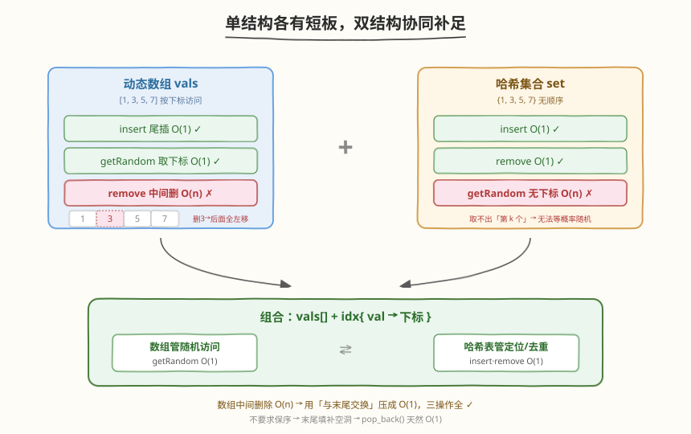
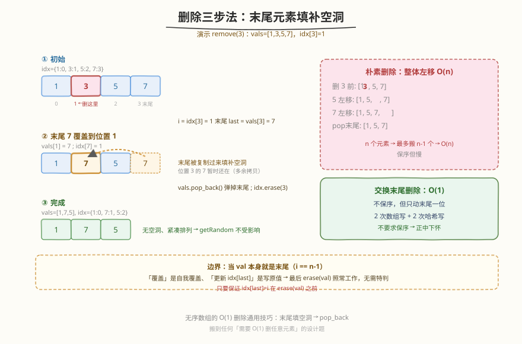
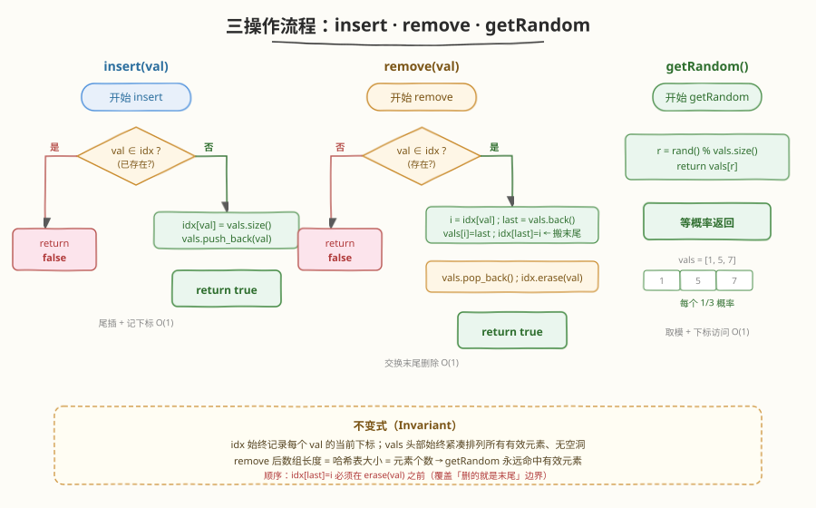

# O(1) 时间插入、删除和获取随机元素

- **题目名称**：O(1) 时间插入、删除和获取随机元素
- **链接**：[380. O(1) 时间插入、删除和获取随机元素](https://leetcode.cn/problems/insert-delete-getrandom-o1/)
- **难度**：中等
- **标签**：设计、哈希表、数组

## 1. 题目概述

实现一个 `RandomizedSet` 类，要求 `insert`、`remove`、`getRandom` 三个操作**平均时间复杂度均为 $O(1)$**：

- `insert(val)`：若 `val` 不存在则插入并返回 `true`，否则返回 `false`。
- `remove(val)`：若 `val` 存在则删除并返回 `true`，否则返回 `false`。
- `getRandom()`：从现有元素中**等概率**随机返回一个。保证调用时集合非空。

**示例 1**：

```text
输入
["RandomizedSet", "insert", "remove", "insert", "getRandom", "remove", "insert", "getRandom"]
[[], [1], [2], [2], [], [1], [2], []]
输出
[null, true, false, true, 2, true, false, 2]

解释
RandomizedSet r = new RandomizedSet();
r.insert(1);     // true, 集合 = {1}
r.remove(2);     // false, 2 不存在, 集合 = {1}
r.insert(2);     // true, 集合 = {1, 2}
r.getRandom();   // 返回 1 或 2, 各 1/2 概率
r.remove(1);     // true, 集合 = {2}
r.insert(2);     // false, 2 已存在, 集合 = {2}
r.getRandom();   // 返回 2
```

**约束条件**：

- $-2^{31} \leq \text{val} \leq 2^{31}-1$
- `insert`、`remove`、`getRandom` 总调用次数最多 $2 \times 10^5$
- 调用 `getRandom` 时数据结构中至少存在一个元素

> 💡 本题的考点不是「能不能做出来」，而是「**三个操作能否同时做到 $O(1)$**」。单用任何一种基础结构都顾此失彼，必须把**动态数组**和**哈希表**组合起来，并用一个「**删除时与末尾交换**」的技巧把数组的 $O(n)$ 删除压成 $O(1)$。这个交换技巧是本题的灵魂，也是面试官最想听的一句。

---

## 2. 解题思路

### 2.1 暴力思路：单结构各有短板

先看每种基础结构单独能否满足三个 $O(1)$：

| 结构 | `insert` | `remove` | `getRandom` | 瓶颈 |
|------|----------|----------|-------------|------|
| **动态数组** `vector` | $O(1)$（尾插） | $O(n)$（需搬移后续元素） | $O(1)$（按下标随机访问） | 删除要整体搬移 |
| **哈希集合** `unordered_set` | $O(1)$ | $O(1)$ | $O(n)$（无法按下标取，只能遍历） | 没有「第 k 个」的概念 |

数组能在 $O(1)$ 拿到「第 k 个」却删不掉中间元素；集合能 $O(1)$ 增删却拿不出「第 k 个」。**`getRandom` 必须依赖下标随机访问**，所以数组不能丢；**`remove` 的 $O(1)$ 判存在**又必须依赖哈希表。于是两者要配合使用。

### 2.2 核心观察：数组 + 哈希表，删除靠「与末尾交换」



维护两个结构：

1. **动态数组** `vals`：按插入顺序存放元素。`getRandom` 用 `vals[rand() % n]` 在 $O(1)$ 取出。
2. **哈希表** `idx`：`val → 在 vals 中的下标`。`insert`/`remove` 用 $O(1)$ 判存在并定位。

> ⚠️ 数组**中间删除**是 $O(n)$（要搬移后面所有元素）。要把它压成 $O(1)$，关键观察是：**题目不要求保持顺序**。于是可以把要删的元素和**末尾元素**交换位置，再弹出末尾——弹出末尾是 $O(1)$ 的。



**`remove(val)` 的三步法**（核心技巧）：

1. **定位**：`i = idx[val]`（哈希表 $O(1)$ 查到下标）。
2. **搬末尾**：把 `vals` 最后一个元素 `last` 复制到位置 `i`，即 `vals[i] = last`；同步更新 `idx[last] = i`（被搬走的末尾元素换了新下标）。
3. **弹末尾**：`vals.pop_back()` 删掉末尾（现在末尾是多余的旧拷贝），`idx.erase(val)` 删掉 `val` 的映射。

整个过程**不搬移任何其它元素**，只有两次数组写、两次哈希表写，故 $O(1)$。

> 💡 **为什么不直接 `swap(vals[i], vals.back())`？** 交换也能达到「末尾变成 val 再弹出」的效果，逻辑等价。但写成「先把 `last` 覆盖到 `i`，更新 `idx[last]`，再弹出末尾」更清晰地体现了「搬末尾填补空洞」的思想。注意一个**边界**：当 `val` 本身就是末尾元素时（`i == n-1`），`vals[i]=last` 是自我覆盖、`idx[last]=i` 也是原值，最后 `pop_back()` + `erase(val)` 照常工作，**无需特判**——只要保证「更新 `idx[last]`」在「`erase(val)`」之前即可。

### 2.3 算法流程图



**`insert(val)`**：
1. 若 `val ∈ idx` → 返回 `false`。
2. `idx[val] = vals.size()`；`vals.push_back(val)` → 返回 `true`。

**`remove(val)`**：
1. 若 `val ∉ idx` → 返回 `false`。
2. `i = idx[val]`；`last = vals.back()`。
3. `vals[i] = last`；`idx[last] = i`。
4. `vals.pop_back()`；`idx.erase(val)` → 返回 `true`。

**`getRandom()`**：返回 `vals[rand() % vals.size()]`。

> ⚠️ **顺序敏感**：第 3 步「`idx[last] = i`」必须在第 4 步「`idx.erase(val)`」**之前**。若先 `erase(val)` 再写 `idx[last]`，当 `val == last`（删的就是末尾）时会先把 `val` 删掉、又用 `last`(=val) 重新插回，导致映射残留。把「搬末尾 + 更新映射」做在「删除 val 映射」之前，可天然规避这个边界。

### 2.4 示例演算

以一组操作演示 `vals` 与 `idx` 的协同演变（重点看 `remove` 的交换过程）：


| 操作 | `vals`（数组） | `idx`（哈希表 val→下标） | 返回 | 说明 |
|------|----------------|--------------------------|------|------|
| `insert(1)` | `[1]` | `{1:0}` | `true` | 尾插，记下标 0 |
| `insert(3)` | `[1,3]` | `{1:0, 3:1}` | `true` | 尾插，记下标 1 |
| `insert(5)` | `[1,3,5]` | `{1:0, 3:1, 5:2}` | `true` | 尾插，记下标 2 |
| `insert(3)` | `[1,3,5]` | `{1:0, 3:1, 5:2}` | `false` | 已存在，直接拒绝 |
| `remove(3)` | `[1,5]` | `{1:0, 5:1}` | `true` | **末尾 5 搬到下标 1，弹末尾，删 3** |
| `getRandom()` | `[1,5]` | — | `1`/`5` | 各 1/2 概率 |
| `remove(1)` | `[5]` | `{5:0}` | `true` | 末尾 5 搬到下标 0，弹末尾，删 1 |
| `getRandom()` | `[5]` | — | `5` | 唯一元素 |

> 💡 **看 `remove(3)` 这一步**：`vals=[1,3,5]`，`idx[3]=1`。把末尾的 `5` 覆盖到下标 1 得 `[1,5,5]`，更新 `idx[5]=1`，再 `pop_back()` 得 `[1,5]`，最后 `erase(3)`。原本要删中间的 `3` 会牵连搬移，现在只动了末尾一位——**这就是 $O(1)$ 删除的全部秘密**。注意 `5` 的新下标从 2 变成 1，`getRandom` 完全不受影响，因为数组里始终是「有效元素紧凑排列在头部」。

---

## 3. 参考代码

### C++

```cpp
class RandomizedSet {
    vector<int> vals;                 // 动态数组：支撑 O(1) 随机访问
    unordered_map<int, int> idx;      // 哈希表：val -> 在 vals 中的下标
public:
    RandomizedSet() {}

    bool insert(int val) {
        if (idx.count(val)) return false;        // 已存在
        idx[val] = vals.size();                  // 记录将要插入的下标
        vals.push_back(val);                     // 尾插 O(1)
        return true;
    }

    bool remove(int val) {
        if (!idx.count(val)) return false;       // 不存在
        int i = idx[val];
        int last = vals.back();
        vals[i] = last;                          // 末尾元素搬到空洞位置
        idx[last] = i;                           // 更新被搬元素的新下标
        vals.pop_back();                         // 弹出末尾 O(1)
        idx.erase(val);                          // 删除 val 的映射
        return true;
    }

    int getRandom() {
        return vals[rand() % vals.size()];        // 等概率取一个
    }
};
```

### Python

```python
class RandomizedSet:
    def __init__(self):
        self.vals: list[int] = []          # 动态数组：支撑 O(1) 随机访问
        self.idx: dict[int, int] = {}      # 哈希表：val -> 在 vals 中的下标

    def insert(self, val: int) -> bool:
        if val in self.idx:                 # 已存在
            return False
        self.idx[val] = len(self.vals)      # 记录将要插入的下标
        self.vals.append(val)               # 尾插 O(1)
        return True

    def remove(self, val: int) -> bool:
        if val not in self.idx:             # 不存在
            return False
        i = self.idx[val]
        last = self.vals[-1]
        self.vals[i] = last                 # 末尾元素搬到空洞位置
        self.idx[last] = i                  # 更新被搬元素的新下标
        self.vals.pop()                     # 弹出末尾 O(1)
        del self.idx[val]                   # 删除 val 的映射
        return True

    def getRandom(self) -> int:
        return random.choice(self.vals)     # 等概率取一个
```

> ⚠️ **两个高频踩坑点**：
> （1）**先 `idx[last] = i` 再 `erase(val)`**。若反过来，当 `val == last`（删除的就是末尾元素）时，`erase(val)` 会先删掉 `last` 的映射，紧接着 `idx[last] = i` 又把它加回来，最后漏删。正确顺序天然覆盖该边界。
> （2）**`getRandom` 不能用 `set`**。哈希集合没有「第 k 个」的下标语义，`random.choice(set)` 在 Python 3 上会报错，必须先转 `list`（$O(n)$）。这正是我们必须保留一个数组的原因。

---

## 4. 复杂度分析

| 维度 | 复杂度 | 说明 |
|------|--------|------|
| **`insert` 时间** | $O(1)$ | 哈希表查一次 + 数组尾插一次，均摊常数 |
| **`remove` 时间** | $O(1)$ | 哈希表查一次 + 两次数组写 + 弹末尾 + 哈希表删一次，均摊常数 |
| **`getRandom` 时间** | $O(1)$ | 一次取模 + 一次下标访问 |
| **空间复杂度** | $O(n)$ | 数组与哈希表各存一份元素引用，$n$ 为当前元素个数 |

> 💡 三个操作都是**平均** $O(1)$——哈希表在最坏情况下（极端哈希冲突）会退化到 $O(n)$，但题目的数据规模与常规面试场景下均摊为 $O(1)$。若要严格最坏 $O(1)$，需用平衡树等结构，但会牺牲常数与实现简洁性，面试无需考虑。

---

## 5. 扩展：允许重复的版本（381）

[381. O(1) 时间插入、删除和获取随机元素 - 允许重复](https://leetcode.cn/problems/insert-delete-getrandom-o1-duplicates-fre) 把「集合」改成「**多重集合**」：同一 `val` 可插入多次，`getRandom` 按出现次数等概率返回。

**改造点**：

- `idx` 从 `val → 单个下标` 变成 `val → 下标集合`（用 `unordered_set<int>` 或 `set<int>` 存所有出现位置）。
- `insert(val)`：把 `vals.size()` 加入 `idx[val]` 这个集合，再尾插。
- `remove(val)`：从 `idx[val]` 任取一个下标 `i`，照旧把末尾搬到 `i`；不同的是，被搬走的 `last` 在 `idx[last]` 集合里要**先删旧下标 `n-1`、再加新下标 `i`**。
- 当 `idx[val]` 集合变空时，删除该 `val` 的键。

> 💡 框架与 380 完全一致，只是「一个值对应一个下标」升级为「一个值对应一组下标」。先吃透 380 的交换末尾思想，381 只是工程上多维护一个集合而已。

---

## 6. 面试要点

1. **为什么需要数组 + 哈希表两个结构？少一个行不行？**

   - `getRandom` 要求 $O(1)$ 等概率取一个，必须能按下标随机访问，这只有数组能做（集合无法按下标取）。而 `remove` 要 $O(1)$ 判存在并定位，数组是 $O(n)$ 查找，必须靠哈希表。两者各管一端：数组管「随机访问」，哈希表管「$O(1)$ 定位」，缺一不可。

2. **怎么把数组中间删除从 $O(n)$ 降到 $O(1)$？**

   - 利用「**不要求保持顺序**」这一条件：把要删的元素与末尾元素交换（更准确说是「把末尾覆盖到删除位置」），再弹出末尾。弹出末尾是 $O(1)$ 的，于是整个删除只剩常数次写操作。这个「交换末尾删除」是无序数组 $O(1)$ 删除的通用技巧。

3. **删除时为什么要先更新 `idx[last]` 再 `erase(val)`？**

   - 为了天然处理「删的就是末尾元素」的边界。当 `val == last` 时，若先 `erase(val)` 再 `idx[last] = i`，会先把映射删掉又重新写回，导致映射残留、数组与哈希表不一致。先更新 `idx[last]`（此时若 `val==last` 是写原值，无副作用）再 `erase(val)`，可保证无论是否删末尾都正确。

4. **`getRandom` 怎样保证等概率？**

   - 用 `vals[rand() % n]`。`rand() % n` 在 `0..n-1` 上均匀分布（忽略取模带来的微小偏差，面试范围内足够），每个下标概率 $1/n$。因为数组里**有效元素始终紧凑排在头部**（删除只是搬末尾填补空洞，不留下空隙），所以按下标取一定能取到有效元素且概率均等。

5. **如果只调用 `insert` 和 `getRandom`，从不 `remove`，还需要哈希表吗？**

   - 若 `insert` 允许重复，则不需要哈希表，数组尾插 + 随机下标即可。但本题 `insert` 要求「已存在则不插、返回 `false`」，必须 $O(1)$ 判存在，仍需哈希表。这说明**哈希表的存在是为 `insert` 的去重和 `remove` 的定位服务的**，不只是为了 `getRandom`。

---

## 7. 同类练习题

- [381. O(1) 时间插入、删除和获取随机元素 - 允许重复](https://leetcode.cn/problems/insert-delete-getrandom-o1-duplicates-fre/)：本题的「多重集合」版，`idx` 改存「下标集合」，巩固交换末尾删除技巧
- [146. LRU 缓存](https://leetcode.cn/problems/lru-cache/)（[题解](146_LRU缓存.md)）：同样是「哈希表 + 另一结构」的 $O(1)$ 设计题，对比「哈希 + 双向链表」与本题「哈希 + 动态数组」的选型差异
- [155. 最小栈](https://leetcode.cn/problems/min-stack/)（[题解](155_最小栈.md)）：辅助结构协同思想——用一个额外结构（辅助栈）补足主结构缺失的能力
- [705. 设计哈希集合](https://leetcode.cn/problems/design-hashset/)：从零实现哈希集合，理解哈希表内部「数组 + 链地址法」的构成，与本题「直接复用语言内置哈希表」形成对照
- [528. 按权重随机选择](https://leetcode.cn/problems/random-pick-with-weight/)：`getRandom` 的进阶版——按权重不等概率随机，用到前缀和 + 二分，对比等概率与加权随机的差异
