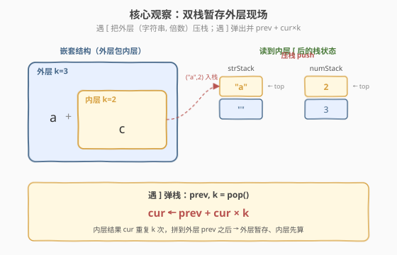
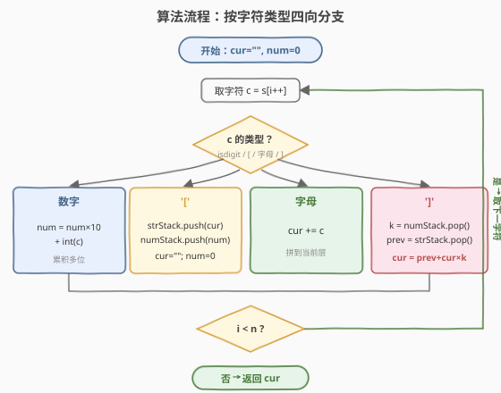

# 字符串解码

- **题目名称**：字符串解码
- **链接**：[394. 字符串解码](https://leetcode.cn/problems/decode-string/)
- **难度**：中等
- **标签**：栈、字符串、递归

## 1. 题目概述

给定一个经过编码的字符串 `s`，返回它解码后的结果。编码规则是：`k[encoded_string]`，表示其中的 `encoded_string` **重复 `k` 次**。`k` 保证为正整数。**方括号可以嵌套**，如 `3[a2[c]]` 解码为 `accaccacc`。

**示例 1**：

```text
输入：s = "3[a]2[bc]"
输出："aaabcbc"
```

**示例 2**：

```text
输入：s = "3[a2[c]]"
输出："accaccacc"
```

**示例 3**：

```text
输入：s = "2[abc]3[cd]ef"
输出："abcabccdcdcdef"
```

**约束条件**：

- `1 <= s.length <= 30`
- `s` 由小写英文字母、数字、方括号 `'[]'` 组成
- `s` 保证是一个**有效**的输入
- 所有整数都在 `[1, 300]` 范围内

> 💡 这是**栈处理嵌套结构**的招牌题。难点在于方括号可以任意嵌套，内层必须先解码、再交给外层重复。核心套路是 **双栈**：遇到 `'['` 把「当前结果和倍数」暂存入栈，遇到 `']'` 弹出上层并拼接。掌握这个「外层暂存、内层先算」的模板，括号匹配、表达式求值、嵌套解码都能举一反三。

---

## 2. 解题思路

### 2.1 暴力思路：递归向下解析

观察到 `k[...]` 是一个**自相似**结构：括号内仍是合法的编码串。最直观的写法是**递归**——扫描到 `'['` 就进入下一层递归，扫描到 `']'` 就返回当前层结果给上一层。

```text
def decode(s, i):
    while i < len(s):
        if s[i] 是数字: 累积得到 k
        elif s[i] == '[':
            sub, i = decode(s, i+1)   # 递归算内层
            cur += sub * k
        elif s[i] == ']':
            return cur, i             # 本层结束
        else:
            cur += s[i]
    return cur
```

时间复杂度 `O(解码后总长度)`，空间复杂度 `O(嵌套深度)`（递归栈）。逻辑清晰，但递归隐式调用栈在嵌套极深时不够直观，且面试官常追问「能否用迭代」。

> ⚠️ 递归法的问题：需要手动维护下标 `i` 的回传，容易写错；嵌套层数受系统递归栈限制（本题约束 30，实际不会爆栈，但理解迭代版更能体现「栈模拟递归」的通用思想）。

### 2.2 核心观察：双栈模拟递归——外层暂存，内层先算

递归的本质是「进入 `[` 时保存现场，遇到 `]` 时恢复现场」。这个「现场」就是**外层已拼好的字符串**和**外层的重复倍数**。我们用两个栈把这个过程显式化：

- **数字栈 `numStack`**：存每个 `[` 对应的倍数 `k`。
- **字符串栈 `strStack`**：存进入 `[` 之前外层已拼好的字符串。

维护两个当前变量：`cur`（当前层正在拼的字符串）、`num`（正在读取的倍数，支持多位）。

**四类字符的处理**：

| 字符 | 操作 |
|------|------|
| **数字** | `num = num * 10 + int(c)`（累积多位，如 `12` 要读两个字符） |
| **`'['`** | 把 `(cur, num)` 压入两个栈，然后 `cur = ""`、`num = 0`（为内层让路） |
| **字母** | `cur += c`（拼到当前层） |
| **`']'`** | 弹出 `prevStr` 和 `k`，令 `cur = prevStr + cur * k`（内层结果交给外层重复并拼接） |



**为什么这样可行？** 因为 `[` 出现时，外层的 `cur` 还没拼完（后面可能还有兄弟片段），必须先存起来；等内层 `]` 结束后，内层结果 `cur` 应当被外层倍数 `k` 重复，并拼回外层已存字符串 `prevStr` 之后。这一「压栈存现场、弹栈拼结果」恰好模拟了递归的进入与返回。

> 💡 **与递归的对应**：遇到 `[` 压栈 = 递归调用前保存现场；遇到 `]` 弹栈拼接 = 递归返回后用内层结果更新外层。双栈法就是把递归调用栈手动展开，省去下标传递，更不易出错。

### 2.3 算法流程图



**完整步骤**：

1. 初始化 `cur = ""`、`num = 0`，两个空栈。
2. 顺序遍历 `s` 的每个字符 `c`：
   - `c` 是数字：`num = num * 10 + (c - '0')`。
   - `c == '['`：`strStack.push(cur)`、`numStack.push(num)`；`cur = ""`、`num = 0`。
   - `c` 是字母：`cur += c`。
   - `c == ']'`：`k = numStack.pop()`、`prev = strStack.pop()`；`cur = prev + cur * k`。
3. 遍历结束，`cur` 即为完整解码结果（最外层无 `[]` 包裹，无需再弹栈）。

### 2.4 示例演算

以 `s = "3[a2[c]]"` 为例（嵌套两层，最能体现双栈价值）：

![示例演算：3[a2[c]] 逐步解码](images/decode_string_example_walkthrough.svg)

| 步骤 | 字符 | 操作 | cur | strStack | numStack |
|------|------|------|-----|----------|----------|
| 1 | `'3'` | 读数字 | `""` | `[]` | `[]`，`num=3` |
| 2 | `'['` | 压栈 `("",3)`，重置 | `""` | `[""]` | `[3]` |
| 3 | `'a'` | 拼字母 | `"a"` | `[""]` | `[3]` |
| 4 | `'2'` | 读数字 | `"a"` | `[""]` | `[3]`，`num=2` |
| 5 | `'['` | 压栈 `("a",2)`，重置 | `""` | `["","a"]` | `[3,2]` |
| 6 | `'c'` | 拼字母 | `"c"` | `["","a"]` | `[3,2]` |
| 7 | `']'` | 弹 `("a",2)`，`cur="a"+"c"×2="acc"` | `"acc"` | `[""]` | `[3]` |
| 8 | `']'` | 弹 `("",3)`，`cur=""+acc×3="accaccacc"` | `"accaccacc"` | `[]` | `[]` |

关键观察：**内层 `]` 先把 `"c"` 展成 `"cc"` 拼回外层 `"a"` 得到 `"acc"`，外层 `]` 再把 `"acc"` 重复 3 次**。栈的 LIFO 特性保证了「最内层先算」，与括号嵌套顺序天然吻合。

> 💡 注意第 4 步：读到 `'2'` 时 `cur` 仍是外层的 `"a"`，并未被重置——只有在遇到下一个 `'['` 时才压栈重置。这保证了外层已拼字符不会丢失。

---

## 3. 参考代码

### C++

```cpp
// 字符串解码.cpp —— 双栈模拟递归
// 编译: g++ -O2 -std=c++17 字符串解码.cpp -o decode
#include <string>
#include <stack>
using namespace std;

class Solution {
  public:
    string decodeString(string s) {
        stack<int> numStack;       // 倍数栈
        stack<string> strStack;    // 外层字符串栈
        string cur;
        int num = 0;
        for (char c : s) {
            if (isdigit(c)) {
                num = num * 10 + (c - '0');
            } else if (c == '[') {
                strStack.push(cur);
                numStack.push(num);
                cur.clear();
                num = 0;
            } else if (c == ']') {
                int k = numStack.top(); numStack.pop();
                string prev = strStack.top(); strStack.pop();
                string tmp = cur;
                cur = prev;
                while (k--) cur += tmp;
            } else {
                cur += c;
            }
        }
        return cur;
    }
};
```

### Python

```python
class Solution:
    def decodeString(self, s: str) -> str:
        num_stack = []    # 倍数栈
        str_stack = []    # 外层字符串栈
        cur = ""
        num = 0
        for c in s:
            if c.isdigit():
                num = num * 10 + int(c)
            elif c == '[':
                str_stack.append(cur)
                num_stack.append(num)
                cur = ""
                num = 0
            elif c == ']':
                k = num_stack.pop()
                prev = str_stack.pop()
                cur = prev + cur * k
            else:
                cur += c
        return cur
```

> 💡 Python 的字符串乘法 `cur * k` 直接得到重复结果，比 C++ 的循环拼接更简洁。注意拼接顺序是 `prev + cur * k`：`prev` 是外层已拼部分，`cur * k` 是内层展开结果，二者拼接不能反。

---

## 4. 复杂度分析

| 维度 | 复杂度 | 说明 |
|------|--------|------|
| **时间复杂度** | `O(解码后总长度)` | 每个输出字符只被「生成一次、拼一次」，与解码后字符串长度成正比 |
| **空间复杂度** | `O(嵌套深度 + 解码后长度)` | 两个栈深度等于最大嵌套层数；`cur` 最终存下完整结果 |

> ⚠️ 时间复杂度不能写成 `O(n)`（`n` 为输入长度）。如 `s = "300[a]"` 输入仅 6 字符，输出却达 300 字符。正确度量是**输出规模**，即解码后字符串的总长度。

---

## 5. 扩展：递归写法与位运算优化

### 5.1 递归写法（显式下标）

当面试官要求递归实现时，用引用或全局下标传递扫描位置：

```python
class Solution:
    def decodeString(self, s: str) -> str:
        self.i = 0
        def decode() -> str:
            cur, num = "", 0
            while self.i < len(s):
                c = s[self.i]
                self.i += 1
                if c.isdigit():
                    num = num * 10 + int(c)
                elif c == '[':
                    sub = decode()        # 递归算内层
                    cur += sub * num
                    num = 0
                elif c == ']':
                    return cur            # 本层结束，返回给上层
                else:
                    cur += c
            return cur
        return decode()
```

仍是 `O(解码后长度)` 时间、`O(嵌套深度)` 空间。两种写法本质同构，迭代版（双栈）更便于调试和扩展。

### 5.2 单栈存元组

可将两个栈合并为一个存 `(prevStr, k)` 元组的栈，逻辑等价、写法更紧凑：

```python
stack = []   # 元素为 (prev_str, k)
cur, num = "", 0
for c in s:
    if c.isdigit():
        num = num * 10 + int(c)
    elif c == '[':
        stack.append((cur, num))
        cur, num = "", 0
    elif c == ']':
        prev, k = stack.pop()
        cur = prev + cur * k
    else:
        cur += c
```

> 💡 面试中推荐先写双栈版（直观、易讲清「外层暂存、内层先算」），再提一句「可用元组栈合并」作为优化，体现对数据结构的灵活运用。

---

## 6. 面试要点

1. **为什么用栈而不是队列？**

   - 括号嵌套是「后进先出」结构：最内层的 `[` 必须最先被对应的 `]` 闭合、最先展开。栈的 LIFO 特性天然匹配这一顺序——遇到 `[` 压栈，遇到 `]` 弹栈，弹出的总是最近压入的内层现场。队列是 FIFO，无法保证内层先算。

2. **数字是多位时怎么处理？**

   - 倍数 `k` 可能是 `12`、`300` 这样的多位数。必须用 `num = num * 10 + int(c)` 累积，而不是直接 `num = int(c)`。常见 bug 是只读一位，遇到 `12[a]` 就会解码成 `a` 而非 12 个 `a`。题目约束 `k ∈ [1,300]`，至少要支持三位。

3. **遇到 `[` 时为什么要重置 `cur` 和 `num`？**

   - `[` 标志进入内层。内层有自己独立的字符串和倍数，若不重置，外层的 `cur` 会污染内层、外层的 `num` 会被内层覆盖。压栈保存的是「外层现场」，重置是为内层开辟干净的工作区，等内层 `]` 结束再恢复。

4. **`']'` 处理时拼接顺序为什么是 `prev + cur * k`？**

   - `prev` 是进入内层 `[` 前外层已拼好的部分（在 `cur` 之前出现），`cur` 是内层刚算出的结果。展开后内层结果应**接在** `prev` **之后**，所以是 `prev` 在前、`cur * k` 在后。顺序反了会得到错误结果。

5. **时间复杂度为什么不是 `O(n)`？**

   - `n` 是输入长度，但输出可能远大于输入（如 `300[a]` 输入 6 字符、输出 300 字符）。算法实际工作量与**输出规模**成正比，因为每个输出字符都要被生成和拼接。所以正确复杂度是 `O(解码后总长度)`，这是字符串展开类问题的通用度量。

> 💡 **一句话总结**：字符串解码是栈处理嵌套结构的招牌题——遇到 `[` 把外层现场（字符串 + 倍数）压栈，遇到 `]` 弹出并 `prev + cur * k` 拼接。核心思想是「外层暂存、内层先算」，与括号匹配、表达式求值同源。掌握双栈模板，所有嵌套解码题都能一通百通。

---

## 7. 同类练习题

- [20. 有效的括号](https://leetcode.cn/problems/valid-parentheses/)：栈处理括号匹配的入门题，本题的栈思想基础
- [71. 简化路径](https://leetcode.cn/problems/simplify-path/)：用栈处理路径分隔与回退，同属「栈维护嵌套/层级」套路
- [150. 逆波兰表达式求值](https://leetcode.cn/problems/evaluate-reverse-polish-notation/)：栈求值后缀表达式，与本题「遇操作符弹栈计算」同源
- [880. 索引处的解码字符串](https://leetcode.cn/problems/decoded-string-at-index/)：解码字符串的进阶变体，只问第 K 个字符，可用贪心避免完整展开
- [471. 编码最短长度的字符串](https://leetcode.cn/problems/encode-string-with-shortest-length/)：本题的逆问题——把字符串压缩成最短的 `k[...]` 编码，区间 DP
