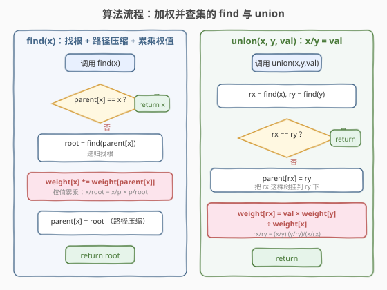
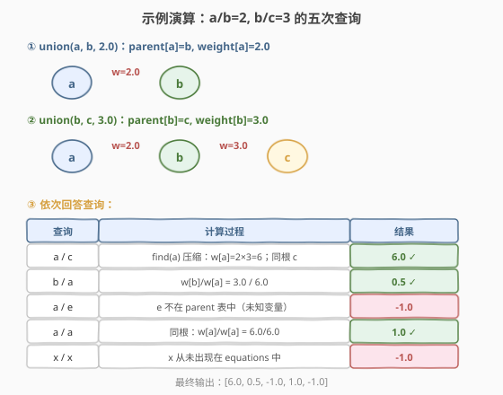

# 除法求值

- **题目名称**：除法求值
- **链接**：[399. 除法求值](https://leetcode.cn/problems/evaluate-division/)
- **难度**：中等
- **标签**：并查集、图、深度优先搜索、数组

## 1. 题目概述

给你一个变量对数组 `equations` 和一个实数值数组 `values`，其中 `equations[i] = [Ai, Bi]` 且 `values[i]` 表示 `Ai / Bi = values[i]`。每个 `Ai`、`Bi` 是互不相同的字符串变量。

再给你若干查询 `queries`，`queries[j] = [Cj, Dj]` 表示求 `Cj / Dj` 的值。若该比值无法由已知等式推出，返回 `-1.0`。

**示例 1**：

```text
输入：equations = [["a","b"],["b","c"]], values = [2.0,3.0]
     queries = [["a","c"],["b","a"],["a","e"],["a","a"],["x","x"]]
输出：[6.00000,0.50000,-1.00000,1.00000,-1.00000]
解释：a/b = 2.0，b/c = 3.0
     a/c = a/b × b/c = 2.0 × 3.0 = 6.0
     b/a = 1/2 = 0.5
     a/e 未知 → -1.0
     a/a = 1.0
     x/x 中 x 从未出现 → -1.0
```

**约束条件**：

- $1 \leq \text{equations.length} \leq 20$
- $\text{equations}[i].\text{length} == 2$，$1 \leq A_i.\text{length}, B_i.\text{length} \leq 5$
- $\text{values.length} == \text{equations.length}$
- $0.0 < \text{values}[i] \leq 20.0$
- $1 \leq \text{queries.length} \leq 20$
- 变量名均为小写英文字母

> 💡 本题是 [547. 省份数量](547_省份数量.md) 中**基础并查集**的进阶版：节点间不再只有「连通 / 不连通」这一信息，还附带**比值**。只要给并查集的每条父指针加一个**权值** `weight[x] = x / parent[x]`，就能在 `find` 路径压缩时顺手累乘权值，把任意两点的比值算出来——这就是**加权并查集**模板。

---

## 2. 解题思路

### 2.1 暴力思路：枚举所有变量对

对每对变量 $(u, v)$，用 Floyd 式传递闭包预计算比值：若已知 $u/w$ 与 $w/v$，则 $u/v = u/w \times w/v$。枚举所有中间变量 $w$ 反复松弛，直到比值不再变化。每次查询 $O(1)$，但变量数多时预处理为 $O(n^3)$，且实现啰嗦。

> ⚠️ 暴力的浪费在于：我们其实**只关心两点是否在同一连通分量、以及路径上的权值之积**，并不需要知道每对变量的精确比值。并查集天然维护「同分量」关系，加个权值就能顺带算比值，比全对全预计算更轻量。

### 2.2 核心观察：比值沿路径相乘 = 加权并查集

**关键转化**：把每个变量看作节点，等式 $a/b = v$ 看作一条带权边 $a \to b$（权值 $v$）和反向边 $b \to a$（权值 $1/v$）。同一连通分量内任意两点的比值，等于**沿路径权值之积**。

![核心观察：比值沿路径相乘，weight[x] = x / parent[x]](images/evaluate_division_concept.svg)

给并查集增加一个**权值数组** `weight[x]`，表示 `x` 到其父节点的比值：

$$\text{weight}[x] = \frac{x}{\text{parent}[x]}$$

于是从任一节点 $x$ 沿父指针走到根 `root`，累乘的权值就是 $x / \text{root}$。查询 $x/y$ 时：

- 若 `find(x) != find(y)`（不同分量）→ 比值未知，返回 `-1.0`；
- 若同根，则 $\dfrac{x}{y} = \dfrac{x/\text{root}}{y/\text{root}} = \dfrac{\text{weight}[x]}{\text{weight}[y]}$。

> 💡 这正是 [547. 省份数量](547_省份数量.md) 中 `find(x) == find(y)` 判连通的升级版：基础并查集只问「是否同根」，加权并查集还顺带问「同根的话比值是多少」。多维护一个 `weight` 数组即可，开销几乎不变。

### 2.3 算法流程图：find 与 union 的权值维护



**`find(x)`（带权路径压缩）**：

1. 若 `parent[x] == x`，`x` 是根，返回 `x`。
2. 否则递归 `root = find(parent[x])`。
3. **权值累乘**：`weight[x] *= weight[parent[x]]`（此时 `parent[x]` 的 `weight` 已被压缩成 `parent[x]/root`，相乘后 `weight[x]` 变为 `x/root`）。
4. **路径压缩**：`parent[x] = root`。
5. 返回 `root`。

> ⚠️ 第 3 步顺序很关键：必须先用 `parent[x]`（旧父）查 `weight`，再把 `parent[x]` 改成 `root`。递归返回时 `weight[parent[x]]` 已经是 `旧父/root`，所以 `weight[x] *= weight[parent[x]]` 后 `weight[x] = (x/旧父) × (旧父/root) = x/root`。

**`union(x, y, val)`**（已知 $x/y = \text{val}$）：

1. `rx = find(x)`，`ry = find(y)`。
2. 若 `rx == ry`，已同分量，跳过。
3. 否则把 `rx` 挂到 `ry` 下：`parent[rx] = ry`，并计算 `weight[rx]`：

$$\text{weight}[rx] = \frac{rx}{ry} = \frac{x / y \cdot y / ry}{x / rx} = \frac{\text{val} \times \text{weight}[y]}{\text{weight}[x]}$$

> 💡 推导：$x = \text{weight}[x] \cdot rx$，$y = \text{weight}[y] \cdot ry$，故 $rx/ry = (x/\text{weight}[x]) / (y/\text{weight}[y]) = (x/y) \cdot (\text{weight}[y]/\text{weight}[x]) = \text{val} \cdot \text{weight}[y] / \text{weight}[x]$。

### 2.4 示例演算

以 `equations = [["a","b"],["b","c"]]`，`values = [2.0, 3.0]` 为例：



| 步 | 操作 | parent / weight 变化 | 说明 |
|----|------|----------------------|------|
| ① | `union(a, b, 2.0)` | `parent[a]=b`，`weight[a]=2.0` | $a/b = 2.0$ |
| ② | `union(b, c, 3.0)` | `parent[b]=c`，`weight[b]=3.0` | $b/c = 3.0$；此时 `a` 仍指向 `b`，权值未压缩 |

接着回答查询：

| 查询 | find 过程 | 计算 | 结果 |
|------|-----------|------|------|
| `a/c` | `find(a)`：`a→b→c`，压缩后 `parent[a]=c`，`weight[a]=2×3=6.0`；`find(c)=c`，`weight[c]=1.0` | $6.0/1.0$ | `6.0` |
| `b/a` | `find(b)=c`(`weight[b]=3.0`)，`find(a)=c`(`weight[a]=6.0`) | $3.0/6.0$ | `0.5` |
| `a/e` | `e` 不在 `parent` 表中 | 未知变量 | `-1.0` |
| `a/a` | 同根 `c` | $6.0/6.0$ | `1.0` |
| `x/x` | `x` 从未在 `equations` 中出现 | 未知变量 | `-1.0` |

> 💡 注意 `a/c` 这一步触发了**路径压缩**：`find(a)` 沿 `a→b→c` 找到根 `c`，回溯时把 `weight[a]` 从 `2.0` 累乘 `weight[b]=3.0` 更新为 `6.0`，并把 `parent[a]` 直接指向 `c`。此后再查 `a` 的比值就是 $O(1)$。

---

## 3. 参考代码

### C++

```cpp
// 除法求值.cpp —— 加权并查集
// 编译: g++ -O2 -std=c++17 除法求值.cpp -o ed
class Solution {
  public:
    vector<double> calcEquation(vector<vector<string>>& equations,
                                vector<double>& values,
                                vector<vector<string>>& queries) {
        unordered_map<string, string> parent;
        unordered_map<string, double> weight;

        auto find = [&](auto&& self, const string& x) -> string {
            if (parent[x] != x) {
                string orig = parent[x];          // 记住旧父
                parent[x] = self(self, orig);     // 递归找根 + 压缩
                weight[x] *= weight[orig];        // 累乘：x/root = x/旧父 × 旧父/root
            }
            return parent[x];
        };

        auto unite = [&](const string& x, const string& y, double val) {
            if (!parent.count(x)) { parent[x] = x; weight[x] = 1.0; }
            if (!parent.count(y)) { parent[y] = y; weight[y] = 1.0; }
            string rx = find(find, x), ry = find(find, y);
            if (rx == ry) return;
            parent[rx] = ry;
            weight[rx] = val * weight[y] / weight[x];   // rx/ry = (x/y)·(y/ry)/(x/rx)
        };

        // 1. 建图：把每条等式 union 进并查集
        for (int i = 0; i < (int)equations.size(); ++i) {
            unite(equations[i][0], equations[i][1], values[i]);
        }

        // 2. 回答查询
        vector<double> ans;
        for (auto& q : queries) {
            const string& x = q[0];
            const string& y = q[1];
            if (!parent.count(x) || !parent.count(y)) {
                ans.push_back(-1.0);               // 未知变量
                continue;
            }
            string rx = find(find, x), ry = find(find, y);
            if (rx != ry) {
                ans.push_back(-1.0);               // 不同分量
            } else {
                ans.push_back(weight[x] / weight[y]);
            }
        }
        return ans;
    }
};
```

### Python

```python
class Solution:
    def calcEquation(self, equations: list[list[str]], values: list[float],
                     queries: list[list[str]]) -> list[float]:
        parent: dict[str, str] = {}
        weight: dict[str, float] = {}

        def find(x: str) -> str:
            if parent[x] != x:
                orig = parent[x]            # 旧父
                parent[x] = find(orig)      # 递归找根 + 压缩
                weight[x] *= weight[orig]   # 累乘：x/root = x/旧父 × 旧父/root
            return parent[x]

        def union(x: str, y: str, val: float) -> None:
            if x not in parent:
                parent[x], weight[x] = x, 1.0
            if y not in parent:
                parent[y], weight[y] = y, 1.0
            rx, ry = find(x), find(y)
            if rx == ry:
                return
            parent[rx] = ry
            weight[rx] = val * weight[y] / weight[x]   # rx/ry = (x/y)·(y/ry)/(x/rx)

        # 1. 建图：把每条等式 union 进并查集
        for (a, b), v in zip(equations, values):
            union(a, b, v)

        # 2. 回答查询
        ans = []
        for x, y in queries:
            if x not in parent or y not in parent:
                ans.append(-1.0)            # 未知变量
            elif find(x) != find(y):
                ans.append(-1.0)            # 不同分量
            else:
                ans.append(weight[x] / weight[y])
        return ans
```

> 💡 **两个易错点**：(1) `find` 中必须**先记下旧父 `orig`**，再递归、再累乘 `weight[orig]`，否则递归会改变 `parent[x]` 导致取错；(2) `union` 里 `weight[rx]` 公式是 `val * weight[y] / weight[x]`，**不是** `val * weight[x] / weight[y]`——记不住就当场用 $x = w[x] \cdot rx$ 推一遍。

---

## 4. 复杂度分析

| 维度 | 加权并查集 | 图 BFS/DFS |
|------|-----------|-----------|
| **时间复杂度** | $O((E + Q) \cdot \alpha(N) \cdot L)$ | $O(Q \cdot (E + N))$ |
| **空间复杂度** | $O(N)$（`parent` + `weight`） | $O(N + E)$（邻接表） |
| **推荐度** | ✅ 面试首选，模板通用、可动态加边 | 思路直观，单次查询需遍历分量 |

> 说明：$N$ 为变量数（$\leq 40$），$E$ 为等式数（$\leq 20$），$Q$ 为查询数（$\leq 20$），$L$ 为字符串比较开销。并查集单次 `find/union` 均摊 $O(\alpha(N))$ 近似常数，建图 $E$ 次 `union` + 查询 $Q$ 次 `find`，整体近似 $O(E + Q)$。图法对每个查询都要在分量内 BFS/DFS 累乘权值，查询多了更慢。

---

## 5. 扩展：图 BFS / DFS 解法

把每条等式建成**双向带权邻接表**（$a \to b$ 权 $v$，$b \to a$ 权 $1/v$）。对每个查询 $(c, d)$ 从 $c$ 出发 BFS/DFS 找到 $d$，路径上权值之积即为答案；找不到则 `-1.0`。

```python
from collections import defaultdict, deque

class Solution:
    def calcEquation(self, equations, values, queries):
        graph = defaultdict(dict)
        for (a, b), v in zip(equations, values):
            graph[a][b] = v
            graph[b][a] = 1.0 / v

        def bfs(start: str, end: str) -> float:
            if start not in graph or end not in graph:
                return -1.0
            if start == end:
                return 1.0
            visited = {start}
            q = deque([(start, 1.0)])
            while q:
                node, prod = q.popleft()
                for nxt, w in graph[node].items():
                    if nxt == end:
                        return prod * w
                    if nxt not in visited:
                        visited.add(nxt)
                        q.append((nxt, prod * w))
            return -1.0

        return [bfs(c, d) for c, d in queries]
```

> 💡 **并查集 vs 图 BFS 对照**：两者都在「沿路径累乘权值」。并查集通过 `find` 的路径压缩把任意路径预先压成「直接连根」，查询近乎 $O(1)$；图 BFS 每次查询都要重新遍历分量。当查询很多、图动态加边时并查集更优；当图是静态且查询少时两者皆可。面试先讲并查集（模板性强、可讲剪枝），再提 BFS 作为「思路更直观的备选」。

---

## 6. 面试要点

1. **`weight[x]` 的含义是什么？为什么查询时是 `weight[x]/weight[y]`？**

   > `weight[x]` 表示 $x$ 到其（当前）父节点的比值，即 $x / \text{parent}[x]$。`find` 路径压缩后 `weight[x]` 变为 $x / \text{root}$。因此 $x / y = (x/\text{root}) / (y/\text{root}) = \text{weight}[x] / \text{weight}[y]$。

2. **`find` 中为什么要先记 `orig = parent[x]` 再递归？**

   > 递归 `find(parent[x])` 会把 `parent[x]` 改成根，若不提前保存旧父，压缩后就取不到旧的 `weight[parent[x]]`。正确顺序：记旧父 → 递归找根 → 用旧父的（已被压缩的）`weight` 累乘 → 把 `parent[x]` 指向根。

3. **`union` 里 `weight[rx]` 的公式怎么推？**

   > 由 $x = \text{weight}[x] \cdot rx$、$y = \text{weight}[y] \cdot ry$，得 $rx/ry = (x/\text{weight}[x])/(y/\text{weight}[y]) = (x/y) \cdot (\text{weight}[y]/\text{weight}[x]) = \text{val} \cdot \text{weight}[y] / \text{weight}[x]$。把 `rx` 挂到 `ry` 下时 `weight[rx]` 就等于 $rx/ry$。

4. **哪些情况返回 `-1.0`？**

   > 两种：(1) 查询的变量从未在 `equations` 中出现（不在 `parent` 表里）；(2) 两个变量分属不同连通分量（`find(x) != find(y)`），即没有已知路径把它们连起来。注意 $x/x$ 在 $x$ 未知时也是 `-1.0`，不能直接返回 `1.0`。

5. **加权并查集相比基础并查集多了什么？能解决哪类问题？**

   > 多了一个 `weight` 数组，在 `find` 路径压缩时顺带维护「节点到根的累积权值」。它把并查集从「只判连通」升级为「判连通 + 算路径权值之积/和」，适用于带权连通性问题：除法求值、带权等式约束、差分约束的等价类合并等。

> 💡 **一句话总结**：399 是**加权并查集**的范本——在基础并查集（[547](547_省份数量.md)）的 `parent` 之外加一个 `weight[x] = x/parent[x]`，`find` 时累乘权值并路径压缩，`union` 时用 $\text{val} \cdot \text{weight}[y] / \text{weight}[x]$ 算出新根权值，查询时返回 $\text{weight}[x] / \text{weight}[y]$。这套「带权路径压缩」模板可迁移到所有「连通 + 路径权值」类问题。

---

## 7. 同类练习题

- [547. 省份数量](https://leetcode.cn/problems/number-of-provinces/)（[题解](547_省份数量.md)）：基础并查集模板，本题的前置知识，对照「无权 vs 加权」的差别
- [684. 冗余连接](https://leetcode.cn/problems/redundant-connection/)：并查集判环，加边时两端已同根即为冗余边，巩固 `union` 流程
- [990. 等式方程的可满足性](https://leetcode.cn/problems/satisfiability-of-equality-equations/)：先 union 等式、再查不等式是否冲突，并查集判约束一致性的直接应用
- [721. 账户合并](https://leetcode.cn/problems/accounts-merge/)：并查集合并同名账户下的邮箱，模板进阶（字符串节点 + 分组收集）
- [1631. 最小体力消耗路径](https://leetcode.cn/problems/path-with-minimum-effort/)：并查集按边权排序逐条加边，直到起点终点连通，加权并查集的二分/排序变体
