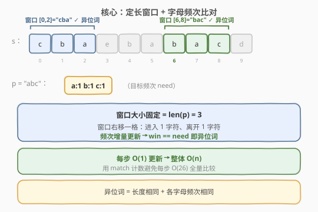
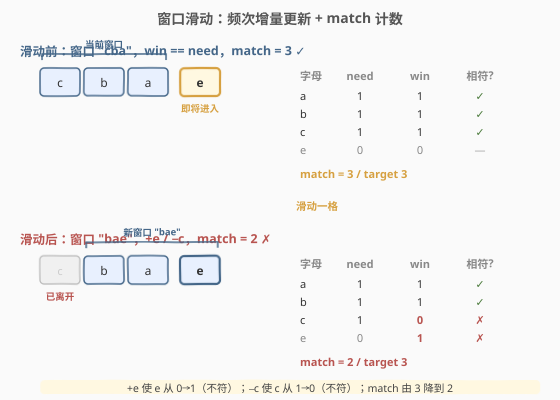
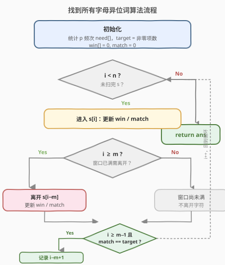
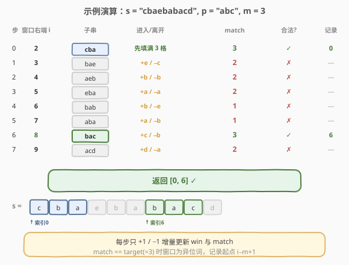

# 找到字符串中所有字母异位词

- **题目名称**：找到字符串中所有字母异位词
- **链接**：[438. 找到字符串中所有字母异位词](https://leetcode.cn/problems/find-all-anagrams-in-a-string/)
- **难度**：中等
- **标签**：哈希表、字符串、滑动窗口

## 1. 题目概述

给定两个字符串 `s` 和 `p`，找到 `s` 中所有 `p` 的**字母异位词**的子串，返回这些子串的**起始索引**。字母异位词指由相同字母重排列形成的字符串（包括相同字符串）。

答案可以按**任意顺序**返回。

**示例 1**：

```text
输入：s = "cbaebabacd", p = "abc"
输出：[0,6]
解释：起始索引 0 的子串 "cba" 是 "abc" 的异位词；起始索引 6 的子串 "bac" 也是。
```

**示例 2**：

```text
输入：s = "abab", p = "ab"
输出：[0,1,2]
解释：起始索引 0/1/2 的子串 "ab"/"ba"/"ab" 都是 "ab" 的异位词。
```

**约束条件**：

- `1 <= s.length, p.length <= 3 * 10^4`
- `s` 和 `p` 仅包含小写英文字母

> ⚠️ **关键性质**：异位词的本质是「**长度相同 + 各字母频次相同**」。`p` 长度固定为 `m`，所以要在 `s` 中找所有长度恰为 `m` 且字母频次与 `p` 一致的窗口——这是典型的**定长滑动窗口**。

---

## 2. 解题思路

### 2.1 暴力思路

枚举 `s` 中每个长度为 `m` 的子串，排序后与排序后的 `p` 比较，或统计其字母频次与 `p` 比较。共 `O(n − m)` 个子串，每个比较 `O(m)` 或 `O(Σ)`（`Σ = 26`），总 `O(n·m)` 或 `O(n·Σ)`。能过但未利用「相邻窗口只差一个字符」的性质，存在更优解。

### 2.2 核心观察：定长窗口 + 频次比对



由于 `p` 长度固定，窗口大小恒为 `m = len(p)`。窗口从左到右每次**右移一格**：进入一个新字符、弹出一个旧字符。窗口内字母频次只需**增量更新**（一加一减），不必重新统计。

> 💡 **关键转化**：维护窗口频次数组 `win[26]` 与目标频次 `need[26]`，每次滑动 `O(1)` 更新 `win`；窗口合法当且仅当 `win == need`。为了不每步 `O(26)` 全量比较，再用一个变量 `match` 记录「频次相符的字母数」，使合法性判断也降到 `O(1)`。

### 2.3 增量更新 + match 计数



设 `need[c]` 为 `p` 中字母 `c` 的频次，`win[c]` 为当前窗口中 `c` 的频次，`match` 记录满足 `win[c] == need[c]` 的字母个数（最多 26）。窗口右移一格时：

- **进入字符 `in`**：`win[in]++`。
  - 若更新后 `win[in] == need[in]`：`match++`。
  - 若更新前 `win[in] == need[in]`（现在多了一个）：`match−−`。
- **离开字符 `out`**：`win[out]−−`。
  - 若更新后 `win[out] == need[out]`：`match++`。
  - 若更新前 `win[out] == need[out]`（现在少了一个）：`match−−`。
- 当 `match == need 中非零字母数`（即所有目标字母频次都吻合）时，窗口合法，记录起始索引。

> ⚠️ **边界**：窗口大小 `m` 可能大于 `n`，此时无解直接返回空；`match` 的「目标值」是 `need` 中非零项的个数（即 `p` 中出现的不同字母数），而非 26。

### 2.4 算法流程图



### 2.5 示例演算

以 `s = "cbaebabacd", p = "abc"` 为例，`m = 3`，`need = {a:1,b:1,c:1}`，目标 `match == 3`：



| 窗口右端 | 子串 | 进入/离开 | match | 合法? | 记录索引 |
|----------|------|-----------|-------|-------|----------|
| 初始 [c,b,a] | "cba" | 先填满 3 格 | 3 | ✓ | 0 |
| 右移→[b,a,e] | "bae" | +e / −c | 2 | ✗ | — |
| 右移→[a,e,b] | "aeb" | +b / −b | 2 | ✗ | — |
| 右移→[e,b,a] | "eba" | +a / −a | 2 | ✗ | — |
| 右移→[b,a,b] | "bab" | +b / −e | 1 | ✗ | — |
| 右移→[a,b,a] | "aba" | +a / −b | 1 | ✗ | — |
| 右移→[b,a,c] | "bac" | +c / −b | 3 | ✓ | 6 |
| 右移→[a,c,d] | "acd" | +d / −a | 2 | ✗ | — |

最终返回 `[0, 6]` ✓。注意每个窗口只需 `O(1)` 增量更新，共 `O(n)` 步。

---

## 3. 参考代码

### C++

```cpp
class Solution {
  public:
    vector<int> findAnagrams(string s, string p) {
        vector<int> ans;
        int n = s.size(), m = p.size();
        if (m > n) return ans;

        array<int, 26> need{}, win{};
        for (char c : p) need[c - 'a']++;

        int target = 0;                      // need 中非零字母数
        for (int i = 0; i < 26; i++)
            if (need[i] > 0) target++;

        int match = 0;
        for (int i = 0; i < n; i++) {
            // 进入字符 s[i]
            int in = s[i] - 'a';
            if (win[in] == need[in]) match--;
            win[in]++;
            if (win[in] == need[in]) match++;

            // 离开字符 s[i - m]
            if (i >= m) {
                int out = s[i - m] - 'a';
                if (win[out] == need[out]) match--;
                win[out]--;
                if (win[out] == need[out]) match++;
            }

            // 窗口大小达到 m 时判断
            if (i >= m - 1 && match == target) {
                ans.push_back(i - m + 1);
            }
        }
        return ans;
    }
};
```

### Python

```python
class Solution:
    def findAnagrams(self, s: str, p: str) -> List[int]:
        n, m = len(s), len(p)
        if m > n:
            return []

        need = [0] * 26
        for c in p:
            need[ord(c) - 97] += 1
        target = sum(1 for x in need if x > 0)   # need 中非零字母数

        win = [0] * 26
        match = 0
        ans = []
        for i, ch in enumerate(s):
            # 进入字符
            idx = ord(ch) - 97
            if win[idx] == need[idx]:
                match -= 1
            win[idx] += 1
            if win[idx] == need[idx]:
                match += 1

            # 离开字符
            if i >= m:
                out = ord(s[i - m]) - 97
                if win[out] == need[out]:
                    match -= 1
                win[out] -= 1
                if win[out] == need[out]:
                    match += 1

            if i >= m - 1 and match == target:
                ans.append(i - m + 1)
        return ans
```

---

## 4. 复杂度分析

| 维度 | 复杂度 | 说明 |
|------|--------|------|
| 时间复杂度 | O(n + m) | 预处理 `p` 频次 `O(m)`；扫描 `s` 一遍 `O(n)`，每步增量更新与合法性判断均 `O(1)` |
| 空间复杂度 | O(Σ) | `need`、`win` 各 26 个整型，`Σ = 26` 为常数 |

> 💡 由于字母表固定为 26 个小写字母，空间实为 `O(1)`；时间已是下界 `O(n)`（必须至少扫一遍 `s`）。

---

## 5. 扩展：不定长窗口与 match 的通用性

本题是**定长**滑动窗口；若改为**不定长**（如 [76. 最小覆盖子串] 求「包含 `t` 所有字符的最短子串」），`match` 计数法依然适用——只是窗口大小可变，需在 `match == target` 时尝试收缩左端求最短。

> 💡 **match 计数的通用价值**：凡是用频次/计数判断窗口合法性的题，都可用「记录相符项数」把合法性判断从 `O(Σ)` 降到 `O(1)`。这是 76、567、438 一系列「字符串匹配窗口」题的共同优化手段。也可用 `collections.Counter` 直接比较，写法更简洁但常数略大。

---

## 6. 面试要点

1. **为什么用滑动窗口而不是双指针？**
   - 本题窗口大小固定为 `m = len(p)`，是「定长窗口」；双指针通常用于窗口大小可变的场景（如 76 题）。两者本质都是维护一个区间，但定长窗口只需单指针移动 + 固定步长离开。

2. **`match` 计数如何把合法性判断降到 O(1)？**
   - 不每步比较整个 `win` 与 `need`（`O(26)`），而是维护「频次相符的字母数」`match`；当 `match == target`（`need` 中非零字母数）即合法。每次 `win` 增减只可能影响当前字符的相符状态，故 `match` 更新为 `O(1)`。

3. **进入和离开字符的更新顺序能否颠倒？**
   - 可以，但要注意「先判断旧状态再改 `win`」的逻辑：必须用更新**前**的 `win[c] == need[c]` 决定是否 `match−−`，用更新**后**的判断是否 `match++`。颠倒在 `in == out`（同一字符进出的罕见情况）时需小心，但上述写法对它也安全。

4. **`target` 为什么是 `need` 中非零字母数而不是 26？**
   - `match` 只统计「需要且正好相符」的字母；`p` 不含的字母其 `need` 为 0，`win` 也应为 0 才算相符，但它们不参与「是否构成异位词」的判定（多余字母会使 `win` 超过 `need`，反而让该字母从相符变为不符，自然被 `match−−` 捕获）。把 `target` 设为非零项数语义最清晰。

5. **若字符集扩大到 Unicode 怎么办？**
   - 改用哈希表 `dict` 代替长度 26 的数组；`match` 计数法依旧适用，只需用 `need` 的键数作为 `target`。空间从 `O(1)` 变为 `O(|Σ|)`。

---

## 7. 同类练习题

- [76. 最小覆盖子串](https://leetcode.cn/problems/minimum-window-substring/)：不定长窗口 + `match` 计数求最短覆盖，本题模板的进阶
- [567. 字符串的排列](https://leetcode.cn/problems/permutation-in-string/)：判断 `s2` 是否含 `s1` 的排列，与本题几乎同构（只问是否存在）
- [3. 无重复字符的最长子串](https://leetcode.cn/problems/longest-substring-without-repeating-characters/)：不定长窗口 + 频次判重，对比「求最长」与「求所有起点」
- [242. 有效的字母异位词](https://leetcode.cn/problems/valid-anagram/)：单次判断两字符串是否互为异位词，本题的「单点」简化版
- [剑指 Offer II 015. 字符串中的所有变位词](https://leetcode.cn/problems/VabMRr/)：本题同款中文版，定长窗口 + 频次模板
