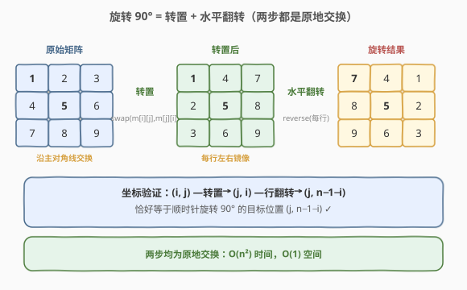
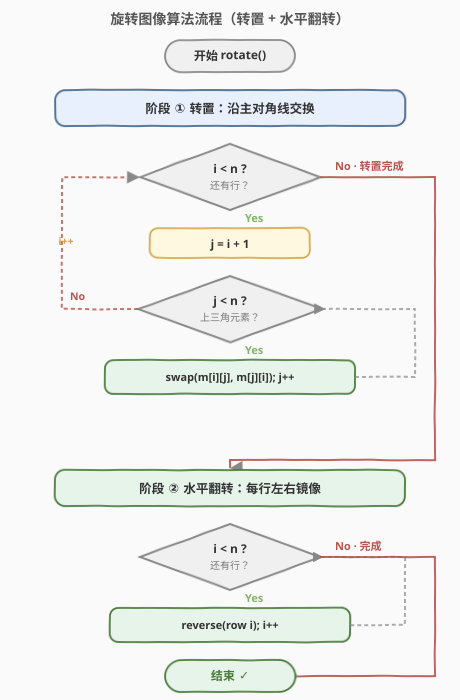
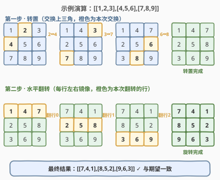

# 旋转图像

- **题目名称**：旋转图像
- **链接**：[48. 旋转图像](https://leetcode.cn/problems/rotate-image/)
- **难度**：中等
- **标签**：数组、数学、矩阵、双指针

## 1. 题目概述

给定一个 `n × n` 的二维矩阵 `matrix`，请你将其**顺时针旋转 90°**，且必须**原地**修改（不能开辟新的二维数组）。

**示例 1**：

```text
输入：matrix = [[1,2,3],[4,5,6],[7,8,9]]
输出：[[7,4,1],[8,5,2],[9,6,3]]
解释：顺时针转 90° 后，原左下角的 7 跑到左上角。
```

```text
旋转前         旋转后
1 2 3         7 4 1
4 5 6   →     8 5 2
7 8 9         9 6 3
```

**示例 2**：

```text
输入：matrix = [[5,1,9,11],[2,4,8,10],[13,3,6,7],[15,14,12,16]]
输出：[[15,13,2,5],[14,3,4,1],[12,6,8,9],[16,7,10,11]]
```

**约束条件**：

- `n == matrix.length == matrix[i].length`
- `1 <= n <= 20`
- `-1000 <= matrix[i][j] <= 1000`
- **进阶**：能否同时做到 $O(1)$ 额外空间？

> 💡 这是一道经典的**原地矩阵操作**模板题。面试中"矩阵旋转 / 翻转 / 转置"几乎都套用同一套思路：**把一次复杂变换分解为两步简单变换的组合**。掌握这一题就能迁移到一整类「几何变换」题。

---

## 2. 解题思路

### 2.1 暴力思路：辅助矩阵

开一个同样大小的 `n × n` 新矩阵 `tmp`，按旋转规则逐个填入：`tmp[j][n - 1 - i] = matrix[i][j]`，最后再把 `tmp` 拷回 `matrix`。

- 时间 $O(n^2)$（必须遍历每个元素），空间 $O(n^2)$（开了新矩阵）。
- 正确但**违反「原地」进阶要求**，面试官会追问能否 $O(1)$ 空间。

> ⚠️ 旋转的坐标映射规律要记牢：元素 $(i, j)$ 顺时针旋转 90° 后落到 $(j, n-1-i)$。这是后续所有原地解法的基石。

### 2.2 核心观察：转置 + 水平翻转



关键洞察：**一次 90° 旋转可以拆成两个更简单的原地变换的复合**。

1. **转置（沿主对角线翻转）**：交换 `matrix[i][j]` 与 `matrix[j][i]`（只对 `i < j` 的上三角做）。
2. **水平翻转（每行左右镜像）**：对每一行，交换 `matrix[i][j]` 与 `matrix[i][n-1-j]`（只对 `j < n/2` 做）。

> 💡 **为什么这样能等价于旋转？** 用坐标验证：原位置 $(i, j)$ 经过转置变成 $(j, i)$；再对第 $j$ 行做水平翻转，列坐标 $i \to n-1-i$，所以最终落在 $(j, n-1-i)$——恰好就是旋转 90° 的目标位置。

两步都是**原地交换**，只需 $O(1)$ 额外指针，完美满足进阶要求。

### 2.3 算法流程图



1. **转置**：双层循环 `i` 从 0 到 `n-1`，`j` 从 `i+1` 到 `n-1`，交换 `matrix[i][j]` 与 `matrix[j][i]`。
   - 只走上三角，避免交换两次又换回去。
2. **水平翻转**：对每一行 `i`，`j` 从 0 到 `n/2 - 1`，交换 `matrix[i][j]` 与 `matrix[i][n-1-j]`。
3. 结束，`matrix` 即为旋转结果。

> ⚠️ 两个边界细节：① 转置的内层从 `j = i+1` 开始（不含主对角线 `i == j`，自己和自己换无意义）；② 水平翻转内层到 `j < n/2`（取半，否则又翻回去）。奇偶 `n` 都适用，中间列/中间元素不需要动。

### 2.4 示例演算

以 `matrix = [[1,2,3],[4,5,6],[7,8,9]]` 为例：



**第一步——转置**（交换 `i < j` 的上三角）：

| 交换对 (i,j)↔(j,i) | 矩阵状态 |
|--------------------|----------|
| 初始 | [[1,2,3],[4,5,6],[7,8,9]] |
| (0,1)↔(1,0): 2↔4 | [[1,4,3],[2,5,6],[7,8,9]] |
| (0,2)↔(2,0): 3↔7 | [[1,4,7],[2,5,6],[3,8,9]] |
| (1,2)↔(2,1): 6↔8 | [[1,4,7],[2,5,8],[3,6,9]] |

**第二步——每行水平翻转**：

| 行 i | 翻转前 | 翻转后 |
|------|--------|--------|
| 0 | [1,4,7] | [7,4,1] |
| 1 | [2,5,8] | [8,5,2] |
| 2 | [3,6,9] | [9,6,3] |

最终结果 `[[7,4,1],[8,5,2],[9,6,3]]`，与期望一致 ✓

---

## 3. 参考代码

### C++（转置 + 水平翻转）

```cpp
class Solution {
  public:
    void rotate(vector<vector<int>>& matrix) {
        int n = matrix.size();

        // 1. 转置：沿主对角线翻转（只走上三角）
        for (int i = 0; i < n; ++i) {
            for (int j = i + 1; j < n; ++j) {
                swap(matrix[i][j], matrix[j][i]);
            }
        }

        // 2. 水平翻转：每行左右镜像
        for (int i = 0; i < n; ++i) {
            reverse(matrix[i].begin(), matrix[i].end());
        }
    }
};
```

### Python

```python
class Solution:
    def rotate(self, matrix: List[List[int]]) -> None:
        n = len(matrix)

        # 1. 转置：沿主对角线翻转（只走上三角）
        for i in range(n):
            for j in range(i + 1, n):
                matrix[i][j], matrix[j][i] = matrix[j][i], matrix[i][j]

        # 2. 水平翻转：每行左右镜像
        for row in matrix:
            row.reverse()
```

> 💡 C++ 直接用 `std::reverse` 翻转一行，Python 用 `list.reverse()`，二者都是原地操作。若想完全手写，把第 2 步换成 `for j in range(n // 2): swap(matrix[i][j], matrix[i][n-1-j])` 即可。

---

## 4. 复杂度分析

| 维度 | 复杂度 | 说明 |
|------|--------|------|
| 时间复杂度 | $O(n^2)$ | 转置遍历上三角约 $n^2/2$ 次、水平翻转每行 $n/2$ 次共 $n^2/2$ 次，总计正比于元素总数 |
| 空间复杂度 | $O(1)$ | 仅用 `i`、`j` 等常数个指针，所有交换均原地完成 |

> ⚠️ $O(n^2)$ 是**理论下界**：旋转必须改变每个元素的位置，至少要"触碰"每个元素一次，不可能更快。

---

## 5. 扩展：四元组原地旋转

除「转置 + 翻转」外，还有一种一步到位的原地解法：**一次性旋转 4 个对称位置**。

观察旋转的坐标环：$(i,j) \to (j, n-1-i) \to (n-1-i, n-1-j) \to (n-1-j, i) \to (i,j)$，这 4 个位置构成一个**旋转环**，只需一轮四元交换即可全部归位。

```cpp
class Solution {
  public:
    void rotate(vector<vector<int>>& matrix) {
        int n = matrix.size();
        for (int i = 0; i < n / 2; ++i) {           // 外层到内层
            for (int j = i; j < n - 1 - i; ++j) {   // 每层一圈
                int tmp = matrix[i][j];
                matrix[i][j]                 = matrix[n - 1 - j][i];
                matrix[n - 1 - j][i]         = matrix[n - 1 - i][n - 1 - j];
                matrix[n - 1 - i][n - 1 - j] = matrix[j][n - 1 - i];
                matrix[j][n - 1 - i]         = tmp;
            }
        }
    }
};
```

两种方法对比：

| 方法 | 思路 | 时间 | 空间 | 特点 |
|------|------|------|------|------|
| 转置 + 翻转 | 拆成两步简单变换 | $O(n^2)$ | $O(1)$ | **代码极简**、不易出错，面试首选 |
| 四元组旋转 | 一轮交换 4 个位置 | $O(n^2)$ | $O(1)$ | 一步到位，但坐标推导易写错边界 |

> 💡 面试推荐讲「转置 + 翻转」：可读性最高、最不易写错。若面试官追问"能否只遍历一次"，再展示四元组旋转。两者复杂度相同，区别只在工程上的简洁与可维护性。

---

## 6. 面试要点

1. **为什么「转置 + 水平翻转」等价于顺时针旋转 90°？**

   - 用坐标验证：原 $(i, j)$ 转置后到 $(j, i)$；再做第 $j$ 行的水平翻转，列坐标 $i \to n-1-i$，最终落在 $(j, n-1-i)$，正是顺时针旋转 90° 的目标位置。两步复合恰好等价。

2. **如何做到 $O(1)$ 空间？**

   - 两步都是**原地交换**：转置用 `swap(matrix[i][j], matrix[j][i])`，水平翻转用 `swap(matrix[i][j], matrix[i][n-1-j])`，全程只需常数个下标变量。

3. **转置时为什么内层循环从 `j = i+1` 开始？**

   - 主对角线上 `i == j` 的元素转置后位置不变，交换无意义；上三角 `j > i` 与下三角 `j < i` 是对称的，只走一遍即可，走两遍会换回去。

4. **如果要逆时针旋转 90° 怎么办？**

   - 逆时针 = 转置 + **垂直翻转**（上下镜像每列），或等价地：水平翻转 + 转置。把两步的顺序或翻转方向调一下即可，模板完全复用。

5. **能否用库函数一行解决？**

   - Python 可 `matrix[:] = list(zip(*matrix[::-1]))`：先上下翻转 `matrix[::-1]`，再用 `zip(*...)` 转置。本质仍是「翻转 + 转置」的组合，但创建了临时元组，严格说不是 $O(1)$ 空间，面试手写两步交换更能体现对原理的掌握。

---

## 7. 同类练习题

- [54. 螺旋矩阵](https://leetcode.cn/problems/spiral-matrix/)：按螺旋顺序遍历矩阵，同属矩阵坐标操作，考察边界控制
- [59. 螺旋矩阵 II](https://leetcode.cn/problems/spiral-matrix-ii/)：按螺旋顺序生成矩阵，与本题共享"逐层向内"的矩阵思维
- [73. 矩阵置零](https://leetcode.cn/problems/set-matrix-zeroes/)：原地标记行列置零，同属原地矩阵操作模板
- [1882. 处理任务用处理器](https://leetcode.cn/problems/process-tasks-using-servers/)：矩阵转置思想在二维数据映射中的应用（坐标变换迁移）
