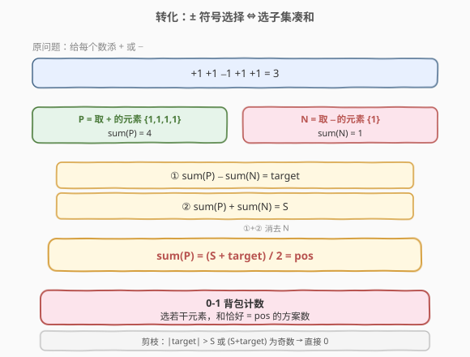
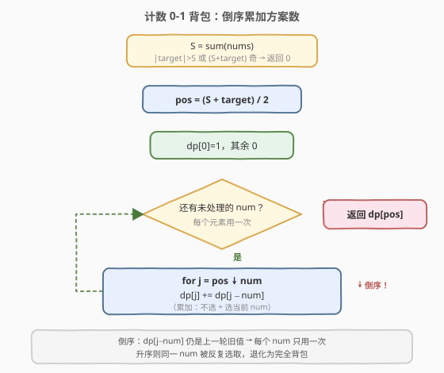
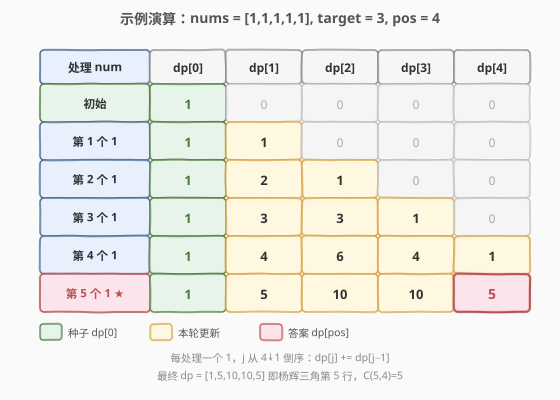

# 目标和

- **题目名称**：目标和
- **链接**：[494. 目标和](https://leetcode.cn/problems/target-sum/)
- **难度**：中等
- **标签**：数组、动态规划、背包

## 1. 题目概述

给你一个非负整数数组 `nums` 和一个整数 `target`。向数组中每个整数前添加 `+` 或 `-`，串联起所有整数构造一个表达式，返回运算结果等于 `target` 的不同表达式数目。

**示例 1**：

```text
输入：nums = [1,1,1,1,1], target = 3
输出：5
解释：一共有 5 种方法让最终目标和为 3 。
-1 + 1 + 1 + 1 + 1 = 3
+1 - 1 + 1 + 1 + 1 = 3
+1 + 1 - 1 + 1 + 1 = 3
+1 + 1 + 1 - 1 + 1 = 3
+1 + 1 + 1 + 1 - 1 = 3
```

**示例 2**：

```text
输入：nums = [1], target = 1
输出：1
解释：只有 "+1" 一种方法得到目标和 1。
```

**约束条件**：

- $1 \leq \text{nums.length} \leq 20$
- $0 \leq \text{nums[i]} \leq 1000$
- $0 \leq \text{sum(nums[i])} \leq 1000$
- $-1000 \leq \text{target} \leq 1000$

> 💡 **进阶要求**：数组长度不超过 20 时可用 $2^n$ 回溯，但题目要求更好的方法。利用 $\text{sum(nums)} \leq 1000$ 的条件，可把问题转化为 **0-1 背包计数**，做到 $O(n \cdot \text{sum})$。

---

## 2. 解题思路

### 2.1 暴力思路：枚举每个符号

对每个元素选择 `+` 或 `-`，共 $2^n$ 种组合，逐一计算表达式结果是否等于 `target`。$n = 20$ 时 $2^{20} \approx 10^6$，可以跑过但常数大；若加上记忆化（记录「当前下标 + 当前累加和」）可避免重复子问题。但更优雅的做法是下面这个**数学转化**。

### 2.2 核心观察：把符号选择转化为子集选取



把所有添加 `+` 的元素归入集合 $P$，所有添加 `-` 的元素归入集合 $N$，则表达式结果为：

$$
\text{sum}(P) - \text{sum}(N) = \text{target}
$$

而所有元素之和 $S = \text{sum}(P) + \text{sum}(N)$。两式相加消去 $\text{sum}(N)$：

$$
2 \cdot \text{sum}(P) = \text{target} + S \quad\Longrightarrow\quad \text{sum}(P) = \frac{S + \text{target}}{2}
$$

> 💡 **关键转化**：原问题等价于——**从** `nums` **中选若干元素组成子集** $P$，**使其和恰好等于** $\text{pos} = \dfrac{S + \text{target}}{2}$，求选法的**数目**。这正是 0-1 背包的「计数」版本。

**可行性剪枝**（必须先判断，否则 `pos` 不合法）：

1. 若 $| \text{target} | > S$：即使全取同号也达不到 `target`，返回 `0`；
2. 若 $S + \text{target}$ 为奇数：$\text{pos}$ 不是整数，无法平分，返回 `0`。

> ⚠️ 注意 `nums[i]` 可以为 `0`：`0` 无论取 `+` 还是 `-` 都不改变和，因此每个 `0` 会让方案数翻倍。下面的计数 DP 能自然处理这一点，无需特判。

### 2.3 算法流程：计数 0-1 背包



定义 `dp[j]` 为「凑出和为 `j` 的子集选取方案数」。初始 `dp[0] = 1`（空集凑出 0，一种方案），其余为 `0`。

对每个 `num`（每个元素只用一次，`j` 必须**倒序**更新）：

$$
dp[j] \;{+}{=}\; dp[j - num]
$$

- `dp[j]`：不选当前 `num`，方案数沿用旧值；
- `dp[j-num]`：选当前 `num`，看去掉它之后凑出 `j-num` 的方案数，累加进来。

> ⚠️ **倒序的原因**：与 [416. 分割等和子集](416_分割等和子集.md) 完全一致——一维 DP 中 `j` 从大到小遍历，保证计算 `dp[j]` 时用到的 `dp[j-num]` 还是**上一轮**（未选当前 `num`）的值，避免同一元素被重复选取。若升序遍历，`dp[j-num]` 已被当前 `num` 污染，会变成「每个元素可无限取」的完全背包，答案偏大。

### 2.4 示例演算

以 `nums = [1,1,1,1,1], target = 3` 为例：$S = 5$，$\text{pos} = (5+3)/2 = 4$，即统计和为 4 的子集数。`dp` 数组长度 5，初始 `dp[0]=1`，其余 0。



| 处理 num | dp[0] | dp[1] | dp[2] | dp[3] | dp[4] | 说明 |
|----------|-------|-------|-------|-------|-------|------|
| 初始     | 1     | 0     | 0     | 0     | 0     | 空集凑出 0 |
| 第 1 个 1 | 1     | 1     | 0     | 0     | 0     | 可凑 {1} |
| 第 2 个 1 | 1     | 2     | 1     | 0     | 0     | 凑 2 种 1、1 种 2 |
| 第 3 个 1 | 1     | 3     | 3     | 1     | 0     | 组合数雏形 |
| 第 4 个 1 | 1     | 4     | 6     | 4     | 1     | $C_4^k$ 排列 |
| 第 5 个 1 | 1     | 5     | 10    | 10    | **5** ⭐ | $C_5^4 = 5$ |

最终 `dp[4] = 5`，即 5 种方案，对应从 5 个 1 中选 4 个放入 $P$（$\binom{5}{4}=5$）。

> 💡 **规律观察**：全是 1 时，处理完第 $k$ 个元素后 `dp` 恰好是杨辉三角第 $k$ 行（$\binom{k}{j}$），因为「选若干个 1 凑和 $j$」等价于「从 $k$ 个里选 $j$ 个」。

---

## 3. 参考代码

### C++

```cpp
class Solution {
  public:
    int findTargetSumWays(vector<int>& nums, int target) {
        int s = accumulate(nums.begin(), nums.end(), 0);
        if (abs(target) > s || (s + target) % 2 != 0) return 0;
        int pos = (s + target) / 2;
        vector<int> dp(pos + 1, 0);
        dp[0] = 1;
        for (int num : nums) {
            for (int j = pos; j >= num; --j) {   // 倒序，保证每个 num 用一次
                dp[j] += dp[j - num];
            }
        }
        return dp[pos];
    }
};
```

### Python

```python
class Solution:
    def findTargetSumWays(self, nums: List[int], target: int) -> int:
        s = sum(nums)
        if abs(target) > s or (s + target) % 2 != 0:
            return 0
        pos = (s + target) // 2
        dp = [0] * (pos + 1)
        dp[0] = 1
        for num in nums:
            for j in range(pos, num - 1, -1):   # 倒序
                dp[j] += dp[j - num]
        return dp[pos]
```

> ⚠️ **易错点**：
> - 内层循环必须 `j` 从 `pos` 递减到 `num`，否则一个元素被重复选取。
> - `num = 0` 时 `j >= 0`，循环会把每个 `dp[j]` 翻倍（`dp[j] += dp[j]`），这正是「0 取正取负都一样、方案翻倍」的正确语义。
> - 若 `num > pos`，内层循环不执行，表示该元素太大不可能入选 $P$，直接跳过。

---

## 4. 复杂度分析

| 维度 | 复杂度 | 说明 |
|------|--------|------|
| 时间复杂度 | $O(n \cdot \text{pos})$ | `n` 个元素，每个扫一遍长度 `pos+1` 的 dp；`pos ≤ S ≤ 1000`，故最多 $20 \times 1001 \approx 2 \times 10^4$ |
| 空间复杂度 | $O(\text{pos})$ | 一维计数 dp，长度 `pos+1` |

> 💡 本题 $n \leq 20$、$S \leq 1000$，所以 $n \cdot S \leq 2 \times 10^4$，远优于回溯的 $2^n$。即便 $n$ 更大（如 $10^2$），只要 $S$ 不大仍然可解，这正是「**伪多项式**」DP 的优势。

---

## 5. 扩展：回溯 + 记忆化

当 $S$ 很大（无法开 dp 数组）但 $n$ 较小时，可用记忆化搜索。状态为 `(下标 index, 当前累加和 cur)`，由于累加和范围 $[-S, S]$，加偏移 $S$ 映射到 $[0, 2S]$。每个状态最多 $n \times (2S+1)$ 个，复杂度同为 $O(n \cdot S)$。

```cpp
class Solution {
    unordered_map<int, int> memo[21];   // memo[index][cur+S]
  public:
    int findTargetSumWays(vector<int>& nums, int target) {
        int s = accumulate(nums.begin(), nums.end(), 0);
        return dfs(nums, 0, 0, target, s);
    }
    int dfs(vector<int>& nums, int i, int cur, int target, int s) {
        if (i == nums.size()) return cur == target ? 1 : 0;
        int key = cur + s;                // 偏移避免负 key
        if (memo[i].count(key)) return memo[i][key];
        return memo[i][key] = dfs(nums, i + 1, cur + nums[i], target, s)
                            + dfs(nums, i + 1, cur - nums[i], target, s);
    }
};
```

> 💡 记忆化与背包 DP 本质等价（都是枚举「选/不选进 $P$」），只是视角不同：记忆化自顶向下、背包自底向上。面试中若数据范围未给 $S$，可先用记忆化兜底；若给了 $S \leq 1000$，优先一维背包更省空间。

---

## 6. 面试要点

1. **为什么能把 `±` 选择转化为子集和问题？**
   - 设取 `+` 的元素和为 $P$、取 `-` 的为 $N$，则 $P - N = \text{target}$ 且 $P + N = S$，解得 $P = (S+\text{target})/2$。于是「分配符号」等价于「选出和为 $P$ 的子集」，把指数级搜索压缩为伪多项式 DP。

2. **为什么要判断 $(S+\text{target})$ 是偶数？**
   - $P$ 必须是整数和。若 $S+\text{target}$ 为奇数，$P$ 不是整数，不可能由整数元素凑出，直接返回 0。同理 $|\text{target}| > S$ 时无解。

3. **为什么内层循环要倒序？**
   - 一维 0-1 背包中 `dp[j]` 依赖 `dp[j-num]`。倒序保证用到的是上一轮（未选当前 `num`）的旧值；升序会让当前 `num` 在一轮内被重复选取，退化为完全背包，方案数偏大。

4. **`nums[i] = 0` 会影响结果吗？**
   - 不会出错，反而符合直觉。`num=0` 时 `dp[j] += dp[j]` 使每个 `dp[j]` 翻倍，对应「0 取正取负结果不变，方案数 ×2」。倒序循环下每个 `dp[j]` 独立翻倍，逻辑正确。

5. **0-1 背包的「判定」与「计数」有何区别？**
   - **判定**（[416](416_分割等和子集.md)）：`dp[j]` 为布尔，转移 `dp[j] = dp[j] | dp[j-num]`，初始 `dp[0]=true`。
   - **计数**（本题）：`dp[j]` 为方案数，转移 `dp[j] += dp[j-num]`，初始 `dp[0]=1`。
   - **最值**（分割数组的最大值等）：`dp[j] = max/min(...)`。三者框架一致，仅转移算子与初值不同。

---

## 7. 同类练习题

- [416. 分割等和子集](https://leetcode.cn/problems/partition-equal-subset-sum/)（[题解](416_分割等和子集.md)）：0-1 背包「判定」版，对比布尔 DP 与本题计数 DP 的转移算子区别
- [518. 零钱兑换 II](https://leetcode.cn/problems/coin-change-ii/)：完全背包计数版（物品可重复用），对比内层循环为何要**升序**
- [279. 完全平方数](https://leetcode.cn/problems/perfect-squares/)：完全背包求最少个数，进一步熟悉背包框架
- [1049. 最后一块石头的重量 II](https://leetcode.cn/problems/last-stone-weight-ii/)：同样转化为「尽量装满一半」，但是求最值而非计数
- [474. 一和零](https://leetcode.cn/problems/ones-and-zeroes/)：二维费用 0-1 背包，把「费用」从一维扩展到二维
