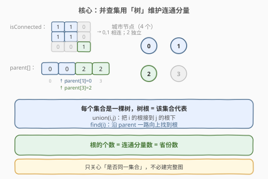
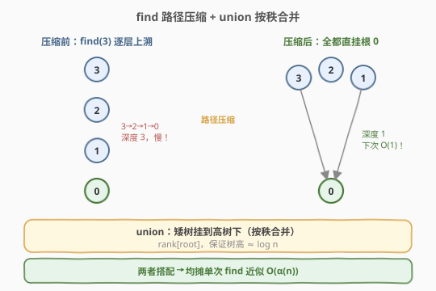
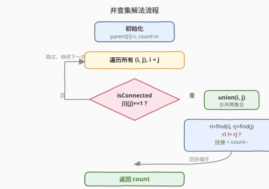
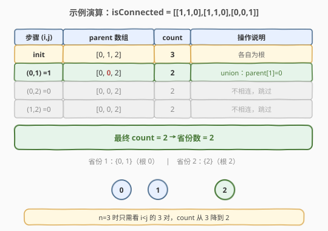

# 省份数量

- **题目名称**：省份数量
- **链接**：[547. 省份数量](https://leetcode.cn/problems/number-of-provinces/)
- **难度**：中等
- **标签**：并查集、深度优先搜索、图

## 1. 题目概述

有 `n` 个城市，其中一些彼此相连，另一些没有相连。如果城市 `a` 与城市 `b` 直接相连，且城市 `b` 与城市 `c` 直接相连，那么城市 `a` 与城市 `c` **间接相连**。

**省份**是一组直接或间接相连的城市，组内不含不相连的城市。

给你一个 `n x n` 的矩阵 `isConnected`，其中 `isConnected[i][j] = 1` 表示第 `i` 个城市和第 `j` 个城市直接相连，`isConnected[i][j] = 0` 表示二者不直接相连。返回矩阵中**省份的数量**。

**示例 1**：

```text
输入：isConnected = [[1,1,0],[1,1,0],[0,0,1]]
输出：2
解释：城市 0 与城市 1 直接相连，二者同属一个省份；城市 2 独立成省。
```

**示例 2**：

```text
输入：isConnected = [[1,0,0],[0,1,0],[0,0,1]]
输出：3
解释：三座城市互不相连，各有 1 个省份。
```

**约束条件**：

- `1 <= n <= 200`
- `n == isConnected.length`
- `n == isConnected[i].length`
- `isConnected[i][j]` 为 `1` 或 `0`
- `isConnected[i][i] == 1`
- `isConnected[i][j] == isConnected[j][i]`

---

## 2. 解题思路

### 2.1 暴力思路

把 `isConnected` 看成图的邻接矩阵，对每个未访问城市做一次 DFS/BFS 把整个连通分量标记掉，统计需要几次遍历就能覆盖所有城市即为省份数。时间复杂度 $O(n^2)$（每条边访问一次），空间 $O(n)$。这能过，但**学不到新模板**——下面用并查集统一处理「动态连通性」类问题。

### 2.2 核心观察：并查集



并查集（Union-Find / Disjoint Set Union）用一个**森林**维护若干不相交集合：

- 每个元素初始自成一棵树，`parent[i] = i`，即自己是根。
- `find(x)`：沿 `parent` 指针一路向上找到 `x` 所在树的**根**（即该集合的代表）。
- `union(x, y)`：分别找 `x`、`y` 的根，若不同就把一棵树的根挂到另一棵树下，集合数 `-1`。

本题里「同一省份」=「同一集合」。最终**根的个数**就是省份数。用一个计数器 `count` 初始为 `n`，每次成功 `union` 就 `count--`，避免最后再扫一遍 `parent`。

> 💡 关键直觉：我们**只关心两点是否同属一个集合**，并不需要记录完整的连通路径。并查集正是为这种「只问连通性」的场景量身定制，比建图 + DFS 更轻量、也更通用（尤其支持动态加边）。

### 2.3 find 与路径压缩、union 按秩合并



朴素 `find` 会退化成链表。两个标准优化让均摊复杂度逼近常数：

- **路径压缩（Path Compression）**：`find` 递归向上找根时，顺手把路径上所有节点**直接挂到根**下，树高瞬间压平。
- **按秩合并（Union by Rank）**：合并时让**矮树挂到高树**下，`rank` 近似树高，保证 `rank` 只在两棵等高树合并时才 `+1`，树高被控制在对数级别。

两者搭配后，单次操作的均摊复杂度为 $O(\alpha(n))$（阿克曼函数的反函数），在 $n \le 10^{80}$ 范围内 $\alpha(n) < 5$，**实际可视为常数**。

### 2.4 算法流程图



### 2.5 示例演算



以 `isConnected = [[1,1,0],[1,1,0],[0,0,1]]` 为例：

- 初始 `parent = [0,1,2]`，`count = 3`。
- 处理 `(0,1)`：`isConnected[0][1]=1`，`find(0)=0`、`find(1)=1`，不同 → `parent[1]=0`，`count=2`。
- 处理 `(0,2)`、`(1,2)`：均为 `0`，跳过。
- 最终 `count = 2`，即 2 个省份。

---

## 3. 参考代码

### C++（并查集 + 路径压缩 + 按秩合并）

```cpp
class UnionFind {
  public:
    vector<int> parent;
    vector<int> rank_;
    int count;

    UnionFind(int n) : count(n) {
        parent.resize(n);
        rank_.assign(n, 0);
        for (int i = 0; i < n; i++) parent[i] = i;
    }

    int find(int x) {
        if (parent[x] != x) parent[x] = find(parent[x]); // 路径压缩
        return parent[x];
    }

    void unite(int x, int y) {
        int rx = find(x), ry = find(y);
        if (rx == ry) return;
        if (rank_[rx] < rank_[ry]) parent[rx] = ry;       // 按秩合并
        else if (rank_[rx] > rank_[ry]) parent[ry] = rx;
        else { parent[ry] = rx; rank_[rx]++; }
        count--;
    }
};

class Solution {
  public:
    int findCircleNum(vector<vector<int>>& isConnected) {
        int n = isConnected.size();
        UnionFind uf(n);
        for (int i = 0; i < n; i++)
            for (int j = i + 1; j < n; j++)   // 只看上三角，避免重复
                if (isConnected[i][j] == 1) uf.unite(i, j);
        return uf.count;
    }
};
```

### Python（并查集 + 路径压缩 + 按秩合并）

```python
class Solution:
    def findCircleNum(self, isConnected: List[List[int]]) -> int:
        n = len(isConnected)
        parent = list(range(n))
        rank_ = [0] * n
        count = n

        def find(x):
            while parent[x] != x:
                parent[x] = parent[parent[x]]   # 路径压缩（隔代压缩）
                x = parent[x]
            return x

        for i in range(n):
            for j in range(i + 1, n):
                if isConnected[i][j] == 1:
                    ri, rj = find(i), find(j)
                    if ri == rj:
                        continue
                    if rank_[ri] < rank_[rj]:
                        parent[ri] = rj
                    elif rank_[ri] > rank_[rj]:
                        parent[rj] = ri
                    else:
                        parent[rj] = ri
                        rank_[ri] += 1
                    count -= 1
        return count
```

### 扩展写法：DFS

```cpp
class Solution {
  public:
    int findCircleNum(vector<vector<int>>& isConnected) {
        int n = isConnected.size(), ans = 0;
        vector<int> vis(n, 0);
        for (int i = 0; i < n; i++) {
            if (!vis[i]) { dfs(isConnected, vis, i, n); ans++; }
        }
        return ans;
    }
    void dfs(vector<vector<int>>& g, vector<int>& vis, int u, int n) {
        vis[u] = 1;
        for (int v = 0; v < n; v++)
            if (g[u][v] == 1 && !vis[v]) dfs(g, vis, v, n);
    }
};
```

---

## 4. 复杂度分析

| 维度 | 复杂度 | 说明 |
|------|--------|------|
| 时间复杂度 | $O(n^2 \alpha(n))$ | 遍历矩阵上三角共 $\frac{n(n-1)}{2}$ 对，每次 `union/find` 均摊 $O(\alpha(n))$ |
| 空间复杂度 | $O(n)$ | `parent` 与 `rank` 数组各 $O(n)$ |

> 💡 由于 $\alpha(n) \le 5$（本题范围内），实际等同于 $O(n^2)$，与朴素 DFS 同阶，但换来了一个可复用的「动态连通性」模板。

---

## 5. 扩展：迭代版 find 与判断连通性

1. **迭代 `find`**：递归版在 $n$ 很大时可能爆栈，迭代写法更稳：

   ```cpp
   int find(int x) {
       int r = x;
       while (parent[r] != r) r = parent[r];   // 找根
       while (parent[x] != r) {                 // 第二趟压缩
           int nxt = parent[x];
           parent[x] = r;
           x = nxt;
       }
       return r;
   }
   ```

2. **只问连通、不问个数**：若题目改成「判断城市 `a`、`b` 是否同省」，只需 `find(a) == find(b)`，无需维护 `count`。

3. **按 size 合并**：用集合大小 `size` 代替 `rank`，把小树挂大树，效果类似，还能顺手统计集合大小。

---

## 6. 面试要点

1. **并查集的两个核心操作是什么？分别解决什么问题？**

   - `find(x)` 找 `x` 所属集合的根（代表元）；`union(x, y)` 把 `x`、`y` 所在两个集合并成一个。前者用于「查询」，后者用于「合并」。

2. **路径压缩和按秩合并为什么需要？只用一个行不行？**

   - 二者都在压低树高。只用路径压缩，均摊复杂度已是 $O(\log n)$ 级别；只用按秩合并也是 $O(\log n)$；**两者同时使用**才能达到 $O(\alpha(n))$ 近似常数。面试中通常一起写，但只写路径压缩也常被接受。

3. **为什么用 `count` 计数而不是最后数 `parent[i] == i` 的个数？**

   - 路径压缩后 `parent[i] == i` 的仍是根，数根也正确；但维护 `count` 在每次成功 `union` 时 `--`，最后直接返回，省一次 $O(n)$ 扫描，且语义清晰（「合并一次少一个集合」）。

4. **并查集相比 DFS/BFS 的优势在哪？什么时候必须用它？**

   - DFS/BFS 适合**静态图**一次性求连通分量；并查集擅长**动态加边**、**反复查询两点是否连通**（如冗余连接、账户合并）。当边是逐条给出且伴随查询时，并查集更优。

5. **为什么只遍历矩阵上三角 `j = i+1`？**

   - 矩阵对称（`isConnected[i][j] == isConnected[j][i]`）且对角线恒为 `1`（自环无需处理），上三角已覆盖所有无序城市对，避免重复 `union`。

---

## 7. 同类练习题

- [200. 岛屿数量](https://leetcode.cn/problems/number-of-islands/)：DFS/BFS 求连通分量，可与并查集解法对照
- [684. 冗余连接](https://leetcode.cn/problems/redundant-connection/)：并查集判环，加边时两端已同根即为冗余边
- [721. 账户合并](https://leetcode.cn/problems/accounts-merge/)：并查集合并同名账户下的邮箱，模板进阶
- [990. 等式方程的可满足性](https://leetcode.cn/problems/satisfiability-of-equality-equations/)：先 union 等式、再查不等式是否冲突
- [1319. 连通网络的操作次数](https://leetcode.cn/problems/number-of-operations-to-make-network-connected/)：并查集统计连通分量，求最少接线数
