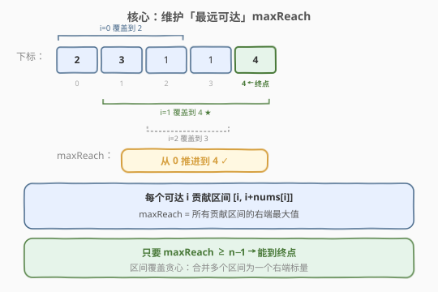
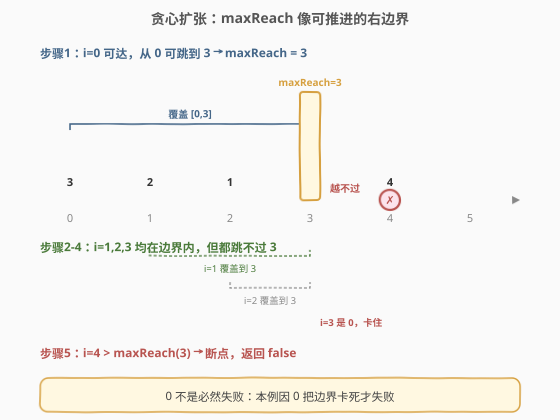
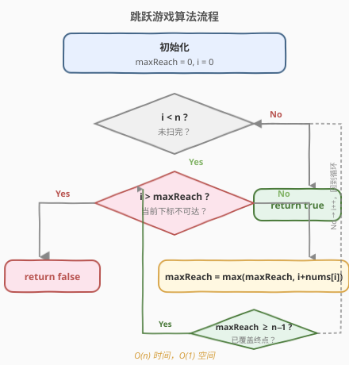
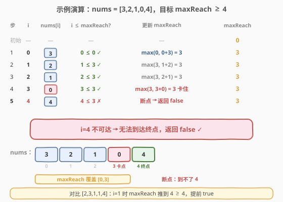

# 跳跃游戏

- **题目名称**：跳跃游戏
- **链接**：[55. 跳跃游戏](https://leetcode.cn/problems/jump-game/)
- **难度**：中等
- **标签**：数组、贪心、动态规划

## 1. 题目概述

给你一个非负整数数组 `nums`，你最初位于数组的**第一个下标**。数组中的每个元素代表你在该位置可以跳跃的**最大长度**。

判断你是否能够到达最后一个下标。

**示例 1**：

```text
输入：nums = [2,3,1,1,4]
输出：true
解释：先跳 1 步到下标 1，再跳 3 步到达最后一个下标。
```

**示例 2**：

```text
输入：nums = [3,2,1,0,4]
输出：false
解释：无论怎样都会在下标 3 处（值为 0）停下，无法到达最后一个下标。
```

**约束条件**：

- `1 <= nums.length <= 10^4`
- `0 <= nums[i] <= 10^5`

> ⚠️ 注意每个位置是「**最大**跳跃长度」，意味着可以少跳；这给了贪心「不断扩张可达范围」的空间——只要最后能覆盖到终点即可，不必关心具体走法。

---

## 2. 解题思路

### 2.1 暴力思路

**DFS / 回溯**：从下标 0 出发，每个位置尝试跳 1 到 `nums[i]` 步的所有分支，递归判断能否到达终点。时间 `O(n!)` 级别，严重超时。

**DP（自底向上）**：定义 `dp[i]` 表示能否到达下标 `i`，对每个 `i` 检查是否存在 `j < i` 使 `dp[j]` 为真且 `j + nums[j] >= i`。时间 `O(n²)`、空间 `O(n)`，可过但非最优。

### 2.2 核心观察：维护「最远可达」



我们不关心「具体怎么跳」，只关心「**最远能跳到哪**」。从左到右扫描，维护一个变量 `maxReach`——当前能到达的最远下标：

- 在下标 `i` 处，若 `i <= maxReach`（即 `i` 可达），则从 `i` 出发能到 `i + nums[i]`，于是更新 `maxReach = max(maxReach, i + nums[i])`。
- 若 `maxReach >= n − 1`，提前返回 `true`。
- 若扫描中遇到 `i > maxReach`（当前下标已不可达），返回 `false`。

> 💡 **关键转化**：把「能否到终点」转化为「可达边界能否不断向右扩张并覆盖终点」。每个可达位置都贡献一个 `[i, i + nums[i]]` 的覆盖区间，`maxReach` 就是这些区间的右端最大值——这是典型的**区间覆盖贪心**。

### 2.3 贪心扩张过程



直觉上，`maxReach` 像一根「可推进的右边界」：

- 只要 `i` 落在边界内，边界就有机会被推得更远。
- `nums[i] = 0` 的位置不会扩张边界，但它本身若在边界内仍可「路过」。
- 一旦边界卡住不动且 `i` 超过边界，说明出现「断点」（如示例 2 的 0），后续再也到不了。

> ⚠️ **常见误区**：把 `nums[i] = 0` 当作「必然失败」。其实只要该 0 位置已被之前的跳跃越过（即它左侧某点能跳到它右边），就无碍；只有当 0 成为「边界无法继续推进的卡点」时才失败。

### 2.4 算法流程图



### 2.5 示例演算

以 `nums = [3,2,1,0,4]` 为例，`n = 5`，目标 `maxReach >= 4`：



| 步骤 | i | nums[i] | i ≤ maxReach? | 更新 maxReach | maxReach | 状态 |
|------|---|---------|----------------|----------------|----------|------|
| 初始 | — | — | — | — | 0 | 起点可达 |
| 1 | 0 | 3 | 0≤0 ✓ | max(0, 0+3)=3 | 3 | 边界推到 3 |
| 2 | 1 | 2 | 1≤3 ✓ | max(3, 1+2)=3 | 3 | 不变 |
| 3 | 2 | 1 | 2≤3 ✓ | max(3, 2+1)=3 | 3 | 不变 |
| 4 | 3 | 0 | 3≤3 ✓ | max(3, 3+0)=3 | 3 | 卡住 |
| 5 | 4 | 4 | 4≤3 ✗ | — | 3 | **断点 → false** |

`i = 4` 时 `4 > maxReach = 3`，下标 4 不可达，返回 `false` ✓。这正是示例 2 的失败原因——0 把边界卡死在下标 3。

---

## 3. 参考代码

### C++

```cpp
class Solution {
  public:
    bool canJump(vector<int>& nums) {
        int maxReach = 0;
        int n = nums.size();
        for (int i = 0; i < n; i++) {
            if (i > maxReach) return false;       // 当前下标不可达
            maxReach = max(maxReach, i + nums[i]);
            if (maxReach >= n - 1) return true;   // 已能覆盖终点
        }
        return true;
    }
};
```

### Python

```python
class Solution:
    def canJump(self, nums: List[int]) -> bool:
        max_reach = 0
        n = len(nums)
        for i in range(n):
            if i > max_reach:
                return False                      # 当前下标不可达
            max_reach = max(max_reach, i + nums[i])
            if max_reach >= n - 1:
                return True                       # 已能覆盖终点
        return True
```

---

## 4. 复杂度分析

| 维度 | 复杂度 | 说明 |
|------|--------|------|
| 时间复杂度 | O(n) | 只遍历数组一次，每步 `O(1)` 更新 |
| 空间复杂度 | O(1) | 仅用 `maxReach` 一个变量 |

> 💡 这是该题的最优解：时间已达下界 `O(n)`（必须至少看一遍），空间为常数。相比 DP 的 `O(n²)/O(n)`，贪心在两方面都更优。

---

## 5. 扩展：最少跳跃次数（第 45 题）

若题目改为求「到达终点的**最少跳跃次数**」，则需在贪心框架上再加一层「当前跳跃边界」的概念：

- 维护 `maxReach`（最远可达）与 `end`（当前这一跳能覆盖的最远右端）。
- 扫描时不断更新 `maxReach`；当 `i == end` 时，说明当前一跳的覆盖范围已用尽，必须再跳一次，于是 `jumps++` 并把 `end = maxReach`。
- 到达终点前累加的 `jumps` 即最少次数。

> 💡 这就是 [45. 跳跃游戏 II] 的 `O(n)` 贪心解法，本质是「在可达范围内分层 BFS」的线性实现。理解本题的 `maxReach` 后，45 题只是在它之上加了「分段计数」。

---

## 6. 面试要点

1. **贪心为什么正确？为什么不需要回溯？**
   - 我们只问「能否到终点」，不问走法。每个可达位置都把覆盖区间向右扩张，`maxReach` 是单调不减的；只要终点能被任一可达位置覆盖即可。回溯会枚举具体走法，但对「能否」这个布尔问题是不必要的。

2. **`nums[i] = 0` 一定失败吗？**
   - 不一定。若该 0 位置在边界内，且其左侧某点 `j` 满足 `j + nums[j] > i`（能直接越过 0），则边界仍可继续推进。只有当 0 使 `maxReach` 卡住、后续 `i` 超过 `maxReach` 时才失败。

3. **为什么提前返回 `maxReach >= n − 1` 是安全的？**
   - `maxReach` 单调不减，一旦它覆盖终点，后续无论怎么扫都不会变小，结果必然为真；提前返回可减少无效扫描。

4. **能否从右往左贪心？**
   - 可以：维护「最近能到达终点的位置」`last = n − 1`，从右往左扫，若 `i + nums[i] >= last` 则 `last = i`；最后看 `last == 0`。两种方向等价，左→右更直观。

5. **DP 和贪心的本质区别是什么？**
   - DP 记录「每个位置能否到达」，逐位置依赖前面所有位置，故 `O(n²)`；贪心只维护一个全局「最远可达」，把多个位置的贡献合并成一个标量，降到 `O(n)`。这是「状态压缩」的典型例子。

---

## 7. 同类练习题

- [45. 跳跃游戏 II](https://leetcode.cn/problems/jump-game-ii/)：求最少跳跃次数，本题贪心的进阶（加分段计数）
- [1306. 跳跃游戏 III](https://leetcode.cn/problems/jump-game-iii/)：改为可左右跳、问能否到达值为 0 的位置，转成 BFS
- [1345. 跳跃游戏 IV](https://leetcode.cn/problems/jump-game-iv/)：可跳同值位置，BFS + 哈希去重
- [1024. 视频拼接](https://leetcode.cn/problems/video-stitching/)：区间覆盖贪心，与本题「维护最远右端」同构
- [763. 划分字母区间](https://leetcode.cn/problems/partition-labels-ii/)：贪心维护边界，体会「区间右端」的通用思路
