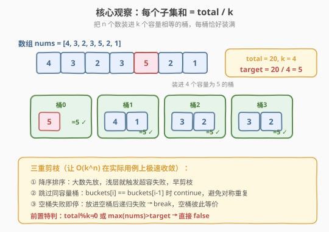
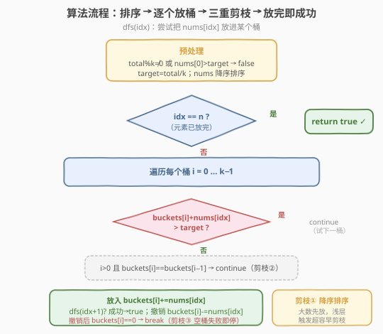
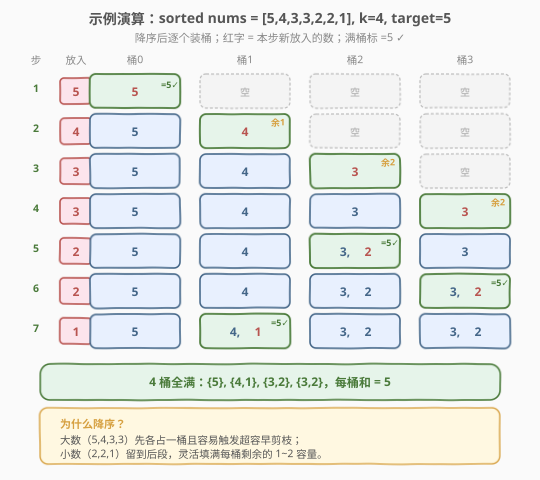

# 划分为K个相等的子集

- **题目名称**：划分为K个相等的子集
- **链接**：[698. 划分为K个相等的子集](https://leetcode.cn/problems/partition-to-k-equal-sum-subsets/)
- **难度**：中等
- **标签**：数组、回溯、剪枝、位运算

## 1. 题目概述

给定一个整数数组 `nums` 和一个正整数 `k`，判断是否能把该数组分成 `k` 个**非空**子集，使得每个子集的元素之和都相等。

**示例 1**：

```text
输入：nums = [4,3,2,3,5,2,1], k = 4
输出：true
解释：可分成 4 个子集 (5), (1,4), (2,3), (2,3)，每个子集和均为 5。
```

**示例 2**：

```text
输入：nums = [1,2,3,4], k = 3
输出：false
解释：总和 10 不能被 3 整除，无法等分。
```

**约束条件**：

- $1 \leq k \leq \text{nums.length} \leq 16$
- $1 \leq \text{nums}[i] \leq 10^4$
- 频率保证：每个元素在数组中出现的次数在 $[1,4]$ 范围内

> 💡 本题是**回溯 + 剪枝**的经典模板题。它和 [39. 组合总和](39_组合总和.md)（选与不选的回溯）同源，但新增了「把元素装进 `k` 个容量相等的桶」的视角，因此能套用一类**桶填充剪枝**：降序排序、跳过相同容量、空桶失败即停。`n \leq 16` 的规模也使其适合用**状压 DP** 求解，是理解「回溯 ↔ 状压 DP 互换」的范本。

---

## 2. 解题思路

### 2.1 暴力思路：枚举每个元素归属

把每个元素分配给 `k` 个桶中的任意一个，共有 $k^n$ 种分配方案，逐一检查每个桶之和是否都等于 `target`。$n=16, k=8$ 时 $k^n$ 是天文数字，**严重超时**。

> ⚠️ 暴力的浪费在于：没有利用「每个桶容量固定为 `target`」这一约束提前剪枝。一旦某个桶超过 `target`，后续分配毫无意义；且相同容量的桶彼此等价，重复搜索。

### 2.2 核心观察：`k` 个容量相等的桶 + 降序剪枝

**关键转化**：若 `total = sum(nums)` 不能被 `k` 整除，直接返回 `false`；否则每个子集的和必须恰为 `target = total / k`。于是问题变成：把 `n` 个数依次放进 `k` 个容量为 `target` 的桶，问是否存在合法放法。



三条**剪枝**让搜索量骤降：

| 剪枝 | 做法 | 原因 |
|------|------|------|
| **降序排序** | 把 `nums` 从大到小排序后再放 | 大数先放更容易触发「超容」失败，早剪枝；小数留到后段填缝，灵活度高 |
| **跳过相同容量** | 若 `buckets[i] == buckets[i-1]`，跳过 `i` | 两个桶当前和相同意味着剩余容量相同，把它们看作「同一个桶」，避免对称重复 |
| **空桶失败即停** | 若把当前数放进一个**空桶**（`buckets[i]==0`）后递归失败，直接 `break` | 所有空桶彼此等价，换一个空桶结果不变；继续试其余空桶纯属浪费 |

> ⚠️ 还需两个**前置特判**：(1) `total % k != 0` 直接 `false`；(2) 任何 `nums[i] > target` 直接 `false`（单个数就超容，无解）。这两个特判能在 $O(1)$ 内挡掉大量无解用例。

> 💡 **为什么降序排序能大幅加速？** 大数选择少（容易超容），先放它能在搜索树浅层就判定无解；小数灵活，留到深处在剩余空隙里找组合的概率更高。这与 [322. 零钱兑换](322_零钱兑换.md) 中「贪心先试大面额」的直觉一致，但本题只是用排序引导剪枝顺序，并非贪心。

### 2.3 算法流程图



**完整步骤**：

1. **预处理**：`total = sum(nums)`；若 `total % k != 0` 返回 `false`；`target = total / k`；`nums` 降序排序；若 `nums[0] > target` 返回 `false`。
2. **`buckets[k]`** 全初始化为 `0`。
3. **`dfs(idx)`**：尝试把 `nums[idx]` 放进某个桶：
   - 若 `idx == n`，所有元素已放完，返回 `true`。
   - 遍历 `i` 从 `0` 到 `k-1`：
     1. `buckets[i] + nums[idx] > target` → 超容，`continue`；
     2. `i > 0 且 buckets[i] == buckets[i-1]` → 同容量桶已试过，`continue`；
     3. 放入：`buckets[i] += nums[idx]`；若 `dfs(idx+1)` 成功返回 `true`；撤销：`buckets[i] -= nums[idx]`；
     4. **若撤销后 `buckets[i] == 0`**（即刚才放的是空桶且失败）→ `break`。
   - 都不行则返回 `false`。

> 💡 第 4 步是「空桶失败即停」：放进空桶失败意味着这个数无论放哪个空桶都无解（空桶等价），所以直接 `break` 不再试后续桶，这是最关键的一条剪枝。

### 2.4 示例演算

以 `nums = [4,3,2,3,5,2,1], k = 4` 为例。`total = 20`，`target = 5`，降序排序后 `nums = [5,4,3,3,2,2,1]`。4 个桶容量均为 5：



| 步 | nums[idx] | 尝试过程 | 桶状态（容量 5） | 结果 |
|----|-----------|----------|------------------|------|
| 1 | 5 | 桶0：0+5=5 ✓ 放入 | 桶0={5}(满), 桶1=0, 桶2=0, 桶3=0 | 进入下一步 |
| 2 | 4 | 桶0：5+4>5 ✗；桶1：0+4=4 ✓ 放入 | 桶0={5}, 桶1={4}(余1), 桶2=0, 桶3=0 | 进入下一步 |
| 3 | 3 | 桶0满✗；桶1：4+3>5 ✗；桶2：0+3=3 ✓ 放入 | 桶0={5}, 桶1={4}, 桶2={3}(余2), 桶3=0 | 进入下一步 |
| 4 | 3 | 桶0满✗；桶1：4+3>5 ✗；桶2：3+3>5 ✗；桶3：0+3=3 ✓ 放入 | 桶0={5}, 桶1={4}, 桶2={3}, 桶3={3}(余2) | 进入下一步 |
| 5 | 2 | 桶0满✗；桶1：4+2>5 ✗；桶2：3+2=5 ✓ 放入 | 桶0={5}, 桶1={4}, 桶2={3,2}(满), 桶3={3} | 进入下一步 |
| 6 | 2 | 桶0满✗；桶1：4+2>5 ✗；桶2满✗；桶3：3+2=5 ✓ 放入 | 桶0={5}, 桶1={4}, 桶2={3,2}, 桶3={3,2}(满) | 进入下一步 |
| 7 | 1 | 桶0满✗；桶1：4+1=5 ✓ 放入 | 桶0={5}, 桶1={4,1}(满), 桶2={3,2}, 桶3={3,2} | `idx==7==n` → true |

最终 4 个子集为 `{5}, {4,1}, {3,2}, {3,2}`，每个和均为 5，返回 `true` ✓。

> 💡 注意第 3 步：`3` 没有放进「已经放了 4 的桶1」（4+3 超容），而是开新桶2。这正是降序排序的好处——大数先各占一桶，小数（2、1）留到后段填满每个桶的剩余 1~2 容量。

---

## 3. 参考代码

### C++

```cpp
// 划分为K个相等的子集.cpp —— 回溯 + 三重剪枝
// 编译: g++ -O2 -std=c++17 划分为K个相等的子集.cpp -o pkess
class Solution {
  public:
    bool canPartitionKSubsets(vector<int>& nums, int k) {
        int total = accumulate(nums.begin(), nums.end(), 0);
        if (total % k != 0) return false;
        int target = total / k;
        sort(nums.begin(), nums.end(), greater<int>());   // 降序：大数先放
        if (nums[0] > target) return false;               // 单个数就超容
        vector<int> buckets(k, 0);
        return dfs(nums, 0, buckets, target);
    }

  private:
    bool dfs(const vector<int>& nums, int idx, vector<int>& buckets, int target) {
        if (idx == (int)nums.size()) return true;         // 全部放完
        for (int i = 0; i < (int)buckets.size(); ++i) {
            if (buckets[i] + nums[idx] > target) continue;            // 超容
            if (i > 0 && buckets[i] == buckets[i - 1]) continue;      // 同容量桶已试过
            buckets[i] += nums[idx];                                  // 放入
            if (dfs(nums, idx + 1, buckets, target)) return true;
            buckets[i] -= nums[idx];                                  // 撤销
            if (buckets[i] == 0) break;                               // 空桶失败即停
        }
        return false;
    }
};
```

### Python

```python
class Solution:
    def canPartitionKSubsets(self, nums: list[int], k: int) -> bool:
        total = sum(nums)
        if total % k != 0:
            return False
        target = total // k
        nums.sort(reverse=True)                 # 降序：大数先放
        if nums[0] > target:                    # 单个数就超容
            return False
        buckets = [0] * k

        def dfs(idx: int) -> bool:
            if idx == len(nums):                # 全部放完
                return True
            for i in range(k):
                if buckets[i] + nums[idx] > target:
                    continue                    # 超容
                if i > 0 and buckets[i] == buckets[i - 1]:
                    continue                    # 同容量桶已试过
                buckets[i] += nums[idx]         # 放入
                if dfs(idx + 1):
                    return True
                buckets[i] -= nums[idx]         # 撤销
                if buckets[i] == 0:
                    break                       # 空桶失败即停
            return False

        return dfs(0)
```

> 💡 **三重剪枝缺一不可**：去掉「降序排序」会慢几十倍；去掉「跳过同容量桶」会产生大量对称重复；去掉「空桶失败即停」会让 `k` 个空桶被反复等价搜索。三者叠加后，$n=16$ 的用例可在毫秒级通过。

---

## 4. 复杂度分析

| 维度 | 回溯 + 剪枝 | 状压 DP |
|------|------------|---------|
| **时间复杂度** | 最坏 $O(k^n)$，剪枝后实际极快 | $O(n \cdot 2^n)$ |
| **空间复杂度** | $O(n)$（递归栈 + `buckets`） | $O(2^n)$ |
| **推荐度** | ✅ 面试首选，剪枝思路通用 | 数据规模确定时稳妥，模板化 |

> ⚠️ 回溯的最坏复杂度仍是 $O(k^n)$，但三条剪枝在实际用例上近乎把它压到多项式级别。$n \leq 16$ 时，即使最坏情况也能快速通过。状压 DP 的 $O(n \cdot 2^n) \approx 16 \cdot 65536 \approx 10^6$，是稳定的上界。

---

## 5. 扩展：状压 DP 解法

$n \leq 16$ 提示可用**位掩码**枚举所有子集选取状态。定义 `dp[mask]` 为：在选取状态 `mask` 下，当前正在填充的那个桶的**已装和**对 `target` 取模后的值（即该桶剩余要补的进度）；`-1` 表示该状态不可达。

**转移**：`dp[0] = 0`。对每个可达 `mask`，尝试把某个尚未选取的元素 `j` 放进当前桶：

- 若 `dp[mask] + nums[j] <= target`，则 `dp[mask | (1<<j)] = (dp[mask] + nums[j]) % target`。
  - 当取模结果为 `0`，表示当前桶正好装满，下一个元素从新桶的 `0` 开始。

**答案**：`dp[(1<<n) - 1] == 0`（所有元素取完，且最后一个桶也正好装满）。

```python
class Solution:
    def canPartitionKSubsets(self, nums: list[int], k: int) -> bool:
        total = sum(nums)
        if total % k != 0:
            return False
        target = total // k
        n = len(nums)
        dp = [-1] * (1 << n)
        dp[0] = 0
        for mask in range(1 << n):
            if dp[mask] == -1:
                continue
            for j in range(n):
                if mask & (1 << j):
                    continue
                if dp[mask] + nums[j] <= target:
                    dp[mask | (1 << j)] = (dp[mask] + nums[j]) % target
        return dp[(1 << n) - 1] == 0
```

> 💡 **与回溯的对照**：回溯是「按元素顺序决策放进哪个桶」，状压 DP 是「按选取状态记录桶进度」。两者本质都在搜索「能否把元素分成和为 `target` 的若干组」，只是状态定义不同。面试时先讲回溯（思路直观、剪枝可讲性强），再提状压 DP 作为「规模确定时的稳定解」。

---

## 6. 面试要点

1. **为什么先排序降序？不排序会怎样？**

   > 降序让大数先放。大数可选桶少、容易触发超容失败，能在搜索树浅层就剪枝；小数灵活，留到后段填缝成功率高。不排序时小数先放会铺出大量「看似可行」的浅层分支，到深处才发现无解，搜索量暴增几十倍。

2. **「空桶失败即停」为什么正确？**

   > 所有空桶彼此等价（剩余容量都是 `target`）。把当前数放进一个空桶后递归失败，意味着「以这个数开启一个新桶」走不通；换另一个空桶结果完全相同。所以直接 `break`，不再试其余空桶。这是最关键的一条剪枝。

3. **「跳过相同容量桶」依据是什么？**

   > 两个桶当前和相同 ⇒ 剩余容量相同 ⇒ 把当前数放进它们后续能展开的子树完全同构。遍历 `i` 时若 `buckets[i] == buckets[i-1]`，说明这种容量刚试过，跳过即可。注意它要求按 `i` 顺序遍历，不需桶排序。

4. **回溯和状压 DP 怎么选？**

   > $n \leq 16$ 两者都可。回溯实现短、剪枝可讲性强，面试首选；状压 DP 复杂度 $O(n \cdot 2^n)$ 是确定上界，适合「追求稳定」或要求多项式可证明复杂度时。两者状态定义不同但搜索本质相同。

5. **有哪些前置特判能 $O(1)$ 挡掉无解？**

   > (1) `total % k != 0` 直接 `false`——总和都不能等分；(2) `max(nums) > target` 直接 `false`——单个数就超过每桶容量；(3) `k == 1` 直接 `true`——整个数组就是一个子集。这些特判能避免无意义的深搜。

> 💡 **一句话总结**：698 是「桶填充回溯」的范本——把等分子集问题转化为「`k` 个容量为 `target` 的桶」，用**降序排序 + 跳过同容量桶 + 空桶失败即停**三重剪枝把 $O(k^n)$ 压到实际可行；$n \leq 16$ 也可用状压 DP $O(n \cdot 2^n)$ 稳定求解。这套「按元素决策放哪个桶」的剪枝可迁移到 [473. 火柴拼正方形](https://leetcode.cn/problems/matchsticks-to-square/)、[2305. 公平分发饼干](https://leetcode.cn/problems/fair-distribution-of-cookies/) 等所有「分成 k 组使某指标最优/可行」的问题。

---

## 7. 同类练习题

- [473. 火柴拼正方形](https://leetcode.cn/problems/matchsticks-to-square/)：本题 `k=4` 的特例，完全同构，用来巩固桶填充回溯模板
- [2305. 公平分发饼干](https://leetcode.cn/problems/fair-distribution-of-cookies/)：把饼干分给 `k` 个孩子使「最大总和最小」，同套桶填充回溯 + 剪枝，结算从「可行性」变「最优化」
- [39. 组合总和](https://leetcode.cn/problems/combination-sum/)（[题解](39_组合总和.md)）：选与不选的回溯模板，对照「组合型回溯」与「桶填充回溯」的决策维度差异
- [1723. 完成所有工作的最短时间](https://leetcode.cn/problems/find-minimum-time-to-finish-all-jobs/)：把工作分给 `k` 个工人使最大工时最小，桶填充回溯 + 二分答案的进阶组合
- [1655. 分配重复整数](https://leetcode.cn/problems/distribute-repeating-integers/)：把数组分成若干满足顾客订单的组，状压 DP 思路，对照回溯与状压的互换
