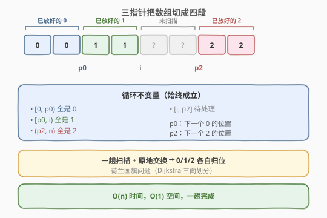
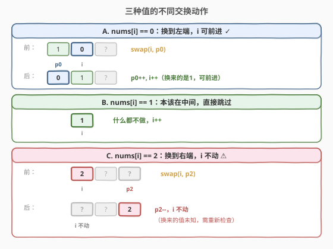
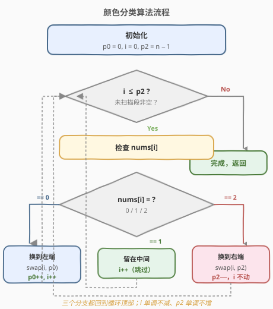
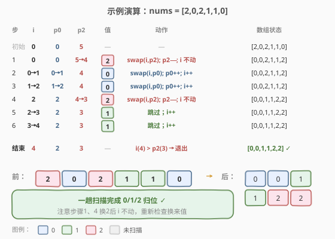

# 颜色分类

- **题目名称**：颜色分类
- **链接**：[75. 颜色分类](https://leetcode.cn/problems/sort-colors/)
- **难度**：中等
- **标签**：数组、双指针、排序

## 1. 题目概述

给定一个包含红色、白色和蓝色（共 `n` 个）元素的数组 `nums`，原地对它们进行排序，使得相同颜色的元素**相邻**，并按照红色、白色、蓝色顺序排列。

我们使用整数 `0`、`1` 和 `2` 分别表示红色、白色和蓝色。

必须在不使用库内置的 `sort` 函数的情况下解决这个问题，且**只能使用常数空间**的一趟扫描算法。

**示例 1**：

```text
输入：nums = [2,0,2,1,1,0]
输出：[0,0,1,1,2,2]
解释：原地排序为 0,0,1,1,2,2。
```

**示例 2**：

```text
输入：nums = [2,0,1]
输出：[0,1,2]
```

**约束条件**：

- `n == nums.length`
- `1 <= n <= 300`
- `nums[i] == 0、1 或 2`

> ⚠️ **进阶要求**：① **一趟**扫描算法；② **常数**额外空间。计数排序（两趟、`O(1)` 空间）能过但不满足「一趟」；荷兰国旗三向划分正是为此设计。

---

## 2. 解题思路

### 2.1 暴力思路

**计数排序（两趟）**：第一趟统计 0、1、2 各自的个数；第二趟按个数覆盖写回数组。时间 `O(n)`、空间 `O(1)`。简单正确，但需要**两趟**扫描，不满足进阶的「一趟」要求。

**直接排序**：调用库排序 `O(n log n)`，被题目明确禁止，且常数空间的一趟解法更优。

### 2.2 核心观察：三值 → 三向划分



数组只有三种值，排序后必然形如 `[0...0, 1...1, 2...2]`。用**三个指针**把数组切成四段：

- `[0, p0)`：已放好的 0
- `[p0, i)`：已放好的 1
- `[i, p2]`：尚未扫描
- `(p2, n−1]`：已放好的 2

其中 `p0` 是「下一个 0 应放位置」，`p2` 是「下一个 2 应放位置」，`i` 是当前扫描指针。

> 💡 **关键转化**：遇到 0 就换到左端 `p0`、遇到 2 就换到右端 `p2`、遇到 1 就留在中间不动。这就是经典的 **荷兰国旗问题（Dutch National Flag）** 三向划分。

### 2.3 三指针交换



扫描指针 `i` 从 0 开始，`p0 = 0`，`p2 = n − 1`。当 `i <= p2` 时循环：

- `nums[i] == 0`：交换 `nums[i]` 与 `nums[p0]`，`p0++`，`i++`。
  - 换过来的 `nums[p0]` 原本是 1（因为 `[p0, i)` 段全是 1），所以 `i` 可直接前进。
- `nums[i] == 1`：什么都不做，`i++`（1 本该在中间）。
- `nums[i] == 2`：交换 `nums[i]` 与 `nums[p2]`，`p2−−`，`i` **不动**。
  - 换过来的 `nums[p2]` 是未扫描的值，需要重新检查，故 `i` 不前进。

> ⚠️ **最易错点**：遇到 2 交换后 `i` **不能前进**，因为换到 `i` 位置的是来自右段未扫描的值，可能是 0/1/2 任意一种，必须重新判断。遇到 0 交换后 `i` 可以前进，因为换来的是已知的 1。

### 2.4 算法流程图



### 2.5 示例演算

以 `nums = [2,0,2,1,1,0]` 为例，`p0=0, i=0, p2=5`：



| 步骤 | i | p0 | p2 | nums[i] | 动作 | 数组状态 |
|------|---|----|----|---------|------|----------|
| 初始 | 0 | 0 | 5 | 2 | 换 i,p2; p2=4; i 不动 | [0,0,2,1,1,2] |
| 1 | 0 | 0 | 4 | 0 | 换 i,p0; p0=1; i=1 | [0,0,2,1,1,2] |
| 2 | 1 | 1 | 4 | 0 | 换 i,p0; p0=2; i=2 | [0,0,2,1,1,2] |
| 3 | 2 | 2 | 4 | 2 | 换 i,p2; p2=3; i 不动 | [0,0,1,1,2,2] |
| 4 | 2 | 2 | 3 | 1 | 跳过; i=3 | [0,0,1,1,2,2] |
| 5 | 3 | 2 | 3 | 1 | 跳过; i=4 | [0,0,1,1,2,2] |
| 结束 | 4 | 2 | 3 | — | i > p2，退出 | **[0,0,1,1,2,2]** ✓ |

最终一趟扫描完成排序。注意第 3 步交换 2 后 `i` 保持不动，使第 4 步重新检查到换来的 1。

---

## 3. 参考代码

### C++

```cpp
class Solution {
  public:
    void sortColors(vector<int>& nums) {
        int p0 = 0, i = 0, p2 = nums.size() - 1;
        while (i <= p2) {
            if (nums[i] == 0) {
                swap(nums[i], nums[p0]);
                p0++;
                i++;
            } else if (nums[i] == 1) {
                i++;
            } else {  // nums[i] == 2
                swap(nums[i], nums[p2]);
                p2--;
                // i 不动，需重新检查换来的值
            }
        }
    }
};
```

### Python

```python
class Solution:
    def sortColors(self, nums: List[int]) -> None:
        p0 = i = 0
        p2 = len(nums) - 1
        while i <= p2:
            if nums[i] == 0:
                nums[i], nums[p0] = nums[p0], nums[i]
                p0 += 1
                i += 1
            elif nums[i] == 1:
                i += 1
            else:  # nums[i] == 2
                nums[i], nums[p2] = nums[p2], nums[i]
                p2 -= 1
                # i 不动，需重新检查换来的值
```

---

## 4. 复杂度分析

| 维度 | 复杂度 | 说明 |
|------|--------|------|
| 时间复杂度 | O(n) | `i` 与 `p2` 相向移动，每个元素至多被处理一次；循环次数 ≤ n |
| 空间复杂度 | O(1) | 仅用 `p0`、`i`、`p2` 三个指针，原地交换 |

> 💡 这是该题的最优解：一趟、常数空间。`i` 单调不减、`p2` 单调不增，故循环总轮数不超过 `n`。

---

## 5. 扩展：为什么 i 遇 0 可进、遇 2 不进

这是本算法的正确性核心，值得单独说明：

- **遇 0 交换后 `i++`**：交换前 `[p0, i)` 段全是 1（这是不变量），所以从 `p0` 换到 `i` 的值必为 1，已被正确处理，`i` 可以前进。
- **遇 2 交换后 `i` 不动**：从 `p2` 换到 `i` 的值来自未扫描段，可能是 0、1 或 2 任意一种，必须原地重新判断；若贸然 `i++` 会漏处理。

> 💡 **不变量**：循环过程中始终成立——`[0, p0)` 全 0、`[p0, i)` 全 1、`(p2, n)` 全 2、`[i, p2]` 待处理。这三个指针把数组精确切成四段，是三向划分的本质。

---

## 6. 面试要点

1. **为什么叫「荷兰国旗问题」？**
   - 因为荷兰国旗正是红、白、蓝三色条带，与本题 0/1/2 三值排序的视觉一致；该问题由 Dijkstra 提出，三向划分是其标准解法。

2. **遇到 2 交换后为什么 `i` 不能前进？**
   - 换到 `i` 位置的值来自右段未扫描区，性质未知，必须重新判断。这是本题最常考的细节，写错会导致漏元素或顺序错乱。

3. **循环条件为什么是 `i <= p2` 而非 `i < n`？**
   - 当 `i > p2` 时，`[i, n)` 已经全部是已放好的 2，无需再扫；继续扫会把已就位的 2 又换回去。`i <= p2` 保证只处理未扫描段。

4. **计数排序和三向划分如何取舍？**
   - 计数排序两趟、常数空间、实现极简，适合不要求「一趟」的场景；三向划分一趟、常数空间，满足最严苛要求，且是快速排序三向切分的基础，面试更受青睐。

5. **这个模板在快速排序中有什么用？**
   - 当待排序数组存在大量重复键时，用三向切分（按 `< pivot`、`== pivot`、`> pivot` 分三段）可避免对重复元素的重复递归，把 `O(n log n)` 退化风险大幅降低，是 Dijkstra 三向切分快速排序的核心。

---

## 7. 同类练习题

- [283. 移动零](https://leetcode.cn/problems/move-zeroes/)（[题解](../easy/283_移动零.md)）：读写双指针把 0 移到末尾，本题的「两值」简化版，理解后再上「三值」
- [324. 摆动排序 II](https://leetcode.cn/problems/wiggle-sort-ii/)：需先用快速选择找中位数再交叉排列，三向划分定位中位数是其子步骤
- [215. 数组中的第K个最大元素](https://leetcode.cn/problems/kth-largest-element-in-an-array/)（[题解](../medium/215_数组中的第K个最大元素.md)）：partition 划分的另一应用，对比「两向」与「三向」划分的差异
- [912. 排序数组](https://leetcode.cn/problems/sort-an-array/)：通用排序，可用三向切分快速排序应对大量重复元素
- [剑指 Offer 21. 调整数组顺序使奇数位于偶数前面](https://leetcode.cn/problems/diao-zheng-shu-zu-shun-xu-shi-qi-shu-wei-yu-ou-shu-qian-mian-lcof/)：双指针按奇偶分区，本题的「两值」变体
