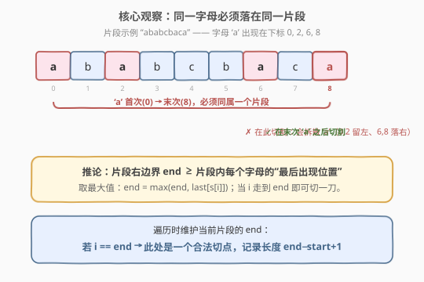
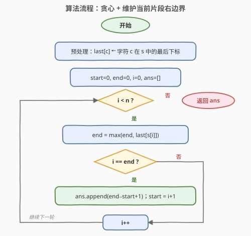
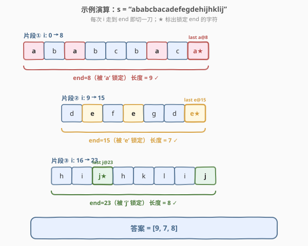

# 划分字母区间

- **题目名称**：划分字母区间
- **链接**：[763. 划分字母区间](https://leetcode.cn/problems/partition-labels/)
- **难度**：中等
- **标签**：贪心、哈希表、双指针

## 1. 题目概述

给你一个字符串 `s`。我们要把这个字符串划分成**尽可能多**的片段，使得每个字母只出现在**某一个片段中**（同一字母不能跨片段）。

返回一个表示每个片段长度的列表。

**示例 1**：

```text
输入：s = "ababcbacadefegdehijhklij"
输出：[9,7,8]
解释：
划分结果为 "ababcbaca"、"defegde"、"hijhklij"。
每个字母最多只出现在一个片段中。
如划分成 "ababcbacadefegde"、"hijhklij" 是错误的，因为 'a'、'e' 等字母跨越了两个片段。
```

**示例 2**：

```text
输入：s = "eccbbbbdec"
输出：[10]
解释：所有字母都挤在一个片段里，无法再分。
```

**约束条件**：

- `1 <= s.length <= 500`
- `s` 只由小写英文字母组成

> 💡 「尽可能多的片段」等价于「每个片段在满足约束的前提下尽量短」，因此一旦到达一个**可切点**就该立刻切，不要往后拖——这是贪心的切入点。

---

## 2. 解题思路

### 2.1 暴力思路

枚举第一个片段的结束位置，检查该片段内每个字母的**所有出现**是否都落在片段内（即字母的最后出现位置也 ≤ 结束位置）；若满足则切一刀，对剩余子串递归。最坏要检查多次字母区间，复杂度 `O(n^2)`，对 `n ≤ 500` 勉强可过，但不够优雅。

### 2.2 核心观察：每个字母的「最后出现位置」决定片段边界



关键直觉是一个字母必须**整段**待在同一个片段里，所以：

- 一个片段的右边界 `end`，必须 **≥ 片段内每个字母的最后出现位置**。
- 反过来，如果我们让 `end` 恰好等于「当前片段内所有字母最后出现位置的最大值」，那么在这个 `end` 处切开**一定合法**，而且是最早的可切点（贪心：尽可能多切）。

> 💡 **关键转化**：先用一次遍历预处理出每个字母的 `last[c]`（最后下标）。再第二遍扫描，维护当前片段的 `end = max(end, last[s[i]])`；当 `i == end` 时，说明此刻片段内所有字母都已“用完”，正好可以切一刀。

### 2.3 算法流程图



整体只有一重循环，`i` 单调递增，`start` 只在切刀时跳变，因此是线性 `O(n)`。

### 2.4 示例演算



以 `s = "ababcbacadefegdehijhklij"` 为例：

- **片段①** `i: 0→8`：从 `'a'` 开始，`last['a']=8` 把 `end` 顶到 `8`；途中 `'b'`、`'c'` 的最后出现都 ≤ 8，`end` 不再增长。`i=8` 时 `i==end`，切出 `"ababcbaca"`，长度 `9`。
- **片段②** `i: 9→15`：`'d'` 把 `end` 推到 `14`，`'e'` 又推到 `15`；之后 `end` 稳定在 `15`。`i=15` 时切出 `"defegde"`，长度 `7`。
- **片段③** `i: 16→23`：`'h'→19`、`'i'→22`、`'j'→23` 依次抬升 `end` 到 `23`；`'k'`、`'l'` 的最后出现都 ≤ 23。`i=23` 时切出 `"hijhklij"`，长度 `8`。

最终答案 `[9, 7, 8]`。

---

## 3. 参考代码

### C++

```cpp
class Solution {
  public:
    vector<int> partitionLabels(string s) {
        int last[26];
        for (int i = 0; i < s.size(); i++) {
            last[s[i] - 'a'] = i; // 记录每个字母的最后下标
        }

        vector<int> ans;
        int start = 0, end = 0;
        for (int i = 0; i < s.size(); i++) {
            end = max(end, last[s[i] - 'a']); // 扩张当前片段右边界
            if (i == end) {                   // 片段内字母都已收拢
                ans.push_back(end - start + 1);
                start = i + 1;
            }
        }
        return ans;
    }
};
```

### Python

```python
class Solution:
    def partitionLabels(self, s: str) -> List[int]:
        last = {c: i for i, c in enumerate(s)}  # 每个字母最后下标

        ans = []
        start = end = 0
        for i, c in enumerate(s):
            end = max(end, last[c])  # 扩张当前片段右边界
            if i == end:             # 片段内字母都已收拢
                ans.append(end - start + 1)
                start = i + 1
        return ans
```

> ⚠️ **注意**：判断条件是 `i == end` 而非 `i >= end`。因为 `end` 是「当前片段内字母最后出现位置的最大值」，只有在 `i` 真正追上 `end` 时才能保证片段内所有字母都已用完；`end` 不会领先 `i` 太多，也不会回退。

---

## 4. 复杂度分析

| 维度 | 复杂度 | 说明 |
|------|--------|------|
| 时间复杂度 | O(n) | 两次独立遍历：预处理 `last` 一次 + 扫描切分一次 |
| 空间复杂度 | O(1) | `last` 表大小固定为 26（小写字母），与 n 无关 |

---

## 5. 扩展：为什么这是「区间合并」的变体

把每个字母看作一条覆盖区间 `[首次出现, 末次出现]`，题目要求把这些区间**合并**成若干不相交的段，段数尽量多。本题的贪心扫法本质就是「按右端点流式合并」：

- 维护当前合并段的右端点 `end`；
- 遇到新区间就 `end = max(end, 该区间右端点)`；
- 当扫描位置触到 `end`，说明这一段合并结束，落刀。

这与 [56. 合并区间](https://leetcode.cn/problems/merge-intervals/) 的「按左端点排序后合并」是同一思想的两面：56 题在「区间空间」上合并，本题在「字符串下标空间」上边走边合并，省去了显式排序。

> 💡 若题目改为「字母可跨片段，但每个片段内字母种类不超过 k」，则退化为滑动窗口计数问题，思路完全不同。

---

## 6. 面试要点

1. **为什么贪心是正确的？切得越早不会影响后续吗？**

   - 不会。设第一个合法切点为 `end`，则在 `end` 之前任何位置切开都会拆散某个字母（其最后出现 > 切点），非法。所以 `end` 是**最早**的合法切点；选它能让剩余子串最长、可切机会最多。由归纳法，每步取最早合法切点即得最多片段。

2. **为什么 `end = max(end, last[s[i]])` 而不是 `end = last[s[i]]`？**

   - 片段内可能有多个字母，每个都要求 `end ≥ 其最后出现`。`end` 必须取**所有**这些下界的最大值，直接赋值会丢掉之前字母的约束，导致提前切割、拆散字母。

3. **能否只遍历一次、不预处理 `last`？**

   - 不能。判断 `i == end` 需要知道当前字母的**全局最后位置**，这在未扫描到末尾时无法得知，必须先预处理。两次 `O(n)` 遍历仍是线性。

4. **如果要返回每个片段的字符串本身（而非长度）怎么做？**

   - 切刀时记录 `s.substr(start, end - start + 1)` 即可，复杂度不变（输出总长度 `O(n)`）。

5. **字母集变大（如 Unicode）会有什么影响？**

   - 数组方案 `last[26]` 不再适用，改用哈希表 `unordered_map`；时间复杂度仍 `O(n)`，空间变为 `O(字符集大小)`。逻辑完全一致。

---

## 7. 同类练习题

- [56. 合并区间](https://leetcode.cn/problems/merge-intervals/)（[题解](56_合并区间.md)）：同一「区间合并」思想的祖师题，按左端点排序后合并
- [55. 跳跃游戏](https://leetcode.cn/problems/jump-game/)（[题解](55_跳跃游戏.md)）：同样是「维护一个不断扩张的右边界 `end`」的贪心模板
- [45. 跳跃游戏 II](https://leetcode.cn/problems/jump-game-ii/)：在维护右边界的基础上计数「第几跳」，贪心进阶
- [134. 加油站](https://leetcode.cn/problems/gas-station/)（[题解](134_加油站.md)）：单遍扫描 + 区间合法性判断的贪心，思路可对照
- [3. 无重复字符的最长子串](https://leetcode.cn/problems/longest-substring-without-repeating-characters/)（[题解](3_无重复字符的最长子串.md)）：另一类「用哈希记录字符位置 + 维护窗口边界」的经典
