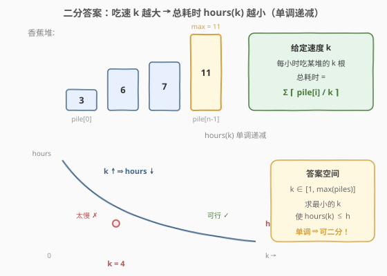
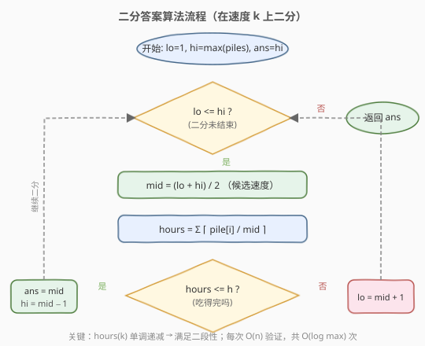

# 爱吃香蕉的珂珂

- **题目名称**：爱吃香蕉的珂珂
- **链接**：[875. 爱吃香蕉的珂珂](https://leetcode.cn/problems/koko-eating-bananas/)
- **难度**：中等
- **标签**：数组、二分查找

## 1. 题目概述

珂珂喜欢吃香蕉。这里有 `n` 堆香蕉，第 `i` 堆中有 `piles[i]` 根香蕉。警卫已经离开，将在 `h` 小时后回来。

珂珂可以决定她吃香蕉的速度 `k`（单位：根/小时）。每个小时，她会选择一堆香蕉，从中吃掉 `k` 根。如果这堆香蕉少于 `k` 根，她就会吃掉这堆的所有香蕉，这一小时内不会再吃其他堆的香蕉。

珂珂喜欢慢慢吃，但仍然想在警卫回来前吃完所有香蕉。返回她可以在 `h` 小时内吃掉所有香蕉的**最小速度** `k`（`k` 为正整数）。

**示例 1**：

```text
输入：piles = [3,6,7,11], h = 8
输出：4
解释：速度 k=4 时，各堆耗时 1+2+2+3=8 小时，恰好吃完。
     k=3 时需要 1+2+3+4=10 小时，来不及。
```

**示例 2**：

```text
输入：piles = [30,11,23,4,20], h = 5
输出：30
```

**示例 3**：

```text
输入：piles = [30,11,23,4,20], h = 6
输出：23
```

**约束条件**：

- `1 <= piles.length <= 10^4`
- `piles.length <= h <= 10^9`
- `1 <= piles[i] <= 10^9`

---

## 2. 解题思路

### 2.1 暴力思路

速度 `k` 的取值范围是 `[1, max(piles)]`（再快也没意义，见 2.2）。从 `k = 1` 开始逐个尝试，对每个 `k` 计算 $\sum \lceil \text{piles}[i] / k \rceil$，第一个满足总耗时 `<= h` 的 `k` 即为答案。验证单个 `k` 是 `O(n)`，整体 `O(n * max(piles))`，而 `max(piles)` 可达 `10^9`，必然超时。

### 2.2 核心观察：二分答案



关键直觉是：**总耗时 `hours(k)` 关于速度 `k` 单调递减**。

- `k` 越大，每小时吃越多，需要的总小时数越少。
- `k = 1` 时最慢（耗时 `sum(piles)`）；`k = max(piles)` 时最快，每堆正好 1 小时，总耗时 `n <= h`（题目保证 `h >= n`），必然可行。

于是存在一个**分界点** `k*`：

```text
k < k*  → hours(k) > h   (太慢，吃不完)
k >= k* → hours(k) <= h  (可行，吃得完)
```

这正是二分查找所需的**二段性**。把「求最小可行 `k`」转化为：在有序区间 `[1, max(piles)]` 上二分，每次 `O(n)` 验证 `mid` 是否可行，可行则去左半找更小的，不可行则去右半加快。

> 💡 **识别信号**：题目求「最小的最大 / 最大的最小 / 最小的满足某单调条件值」，且能 `O(n)` 验证某个候选值是否合法 → 想「二分答案」。这是与「在有序数组里二分找下标」不同的另一类二分：**二分的是答案本身**。

> ⚠️ **上界取 `max(piles)` 即可**：当 `k >= max(piles)`，每堆耗时都是 1，总耗时恒为 `n`，再增大 `k` 不会更优。无需取更大的上界（如 `10^9`），可减少约 30 次无效二分。

### 2.3 算法流程图



注意判定为「可行」时**先记录 `ans = mid` 再收缩右界**（`hi = mid - 1`），保证最终保留的是「最小的可行值」。

### 2.4 示例演算

![示例演算：piles = [3,6,7,11], h = 8](images/koko_example_walkthrough.svg)

以 `piles = [3,6,7,11]`、`h = 8` 为例：

- **第 1 轮** `[1,11]`，`mid=6`，耗时 `1+1+2+2=6 ≤ 8` ✓ → 可行，记 `ans=6`，去左半 `[1,5]`。
- **第 2 轮** `[1,5]`，`mid=3`，耗时 `1+2+3+4=10 > 8` ✗ → 太慢，去右半 `[4,5]`。
- **第 3 轮** `[4,5]`，`mid=4`，耗时 `1+2+2+3=8 ≤ 8` ✓ → 可行，记 `ans=4`，`hi=3`。
- **第 4 轮** `lo=4 > hi=3`，循环结束，返回 `ans=4`。

---

## 3. 参考代码

### C++

```cpp
class Solution {
  public:
    int minEatingSpeed(vector<int>& piles, int h) {
        int lo = 1;
        int hi = *max_element(piles.begin(), piles.end());
        int ans = hi;

        while (lo <= hi) {
            int mid = lo + (hi - lo) / 2;
            long hours = 0; // 防溢出：k=1 时 hours 可达 10^13
            for (int p : piles) {
                hours += (p + mid - 1) / mid; // 向上取整 ceil(p / mid)
            }
            if (hours <= h) {
                ans = mid;      // 可行，尝试更慢
                hi = mid - 1;
            } else {
                lo = mid + 1;   // 太慢，需要加快
            }
        }
        return ans;
    }
};
```

### Python

```python
class Solution:
    def minEatingSpeed(self, piles: List[int], h: int) -> int:
        lo, hi = 1, max(piles)
        ans = hi

        while lo <= hi:
            mid = (lo + hi) // 2
            hours = sum((p + mid - 1) // mid for p in piles)  # 向上取整
            if hours <= h:
                ans = mid       # 可行，尝试更慢
                hi = mid - 1
            else:
                lo = mid + 1    # 太慢，需要加快
        return ans
```

> ⚠️ **两个易错点**：
> 1. **溢出**：`k=1` 时 `hours = sum(piles)`，可达 `10^4 × 10^9 = 10^13`，C++ 必须用 `long` 累加，否则 `int` 溢出导致判定错误。
> 2. **向上取整**：用整数运算 `(p + mid - 1) / mid`，避免浮点 `ceil((double)p / mid)` 的精度问题（`p` 可达 `10^9`）。

---

## 4. 复杂度分析

| 维度 | 复杂度 | 说明 |
|------|--------|------|
| 时间复杂度 | O(n log M) | `M = max(piles)`；二分 `O(log M)` 次，每次验证 `O(n)` |
| 空间复杂度 | O(1) | 仅用常数额外变量 |

---

## 5. 扩展：「二分答案」模板与识别

本题是「二分答案」的经典模板。该套路适用于一类**单调性优化**问题：答案满足二段性，且能在多项式时间（通常 `O(n)`）内验证某个候选答案是否合法。

**通用模板**：

```text
lo = 答案下界, hi = 答案上界, ans = hi
while lo <= hi:
    mid = (lo + hi) / 2
    if check(mid) 合法:      # check() 是题目核心：O(n) 验证
        ans = mid             # 求最小可行 → 记录并向左收缩
        hi = mid - 1
    else:
        lo = mid + 1
return ans
```

**识别信号**：

- 求解「最小的最大值」「最大的最小值」「最小的满足条件值」。
- 答案域单调（或可构造单调性），且 `check()` 可快速判定。
- 直接枚举答案会超时，但答案范围可二分。

> 💡 若求「最大的可行值」（如产能上限），只需把可行分支改为 `ans = mid; lo = mid + 1`，收缩方向相反。

---

## 6. 面试要点

1. **为什么能二分？二段性体现在哪？**

   - `hours(k)` 随 `k` 单调递减。存在分界点 `k*`，使 `k < k*` 时吃不完、`k >= k*` 时吃得完。这种「左不合法 / 右合法」的结构就是二段性，可用二分定位 `k*`。

2. **上界为什么取 `max(piles)` 而不是更大的数？**

   - 当 `k >= max(piles)`，每堆耗时恒为 1，总耗时恒为 `n`，再增大 `k` 不再改变耗时。又因题目保证 `h >= n`，`k = max(piles)` 必然可行，所以它就是合法上界，取更大的值只会浪费二分次数。

3. **`hours` 求和为什么会溢出？怎么处理？**

   - `k=1` 时 `hours = sum(piles)`，最大 `10^4 × 10^9 = 10^13`，超过 32 位 `int` 上界（约 `2.1 × 10^9`）。C++ 用 `long` 累加即可；Python 整数无上限无此问题。

4. **向上取整为什么用 `(p + mid - 1) / mid` 而非浮点？**

   - 浮点 `ceil((double)p / mid)` 在 `p` 达 `10^9` 时可能因精度损失算错（如 `1e9` 已无法精确表示所有整数）。整数公式 `(p + mid - 1) / mid` 等价于 `⌈p / mid⌉` 且无精度问题。

5. **如果 `h == piles.length`，答案是什么？**

   - 此时每小时只能吃一堆，必须 `k >= max(piles)` 才能在一小时内吃完最大堆，答案即 `max(piles)`。可作为快速边界判断。

---

## 7. 同类练习题

- [1011. 在 D 天内送达包裹的能力](https://leetcode.cn/problems/capacity-to-ship-packages-within-d-days/)：同模板，二分船的运载能力，`check` 用贪心按天装货
- [410. 分割数组的最大值](https://leetcode.cn/problems/split-array-largest-sum/)：二分「最大子数组和」，`check` 贪心划分子数组
- [719. 找出第 K 小的数对距离](https://leetcode.cn/problems/find-k-th-smallest-pair-distance/)：二分距离上限，`check` 用双指针统计满足条件的数对数
- [2064. 分配给商店的最小商品数量](https://leetcode.cn/problems/minimized-maximum-of-products-distributed-to-any-store/)：最大化最小值的二分答案，`check` 统计所需商店数
