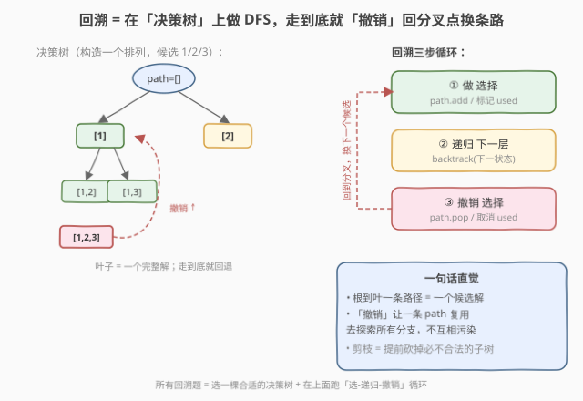
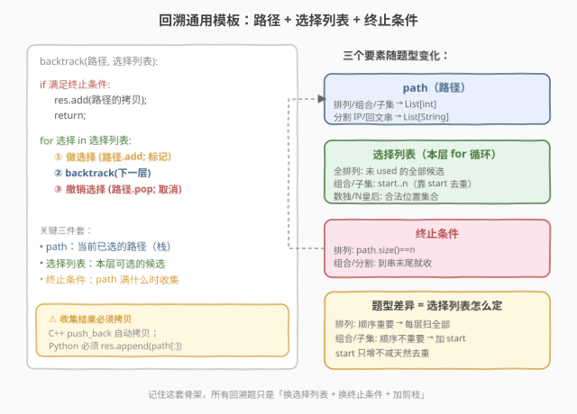
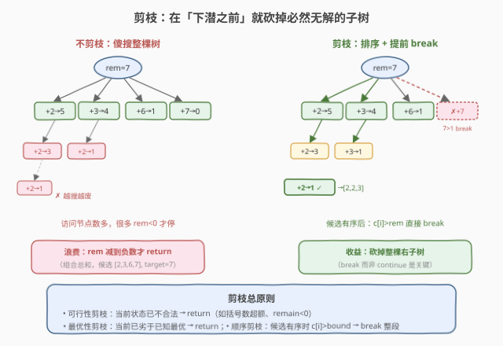
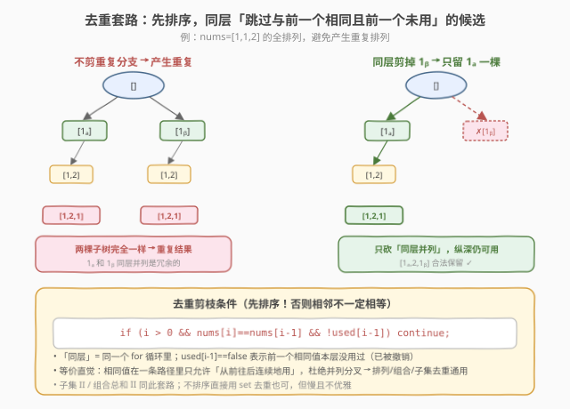
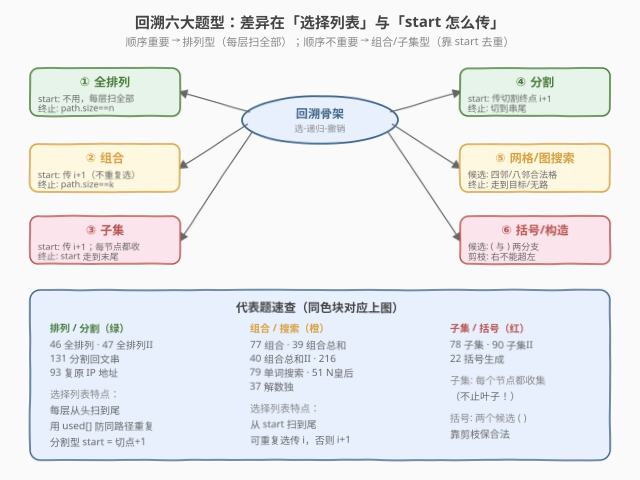
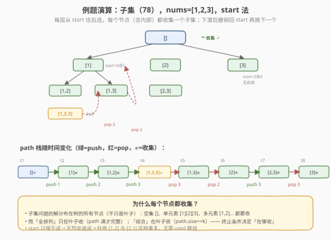

<!-- title: 回溯算法专题 -->
# 回溯算法专题

- **专题**：回溯（Backtracking）
- **适用**：面试高频、LeetCode 中等/困难题的「枚举所有方案」类问题
- **前置**：递归基础、DFS 思想
- **关联题解**：本站已收录 46 / 47 / 39 / 40 / 77 / 78 / 90 / 22 / 79 / 131 / 93 / 51 / 37 / 17 / 216 / 140 / 254 等十余道回溯题解

> 💡 **一句话定位**：回溯法 = 在一棵「决策树」上做 DFS，每走一步「做选择」，走到底或走不通就「撤销选择」回到分叉点换条路。它是**系统地枚举所有可能解**的通用骨架，把「指数级暴力搜索」用递归写得干净优雅，靠**剪枝**把不可能的分支提前砍掉来提速。

---

## 1. 什么是回溯

### 1.1 定义

回溯法是一种**通过探索所有可能的候选解来求解**的算法：从根节点（空解）出发，按某种顺序逐步构造解；每当发现当前路径**不可能产生合法解**时，就「回溯」到上一步，撤销最近一次选择，尝试其他分支。

它本质上是**深度优先搜索（DFS）在解空间树（决策树）上的应用**——区别在于：普通 DFS 只关心「能不能走到」，而回溯法关心「沿途收集所有合法解」，并且强调**状态的撤销与恢复**。

### 1.2 什么时候用回溯

凡是满足下面特征的题，几乎都该想到回溯：

| 特征 | 说明 |
|------|------|
| **要枚举「所有方案」** | 不是求一个最优值，而是列出全部合法解（如所有排列、所有子集、所有分割方式） |
| **没有高效多项式算法** | 问题规模小（`n ≤ 20` 是回溯甜区），暴力枚举可接受 |
| **解可逐步构造** | 一个完整解可以拆成若干「步骤」，每步做一个「选择」 |
| **存在约束** | 每步的选择受合法性约束（如不能重复、括号要配对、皇后不能同行同列） |

> ⚠️ **回溯 vs DP**：如果题目问「**有多少种**方案」或「**最优**方案是多少」，且具备最优子结构，优先用动态规划（DP），复杂度更低；只有当题目要求「**列出所有方案**」或无法用 DP 求解时，才用回溯。例如 [139. 单词拆分](https://leetcode.cn/problems/word-break/)（问能否拆）用 DP，而 [140. 单词拆分 II](https://leetcode.cn/problems/word-break-ii/)（列出所有拆法）用回溯 + 记忆化。

---

## 2. 核心心智模型：决策树上的 DFS



把「构造一个解」看作在一棵**决策树**上走一条从根到叶的路径：

- **树的第 `i` 层** = 构造解的第 `i` 步；
- **每个节点的子节点** = 这一步所有合法的「选择」；
- **从根到某个节点的一条路径** = 一个「部分解」；
- **从根到叶子的一条路径** = 一个「完整解」（何时算完整由终止条件决定）。

回溯法在这棵树上做 DFS，核心是**三步循环**：

1. **做选择**：把某个候选加入当前 `path`，并标记「已用」；
2. **递归**：带着这个选择进入下一层继续探索；
3. **撤销选择**：递归返回后，把刚才的选择从 `path` 移除、取消标记，回到分叉点换下一个候选。

> 💡 **为什么必须「撤销」？** 因为整个搜索过程**复用同一条 `path`**（一个共享的栈）。递归返回时表示「这条分支探索完了」，必须把 `path` 恢复到选之前的状态，才能干净地尝试下一个兄弟分支。不撤销 → 上一个分支的选择会「污染」后续分支 → 结果全错。这就是「回溯」二字的字面含义——**回退一步，换条路走**。

---

## 3. 通用代码模板



所有回溯题都套用下面这个骨架，只需根据题型调整三件套：

### Python 模板

```python
def solve(inputs):
    res = []
    path = []
    # 可能还有 used / start 等状态，作为参数传入

    def backtrack(路径状态, 选择列表):
        if 满足终止条件:          # 如 path 已满 / 走到串尾
            res.append(path[:])   # ⚠ 必须拷贝！
            return
        for 选择 in 选择列表:
            if 不合法: continue    # 剪枝
            # ① 做选择
            path.append(选择)
            # ② 递归
            backtrack(下一状态, 下一层选择列表)
            # ③ 撤销选择
            path.pop()

    backtrack(初始状态, 初始选择列表)
    return res
```

### C++ 模板

```cpp
void backtrack(/* 路径状态, 选择列表 */) {
    if (/* 满足终止条件 */) {
        ans.push_back(path);   // C++ push_back 自动拷贝
        return;
    }
    for (/* 遍历选择列表 */) {
        if (/* 不合法 */) continue;   // 剪枝
        // ① 做选择
        path.push_back(选择);
        // ② 递归
        backtrack(/* 下一状态 */);
        // ③ 撤销选择
        path.pop_back();
    }
}
```

> ⚠️ **Python 收集结果必须 `path[:]`**：`res.append(path)` 存的是引用，后续 `path.pop()` 会把已存入的结果也改掉，最终 `res` 里全是空列表。C++ 的 `ans.push_back(path)` 会自动拷贝 `vector`，无需额外处理。

### 三件套随题型的变化

| 要素 | 全排列 | 组合/子集 | 分割 | 网格搜索 |
|------|--------|-----------|------|----------|
| **path** | `List[int]` | `List[int]` | `List[String]`（各段） | `List[坐标]` 或字符串 |
| **选择列表** | 所有 `!used[i]` 的元素 | `start..n` 的元素 | 下一刀切在哪 | 四邻/八邻合法格 |
| **终止条件** | `path.size()==n` | `path.size()==k` / 到末尾 | 切到串尾 | 走到目标 / 无路可走 |
| **去重手段** | `used[]` 防同路径重复 | `start` 只增不减 | 自然有序 | `visited[][]` 防回头 |

---

## 4. 剪枝：让搜索树变瘦



回溯的复杂度天然是指数级，**剪枝**是把指数变成「实际可接受」的关键——在「下潜之前」就判断当前分支不可能产生合法解，直接 `return`/`break`，不再展开它的子树。

### 三种常见剪枝

| 类型 | 触发条件 | 动作 | 例题 |
|------|----------|------|------|
| **可行性剪枝** | 当前状态已不合法 | `return` | [22. 括号生成](https://leetcode.cn/problems/generate-parentheses/)：右括号数不能超过左括号数 |
| **最优性剪枝** | 当前已劣于已知最优 | `return` | N 皇后计数、博弈型回溯 |
| **顺序剪枝** | 候选有序，`c[i]` 已超界 | `break`（非 continue） | [39. 组合总和](https://leetcode.cn/problems/combination-sum/)：排序后 `candidates[i] > remain` 直接 `break` |

> 💡 **`break` vs `continue`**：当候选数组**有序**时，`candidates[i] > remain` 意味着后面更大的候选也一定超界，用 `break` 砍掉整段右子树；若候选无序，只能 `continue` 跳过当前一个。这就是「组合总和」类题**先排序**的核心收益——把 `continue` 升级为 `break`。

---

## 5. 去重：同层跳过相等元素



当**输入含重复元素**（如 [47. 全排列 II](https://leetcode.cn/problems/permutations-ii/)、[40. 组合总和 II](https://leetcode.cn/problems/combination-sum-ii/)、[90. 子集 II](https://leetcode.cn/problems/subsets-ii/)），朴素的回溯会产生重复解。标准去重套路：

1. **先排序**：让相等元素相邻；
2. **同层剪枝**：在 `for` 循环里跳过「与前一个相同**且前一个未被本层使用**」的候选。

```cpp
// 排列去重（used 数组法）
if (i > 0 && nums[i] == nums[i-1] && !used[i-1]) continue;
```

```python
# 组合/子集去重（start 法，前一个必然没被本层选）
if i > start and nums[i] == nums[i-1]: continue
```

### 直觉理解

「相同值在一条路径里只允许**从前往后连续地用**，不允许**同层并列**」。具体到决策树：

- 同一层 `for` 循环里，第一个 `1`（记 `1ₐ`）已经展开了一整棵子树，涵盖了「选 1」的所有可能；
- 第二个 `1`（`1ᵦ`）若再在同层展开，得到的子树与 `1ₐ` 的**完全相同** → 重复。
- `!used[i-1]`（排列型）表示前一个相同值「本层已撤销、没被选」→ 说明它在同层已被处理过 → 跳过当前。
- 纵深方向（`1ₐ` 选了之后再选 `1ᵦ`）是允许的，因为 `used[i-1]` 为 `true`，不触发剪枝。

> ⚠️ **必须先排序**：否则相等的元素不一定相邻，`nums[i]==nums[i-1]` 判断会漏。排序是这套剪枝的前提。

---

## 6. 题型分类与 start 参数约定



回溯题可按「解的结构」分成六类，核心差异在**选择列表怎么枚举**和 **`start` 怎么传**：

| 题型 | 选择列表 | start 约定 | 在哪收集结果 | 代表题 |
|------|----------|-----------|--------------|--------|
| **① 全排列** | 每层扫全部候选 | 不用 start，用 `used[]` | 叶子（`path.size==n`） | 46 / 47 |
| **② 组合** | `start..n` | 传 `i+1`（不重复选） | 叶子（`path.size==k`） | 77 / 216 |
| **③ 子集** | `start..n` | 传 `i+1` | **每个节点都收** | 78 / 90 |
| **④ 分割** | 下一刀切在哪 | 传切割终点 `i+1` | 切到串尾 | 131 / 93 |
| **⑤ 网格/图搜索** | 四邻/八邻合法格 | 用 `visited[][]` | 走到目标 | 79 / 51 / 37 |
| **⑥ 括号/构造** | `(` 与 `)` 两分支 | 不用 start | `path.size==2n` | 22 |

### 关键区分：顺序是否重要

- **顺序重要**（排列型）：`[1,2]` 和 `[2,1]` 是不同解 → 每层从**全部**候选里选，用 `used[]` 防同路径重复。
- **顺序不重要**（组合/子集型）：`[1,2]` 和 `[2,1]` 是同一个解 → 引入 `start`，只往后选，天然非递减，自动去重。

### 可重复选 vs 不可重复选

组合/子集型里，若**同一元素可重复选**（如 [39. 组合总和](https://leetcode.cn/problems/combination-sum/)），递归下一层 `start` 传 `i`（而非 `i+1`），表示当前元素还能再选一次；同时 `start` 只增不减，保证后续 ≥ 当前，仍能去重。

> 💡 **「可重复选」与「不重复组合」如何同时满足？** 可重复选靠 `start` 传 `i`；不重复组合靠 `start` 只增不减——两者并不矛盾，前者控制「能不能再选当前」，后者控制「不能回头选前面的」。

---

## 7. 例题精讲

### 7.1 全排列（46）—— 模板入门

**题意**：给定不含重复数字的数组 `nums`，返回所有全排列。

**思路**：每层从全部候选中选一个没用过的数，用 `used[]` 标记。`path` 满了就收集。

```python
def permute(nums):
    ans, used = [], [False] * len(nums)
    def backtrack(path):
        if len(path) == len(nums):
            ans.append(path[:])    # ⚠ 拷贝
            return
        for i in range(len(nums)):
            if used[i]: continue
            used[i] = True
            path.append(nums[i])
            backtrack(path)
            path.pop()
            used[i] = False
    backtrack([])
    return ans
```

> 详细图解与演算见站内题解 [46. 全排列](../solution/0001-0100/46_全排列.md)。含重复元素的 [47. 全排列 II](../solution/0001-0100/47_全排列II.md) 在此基础上加排序 + 同层剪枝。

### 7.2 子集（78）—— 选/不选 vs start 法

**题意**：给定不含重复数字的数组 `nums`，返回所有可能的子集（幂集）。

**思路**：与排列不同，子集**顺序不重要**，用 `start` 只往后选。关键区别——**每个节点都收集一个子集**（不只是叶子），因为空集 `[]`、单元素 `[1]` 等都是合法解。



```python
def subsets(nums):
    ans = []
    def backtrack(start, path):
        ans.append(path[:])          # 每个节点都收
        for i in range(start, len(nums)):
            path.append(nums[i])     # ① 选
            backtrack(i + 1, path)   # ② 递归，start=i+1 不回头
            path.pop()               # ③ 撤销
    backtrack(0, [])
    return ans
```

**两种等价写法**：除了上面「`start` 法」（枚举选哪些），还有「选/不选法」（对每个元素决定要或不要，二叉决策树）。两者结果一致，`start` 法更简洁、更易推广到组合题。详见站内题解 [78. 子集](../solution/0001-0100/78_子集.md)。

### 7.3 组合总和（39）—— 可重复选 + 剪枝

**题意**：给定无重复正整数 `candidates` 和 `target`，找出所有和为 `target` 的组合，同一数字可无限重复选取。

**思路**：在子集骨架上做两处改造——

1. **可重复选**：递归传 `start = i`（而非 `i+1`）；
2. **剪枝**：先排序，回溯时若 `candidates[i] > remain`，由于有序，后续更大，直接 `break` 砍掉整棵右子树。

```python
def combinationSum(candidates, target):
    candidates.sort()                # 排序是剪枝前提
    ans = []
    def backtrack(start, remain, path):
        if remain == 0:
            ans.append(path[:])      # 凑满，收集
            return
        for i in range(start, len(candidates)):
            if candidates[i] > remain:
                break                # ⭐ 剪枝：break 而非 continue
            path.append(candidates[i])
            backtrack(i, remain - candidates[i], path)  # start=i 可重复选
            path.pop()
    backtrack(0, target, [])
    return ans
```

> 详细决策树与流程图见站内题解 [39. 组合总和](../solution/0001-0100/39_组合总和.md)。每个候选只能用一次的 [40. 组合总和 II](../solution/0001-0100/40_组合总和II.md) 则把 `start` 改回 `i+1` 并加同层去重。

---

## 8. 复杂度分析

回溯的复杂度取决于**决策树的节点数**，最坏情况就是暴力枚举的规模：

| 题型 | 解的个数（最坏） | 时间复杂度 | 空间复杂度 |
|------|------------------|------------|------------|
| 全排列 | `n!` | $O(n \cdot n!)$ | $O(n)$（递归栈 + path + used） |
| 组合 $C(n,k)$ | $\binom{n}{k}$ | $O(k \cdot \binom{n}{k})$ | $O(k)$ |
| 子集 | $2^n$ | $O(n \cdot 2^n)$ | $O(n)$ |
| 分割串 | $2^{n-1}$（n 个间隙每个切/不切） | $O(n \cdot 2^{n-1})$ | $O(n)$ |
| N 皇后 | 取决于剪枝，最坏 $O(n!)$ | $O(n!)$（实际远小） | $O(n)$ |
| 网格搜索 | $4^{len}$（每步 4 方向） | $O(4^{\text{word.len}})$ | $O(\text{len})$ |

> 💡 **为什么时间复杂度带个 `n` 因子？** 解的个数是叶子数，但构造每个解要递归 `n` 层、每层 `O(1)` 操作，外加收集结果时拷贝 `path` 需 $O(n)$，所以是「叶子数 × $n$」。

> ⚠️ **回溯的甜区是 `n ≤ 20`**：$2^{20} \approx 10^6$ 可接受，$20!$ 则不行——所以排列型题 `n` 通常很小（如 N 皇后 `n ≤ 9`，全排列 `n ≤ 6`）。子集型能撑到 `n ≈ 20`，是因为 $2^{20}$ 远小于 $20!$。

---

## 9. 常见误区与技巧

1. **忘记拷贝 `path`（Python 重灾区）**
   - `res.append(path)` 存引用，`path.pop()` 会改坏已存结果 → 最终 `res` 全是空列表。**必须 `path[:]`**。C++ 的 `push_back` 自动拷贝，无需处理。

2. **撤销和选择不对称**
   - 选时 `path.append(x); used[i]=true`，撤销时就要 `path.pop(); used[i]=false`——两步必须严格配对。漏掉 `used[i]=false` 会导致后续分支误判该元素已用。

3. **去重不先排序**
   - `nums[i]==nums[i-1]` 剪枝依赖「相等元素相邻」，不排序会漏掉非相邻的重复。**排序是这套去重的前提**。

4. **该 `break` 时用了 `continue`**
   - 候选有序且 `c[i] > remain` 时，后面更大必然也超界，应 `break` 砍整段；`continue` 只跳一个，浪费整棵子树的探索。

5. **子集题只在叶子收集**
   - 子集的解分布在**所有节点**（含根 `[]`、内部节点 `[1]` 等），不是只在叶子。在 `backtrack` 一进来就 `ans.append(path[:])`，而不是放在终止条件里。

6. **混淆「同层去重」和「同路径去重」**
   - `used[i-1]==false`（前一个**本层未用**）才剪——剪的是「同层并列」；`used[i-1]==true`（前一个在本路径已选）是正常的纵深使用，**不剪**。方向反了会误杀合法解或漏剪重复。

7. **网格搜索忘记「撤销 visited」**
   - [79. 单词搜索](https://leetcode.cn/problems/word-search/) 这类题，进入格子标记 `visited`，递归返回**必须取消标记**，否则其他路径走不进来。和 `path.pop` 完全对称。

8. **能记忆化却不记忆化**
   - 若题目问「能否/多少种」而非「列出全部」，回溯会重复求解同一子问题。加 `memo`（记忆化 DFS）可把指数复杂度降到多项式，如 [140. 单词拆分 II](https://leetcode.cn/problems/word-break-ii/)。

---

## 10. 课后练习题

按难度递进，建议**按顺序刷**，每道题先自己写，卡 20 分钟再看站内题解。带「✅ 题解」的表示本站已有详细中文题解。

### 🟢 基础：默写模板

| 题号 | 题目 | 难度 | 考点 | 题解 |
|------|------|------|------|------|
| 46 | [全排列](https://leetcode.cn/problems/permutations/) | 中等 | 回溯三步模板、used 数组 | ✅ [题解](../solution/0001-0100/46_全排列.md) |
| 77 | [组合](https://leetcode.cn/problems/combinations/) | 中等 | start 法、组合模板 | ✅ [题解](../solution/0001-0100/77_组合.md) |
| 78 | [子集](https://leetcode.cn/problems/subsets/) | 中等 | 每节点收集、start 去重 | ✅ [题解](../solution/0001-0100/78_子集.md) |
| 17 | [电话号码的字母组合](https://leetcode.cn/problems/letter-combinations-of-a-phone-number/) | 中等 | 多候选集合逐层枚举 | ✅ [题解](../solution/0001-0100/17_电话号码的字母组合.md) |

> **目标**：默写出「选-递归-撤销」骨架，理解 `used[]` 与 `start` 两种去重手段的区别。

### 🟡 进阶：剪枝与去重

| 题号 | 题目 | 难度 | 考点 | 题解 |
|------|------|------|------|------|
| 39 | [组合总和](https://leetcode.cn/problems/combination-sum/) | 中等 | 可重复选、排序 + break 剪枝 | ✅ [题解](../solution/0001-0100/39_组合总和.md) |
| 40 | [组合总和 II](https://leetcode.cn/problems/combination-sum-ii/) | 中等 | 不可重复选 + 同层去重 | ✅ [题解](../solution/0001-0100/40_组合总和II.md) |
| 47 | [全排列 II](https://leetcode.cn/problems/permutations-ii/) | 中等 | 排序 + `!used[i-1]` 去重 | ✅ [题解](../solution/0001-0100/47_全排列II.md) |
| 90 | [子集 II](https://leetcode.cn/problems/subsets-ii/) | 中等 | 子集 + 同层去重 | ✅ [题解](../solution/0001-0100/90_子集II.md) |
| 22 | [括号生成](https://leetcode.cn/problems/generate-parentheses/) | 中等 | 两分支 + 可行性剪枝 | ✅ [题解](../solution/0001-0100/22_括号生成.md) |
| 216 | [组合总和 III](https://leetcode.cn/problems/combination-sum-iii/) | 中等 | 组合 + 数量约束 | ✅ [题解](../solution/0201-0300/216_组合总和III.md) |

> **目标**：掌握三种剪枝（可行性/最优性/顺序），熟练运用「排序 + 同层跳过」去重套路。

### 🔴 挑战：多维约束与搜索

| 题号 | 题目 | 难度 | 考点 | 题解 |
|------|------|------|------|------|
| 131 | [分割回文串](https://leetcode.cn/problems/palindrome-partitioning/) | 中等 | 分割型 + 合法性判断 | ✅ [题解](../solution/0101-0200/131_分割回文串.md) |
| 93 | [复原 IP 地址](https://leetcode.cn/problems/restore-ip-addresses/) | 中等 | 分割型 + 分段合法性 | ✅ [题解](../solution/0001-0100/93_复原IP地址.md) |
| 79 | [单词搜索](https://leetcode.cn/problems/word-search/) | 中等 | 网格 DFS + 撤销 visited | ✅ [题解](../solution/0001-0100/79_单词搜索.md) |
| 51 | [N 皇后](https://leetcode.cn/problems/n-queens/) | 困难 | 多维约束 + 列/对角线判重 | ✅ [题解](../solution/0001-0100/51_N皇后.md) |
| 37 | [解数独](https://leetcode.cn/problems/sudoku-solver/) | 困难 | 行/列/宫三表判重剪枝 | ✅ [题解](../solution/0001-0100/37_解数独.md) |
| 140 | [单词拆分 II](https://leetcode.cn/problems/word-break-ii/) | 困难 | 回溯 + 记忆化降复杂度 | ✅ [题解](../solution/0101-0200/140_单词拆分II.md) |

> **目标**：能在多约束场景下设计 `used`/约束表，理解「列出全部」与「能否/多少」该用回溯还是记忆化/DP。

### 🏆 拓展：变体与综合

| 题号 | 题目 | 难度 | 考点 |
|------|------|------|------|
| 254 | [因子的组合](https://leetcode.cn/problems/factor-combinations/) | 中等 | 乘法版组合总和，因子非递减（✅ [题解](../solution/0201-0300/254_因子的组合.md)） |
| 473 | [火柴拼正方形](https://leetcode.cn/problems/matchsticks-to-square/) | 中等 | 桶分配 + 剪枝优化 |
| 491 | [非递减子序列](https://leetcode.cn/problems/non-decreasing-subsequences/) | 中等 | 子集变体，不能排序改用 set 去重 |
| 698 | [划分为 K 个相等的子集](https://leetcode.cn/problems/partition-to-k-equal-sum-subsets/) | 中等 | 桶分配回溯 + 强剪枝 |
| 1219 | [黄金矿工](https://leetcode.cn/problems/path-with-maximum-gold/) | 中等 | 网格回溯求最优值 |
| 1593 | [拆分字符串使唯一子字符串的数目最大](https://leetcode.cn/problems/split-a-string-into-the-max-number-of-unique-substrings/) | 中等 | 分割型 + set 去重 + 最优性剪枝 |

---

## 11. 速记总结

> **回溯 = 决策树 DFS + 状态撤销**。骨架永远是「**选 → 递归 → 撤销**」，三件套是「**path / 选择列表 / 终止条件**」。题型差异只在「选择列表怎么枚举」——排列用 `used` 扫全部，组合/子集用 `start` 只往后。提速靠**剪枝**（排序 + break），去重靠**排序 + 同层跳过相等元素**。Python 收集结果**必须拷贝 `path[:]`**。甜区是 `n ≤ 20`，问「列出全部」用回溯，问「能否/多少」优先 DP 或记忆化。
