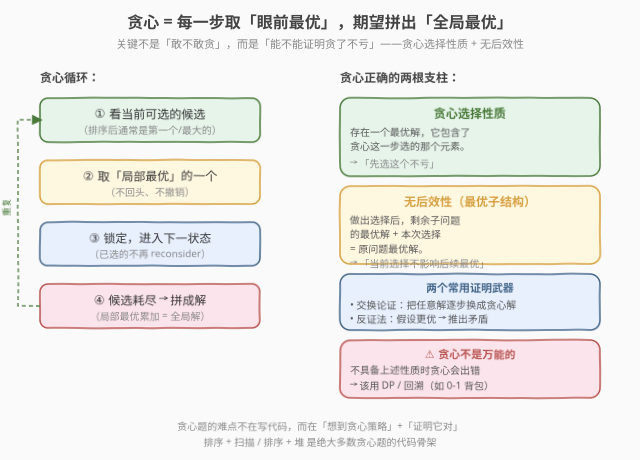
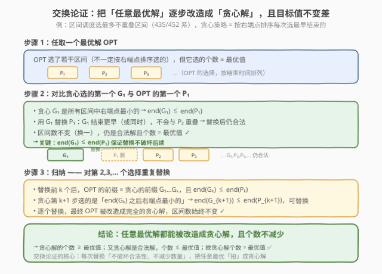
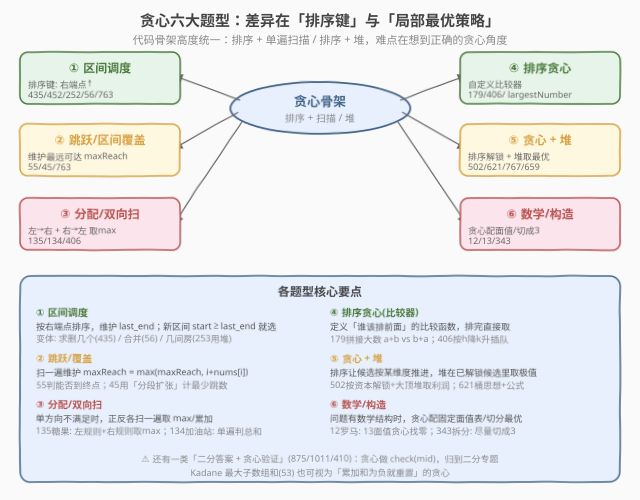
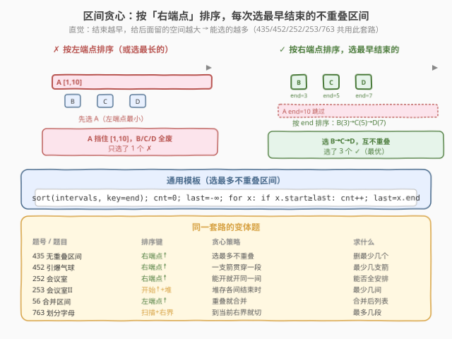
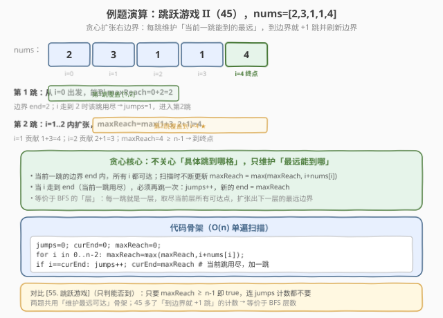
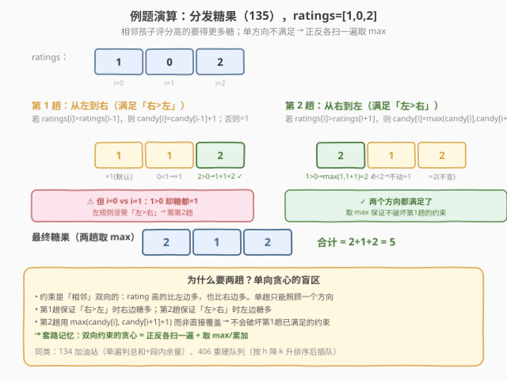
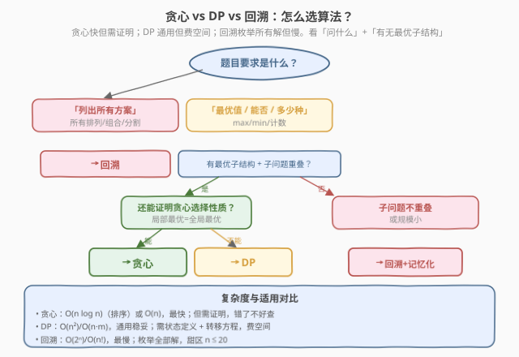

<!-- title: 贪心算法专题 -->
# 贪心算法专题

- **专题**：贪心（Greedy）
- **适用**：面试高频的「求最优值」类问题，排序 + 单遍扫描即可解
- **前置**：排序、双指针、堆的基础用法
- **关联题解**：本站已收录 11 / 12 / 13 / 45 / 53 / 55 / 56 / 121 / 122 / 134 / 135 / 179 / 252 / 253 / 316 / 334 / 343 / 392 / 402 / 406 / 435 / 452 / 502 / 621 / 659 / 714 / 763 / 767 / 875 / 1011 / 1584 等三十余道贪心题解

> 💡 **一句话定位**：贪心 = 每一步都取「眼前最优」的选择，期望拼出「全局最优」解。它**不回头、不撤销**，靠排序或堆把每步的最优选择变得触手可及。难点不在写代码（骨架就是「排序 + 扫描」或「排序 + 堆」），而在**想到正确的贪心角度**并**证明它确实不亏**。

---

## 1. 什么是贪心

### 1.1 定义

贪心算法是一种**在每一步选择中都采取当前状态下最好（或最优）的选择**，从而希望导致全局结果也是最好（或最优）的算法。它做出选择后**绝不反悔**——不像回溯那样撤销重来，也不像 DP 那样枚举所有子问题再取最大。

一句话：**贪心把「求全局最优」简化成「重复做局部最优」**。

### 1.2 什么时候用贪心

凡是满足下面特征的题，值得尝试贪心：

| 特征 | 说明 |
|------|------|
| **求最优值**（max/min/能否/最少） | 不是要「列出所有方案」，而是只要一个最优结果 |
| **有明显的局部最优策略** | 每一步能直观判断「选哪个最好」（如选最早结束的、选最大的、选最短的） |
| **贪心选择性质** | 能证明：存在一个最优解，它包含了贪心这一步选的元素 |
| **无后效性** | 当前选择不影响后续子问题的最优结构（或可证明不影响全局最优） |

> ⚠️ **贪心不是万能的**：当问题不具备上述性质时，贪心会给出错误答案。经典反例是「0-1 背包」——按性价比（价值/重量）贪心并不能得到最优解，因为物品不可分割，必须用 DP。判断「能不能贪心」是本专题的核心功夫。

---

## 2. 核心心智模型：局部最优拼全局最优



贪心的执行骨架是一个简单的循环：

1. **看当前可选的候选**（排序后通常是第一个/最大的）；
2. **取局部最优的一个**（不回头、不撤销）；
3. **锁定，进入下一状态**（已选的不再 reconsider）；
4. **候选耗尽 → 局部最优累加 = 全局解**。

但这个骨架「敢不敢用」取决于两根支柱：

- **贪心选择性质**：存在一个最优解，它包含了贪心这一步选的那个元素——即「先选这个不亏」；
- **无后效性（最优子结构）**：做出选择后，剩余子问题的最优解 + 本次选择 = 原问题最优解——即「当前选择不影响后续最优」。

### 两个证明武器

| 方法 | 思路 | 适用场景 |
|------|------|----------|
| **交换论证** | 任取一个最优解，把它逐步「改造成」贪心解，且目标值不变差 | 区间调度、IPO、分发糖果 |
| **反证法** | 假设存在更优解，推出矛盾 | 跳跃游戏、加油站 |

> 💡 **面试中证明比写代码更重要**：贪心代码往往只有 5-10 行，面试官真正考察的是「你能不能说清为什么这样贪是对的」。能讲出交换论证或反证法，是贪心题拿满分的标志。

---

## 3. 正确性证明：交换论证



交换论证是证明贪心正确性最通用的武器。以「区间调度选最多不重叠区间」（[435](https://leetcode.cn/problems/non-overlapping-intervals/) / [452](https://leetcode.cn/problems/minimum-number-of-arrows-to-burst-balloons/) / [252](https://leetcode.cn/problems/meeting-rooms/) 共用）为例，贪心策略是**按右端点排序，每次选最早结束的不重叠区间**：

1. **任取一个最优解 OPT**：它选了若干区间，个数 = 最优值，但未必是按右端点排序选的。
2. **对比贪心选的第一个 G₁ 与 OPT 的第一个 P₁**：
   - 贪心 G₁ 是所有区间中右端点最小的 → `end(G₁) ≤ end(P₁)`；
   - 用 G₁ 替换 P₁：G₁ 结束更早（或同时），不会与 P₂ 重叠 → 替换后仍合法，区间数不变。
3. **归纳**：对第 2、3… 个选择重复替换。替换前 k 个后，OPT 的前缀 = 贪心的前缀 G₁…Gₖ，且 `end(Gₖ) ≤ end(Pₖ)`，故贪心第 k+1 步选的 `G_{k+1}` 满足 `end(G_{k+1}) ≤ end(P_{k+1})`，可替换。
4. **结论**：任意最优解都能被改造成贪心解，且个数不减少 → 贪心解个数 ≥ 最优值；又贪心解是合法解，个数 ≤ 最优值；故**贪心解个数 = 最优值** ✅。

> 💡 **交换论证的核心直觉**：每次替换「不破坏合法性、不减少数量」，把任意最优「扭」成贪心解。只要能构造这样的替换，贪心就成立。

---

## 4. 题型分类



贪心题按「解的结构」可分六类，代码骨架高度统一（排序 + 扫描 / 排序 + 堆），差异在**排序键**与**局部最优策略**：

| 题型 | 排序键 / 核心策略 | 代表题 |
|------|-------------------|--------|
| **① 区间调度** | 右端点↑，维护 last_end | 435 / 452 / 252 / 56 / 763 |
| **② 跳跃/区间覆盖** | 维护最远可达 maxReach | 55 / 45 |
| **③ 分配/双向扫** | 正反各扫一遍取 max | 135 / 134 / 406 |
| **④ 排序贪心（比较器）** | 自定义比较器 | 179 / 406 |
| **⑤ 贪心 + 堆** | 排序解锁 + 堆取极值 | 502 / 621 / 767 / 659 |
| **⑥ 数学/构造** | 贪心配面值/切分最优 | 12 / 13 / 343 |

> 💡 还有一类「**二分答案 + 贪心验证**」（[875](https://leetcode.cn/problems/koko-eating-bananas/) / [1011](https://leetcode.cn/problems/capacity-to-ship-packages-within-d-days/) / [410](https://leetcode.cn/problems/split-array-largest-sum/)）：贪心做 `check(mid)`，归到二分专题；以及 [53. 最大子数组和](https://leetcode.cn/problems/maximum-subarray/) 的 Kadane 算法可视为「累加和为负就重置」的贪心。

---

## 5. 例题精讲

### 5.1 区间调度（435/452/252/56/763）—— 按右端点排序



**母题**：给定若干区间，选最多不重叠的（或求最少删几个使剩余不重叠）。

**贪心策略**：按**右端点**升序排序，维护 `last_end`，新区间 `start ≥ last_end` 就选，更新 `last_end = end`。

```python
def eraseOverlapIntervals(intervals):
    if not intervals: return 0
    intervals.sort(key=lambda x: x[1])   # ⭐ 按右端点排序
    cnt, last_end = 0, float('-inf')
    for s, e in intervals:
        if s >= last_end:                # 不重叠，选它
            cnt += 1
            last_end = e
    return len(intervals) - cnt          # 求删几个 = 总数 - 选的个数
```

**为什么按右端点而不是左端点？** 结束越早，给后面留的空间越大 → 能选的越多。按左端点排序会先选到 `[1,10]` 这种长区间，挡住后面所有 `[2,3]`、`[4,5]` 等短区间，反而不优。

**变体一网打尽**：

| 题号 | 题目 | 排序键 | 策略变化 |
|------|------|--------|----------|
| 435 | 无重叠区间 | 右端点↑ | 选最多不重叠，求删几个 |
| 452 | 引爆气球 | 右端点↑ | 一支箭贯穿一段重叠区间 |
| 252 | 会议室 | 右端点↑ | 能开就开同一间，判能否全安排 |
| 253 | 会议室 II | 开始↑ + 小顶堆 | 堆存各间结束时刻，求最少几间 |
| 56 | 合并区间 | 左端点↑ | 重叠就合并成一个 |
| 763 | 划分字母区间 | 扫描 + 维护右界 | 到当前右界就切 |

> 详细图解见站内题解 [435. 无重叠区间](../solution/0401-0500/435_无重叠区间.md)、[452. 引爆气球](../solution/0401-0500/452_用最少数量的箭引爆气球.md)、[56. 合并区间](../solution/0001-0100/56_合并区间.md)、[763. 划分字母区间](../solution/0701-0800/763_划分字母区间.md)。

### 5.2 跳跃游戏 II（45）—— 维护最远可达



**题意**：给定非负整数数组 `nums`，`nums[i]` 表示从 `i` 最多能跳 `nums[i]` 步，求到终点最少跳几次。

**贪心策略**：不关心「具体跳到哪格」，只维护「最远能到哪」。每跳维护当前一跳能到的边界 `curEnd`，扫描时不断更新 `maxReach = max(maxReach, i + nums[i])`；当 `i` 走到 `curEnd`（当前一跳用尽），必须再跳一次：`jumps++`，新的 `curEnd = maxReach`。

```python
def jump(nums):
    n = len(nums)
    if n <= 1: return 0
    jumps = curEnd = maxReach = 0
    for i in range(n - 1):               # 注意不到 n-1（终点不用再跳）
        maxReach = max(maxReach, i + nums[i])
        if i == curEnd:                  # 当前跳用尽
            jumps += 1
            curEnd = maxReach
            if curEnd >= n - 1: break    # 已能到终点
    return jumps
```

**正确性直觉**：这等价于 BFS 的「层」——每一跳就是一层，取尽当前层所有可达点，扩张出下一层的最远边界。BFS 在无权图上求最短路是经典的，本题的「图」就是「从 i 能到 i+1..i+nums[i]」。

> 对比 [55. 跳跃游戏](https://leetcode.cn/problems/jump-game/)（只判能否到）：只要 `maxReach ≥ n-1` 即 `true`，连 `jumps` 计数都不要。两题共用「维护最远可达」骨架，详见 [45. 跳跃游戏 II](../solution/0001-0100/45_跳跃游戏 II.md) 与 [55. 跳跃游戏](../solution/0001-0100/55_跳跃游戏.md)。

### 5.3 分发糖果（135）—— 双向扫描



**题意**：`n` 个孩子排成一行，`ratings[i]` 为评分。相邻孩子中评分高的要得更多糖果，每个孩子至少 1 颗，求最少发多少糖果。

**难点**：约束是「相邻」**双向**的——rating 高的比左边多，也比右边多。单趟只能照顾一个方向。

**贪心策略**：正反各扫一遍取 max——

1. **从左到右**：若 `ratings[i] > ratings[i-1]`，则 `candy[i] = candy[i-1] + 1`；否则 `= 1`。保证「右 > 左」时右边糖多。
2. **从右到左**：若 `ratings[i] > ratings[i+1]`，则 `candy[i] = max(candy[i], candy[i+1] + 1)`。保证「左 > 右」时左边糖多。用 `max` 而非覆盖，不破坏第 1 趟的约束。

```python
def candy(ratings):
    n = len(ratings)
    candy = [1] * n
    for i in range(1, n):                # ① 左→右
        if ratings[i] > ratings[i-1]:
            candy[i] = candy[i-1] + 1
    for i in range(n - 2, -1, -1):       # ② 右→左
        if ratings[i] > ratings[i+1]:
            candy[i] = max(candy[i], candy[i+1] + 1)
    return sum(candy)
```

**套路记忆**：**双向约束的贪心 = 正反各扫一遍 + 取 max/累加**。同类还有 [134. 加油站](https://leetcode.cn/problems/gas-station/)（单遍判总和 + 段内余量）、[406. 根据身高重建队列](https://leetcode.cn/problems/queue-reconstruction-by-height/)（按 `h` 降、`k` 升排序后按 `k` 插队）。详见 [135. 分发糖果](../solution/0101-0200/135_分发糖果.md)。

---

## 6. 贪心 vs DP vs 回溯：怎么选算法



| 算法 | 适用场景 | 复杂度 | 关键判断 |
|------|----------|--------|----------|
| **贪心** | 求最优值，能证明贪心选择性质 | $O(n \log n)$（排序）或 $O(n)$ | 局部最优 = 全局最优？能证明就贪心 |
| **DP** | 求最优值/计数，有最优子结构 + 子问题重叠 | $O(n^2)$ / $O(n \cdot m)$ | 有重叠子问题，贪心证不出 → DP |
| **回溯** | 列出所有方案，规模小（n ≤ 20） | $O(2^n)$ / $O(n!)$ | 要「枚举全部解」→ 回溯 |

**决策流程**：

1. 题目要**列出所有方案** → 回溯；
2. 题目要**最优值/能否/计数** → 有最优子结构？
   - **能**：还能证明贪心选择性质？能 → **贪心**；不能 → **DP**；
   - **不能**（子问题不重叠或规模小）→ **回溯 + 记忆化**。

**经典对照**：

| 题对 | 贪心版 | DP 版 |
|------|--------|-------|
| 背包 | 部分背包（可分割，按性价比贪心 ✅） | 0-1 背包（不可分割，贪心 ✗ → DP） |
| 股票 | [122. 多次买卖](https://leetcode.cn/problems/best-time-to-buy-and-sell-stock-ii/)（每次涨就赚 ✅） | [188. k 次买卖](https://leetcode.cn/problems/best-time-to-buy-and-sell-stock-iv/)（状态机 DP） |
| 跳跃 | [55](https://leetcode.cn/problems/jump-game/)/[45](https://leetcode.cn/problems/jump-game-ii/)（维护 maxReach ✅） | — |
| 子数组和 | [53. 最大子数组和](https://leetcode.cn/problems/maximum-subarray/) Kadane（和为负重置 ✅） | 也可 DP：`dp[i]=max(nums[i],dp[i-1]+nums[i])` |

> ⚠️ **贪心错了不好查**：不像 DP 有明确的转移方程可验证，贪心「漏掉一种情况」会静默给出错误答案。建议**先用小数据暴力验证**（写个回溯对照），确认贪心结果与暴力一致，再提交。

---

## 7. 复杂度分析

贪心的复杂度几乎总是「排序 + 单遍扫描」：

| 题型 | 时间复杂度 | 空间复杂度 | 说明 |
|------|------------|------------|------|
| 区间调度 | $O(n \log n)$ | $O(\log n)$（排序栈）/ $O(1)$ | 排序主导，扫描 $O(n)$ |
| 跳跃/覆盖 | $O(n)$ | $O(1)$ | 无需排序，单遍扫描 |
| 分配/双向扫 | $O(n)$ | $O(n)$ | 两趟扫描，存 candy 数组 |
| 排序贪心（比较器） | $O(n \log n)$ | $O(n)$（拼接字符串） | 排序主导 |
| 贪心 + 堆 | $O(n \log n)$ | $O(n)$ | 每次堆操作 $O(\log n)$，共 $n$ 次 |
| 数学/构造 | $O(1)$ 或 $O(\log n)$ | $O(1)$ | 如罗马数字 13 面值、整数拆分切 3 |

> 💡 **贪心题的复杂度下限通常是排序的 $O(n \log n)$**，少数无需排序的（如跳跃游戏、分发糖果）能到 $O(n)$。这比 DP 的 $O(n^2)$ 和回溯的 $O(2^n)$ 快得多——这就是贪心的魅力：**一旦证明正确，它是最快的解法**。

---

## 8. 常见误区与技巧

1. **不证明就贪心**
   - 贪心「看起来对」不等于「真对」。经典反例：0-1 背包按性价比贪心会错（物品不可分割）。**先想反例，想不出再尝试证明**。

2. **区间题按左端点排序**
   - 选最多不重叠区间要按**右端点**排（结束早的优先，给后面留空间）。按左端点排会先选长区间挡住后面。但「合并区间」(56) 按左端点排（要合并重叠的，按起点扫更自然）。**排序键随目标而变**。

3. **单向贪心漏掉双向约束**
   - 分发糖果(135)的约束是双向的（比左多、比右多），单趟只能满足一个方向。**正反各扫一遍取 max** 是通用套路。

4. **比较器写反或没传递性**
   - [179. 最大数](https://leetcode.cn/problems/largest-number/) 用 `a+b vs b+a` 比较拼接大小，不能用普通的数值比较。自定义比较器必须满足**全序关系**（自反、反对称、传递），否则排序结果错乱。

5. **堆用错方向**
   - 「选最大」用大顶堆，「求第 K 大 / 最小覆盖」用小顶堆（堆顶是最差者，超过 K 就踢堆顶）。[502. IPO](https://leetcode.cn/problems/ipo/) 用大顶堆取最大利润，[253. 会议室 II](https://leetcode.cn/problems/meeting-rooms-ii/) 用小顶堆存各房间结束时刻。

6. **贪心和 DP 混淆**
   - 问「列出所有方案」→ 回溯；问「最优值/计数」且能证明贪心性质 → 贪心；证不出 → DP。**先想能不能贪心，不行再 DP**，不要一上来就 DP 错过更优解。

7. **忘记边界：空输入、单元素、全相同**
   - 区间题空数组返回 0；分发糖果全相同 rating 每人 1 颗；跳跃游戏 `n=1` 直接 0 跳。**先写边界再写主体**。

8. **能排序预处理却不排序**
   - 很多贪心策略依赖「候选有序」才能成立（如区间按右端点、IPO 按资本、最大数按拼接比较器）。**排序是贪心的前置步骤，不能省**。

---

## 9. 课后练习题

按难度递进，建议**按顺序刷**，每道题先自己写，卡 20 分钟再看站内题解。带「✅ 题解」的表示本站已有详细中文题解。

### 🟢 基础：单遍扫描

| 题号 | 题目 | 难度 | 考点 | 题解 |
|------|------|------|------|------|
| 55 | [跳跃游戏](https://leetcode.cn/problems/jump-game/) | 中等 | 维护 maxReach 判能否到 | ✅ [题解](../solution/0001-0100/55_跳跃游戏.md) |
| 121 | [买卖股票的最佳时机](https://leetcode.cn/problems/best-time-to-buy-and-sell-stock/) | 简单 | 维护历史最低，一次遍历 | ✅ [题解](../solution/0101-0200/121_买卖股票的最佳时机.md) |
| 122 | [买卖股票的最佳时机 II](https://leetcode.cn/problems/best-time-to-buy-and-sell-stock-ii/) | 中等 | 每次涨就赚，累加正向差 | ✅ [题解](../solution/0101-0200/122_买卖股票的最佳时机II.md) |
| 53 | [最大子数组和](https://leetcode.cn/problems/maximum-subarray/) | 中等 | Kadane：累加和为负就重置 | ✅ [题解](../solution/0001-0100/53_最大子数组和.md) |
| 392 | [判断子序列](https://leetcode.cn/problems/is-subsequence/) | 简单 | 双指针贪心匹配 | ✅ [题解](../solution/0301-0400/392_判断子序列.md) |
| 13 | [罗马数字转整数](https://leetcode.cn/problems/roman-to-integer/) | 简单 | 哈希 + 贪心（左小右大则减） | ✅ [题解](../solution/0001-0100/13_罗马数字转整数.md) |

> **目标**：掌握「单遍扫描维护一个标量（max/min/sum）」的最基础贪心形态。

### 🟡 进阶：排序 + 贪心策略

| 题号 | 题目 | 难度 | 考点 | 题解 |
|------|------|------|------|------|
| 435 | [无重叠区间](https://leetcode.cn/problems/non-overlapping-intervals/) | 中等 | 区间调度，按右端点排序 | ✅ [题解](../solution/0401-0500/435_无重叠区间.md) |
| 452 | [用最少数量的箭引爆气球](https://leetcode.cn/problems/minimum-number-of-arrows-to-burst-balloons/) | 中等 | 区间合并，一支箭一段 | ✅ [题解](../solution/0401-0500/452_用最少数量的箭引爆气球.md) |
| 56 | [合并区间](https://leetcode.cn/problems/merge-intervals/) | 中等 | 按左端点排序合并重叠 | ✅ [题解](../solution/0001-0100/56_合并区间.md) |
| 763 | [划分字母区间](https://leetcode.cn/problems/partition-labels/) | 中等 | 维护当前段右界，到就切 | ✅ [题解](../solution/0701-0800/763_划分字母区间.md) |
| 45 | [跳跃游戏 II](https://leetcode.cn/problems/jump-game-ii/) | 中等 | maxReach + 边界计数 | ✅ [题解](../solution/0001-0100/45_跳跃游戏 II.md) |
| 179 | [最大数](https://leetcode.cn/problems/largest-number/) | 中等 | 自定义比较器拼接 | ✅ [题解](../solution/0101-0200/179_最大数.md) |
| 406 | [根据身高重建队列](https://leetcode.cn/problems/queue-reconstruction-by-height/) | 中等 | 按 h 降 k 升排序后插队 | ✅ [题解](../solution/0401-0500/406_根据身高重建队列.md) |
| 12 | [整数转罗马数字](https://leetcode.cn/problems/integer-to-roman/) | 中等 | 13 面值贪心找零 | ✅ [题解](../solution/0001-0100/12_整数转罗马数字.md) |
| 343 | [整数拆分](https://leetcode.cn/problems/integer-break/) | 中等 | 数学贪心，尽量切成 3 | ✅ [题解](../solution/0301-0400/343_整数拆分.md) |

> **目标**：熟练运用「排序 + 单遍扫描」骨架，能根据目标选对排序键（右端点/左端点/自定义比较器）。

### 🔴 挑战：双向扫 / 贪心 + 堆

| 题号 | 题目 | 难度 | 考点 | 题解 |
|------|------|------|------|------|
| 135 | [分发糖果](https://leetcode.cn/problems/candy/) | 困难 | 正反双向扫描取 max | ✅ [题解](../solution/0101-0200/135_分发糖果.md) |
| 134 | [加油站](https://leetcode.cn/problems/gas-station/) | 中等 | 单遍判总和 + 段内余量 | ✅ [题解](../solution/0101-0200/134_加油站.md) |
| 502 | [IPO](https://leetcode.cn/problems/ipo/) | 困难 | 排序解锁 + 大顶堆取利润 | ✅ [题解](../solution/0501-0600/502_IPO.md) |
| 621 | [任务调度器](https://leetcode.cn/problems/task-scheduler/) | 中等 | 桶思想 + 公式 | ✅ [题解](../solution/0601-0700/621_任务调度器.md) |
| 767 | [重构字符串](https://leetcode.cn/problems/reorganize-string/) | 中等 | 大根堆按频率交替放置 | ✅ [题解](../solution/0701-0800/767_重构字符串.md) |
| 659 | [分割数组为连续子序列](https://leetcode.cn/problems/split-array-into-consecutive-subsequences/) | 中等 | 贪心 + 哈希，续接优先 | ✅ [题解](../solution/0601-0700/659_分割数组为连续子序列.md) |
| 402 | [移掉 K 位数字](https://leetcode.cn/problems/remove-k-digits/) | 中等 | 单调栈 + 贪心 | ✅ [题解](../solution/0401-0500/402_移掉K位数字.md) |
| 316 | [去除重复字母](https://leetcode.cn/problems/remove-duplicate-letters/) | 中等 | 单调栈 + 贪心 + 去重 | ✅ [题解](../solution/0301-0400/316_去除重复字母.md) |

> **目标**：掌握双向扫描、贪心 + 堆、贪心 + 单调栈三大进阶套路，能讲清正确性证明。

### 🏆 拓展：综合与变体

| 题号 | 题目 | 难度 | 考点 |
|------|------|------|------|
| 253 | [会议室 II](https://leetcode.cn/problems/meeting-rooms-ii/) | 中等 | 区间 + 小顶堆求最少房间（✅ [题解](../solution/0201-0300/253_会议室II.md)） |
| 334 | [递增的三元子序列](https://leetcode.cn/problems/increasing-triplet-subsequence/) | 中等 | 贪心双阈值 O(n) 判 LIS≥3（✅ [题解](../solution/0301-0400/334_递增的三元子序列.md)） |
| 714 | [买卖股票含手续费](https://leetcode.cn/problems/best-time-to-buy-and-sell-stock-with-transaction-fee/) | 中等 | 状态机 DP + 贪心后悔机制（✅ [题解](../solution/0701-0800/714_买卖股票的最佳时机含手续费.md)） |
| 875 | [爱吃香蕉的珂珂](https://leetcode.cn/problems/koko-eating-bananas/) | 中等 | 二分答案 + 贪心验证（✅ [题解](../solution/0801-0900/875_爱吃香蕉的珂珂.md)） |
| 1011 | [在 D 天内送达包裹的能力](https://leetcode.cn/problems/capacity-to-ship-packages-within-d-days/) | 中等 | 二分答案 + 贪心装船（✅ [题解](../solution/1001-1100/1011_在D天内送达包裹的能力.md)） |
| 1584 | [连接所有点的最小费用](https://leetcode.cn/problems/min-cost-to-connect-all-points/) | 中等 | Prim MST 贪心选最短跨割边（✅ [题解](../solution/1501-1600/1584_连接所有点的最小费用.md)） |
| 11 | [盛最多水的容器](https://leetcode.cn/problems/container-with-most-water/) | 中等 | 双指针贪心收缩（✅ [题解](../solution/0001-0100/11_盛最多水的容器.md)） |
| 918 | [环形子数组的最大和](https://leetcode.cn/problems/maximum-sum-circular-subarray/) | 中等 | Kadane 环形变体 total−min（✅ [题解](../solution/0901-1000/918_最大环形子数组和.md)） |
| 881 | [救生艇](https://leetcode.cn/problems/boats-to-save-people/) | 中等 | 排序 + 双指针贪心配对 |
| 1347 | [制造字母异位词的最小步数](https://leetcode.cn/problems/minimum-number-of-steps-to-make-two-strings-anagram/) | 中等 | 频率差贪心 |
| 1402 | [做菜顺序](https://leetcode.cn/problems/reducing-dishes/) | 困难 | 排序 + 后缀和贪心 |
| 1561 | [你可以获得的最大硬币数目](https://leetcode.cn/problems/maximum-number-of-coins-you-can-get/) | 中等 | 排序 + 隔一个取次大 |

---

## 10. 速记总结

> **贪心 = 每步取局部最优，证明不亏就能拼出全局最优**。骨架永远是「**排序 + 单遍扫描**」或「**排序 + 堆**」，三步循环：看候选 → 取最优 → 锁定进入下一状态。题型差异在排序键：区间调度按**右端点**（结束早留空间大），跳跃/覆盖维护**最远可达**，分配/双向约束**正反各扫取 max**，排序贪心用**自定义比较器**，资源调度用**堆取极值**。正确性靠**交换论证**或**反证法**证明。问「最优值」且能证明贪心性质 → 贪心（最快）；证不出 → DP；要「列出全部方案」→ 回溯。**先想反例，想不出再证明，小数据暴力对照**。
