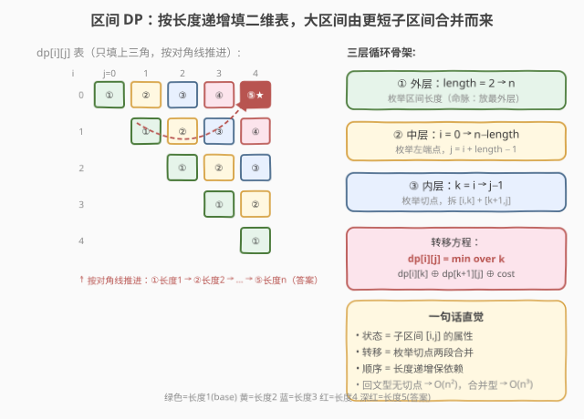
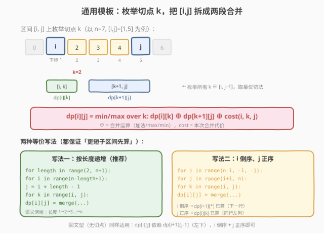
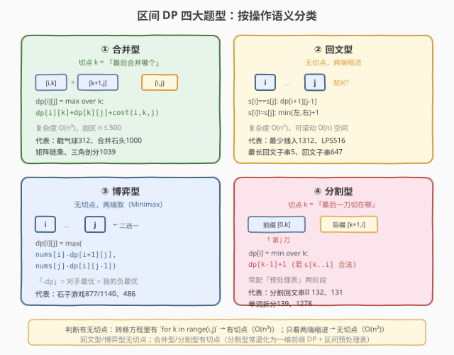

<!-- title: 区间 DP 专题 -->
# 区间 DP 专题

- **专题**：区间 DP（Interval DP）
- **适用**：面试高频的「序列/环形上的合并、回文、博弈」类问题
- **前置**：一维/二维 DP 基础、递归分治思想
- **关联题解**：本站已收录 5 / 132 / 1312 / 1143 等区间 DP 相关题解

> 💡 **一句话定位**：区间 DP = 在一段序列上「**由短到长**」地填一张二维表，`dp[i][j]` 表示子区间 `[i, j]` 上的最优值/方案数。它把「区间上的分治」变成「按长度递增的递推」——先算所有长度为 1 的子区间，再算长度 2、3……直到 `[0, n-1]`。所有转移都形如「**在区间内找一个切点 `k`，把 `[i,j]` 拆成 `[i,k]` + `[k,j]` 两段合并**」。

---

## 1. 什么是区间 DP

### 1.1 定义

区间 DP 是一类**状态定义在「序列的连续子区间」上**的动态规划。与一维前缀 DP（`dp[i]` 表示前 `i` 个元素）不同，它的状态是二维的——`dp[i][j]` 刻画**子区间 `[i, j]` 这个整体**的属性（最优值、方案数、可行性），而非某个前缀。

它的核心特征是**「枚举切点，两段合并」**：要计算 `[i, j]` 的答案，必须先知道它的所有更短子区间的答案，然后枚举一个切点 `k`，把 `[i, j]` 拆成 `[i, k]` 和 `[k, j]`（或 `[i, k]` 和 `[k+1, j]`），由两段的答案合并出整段的答案。

### 1.2 什么时候用区间 DP

凡是满足下面特征的题，几乎都该想到区间 DP：

| 特征 | 说明 |
|------|------|
| **输入是一段序列/字符串/环** | 元素有序排列，操作针对「连续子段」 |
| **操作是「合并相邻」或「从两端缩进」** | 每步把区间拆成两半或剥掉两端 |
| **具备最优子结构（区间可分）** | 大区间的最优解能由更短子区间的最优解拼出 |
| **规模较小** | `n ≤ 500` 是区间 DP 甜区（`O(n³)` 约 $10^8$ 可接受） |

> ⚠️ **区间 DP vs 一维前缀 DP**：前缀 DP（如 [300. LIS](https://leetcode.cn/problems/longest-increasing-subsequence/)）的状态 `dp[i]` 只依赖 `dp[0..i-1]`，一重循环即可；区间 DP 的 `dp[i][j]` 依赖所有 `dp[i][k]` 和 `dp[k][j]`，必须**按长度递增**填表，且通常多一层「枚举切点」的循环 → $O(n^3)$。看到「区间合并/回文/博弈」就想到区间 DP，看到「前缀最值」就用一维 DP。

---

## 2. 核心心智模型：由短到长填表



把区间 `[i, j]` 想象成二维表中的一个格子（行 `i`、列 `j`，只填 `i ≤ j` 的上三角）。区间 DP 的填表顺序是**按对角线推进**——

1. **长度 1**（对角线 `i == j`）：base case，单元素区间，直接初始化；
2. **长度 2**（`j == i+1`）：由两个长度 1 的子区间合并，或两端配对；
3. **长度 3、4……**：每次枚举切点 `k`，由两段更短的子区间合并；
4. **直到长度 `n`**：`dp[0][n-1]` 即答案。

**通用转移骨架**：

$$
dp[i][j] = \min_{i \leq k < j} \big(\, dp[i][k] \oplus dp[k+1][j] \oplus \text{cost}(i, k, j) \,\big)
$$

其中 `⊕` 是「合并运算」（加法、取 max/min、按题意组合），`cost(i, k, j)` 是这次合并的额外代价。核心动作是**枚举所有切点 `k`，取最优的切法**。

> 💡 **为什么必须按长度递增？** `dp[i][j]` 依赖 `dp[i][k]`（长度 `k-i+1 < j-i+1`）和 `dp[k+1][j]`（长度 `j-k < j-i+1`），两段都严格更短。只有先填完所有更短的子区间，才能正确推导当前区间。按长度递增 = 保证依赖项已就绪，这是区间 DP 的**命脉**。

---

## 3. 通用代码模板



所有区间 DP 题都套用下面这个三层循环骨架，只需调整「状态定义、合并运算、代价函数」三件套：

### Python 模板

```python
def interval_dp(nums):
    n = len(nums)
    dp = [[0] * n for _ in range(n)]
    # ① 初始化：长度 1 的 base case
    for i in range(n):
        dp[i][i] = base_case(i)
    # ② 按长度递增填表
    for length in range(2, n + 1):          # 枚举区间长度
        for i in range(n - length + 1):     # 枚举左端点
            j = i + length - 1              # 右端点
            dp[i][j] = INF                   # 初始化为极值
            # ③ 枚举切点 k（合并 [i,k] 与 [k+1,j]）
            for k in range(i, j):
                dp[i][j] = min(dp[i][j],
                               dp[i][k] + dp[k+1][j] + cost(i, k, j))
    return dp[0][n-1]
```

### C++ 模板

```cpp
int interval_dp(vector<int>& nums) {
    int n = nums.size();
    vector<vector<int>> dp(n, vector<int>(n, 0));
    // ① 初始化：长度 1
    for (int i = 0; i < n; ++i) dp[i][i] = base_case(i);
    // ② 按长度递增
    for (int len = 2; len <= n; ++len) {
        for (int i = 0; i + len <= n; ++i) {
            int j = i + len - 1;
            dp[i][j] = INF;
            // ③ 枚举切点
            for (int k = i; k < j; ++k) {
                dp[i][j] = min(dp[i][j],
                               dp[i][k] + dp[k+1][j] + cost(i, k, j));
            }
        }
    }
    return dp[0][n-1];
}
```

> ⚠️ **三层循环顺序不能乱**：最外层是**长度**（保证依赖项先算），中间是**左端点**（配合长度定右端点），最内层是**切点**（枚举所有拆法）。把长度放外层是区间 DP 区别于普通二维 DP 的关键——普通二维 DP 按 `i` 递增、`j` 递增即可，而区间 DP 必须按长度递增。

### 三件套随题型的变化

| 要素 | 戳气球（312） | 最少插入回文（1312） | 分割回文串 II（132） | 博弈取石子（877） |
|------|--------------|---------------------|----------------------|-------------------|
| **dp[i][j]** | 戳 `(i,j)` 开区间最大金币 | `s[i..j]` 成回文最少插入 | `s[0..i]` 最少切割（一维！） | `[i,j]` 先手净赚 |
| **切点 k** | 最后戳哪个气球 `k` | —（两端配对，无切点） | —（枚举最后一刀位置） | —（两端取，无切点） |
| **合并运算** | `dp[i][k] + dp[k][j] + nums[i]·nums[k]·nums[j]` | `dp[i+1][j-1]` 或 `min(左,右)+1` | `dp[j-1] + 1` | `max(nums[i] − dp[i+1][j], nums[j] − dp[i][j-1])` |
| **复杂度** | $O(n^3)$ | $O(n^2)$ | $O(n^2)$ | $O(n^2)$ |

> 💡 **不是所有区间 DP 都是 $O(n^3)$**：当转移**不枚举切点**（只看两端缩进，如回文类），复杂度降为 $O(n^2)$。枚举切点（如合并类、戳气球）才是 $O(n^3)$。判断标准：转移方程里有没有 `for k in range(i, j)` 这一层。

---

## 4. 填表方向与等价写法

区间 DP 有两种等价的写法，本质都是「保证依赖项先算」：

### 写法一：按长度递增（推荐，语义清晰）

```python
for length in range(2, n + 1):      # 外层长度
    for i in range(n - length + 1):
        j = i + length - 1
        for k in range(i, j):       # 枚举切点
            ...
```

### 写法二：i 倒序、j 正序（省去 length 变量）

```python
for i in range(n - 1, -1, -1):      # i 从大到小
    for j in range(i + 1, n):       # j 从小到大
        for k in range(i, j):       # 枚举切点
            ...
```

**为什么写法二也正确？** `dp[i][j]` 依赖 `dp[i][k]`（`k < j`，同一行更左列，`j` 正序时已算）和 `dp[k+1][j]`（`k+1 > i`，更下面行，`i` 倒序时已算）。两个依赖都先于 `dp[i][j]` 被填好。

> ⚠️ **回文类区间 DP（无切点）的依赖方向不同**：`dp[i][j]` 依赖 `dp[i+1][j-1]`（左下方）。此时 `i` 倒序、`j` 正序同样正确——`i+1 > i`（下一行已算），`j-1 < j`（同行左列已算）。这也是 [516. 最长回文子序列](https://leetcode.cn/problems/longest-palindromic-subsequence/)、[1312](../solution/1301-1400/1312_让字符串成为回文串的最少插入次数.md) 的推荐写法。

---

## 5. 题型分类



区间 DP 题按「操作语义」分四类，核心差异在**切点含义**和**合并方式**：

| 题型 | 切点 k 的含义 | 合并方式 | 代表题 |
|------|--------------|----------|--------|
| **① 合并型** | 「最后合并哪个」 | 两段代价 + 合并代价 | 戳气球 312、合并石头 1000 |
| **② 回文型** | 无切点（两端缩进） | 两端配对/单边补 | 最少插入 1312、LPS 516、最长回文子串 5 |
| **③ 博弈型** | 无切点（两端取） | 先手取一端，剩余转后手 | 石子游戏 877/1140 |
| **④ 分割型** | 「最后一刀切在哪」 | 前缀代价 + 后缀代价 | 分割回文串 II 132、单词拆分 139 |

### 5.1 合并型：枚举最后合并的位置

**特征**：每次把区间拆成两段，两段各自的最优代价 + 合并这一步的代价 = 整段代价。切点 `k` 表示「左右两段以 `k` 为界」。

**典型转移**（戳气球）：

$$
dp[i][j] = \max_{i < k < j} \big(\, dp[i][k] + dp[k][j] + nums[i] \cdot nums[k] \cdot nums[j] \,\big)
$$

> 💡 **「最后合并」而非「第一次合并」**：区间 DP 的转移通常定义为「枚举**最后一步**操作」，因为最后一步操作后区间变成完整的 `[i, j]`，之前的操作都发生在更短的子区间里——这天然符合「大区间依赖更短子区间」的递推方向。想「第一次操作」则要正向模拟，反而不直观。

### 5.2 回文型：两端配对，无切点

**特征**：操作针对区间两端——若两端字符相同则配对（无代价），不同则单边补/删（代价 `+1`）。**不枚举切点**，复杂度 $O(n^2)$。

**典型转移**（[1312. 最少插入回文](../solution/1301-1400/1312_让字符串成为回文串的最少插入次数.md)）：

$$
dp[i][j] = \begin{cases} dp[i+1][j-1] & \text{若 } s[i] = s[j] \\ \min(dp[i+1][j],\ dp[i][j-1]) + 1 & \text{若 } s[i] \neq s[j] \end{cases}
$$

> 💡 **回文型的等价转化**：最少插入次数 = `n − LPS(s)`，而 `LPS(s) = LCS(s, reverse(s))`，故可套 [1143. LCS](../solution/1101-1200/1143_最长公共子序列.md) 模板求解。这种「区间 DP ↔ LCS」的转化在面试中很出彩。

### 5.3 博弈型：先手取一端，剩余转后手

**特征**：两个玩家轮流从区间两端取元素，都追求自己总分最大。当前玩家取左端或右端后，剩余区间交给对手，对手也最优——**「对手的最优 = 我的负最优」**。

**典型转移**（[877. 石子游戏](https://leetcode.cn/problems/stone-game/)）：

$$
dp[i][j] = \max\big(\, nums[i] - dp[i+1][j],\ \ nums[j] - dp[i][j-1] \,\big)
$$

> 💡 **`-dp` 的含义**：`dp[i+1][j]` 是对手在剩余区间上的「净赚」（对手先手时的最优差分）。我取了 `nums[i]` 后，剩余区间轮到对手先手，对手会拿走 `dp[i+1][j]` 的优势——所以我的净赚是 `nums[i] − dp[i+1][j]`。这就是 Minimax 思想：**我的得分 − 对手的最优得分**。

### 5.4 分割型：枚举最后一刀

**特征**：把区间切成若干段，每段满足某条件，求最少刀数/最大收益。切点 `k` 表示「最后一刀切在 `k` 之后」。

**典型转移**（[132. 分割回文串 II](../solution/0101-0200/132_分割回文串II.md)，实为一维前缀 DP + 回文预处理表）：

$$
dp[i] = \min_{\substack{0 \leq j \leq i \\ \text{isPal}[j][i]}} \big(\, dp[j-1] + 1 \,\big)
$$

> ⚠️ **132 严格说是「前缀 DP + 区间预处理」**：主 DP 是一维 `dp[i]`（前缀），但回文判定表 `isPal[i][j]` 是区间 DP 预处理的。这种「**辅助区间 DP + 主一维 DP**」的范式很常见——把反复使用的中间信息（回文性、区间和）一次性算成表，主 DP 查询 $O(1)$。

---

## 6. 例题精讲

### 6.1 最少插入回文（1312）—— 回文型模板

**题意**：给字符串 `s`，每次可在任意位置插一个字符，求使 `s` 成回文的最少插入次数。

**思路**：`dp[i][j]` = 让 `s[i..j]` 成回文的最少插入。两端相同则配对无代价，不同则单边补 `+1`。

```python
def minInsertions(s):
    n = len(s)
    dp = [[0] * n for _ in range(n)]
    for length in range(2, n + 1):
        for i in range(n - length + 1):
            j = i + length - 1
            if s[i] == s[j]:
                dp[i][j] = dp[i+1][j-1]          # 两端配对，无代价
            else:
                dp[i][j] = min(dp[i+1][j], dp[i][j-1]) + 1
    return dp[0][n-1]
```

**等价解法**：`答案 = n − LPS(s) = n − LCS(s, reverse(s))`，套 1143 LCS 模板。两种解法都 $O(n^2)$。

> 详细图解与演算见站内题解 [1312. 让字符串成为回文串的最少插入次数](../solution/1301-1400/1312_让字符串成为回文串的最少插入次数.md)。

### 6.2 分割回文串 II（132）—— 辅助预处理 + 主 DP

**题意**：给字符串 `s`，切成若干段使每段都是回文，求最少刀数。

**思路**：两阶段——先用区间 DP 预处理 `isPal[i][j]`（`s[i..j]` 是否回文），再用一维 DP `dp[i]` 求前缀 `s[0..i]` 的最少切割。

```python
def minCut(s):
    n = len(s)
    # Phase 1: 区间 DP 预处理回文表
    isPal = [[False] * n for _ in range(n)]
    for i in range(n - 1, -1, -1):
        for j in range(i, n):
            isPal[i][j] = (s[i] == s[j]) and (j - i < 2 or isPal[i+1][j-1])
    # Phase 2: 一维 DP 求最少切割
    dp = [0] * n
    for i in range(n):
        if isPal[0][i]:
            dp[i] = 0
        else:
            dp[i] = i
            for j in range(1, i + 1):
                if isPal[j][i]:
                    dp[i] = min(dp[i], dp[j-1] + 1)
    return dp[n-1]
```

> 详细两阶段图解见站内题解 [132. 分割回文串 II](../solution/0101-0200/132_分割回文串II.md)。核心技巧：把 $O(n)$ 的回文判定预计算成 $O(1)$ 查表，总复杂度从 $O(n^3)$ 降到 $O(n^2)$。

### 6.3 最长回文子串（5）—— 回文表的另一用法

**题意**：给字符串 `s`，返回最长回文子串。

**思路**：与 132 共用同一张 `isPal` 预处理表，只是把「求最少切割」换成「找最长的 `isPal[i][j]=true` 的区间」。也可用中心扩展法 $O(n^2)$ / Manacher $O(n)$。

> 见站内题解 [5. 最长回文子串](../solution/0001-0100/5_最长回文子串.md)。回文预处理表是 5 / 131 / 132 / 1312 / 516 的共同基础设施——一次预处理，多题复用。

---

## 7. 复杂度分析

| 题型 | 状态数 | 每状态转移 | 总复杂度 | 空间 |
|------|--------|-----------|----------|------|
| **合并型**（戳气球 312） | $O(n^2)$ | $O(n)$（枚举切点） | $O(n^3)$ | $O(n^2)$ |
| **回文型**（1312 / 516） | $O(n^2)$ | $O(1)$（两端缩进） | $O(n^2)$ | $O(n^2)$（可滚动 $O(n)$） |
| **博弈型**（877） | $O(n^2)$ | $O(1)$（两端取） | $O(n^2)$ | $O(n^2)$ |
| **分割型 + 预处理**（132） | $O(n)$ + $O(n^2)$ | $O(n)$ / $O(1)$ | $O(n^2)$ | $O(n^2)$ |

> ⚠️ **$O(n^3)$ 的甜区是 `n ≤ 500`**：$500^3 = 1.25 \times 10^8$，常数小时可过；`n = 1000` 则 $10^9$ 容易超时。合并型题若 `n` 更大，需考虑四边形不等式优化（把切点搜索从 $O(n)$ 降到 $O(\log n)$ 或均摊 $O(1)$），但面试极少要求。

> 💡 **空间优化**：回文型/博弈型的 `dp[i][j]` 只依赖 `dp[i+1][...]`（下一行）和 `dp[i][j-1]`（同行左列），可用一维数组 + `prev` 变量压缩到 $O(n)$，技巧与 [1143. LCS](../solution/1101-1200/1143_最长公共子序列.md) 滚动数组完全一致。合并型依赖整个 `[i..j]` 区间，难以滚动。

---

## 8. 常见误区与技巧

1. **填表顺序写错（最常见）**
   - 把长度循环放内层，导致算 `dp[i][j]` 时子区间还没算 → 全错。**长度必须在最外层**，保证「短区间先填」。

2. **切点范围搞错**
   - 合并型切点 `k` 范围是 `[i, j-1]`（把 `[i,j]` 拆成 `[i,k]` 和 `[k+1,j]`，`k` 从 `i` 到 `j-1`）；戳气球开区间则是 `k ∈ (i, j)`。**边界含不含要按题意核对**。

3. **初始化遗漏**
   - 长度 1 的 base case 必须先填（合并型单元素代价 0、回文型单字符为真/代价 0）。长度 0（空区间）有时也需初始化为 0/单位元。

4. **回文型忘记空串边界**
   - `len=2` 时 `dp[i+1][j-1] = dp[i+1][i]` 是 `j < i` 的无效区间，应视为 0/单位元。C++/Python 初始化全 0 即天然满足，但要**意识到这个边界**。

5. **博弈型 `-dp` 写成 `+dp`**
   - 博弈 DP 的转移是「我的得分 − 对手在剩余区间的最优差分」，不是相加。写成 `nums[i] + dp[i+1][j]` 会变成「合作最大化」，语义全错。

6. **能预处理却不预处理**
   - 回文类题反复判定 `s[i..j]` 是否回文，每次双指针 $O(n)$ → 总 $O(n^3)$ 超时。**一次性预处理成 `isPal` 表**，查询 $O(1)$，总 $O(n^2)$。这是 132/5/1312/516 的共同优化。

7. **混淆「区间 DP」和「一维前缀 DP」**
   - 132 的主 DP 是一维 `dp[i]`（前缀），只是辅助表 `isPal` 是区间 DP。不要把所有带二维表的 DP 都叫区间 DP——区间 DP 的标志是**状态定义在子区间 `[i,j]` 上**，而非前缀。

8. **开区间 vs 闭区间**
   - 戳气球（312）用**开区间** `dp[i][j]` 表示「不戳 `i` 和 `j`，只戳中间」，因为最后戳 `k` 时它的邻居是 `i` 和 `j`（已被假设不戳）。闭区间则 `k` 的邻居在变化。**开区间让「最后一步」的代价 cleanly 依赖两端固定值**，是这类题的关键建模技巧。

---

## 9. 课后练习题

按难度递进，建议**按顺序刷**，每道题先自己写，卡 20 分钟再看站内题解。带「✅ 题解」的表示本站已有详细中文题解。

### 🟢 基础：回文型两端缩进

| 题号 | 题目 | 难度 | 考点 | 题解 |
|------|------|------|------|------|
| 5 | [最长回文子串](https://leetcode.cn/problems/longest-palindromic-substring/) | 中等 | 回文预处理表 / 中心扩展 | ✅ [题解](../solution/0001-0100/5_最长回文子串.md) |
| 1312 | [让字符串成为回文串的最少插入次数](https://leetcode.cn/problems/minimum-insertion-steps-to-make-a-string-palindrome/) | 困难 | 回文型区间 DP + LCS 等价 | ✅ [题解](../solution/1301-1400/1312_让字符串成为回文串的最少插入次数.md) |
| 647 | [回文子串](https://leetcode.cn/problems/palindromic-substrings/) | 中等 | 回文表计数 / 中心扩展 | — |
| 516 | [最长回文子序列](https://leetcode.cn/problems/longest-palindromic-subsequence/) | 中等 | 区间 DP 求 LPS，`n−LPS=最少插入` | — |

> **目标**：掌握「两端配对/单边补」的回文型转移，理解 `LPS = LCS(s, rev(s))` 的等价转化。

### 🟡 进阶：分割型 + 预处理

| 题号 | 题目 | 难度 | 考点 | 题解 |
|------|------|------|------|------|
| 132 | [分割回文串 II](https://leetcode.cn/problems/palindrome-partitioning-ii/) | 困难 | 辅助区间 DP + 主一维 DP | ✅ [题解](../solution/0101-0200/132_分割回文串II.md) |
| 131 | [分割回文串](https://leetcode.cn/problems/palindrome-partitioning/) | 中等 | 回溯枚举方案 + 回文表 | ✅ [题解](../solution/0101-0200/131_分割回文串.md) |
| 1278 | [分割回文串 III](https://leetcode.cn/problems/palindrome-partitioning-iii/) | 困难 | 允许改字符，区间 DP 求最小修改 | — |
| 139 | [单词拆分](https://leetcode.cn/problems/word-break/) | 中等 | 一维 DP + 字典查表（分割型变体） | — |

> **目标**：熟练运用「预处理表 + 主 DP」两阶段范式，理解分割型切点枚举与回文型的区别。

### 🔴 挑战：合并型 $O(n^3)$

| 题号 | 题目 | 难度 | 考点 |
|------|------|------|------|
| 312 | [戳气球](https://leetcode.cn/problems/burst-balloons/) | 困难 | 开区间建模，枚举最后戳的气球 |
| 1000 | [合并石头的最低成本](https://leetcode.cn/problems/minimum-cost-to-merge-stones/) | 困难 | K 叉合并，维度加一 |
| 304 | [矩阵链乘](https://leetcode.cn/problems/range-sum-query-2d-immutable/) | 中等 | 经典区间 DP（区间和查询的变体） |
| 1039 | [多边形三角剖分最低分](https://leetcode.cn/problems/minimum-score-triangulation-of-polygon/) | 中等 | 区间 DP 拆三角形 |

> **目标**：掌握「枚举最后一步操作」的建模技巧，能处理开区间、K 叉合并等变体。

### 🏆 拓展：博弈型与综合

| 题号 | 题目 | 难度 | 考点 |
|------|------|------|------|
| 877 | [石子游戏](https://leetcode.cn/problems/stone-game/) | 中等 | 博弈型区间 DP，`−dp` 净赚 |
| 1140 | [石子游戏 II](https://leetcode.cn/problems/stone-game-ii/) | 中等 | 博弈 + 前缀和 |
| 1143 | [最长公共子序列](https://leetcode.cn/problems/longest-common-subsequence/) | 中等 | 二维 DP，回文型等价转化的基石（✅ [题解](../solution/1101-1200/1143_最长公共子序列.md)） |
| 486 | [预测赢家](https://leetcode.cn/problems/predict-the-winner/) | 中等 | 博弈型区间 DP |
| 664 | [奇怪的打印机](https://leetcode.cn/problems/strange-printer/) | 困难 | 区间 DP + 去重转移 |

> **目标**：理解 Minimax 的 `−dp` 建模，能将区间 DP 迁移到博弈、打印等非典型场景。

---

## 10. 速记总结

> **区间 DP = 在子区间 `[i,j]` 上定义状态，按长度递增填表**。骨架是「**长度 + 起点 + 切点**」三层循环，转移是「**枚举切点 k，两段合并**」。四大题型：**合并型**（枚举最后合并，$O(n^3)$，如戳气球）、**回文型**（两端配对无切点，$O(n^2)$，如 1312/516）、**博弈型**（两端取，`−dp` 净赚，如 877）、**分割型**（枚举最后一刀，常配预处理表，如 132）。填表顺序是命脉——**长度必须在最外层**。回文类善用 `LPS = LCS(s, rev(s))` 等价转化，分割类善用「预处理表 + 主 DP」两阶段范式。甜区 `n ≤ 500`（$O(n^3)$）或 `n ≤ 1000`（$O(n^2)$）。
