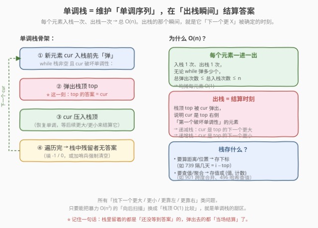
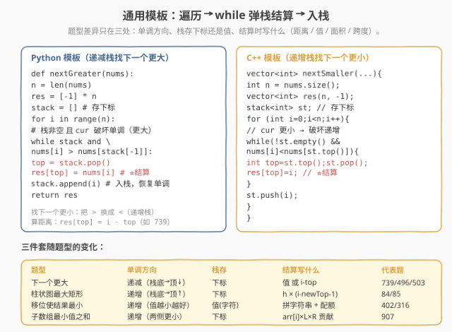
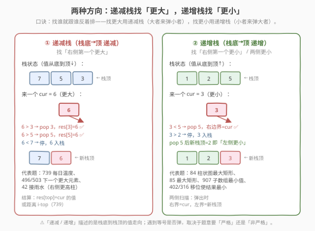
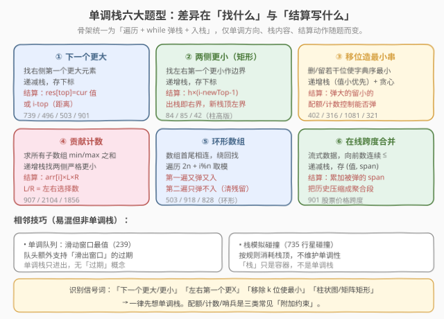
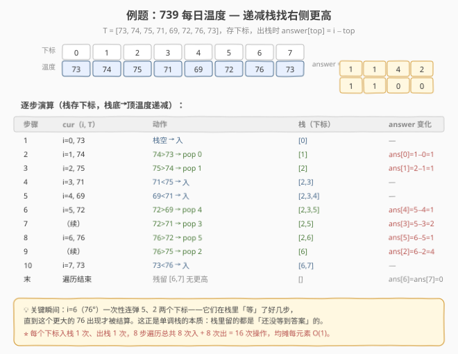
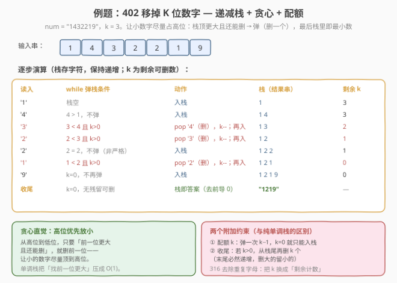

<!-- title: 单调栈专题 -->
# 单调栈专题

- **专题**：单调栈（Monotonic Stack）
- **适用**：面试高频的「找下一个更大 / 更小 / 左右边界」类问题，一次遍历 $O(n)$ 求解
- **前置**：栈的基本用法、数组遍历
- **关联题解**：本站已收录 42 / 84 / 85 / 316 / 402 / 496 / 503 / 739 / 901 / 907 等十余道单调栈题解

> 💡 **一句话定位**：单调栈 = 用一个「始终保持单调（递增或递减）的栈」把暴力 $O(n^2)$ 的「向后扫描找下一个更 X」压缩成 $O(n)$。每个元素**入栈一次、出栈一次**，而**出栈的那个瞬间，正是它的答案被确定的时刻**——栈里留着的都是「还没等到答案」的，弹出去的都「当场结算」了。

---

## 1. 什么是单调栈

### 1.1 定义

单调栈是一种**栈内元素（或其对应值）从栈底到栈顶保持单调（递增或递减）**的栈。在遍历数组时，每个新元素入栈前先「弹」——只要它**破坏了栈的单调性**，就反复弹出栈顶，直到恢复单调再把新元素压入。

它本质上是**普通栈 + 一个「单调性」不变式**。这个不变式带来一个关键性质：

> **栈顶元素在「被弹出」的那一刻，弹它的那个新元素就是它要找的「下一个更 X」。**

- 若栈是**递减**的（栈底→顶递减），新元素一旦**更大**就破坏单调性 → 新元素是栈顶的「下一个更大」；
- 若栈是**递增**的（栈底→顶递增），新元素一旦**更小**就破坏单调性 → 新元素是栈顶的「下一个更小」。

### 1.2 什么时候用单调栈

凡是满足下面特征的题，几乎都该想到单调栈：

| 特征 | 说明 |
|------|------|
| **找「下一个更大 / 更小」** | 对每个元素，求它右侧（或左侧）第一个比它大/小的元素的位置或值 |
| **找「左右第一个更 X 的边界」** | 如柱状图最大矩形——每根柱子要找左右第一个更矮的柱子作为矩形边界 |
| **「移除若干位使剩余最小/最大」** | 让小的（或大的）数字尽量占据高位，靠栈顶比较决定删谁 |
| **「环形数组上找下一个」** | 数组首尾相连，遍历 $2n$ + 取模即可套同一套模板 |
| **规模大、暴力 $O(n^2)$ 超时** | $n$ 到 $10^5$ 级别，双指针扫描会 TLE，需要均摊 $O(n)$ |

> ⚠️ **单调栈 vs 单调队列**：两者都维护单调性，但**单调队列多一个「队头过期」操作**——用于滑动窗口最值（窗口滑出时队头出队）。单调栈只有「入栈 / 出栈」，没有「按时间过期」的概念。代表题 [239. 滑动窗口最大值](https://leetcode.cn/problems/sliding-window-maximum/) 用单调队列，归到栈/队列专题，不在本专题展开。另外 [735. 行星碰撞](https://leetcode.cn/problems/asteroid-collision/) 虽然用栈，但**不维护单调性**（按「相反符号即碰撞」消耗栈顶），不是单调栈。

---

## 2. 核心心智模型：单调性 + 出栈即结算



把单调栈的执行看作一个固定循环：

1. **弹**：新元素 `cur` 入栈前，`while` 栈非空且 `cur` 破坏单调性，反复弹栈顶；
2. **结算**：每次弹出的 `top`，它的答案就是 `cur`（这一刻被确定）；
3. **入**：恢复单调后，`cur` 压入栈顶，等待后续更大的（或更小的）元素来结算它；
4. **收尾**：遍历结束，栈中残留者没有「下一个更 X」，填 `-1` / `0`，或加哨兵强制清空。

> 💡 **为什么 $O(n)$？** 看似 `while` 循环最坏 $O(n)$，但**每个元素一生只入栈一次、出栈一次**。所有 `while` 的总弹出次数 $\le$ 总入栈次数 $\le n$。把 $n$ 次弹栈平摊到 $n$ 次遍历上，每元素均摊 $O(1)$。这就是单调栈的标志性复杂度——**用「栈顶 $O(1)$ 比较」替代「向后 $O(n)$ 扫描」**。

> ⚠️ **栈存下标还是存值？** 这是单调栈题的第一个分叉点：**要算距离/位置时存下标**（如 [739. 每日温度](https://leetcode.cn/problems/daily-temperatures/) 算「隔几天」= `i - top`），**只要查值或聚合时存值**（如 [496. 下一个更大元素 I](https://leetcode.cn/problems/next-greater-element-i/) 用哈希表存「值的下一个更大值」、[901. 股票价格跨度](https://leetcode.cn/problems/online-stock-span/) 存 `(price, span)` 聚合段）。存下标更通用——任何时候都能用 `nums[top]` 取回值。

---

## 3. 通用代码模板



所有单调栈题都套用下面这个骨架，只需根据题型调整三处：**单调方向**（`>` 还是 `<`）、**栈存下标还是值**、**结算时写什么**（距离 / 值 / 面积 / 跨度）。

### Python 模板（递减栈找下一个更大）

```python
def nextGreater(nums):
    n = len(nums)
    res = [-1] * n            # 默认无答案
    stack = []                # 存下标
    for i in range(n):
        # cur 更大 → 破坏「递减」单调性
        while stack and nums[i] > nums[stack[-1]]:
            top = stack.pop()
            res[top] = nums[i]     # ⭐ 结算：top 的下一个更大 = cur
        stack.append(i)            # 入栈，恢复单调
    return res
```

### C++ 模板（递增栈找下一个更小）

```cpp
vector<int> nextSmaller(vector<int>& nums) {
    int n = nums.size();
    vector<int> res(n, -1);
    stack<int> st;             // 存下标
    for (int i = 0; i < n; i++) {
        // cur 更小 → 破坏「递增」单调性
        while (!st.empty() && nums[i] < nums[st.top()]) {
            int top = st.top(); st.pop();
            res[top] = i;           // ⭐ 结算：top 的下一个更小位置 = i
        }
        st.push(i);
    }
    return res;
}
```

> ⚠️ **找下一个更大用递减栈，找下一个更小用递增栈**——口诀是「找谁就跟谁反着排」：找更大，就让栈从底到顶递减（大者来弹小者）；找更小，就让栈递增（小者来弹大者）。方向搞反会全部立即弹出或一个都不弹，结果全错。

### 三件套随题型的变化

| 题型 | 单调方向 | 栈存 | 结算写什么 | 代表题 |
|------|----------|------|------------|--------|
| 下一个更大 | 递减（栈底→顶↓） | 下标 | 值 或 `i-top`（距离） | 739 / 496 / 503 / 901 |
| 柱状图最大矩形 | 递增（栈底→顶↑） | 下标 | `h × (i - newTop - 1)` | 84 / 85 / 42 |
| 移位使结果最小 | 递增（值越小越好） | 值/字符 | 拼字符串 + 配额控制 | 402 / 316 / 1081 |
| 子数组最小值之和 | 递增（两侧更小） | 下标 | `arr[i] × L × R` 贡献 | 907 / 2104 |
| 环形数组下一个更大 | 递减 + 取模遍历 $2n$ | 下标 | 值 | 503 |
| 在线跨度合并 | 递减，存 `(值, span)` | 元组 | 累加被弹的 `span` | 901 |

---

## 4. 两种方向：递减栈 vs 递增栈



单调栈只有两种「方向」，对应两类问题：

### ① 递减栈（栈底→顶递减）— 找「右侧第一个更大」

栈里从底到顶越来越小。当来了一个**更大**的 `cur`，它就破坏了递减性，把比它小的栈顶逐个弹出——每个被弹的 `top`，其「右侧第一个更大」就是 `cur`。

- **代表题**：[739. 每日温度](https://leetcode.cn/problems/daily-temperatures/)（找更高温度）、[496/503. 下一个更大元素](https://leetcode.cn/problems/next-greater-element-i/)、[42. 接雨水](https://leetcode.cn/problems/trapping-rain-water/)（柱子版找右侧更高）。
- **结算**：`res[top] = cur 的值`；若要算距离（如 739 隔几天），`res[top] = i - top`。

### ② 递增栈（栈底→顶递增）— 找「右侧第一个更小」/ 两侧更小

栈里从底到顶越来越大。当来了一个**更小**的 `cur`，它破坏了递增性，把比它大的栈顶逐个弹出——每个被弹的 `top`，其「右侧第一个更小」就是 `cur`；而 `top` 弹出后**新的栈顶**就是它「左侧第一个更小」（因为栈递增，左边比它小的就是新栈顶）。

- **代表题**：[84. 柱状图中最大的矩形](https://leetcode.cn/problems/largest-rectangle-in-histogram/)（找左右更矮边界算最大宽度）、[85. 最大矩形](https://leetcode.cn/problems/maximal-rectangle/)、[907. 子数组的最小值之和](https://leetcode.cn/problems/sum-of-subarray-minimums/)（找两侧严格更小算贡献范围）、[402/316](https://leetcode.cn/problems/remove-k-digits/)（让小数字占高位）。
- **结算**：右界 `R = i`（`cur` 位置），左界 `L = pop 后新栈顶`（无则 `-1`）；矩形面积 `= h × (R - L - 1)`。

> 💡 **等号要不要弹？** 取决于题意要「严格」还是「非严格」。[84. 柱状图最大矩形](https://leetcode.cn/problems/largest-rectangle-in-histogram/) 用 `nums[i] < nums[stack[-1]]`（相等不弹），因为相等高度的柱子可以合并成同一矩形；[907. 子数组的最小值之和](https://leetcode.cn/problems/sum-of-subarray-minimums/) 则一侧严格、一侧非严格，避免重复计数。**记不准时回到题意：相等元素算不算「更小/更大」？**

---

## 5. 题型分类



单调栈题按「找什么 + 结算写什么」可分六类，骨架高度统一，差异在附加约束：

| 题型 | 核心策略 | 附加约束 | 代表题 |
|------|----------|----------|--------|
| **① 下一个更大** | 递减栈存下标，出栈写值/距离 | 无 | 739 / 496 / 503 |
| **② 两侧更小（矩形）** | 递增栈，出栈即右界，新栈顶左界 | 哨兵强制清栈 | 84 / 85 / 42 |
| **③ 移位造最小串** | 递增栈 + 贪心，弹大的留小的 | **配额 k** / 剩余计数 | 402 / 316 / 1081 |
| **④ 贡献计数** | 递增栈找两侧严格更小，算管辖范围 | 取模 $10^9+7$ | 907 / 2104 |
| **⑤ 环形数组** | 遍历 $2n$ + `i%n` 取模 | 第二遍只弹不入 | 503 |
| **⑥ 在线跨度合并** | 递减栈存 `(值, span)`，弹栈累加 | 流式数据 | 901 |

> 💡 **识别信号词**：「下一个更大/更小」「左右第一个更 X」「移除 k 位使最小」「柱状图/矩阵最大矩形」「环形数组找下一个」→ 一律先想单调栈。**配额、计数、哨兵**是三类最常见的「附加约束」——它们决定了在纯单调栈骨架上还要加什么。

---

## 6. 例题精讲

### 6.1 每日温度（739）—— 递减栈模板入门



**题意**：给定每日温度 `temperatures`，对第 `i` 天求「几天后出现更高温度」，无则 `0`。

**思路**：每来一天 `i`，若它的温度 `T[i]` **高于**栈顶那天，则栈顶那天的「更高温度」就是 `T[i]`，答案为 `i - top`（隔几天）；循环弹栈直到栈顶温度 ≥ 当前或栈空；最后把 `i` 入栈。栈存**下标**（要算距离），栈底到栈顶温度**递减**（还没等到更高温的，温度越来越低地排着）。

```python
def dailyTemperatures(temperatures):
    n = len(temperatures)
    res = [0] * n
    stack = []                  # 存下标，温度递减
    for i in range(n):
        while stack and temperatures[i] > temperatures[stack[-1]]:
            top = stack.pop()
            res[top] = i - top       # ⭐ 隔几天 = 当前下标 - top
        stack.append(i)
    return res
```

> 关键瞬间在 `i=6`（76°）：它一次性连弹下标 5、2——它们在栈里「等」了好几步，直到这个更大的 76 出现才被结算。这正是单调栈的本质：**栈里留的都是「还没等到答案」的**。详细图解与决策树见站内题解 [739. 每日温度](../solution/0701-0800/739_每日温度.md)。同模板的 [496. 下一个更大元素 I](../solution/0401-0500/496_下一个更大元素 I.md) 改为存值 + 哈希查表（元素互不相同），[503. 下一个更大元素 II](../solution/0501-0600/503_下一个更大元素 II.md) 套一层取模遍历 $2n$。

### 6.2 柱状图中最大的矩形（84）—— 递增栈两侧扫描


**题意**：给定柱状图各柱高度 `heights`，求能勾勒出的最大矩形面积。

**思路**：最大矩形一定以**某根柱子的高度为高**（否则可向上抬升）。于是对每根柱子 `i`，找它左右第一个**更矮**的柱子作为矩形边界 `L` / `R`，宽度 `= R - L - 1`，面积 `= heights[i] × 宽度`，取最大。用**递增栈**一次遍历：当 `heights[i]` 比栈顶更矮，栈顶的右界就是 `i`，左界是 pop 后的新栈顶。末尾加**哨兵 `height=0`** 强制清栈，避免循环后单独处理残留。

```python
def largestRectangleArea(heights):
    heights = heights + [0]        # ⭐ 哨兵，强制清空栈
    stack = []                     # 存下标，高度递增
    ans = 0
    for i in range(len(heights)):
        while stack and heights[i] < heights[stack[-1]]:
            top = stack.pop()
            h = heights[top]
            left = stack[-1] if stack else -1   # pop 后新栈顶即左界
            ans = max(ans, h * (i - left - 1))  # 宽 = R - L - 1
        stack.append(i)
    return ans
```

> 哨兵技巧是 84 的精华：在数组末尾追加一个比所有柱子都矮的 `0`，遍历到它时必然把栈弹空，所有柱子都在循环内被结算，省去循环后处理残留。详细图解见站内题解 [84. 柱状图中最大的矩形](../solution/0001-0100/84_柱状图中最大的矩形.md)。[85. 最大矩形](../solution/0001-0100/85_最大矩形.md) 把矩阵每行当柱状图底部，逐行套 84 即可；[42. 接雨水](../solution/0001-0100/42_接雨水.md) 的单调栈解法也是递减栈找「右侧更高柱」后算凹槽水量。

### 6.3 移掉 K 位数字（402）—— 递增栈 + 贪心 + 配额



**题意**：给定以字符串表示的非负整数 `num`，移除其中 `k` 位数字，使剩余数字最小。

**思路**：贪心直觉是「**高位优先放小**」——从高位到低位，只要「前一位更大且还能删」，就删前一位，让小数字顶到高位。用**递增栈**把「找前一位更大」压成 $O(1)$：读入 `cur`，`while` 栈顶更大且 `k > 0`，弹栈（删一位）、`k--`；再把 `cur` 入栈。与纯单调栈的差别在两个附加约束：

1. **配额 `k`**：弹一次 `k-1`，`k=0` 就只能入栈不再弹；
2. **收尾**：若遍历完 `k > 0`，从栈尾再删 `k` 个（末尾必然递增，删大的留小的）。

```python
def removeKdigits(num, k):
    stack = []
    for ch in num:
        while k > 0 and stack and stack[-1] > ch:
            stack.pop()
            k -= 1
        stack.append(ch)
    # 收尾：k 还没用完，从末尾删
    if k > 0:
        stack = stack[:-k]
    # 去前导 0
    res = ''.join(stack).lstrip('0')
    return res if res else '0'
```

> 「移除/保留若干位使结果字典序最小」一律单调栈，**配额**与**剩余计数**是两类附加约束的写法。详细图解见站内题解 [402. 移掉 K 位数字](../solution/0401-0500/402_移掉K位数字.md)。[316. 去除重复字母](../solution/0301-0400/316_去除重复字母.md) 把「配额 `k`」换成「每个字母的剩余出现计数」——弹栈前要确认「弹掉的字母后面还会出现」，否则会删没了；它与 [1081. 不同字符的最小子序列](https://leetcode.cn/problems/smallest-subsequence-of-distinct-characters/) 完全同构。

---

## 7. 复杂度分析

单调栈的复杂度高度统一——**时间 $O(n)$、空间 $O(n)$**：

| 题型 | 时间复杂度 | 空间复杂度 | 说明 |
|------|------------|------------|------|
| 下一个更大/更小 | $O(n)$ | $O(n)$（栈 + 结果数组） | 每元素入栈出栈各一次 |
| 柱状图最大矩形 | $O(n)$ | $O(n)$（栈） | 哨兵不增加复杂度阶 |
| 移位造最小串 | $O(n)$ | $O(n)$（栈存字符） | 字符串操作 $O(n)$ |
| 贡献计数（907） | $O(n)$ | $O(n)$ | 两次单调栈或一次遍历 |
| 环形数组（503） | $O(n)$ | $O(n)$ | 遍历 $2n$ 但仍是 $O(n)$ |
| 在线跨度（901） | $O(n)$ 总 / $O(1)$ 均摊每次 | $O(n)$ | `span` 合并跳过逐元素 |

> 💡 **为什么时间复杂度总是 $O(n)$？** 关键在「每元素一进一出」的均摊分析：无论 `while` 循环单次弹多少个，所有 `while` 的总弹出次数 $\le$ 总入栈次数 $\le n$。把 $n$ 次弹栈平摊到 $n$ 次遍历上，每元素均摊 $O(1)$。这与 [901. 股票价格跨度](../solution/0901-1000/901_股票价格跨度.md) 的「单次 `next` 均摊 $O(1)$」完全同理。

> ⚠️ **别被 `while` 吓到**：看到 `while` 循环套在 `for` 里，第一反应可能是 $O(n^2)$。但只要能论证「每个元素至多入栈出栈各一次」，就是 $O(n)$。这是单调栈/单调队列类题的通用论证模板。

---

## 8. 常见误区与技巧

1. **方向搞反**
   - 找「更大」用**递减栈**（`nums[i] > nums[stack[-1]]` 弹），找「更小」用**递增栈**（`<` 弹）。口诀「找谁跟谁反着排」。方向反了会全部立即弹出或一个都不弹。

2. **存值还是存下标分不清**
   - 要算**距离/位置**（如 739 隔几天、84 算宽度）→ **存下标**，用 `nums[top]` 取值；只要**查值/聚合**（如 496 哈希查值、901 跨度合并）→ 可存值或 `(值, 计数)`。**存下标永远通用**，存值是优化。

3. **等号要不要弹**
   - 取决于题意要「严格」还是「非严格」。84 相等不弹（合并同高矩形）；907 一侧严格一侧非严格（避免重复计数）。**回到题意：相等元素算不算「更小/更大」？**

4. **84 忘加哨兵**
   - 不加哨兵，遍历结束后栈中残留的柱子（右界为「无穷」）要在循环后单独处理，容易漏。**末尾追加 `height=0` 强制清栈**，让所有柱子在循环内结算，代码更简洁不易错。

5. **402/316 忘收尾**
   - 配额 `k` 可能没用完（输入已经递增，弹不出更大的）。遍历完后**从栈尾再删 `k` 个**（末尾递增，删大的留小的）。316 的对应物是「剩余计数」，弹前确认字母后面还会出现。

6. **环形数组只遍历一遍**
   - 503 数组是环形的，最后一个元素的「下一个更大」可能在数组开头。只遍历 `n` 步，栈中残留的元素永远等不到绕回来的更大值。**遍历 $2n$ + `i%n` 取模**，第一遍「又弹又入」，第二遍「只弹不入」清理残留。

7. **混淆单调栈与单调队列**
   - 单调队列多一个「队头过期」操作，用于滑动窗口最值（239）。单调栈只有进出，无「按时间过期」。看到「窗口」想单调队列，看到「下一个/边界」想单调栈。

8. **能两侧扫描却只扫一侧**
   - 84/907 需要「左右两侧」的边界。可以跑两遍单调栈（一遍从左找右界、一遍从右找左界），也可以一遍递增栈在「弹出瞬间」同时拿到右界（`cur`）和左界（`pop` 后新栈顶）——后者更优雅，是 84 的标准写法。

9. **贡献计数法想不到**
   - 907「所有子数组最小值之和」不要枚举 $O(n^2)$ 个子数组，而是对每个元素算「以它为最小值的子数组有多少个」= `arr[i] × 左选择数 × 右选择数`。左右选择数靠两次单调栈找两侧严格更小位置。这是「**贡献计数法**」的招牌，把 $O(n^2)$ 枚举转成 $O(n)$ 逐元素贡献。

---

## 9. 课后练习题

按难度递进，建议**按顺序刷**，每道题先自己写，卡 20 分钟再看站内题解。带「✅ 题解」的表示本站已有详细中文题解。

### 🟢 基础：默写模板

| 题号 | 题目 | 难度 | 考点 | 题解 |
|------|------|------|------|------|
| 739 | [每日温度](https://leetcode.cn/problems/daily-temperatures/) | 中等 | 递减栈存下标、算距离 `i-top` | ✅ [题解](../solution/0701-0800/739_每日温度.md) |
| 496 | [下一个更大元素 I](https://leetcode.cn/problems/next-greater-element-i/) | 简单 | 递减栈存值 + 哈希查表 | ✅ [题解](../solution/0401-0500/496_下一个更大元素 I.md) |
| 503 | [下一个更大元素 II](https://leetcode.cn/problems/next-greater-element-ii/) | 中等 | 环形数组，遍历 $2n$ + 取模 | ✅ [题解](../solution/0501-0600/503_下一个更大元素 II.md) |
| 1475 | [商品折扣后的最终价格](https://leetcode.cn/problems/final-prices-with-a-special-discount-in-a-shop/) | 简单 | 递减栈找下一个更小或等于 | — |

> **目标**：默写出「遍历 + while 弹栈 + 入栈」骨架，理解存下标与存值的取舍，掌握「出栈即结算」的核心机制。

### 🟡 进阶：两侧扫描与贪心

| 题号 | 题目 | 难度 | 考点 | 题解 |
|------|------|------|------|------|
| 84 | [柱状图中最大的矩形](https://leetcode.cn/problems/largest-rectangle-in-histogram/) | 困难 | 递增栈两侧找更小、哨兵 | ✅ [题解](../solution/0001-0100/84_柱状图中最大的矩形.md) |
| 42 | [接雨水](https://leetcode.cn/problems/trapping-rain-water/) | 困难 | 递减栈找更高柱算凹槽水量 | ✅ [题解](../solution/0001-0100/42_接雨水.md) |
| 402 | [移掉 K 位数字](https://leetcode.cn/problems/remove-k-digits/) | 中等 | 递增栈 + 贪心 + 配额 k | ✅ [题解](../solution/0401-0500/402_移掉K位数字.md) |
| 316 | [去除重复字母](https://leetcode.cn/problems/remove-duplicate-letters/) | 中等 | 递增栈 + 贪心 + 剩余计数 | ✅ [题解](../solution/0301-0400/316_去除重复字母.md) |
| 85 | [最大矩形](https://leetcode.cn/problems/maximal-rectangle/) | 困难 | 矩阵逐行归约到 84 | ✅ [题解](../solution/0001-0100/85_最大矩形.md) |
| 581 | [最短无序连续子数组](https://leetcode.cn/problems/shortest-unsorted-continuous-subarray/) | 中等 | 单调栈定位左右越界点 | ✅ [题解](../solution/0501-0600/581_最短无序连续子数组.md) |

> **目标**：掌握递增栈「出栈即右界、新栈顶左界」的两侧扫描技巧，熟练运用哨兵与配额/计数两类附加约束。

### 🔴 挑战：贡献计数与综合

| 题号 | 题目 | 难度 | 考点 | 题解 |
|------|------|------|------|------|
| 907 | [子数组的最小值之和](https://leetcode.cn/problems/sum-of-subarray-minimums/) | 中等 | 贡献计数 + 两次单调栈找两侧严格更小 | ✅ [题解](../solution/0901-1000/907_子数组的最小值之和.md) |
| 901 | [股票价格跨度](https://leetcode.cn/problems/online-stock-span/) | 中等 | 在线流式 + `(price, span)` 跨度合并 | ✅ [题解](../solution/0901-1000/901_股票价格跨度.md) |
| 321 | [拼接最大数](https://leetcode.cn/problems/create-maximum-number/) | 困难 | 单调栈 + 双数组长度分配 + 合并 | — |
| 2104 | [子数组范围和](https://leetcode.cn/problems/sum-of-subarray-ranges/) | 中等 | 两次单调栈找两侧更大/更小算贡献 | — |
| 1856 | [子数组最小值与最大值乘积之和](https://leetcode.cn/problems/maximum-subarray-min-product/) | 中等 | 单调栈 + 前缀和 + 贡献计数 | — |

> **目标**：能用贡献计数法把 $O(n^2)$ 枚举转成 $O(n)$ 逐元素贡献，掌握在线场景下的「聚合段 + 弹栈合并」技巧。

### 🏆 拓展：变体与相邻技巧

| 题号 | 题目 | 难度 | 考点 |
|------|------|------|------|
| 1081 | [不同字符的最小子序列](https://leetcode.cn/problems/smallest-subsequence-of-distinct-characters/) | 中等 | 与 316 完全同模板，练手单调栈 + 去重 |
| 735 | [行星碰撞](https://leetcode.cn/problems/asteroid-collision/) | 中等 | 栈模拟碰撞（非单调栈，对照辨析，✅ [题解](../solution/0701-0800/735_行星碰撞.md)） |
| 239 | [滑动窗口最大值](https://leetcode.cn/problems/sliding-window-maximum/) | 困难 | 单调队列（队头过期，与单调栈对照） |
| 654 | [最大二叉树](https://leetcode.cn/problems/maximum-binary-tree/) | 中等 | 单调栈构造树（找左右更大者作父） |
| 456 | [132 模式](https://leetcode.cn/problems/132-pattern/) | 中等 | 单调栈维护「次大值」判定模式 |
| 962 | [最大宽度坡](https://leetcode.cn/problems/maximum-width-ramp/) | 中等 | 单调栈存下标候选 + 二分/双指针 |

---

## 10. 速记总结

> **单调栈 = 维护单调序列 + 出栈即结算**。骨架永远是「**遍历 → while 弹栈 → 入栈**」三步循环，每个元素入栈一次、出栈一次 → 总 $O(n)$。两种方向：找「更大」用**递减栈**（`>` 弹），找「更小」用**递增栈**（`<` 弹），口诀「找谁跟谁反着排」。栈里留的都是「还没等到答案」的，弹出去的都当场结算——`res[top] = cur`（值）或 `i - top`（距离）或 `h × (R - L - 1)`（面积）或 `arr[i] × L × R`（贡献）。存下标永远通用，存值/聚合段是优化。附加约束三类：**配额 k**（402）、**剩余计数**（316）、**哨兵**（84）。识别信号词「下一个更 X / 左右边界 / 移位造最小 / 柱状图矩形 / 环形数组」→ 一律先想单调栈。看到「窗口」想单调队列（多一个队头过期），看到「碰撞」是普通栈模拟（不维护单调）。
